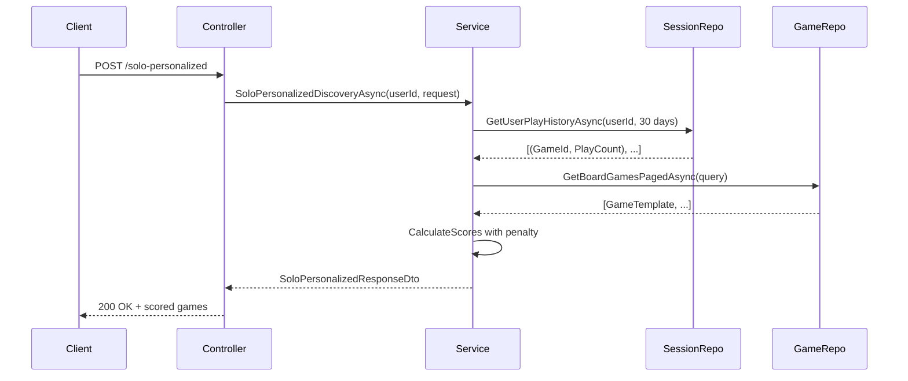

# Cải tiến 3: Play History Influence

**Status:** ✅ **Implemented & Build Verified**  
**Date:** 2026-09-24  
**Author:** BoardVerse AI Development Team

---

## 📋 Overview

Tích hợp lịch sử chơi game (play history) từ `ActiveSession` vào Solo Personalized Discovery để:
- **Tránh lặp lại**: Giảm điểm cho games đã chơi nhiều lần gần đây
- **Khuyến khích đa dạng**: Gợi ý games mới chưa từng chơi
- **Cân bằng**: Penalty nhẹ nhàng, không loại bỏ hoàn toàn games yêu thích

---

## 🎯 Business Logic

### Penalty System

| Số lần chơi (30 ngày) | Penalty | Lý do |
|---|---|---|
| **0 lần** | 0 pts | Chưa chơi → ưu tiên khám phá |
| **1 lần** | -5 pts | Đã thử → giảm nhẹ |
| **2 lần** | -10 pts | Chơi lại → giảm trung bình |
| **3 lần** | -15 pts | Chơi nhiều → giảm mạnh |
| **4+ lần** | -20 pts | Lặp lại quá nhiều → penalty max |

### Tại sao 30 ngày?

- **Ngắn hạn**: Đủ xa để quên chi tiết game
- **Linh hoạt**: User chơi 2 tuần/lần vẫn thấy penalty
- **Không quá khắt**: Games chơi >1 tháng trước không bị ảnh hưởng

---

## 🔧 Technical Implementation

### 1. DTO: `UserPlayHistoryDto`

**File:** `BoardVerse.Core/DTOs/Discovery/UserPlayHistoryDto.cs`

```csharp
public class UserPlayHistoryDto
{
    public Guid GameTemplateId { get; set; }
    public string GameName { get; set; } = string.Empty;
    public int PlayCount { get; set; }
    public DateTime? LastPlayedAt { get; set; }
    public int TotalMinutesPlayed { get; set; }
}
```

### 2. Repository Method

**Interface:** `IActiveSessionRepository`

```csharp
Task<IReadOnlyList<(Guid GameTemplateId, string GameName, int PlayCount, 
    DateTime? LastPlayedAt, int TotalMinutesPlayed)>> GetUserPlayHistoryAsync(
    Guid userId, 
    int daysBack = 30, 
    CancellationToken cancellationToken = default);
```

**Implementation:** `ActiveSessionRepository.GetUserPlayHistoryAsync()`

```csharp
public async Task<IReadOnlyList<(...)>> GetUserPlayHistoryAsync(
    Guid userId, int daysBack = 30, CancellationToken cancellationToken = default)
{
    var cutoffDate = DateTime.UtcNow.AddDays(-daysBack);

    var history = await _db.ActiveSessions
        .Where(s => s.Members.Any(m => m.UserId == userId)
            && (s.EndedAt ?? s.StartedAt) >= cutoffDate)
        .SelectMany(s => s.Members
            .Where(m => m.UserId == userId)
            .Select(m => new
            {
                s.GameTemplateId,
                GameName = s.GameTemplate.Name,
                SessionEndedAt = s.EndedAt,
                MinutesPlayed = m.TotalMinutesPlayed
            }))
        .GroupBy(x => new { x.GameTemplateId, x.GameName })
        .Select(g => new
        {
            g.Key.GameTemplateId,
            g.Key.GameName,
            PlayCount = g.Count(),
            LastPlayedAt = g.Max(x => x.SessionEndedAt),
            TotalMinutesPlayed = g.Sum(x => x.MinutesPlayed)
        })
        .ToListAsync(cancellationToken);

    return history
        .Select(h => (h.GameTemplateId, h.GameName, h.PlayCount, 
            h.LastPlayedAt, h.TotalMinutesPlayed))
        .ToList();
}
```

### 3. Service Logic

**File:** `BoardGameDiscoveryService`

**Constructor injection:**

```csharp
private readonly IActiveSessionRepository _activeSessionRepository;

public BoardGameDiscoveryService(
    // ... existing
    IActiveSessionRepository activeSessionRepository)
{
    _activeSessionRepository = activeSessionRepository;
}
```

**Penalty calculation:**

```csharp
private double CalculatePlayHistoryPenalty(
    Guid gameTemplateId, 
    Dictionary<Guid, int> playHistoryDict)
{
    if (!playHistoryDict.TryGetValue(gameTemplateId, out int playCount))
    {
        return 0; // Chưa chơi → không penalty
    }

    return playCount switch
    {
        1 => -5.0,
        2 => -10.0,
        3 => -15.0,
        _ => -20.0  // 4+ times
    };
}
```

**Integration in `SoloPersonalizedDiscoveryAsync`:**

```csharp
// Step 6: Get play history
var playHistory = await _activeSessionRepository.GetUserPlayHistoryAsync(
    userId, 
    daysBack: 30, 
    cancellationToken);

var playHistoryDict = playHistory.ToDictionary(h => h.GameTemplateId, h => h.PlayCount);

// Step 7: Calculate scores with penalty
var scoredGames = games.Select(game =>
{
    double baseScore = CalculateSoloBaseScore(game, request);
    double personalizationBoost = userPref != null
        ? CalculatePreferenceBoost(game, userPref)
        : 0;

    // Cải tiến 3: Play history penalty
    double playHistoryPenalty = CalculatePlayHistoryPenalty(game.Id, playHistoryDict);

    double personalizedScore = Math.Min(
        baseScore + personalizationBoost + playHistoryPenalty, 100);

    // ...
});
```

---

## 📊 Scoring Formula

### Complete Score Calculation

```
PersonalizedScore = MIN(BaseScore + PersonalizationBoost + PlayHistoryPenalty, 100)

Where:
  BaseScore           = 0-85 pts (category + duration + player fit)
  PersonalizationBoost = 0-15 pts (from saved games affinity)
  PlayHistoryPenalty   = 0 to -20 pts (from recent play sessions)
```

### Example Scenarios

#### Scenario 1: Game chưa chơi, khớp category + weight

```
BaseScore           = 70 pts (40 category + 30 duration)
PersonalizationBoost = 12 pts (weight affinity)
PlayHistoryPenalty   = 0 pts (chưa chơi)
───────────────────────────────────────────────
PersonalizedScore   = 82 pts
```

#### Scenario 2: Game yêu thích, đã chơi 2 lần

```
BaseScore           = 75 pts
PersonalizationBoost = 15 pts (category + weight perfect match)
PlayHistoryPenalty   = -10 pts (chơi 2 lần)
───────────────────────────────────────────────
PersonalizedScore   = 80 pts (vẫn cao nhờ boost)
```

#### Scenario 3: Game trung bình, chơi 5 lần

```
BaseScore           = 60 pts
PersonalizationBoost = 5 pts
PlayHistoryPenalty   = -20 pts (max penalty)
───────────────────────────────────────────────
PersonalizedScore   = 45 pts (xuống thấp)
```

---

## 📡 API Impact

### Affected Endpoint

```
POST /api/v1/discovery/solo-personalized
```

**Authentication:** Required (Bearer token)

**Base URLs:**

| Environment | URL |
|---|---|
| **Production** | `https://api.boardverse.com` |
| **Staging** | `https://staging-api.boardverse.com` |
| **Local Dev** | `http://localhost:5000` |

---

### Request (No Changes)

**Headers:**
```http
Authorization: Bearer <your_jwt_token>
Content-Type: application/json
```

**Body:** (unchanged)
```json
{
  "categoryIds": ["guid-1", "guid-2"],
  "preferredDurations": ["under30", "30to60"],
  "weightRanges": [1, 2, 3],
  "playerCount": 4,
  "searchKeyword": "catan",
  "pageSize": 20,
  "excludeSavedGames": false
}
```

---

### Response Changes

#### Updated Response DTO

```typescript
interface PersonalizedBoardGameDto {
  id: string;
  name: string;
  thumbnailUrl?: string;
  description?: string;
  minPlayers: number;
  maxPlayers: number;
  playTimeMinutes: number;
  weight?: number;
  categories: string[];
  
  // Scoring breakdown
  baseScore: number;              // 0-85
  personalizationBoost: number;   // 0-15
  playHistoryPenalty: number;     // 0 to -20 ← NEW FIELD
  personalizedScore: number;      // Final score (updated formula)
  
  matchReason?: string;
  isSaved: boolean;
  hasOpenLobby: boolean;
}
```

**New field:** `playHistoryPenalty`
- **Type:** `number`
- **Range:** `0` to `-20`
- **Meaning:**
  - `0`: Chưa chơi game này trong 30 ngày qua
  - `-5`: Chơi 1 lần
  - `-10`: Chơi 2 lần
  - `-15`: Chơi 3 lần
  - `-20`: Chơi 4+ lần (max penalty)

---

#### Example Response (200 OK)

```json
{
  "statusCode": 200,
  "message": "Gợi ý cá nhân hóa hoàn tất dựa trên sở thích của bạn.",
  "data": {
    "games": [
      {
        "id": "550e8400-e29b-41d4-a716-446655440000",
        "name": "Catan",
        "thumbnailUrl": "https://example.com/catan.jpg",
        "description": "Game chiến thuật xây dựng đảo",
        "minPlayers": 3,
        "maxPlayers": 4,
        "playTimeMinutes": 90,
        "weight": 2.3,
        "categories": ["Chiến thuật", "Kinh tế"],
        "baseScore": 70.0,
        "personalizationBoost": 12.0,
        "playHistoryPenalty": 0.0,
        "personalizedScore": 82.0,
        "matchReason": "Khớp với thể loại bạn thường chơi",
        "isSaved": true,
        "hasOpenLobby": false
      },
      {
        "id": "660e8400-e29b-41d4-a716-446655440001",
        "name": "Uno",
        "thumbnailUrl": "https://example.com/uno.jpg",
        "description": "Game bài nhanh",
        "minPlayers": 2,
        "maxPlayers": 10,
        "playTimeMinutes": 30,
        "weight": 1.2,
        "categories": ["Party", "Gia đình"],
        "baseScore": 75.0,
        "personalizationBoost": 15.0,
        "playHistoryPenalty": -10.0,
        "personalizedScore": 80.0,
        "matchReason": "Game bạn yêu thích",
        "isSaved": true,
        "hasOpenLobby": false
      },
      {
        "id": "770e8400-e29b-41d4-a716-446655440002",
        "name": "Splendor",
        "thumbnailUrl": "https://example.com/splendor.jpg",
        "description": "Game thu thập ngọc quý",
        "minPlayers": 2,
        "maxPlayers": 4,
        "playTimeMinutes": 45,
        "weight": 2.1,
        "categories": ["Chiến thuật", "Kinh tế"],
        "baseScore": 68.0,
        "personalizationBoost": 10.0,
        "playHistoryPenalty": -20.0,
        "personalizedScore": 58.0,
        "matchReason": "Độ phức tạp phù hợp",
        "isSaved": false,
        "hasOpenLobby": true
      }
    ],
    "userProfile": {
      "userId": "123e4567-e89b-12d3-a456-426614174000",
      "topCategoryIds": ["cat-1-uuid", "cat-2-uuid"],
      "averageWeight": 2.5,
      "averageDuration": 55.0,
      "savedGameCount": 12
    },
    "totalCount": 48,
    "nearestCafe": null,
    "openLobbies": []
  }
}
```

---

#### Error Responses (No Changes)

**400 Bad Request, 401 Unauthorized, 500 Internal Server Error** — same as before

See `SOLO_PERSONALIZED_API.md` for full error response documentation.

---

## 💻 Frontend Integration Guide

### TypeScript Types (Updated)

```typescript
// ========== Response DTO (Updated) ==========

interface PersonalizedBoardGameDto {
  id: string;
  name: string;
  thumbnailUrl?: string;
  description?: string;
  minPlayers: number;
  maxPlayers: number;
  playTimeMinutes: number;
  weight?: number;
  categories: string[];
  
  // Scoring breakdown
  baseScore: number;              // 0-85
  personalizationBoost: number;   // 0-15
  playHistoryPenalty: number;     // NEW: 0 to -20
  personalizedScore: number;      // Final score
  
  matchReason?: string;
  isSaved: boolean;
  hasOpenLobby: boolean;
}

interface SoloPersonalizedResponse {
  statusCode: number;
  message: string;
  data: {
    games: PersonalizedBoardGameDto[];
    userProfile: UserGamePreference | null;
    totalCount: number;
    nearestCafe: NearbyCafeForGame | null;
    openLobbies: OpenLobbySummary[];
  };
}

// ========== Play History Metadata ==========

interface PlayHistoryBadge {
  level: 'none' | 'light' | 'medium' | 'heavy';
  label: string;
  color: string;
  tooltip: string;
}

function getPlayHistoryBadge(penalty: number): PlayHistoryBadge {
  if (penalty === 0) {
    return {
      level: 'none',
      label: '',
      color: '',
      tooltip: ''
    };
  } else if (penalty >= -5) {
    return {
      level: 'light',
      label: 'Đã thử',
      color: 'yellow',
      tooltip: 'Bạn đã chơi game này 1 lần gần đây'
    };
  } else if (penalty >= -15) {
    return {
      level: 'medium',
      label: 'Chơi nhiều',
      color: 'orange',
      tooltip: 'Bạn đã chơi game này 2-3 lần gần đây'
    };
  } else {
    return {
      level: 'heavy',
      label: 'Chơi rất nhiều',
      color: 'red',
      tooltip: 'Bạn đã chơi game này 4+ lần trong 30 ngày qua'
    };
  }
}
```

---

### React Component Example

```tsx
import React from 'react';
import { PersonalizedBoardGameDto, PlayHistoryBadge } from './types';

interface GameCardProps {
  game: PersonalizedBoardGameDto;
}

export const PersonalizedGameCard: React.FC<GameCardProps> = ({ game }) => {
  const historyBadge = getPlayHistoryBadge(game.playHistoryPenalty);

  return (
    <div className="game-card">
      
      
      <div className="game-info">
        <h3>{game.name}</h3>
        <p>{game.description}</p>
        
        {/* Score breakdown */}
        <div className="score-breakdown">
          <span className="total-score">{game.personalizedScore.toFixed(1)}</span>
          <div className="score-details">
            <div>Base: {game.baseScore}</div>
            <div>Personalization: +{game.personalizationBoost}</div>
            {game.playHistoryPenalty < 0 && (
              <div className="penalty">
                Play History: {game.playHistoryPenalty}
              </div>
            )}
          </div>
        </div>

        {/* Play history badge */}
        {historyBadge.level !== 'none' && (
          <div 
            className={`badge badge-${historyBadge.color}`}
            title={historyBadge.tooltip}
          >
            🔁 {historyBadge.label}
          </div>
        )}

        {/* Match reason */}
        {game.matchReason && (
          <p className="match-reason">
            ✓ {game.matchReason}
          </p>
        )}
      </div>
    </div>
  );
};

// ========== Helper function ==========

function getPlayHistoryBadge(penalty: number): PlayHistoryBadge {
  if (penalty === 0) {
    return { level: 'none', label: '', color: '', tooltip: '' };
  } else if (penalty >= -5) {
    return {
      level: 'light',
      label: 'Đã thử',
      color: 'yellow',
      tooltip: 'Bạn đã chơi game này 1 lần gần đây'
    };
  } else if (penalty >= -15) {
    return {
      level: 'medium',
      label: 'Chơi nhiều',
      color: 'orange',
      tooltip: 'Bạn đã chơi game này 2-3 lần gần đây'
    };
  } else {
    return {
      level: 'heavy',
      label: 'Chơi rất nhiều',
      color: 'red',
      tooltip: 'Bạn đã chơi game này 4+ lần trong 30 ngày qua'
    };
  }
}
```

---

### CSS Example

```css
.game-card {
  border: 1px solid #e0e0e0;
  border-radius: 8px;
  padding: 16px;
  margin-bottom: 16px;
}

.score-breakdown {
  display: flex;
  align-items: center;
  gap: 12px;
  margin: 12px 0;
}

.total-score {
  font-size: 24px;
  font-weight: bold;
  color: #2196F3;
}

.score-details {
  font-size: 12px;
  color: #666;
}

.score-details .penalty {
  color: #f44336;
  font-weight: 500;
}

/* Play history badges */
.badge {
  display: inline-block;
  padding: 4px 8px;
  border-radius: 4px;
  font-size: 12px;
  font-weight: 500;
  margin-top: 8px;
}

.badge-yellow {
  background-color: #fff3cd;
  color: #856404;
  border: 1px solid #ffeaa7;
}

.badge-orange {
  background-color: #ffe0b2;
  color: #e65100;
  border: 1px solid #ffcc80;
}

.badge-red {
  background-color: #ffcdd2;
  color: #c62828;
  border: 1px solid #ef9a9a;
}

.match-reason {
  font-size: 14px;
  color: #4caf50;
  margin-top: 8px;
}
```

---

### UI Display Guidelines

#### 1. **Score Breakdown Display**

**When to show:**
- Always show `personalizedScore` as primary score
- Optionally show breakdown on hover/click

**Format:**
```
Score: 82
  Base: 70
  Personalization: +12
  Play History: 0
```

#### 2. **Play History Badge**

**Display rules:**
| Penalty | Badge | Color | Icon |
|---|---|---|---|
| `0` | No badge | — | — |
| `-5` | "Đã thử" | Yellow | 🔁 |
| `-10` | "Chơi nhiều" | Orange | 🔁 |
| `-15` | "Chơi nhiều" | Orange | 🔁 |
| `-20` | "Chơi rất nhiều" | Red | 🔁 |

**Tooltip text:**
- `-5`: "Bạn đã chơi game này 1 lần gần đây"
- `-10`: "Bạn đã chơi game này 2 lần gần đây"
- `-15`: "Bạn đã chơi game này 3 lần gần đây"
- `-20`: "Bạn đã chơi game này 4+ lần trong 30 ngày qua"

#### 3. **Filter/Sort Options**

**New filter:** "Chỉ hiển thị game chưa chơi"
```typescript
const unplayedGames = games.filter(g => g.playHistoryPenalty === 0);
```

**Sort by freshness:**
```typescript
const sortedByFreshness = [...games].sort((a, b) => 
  a.playHistoryPenalty - b.playHistoryPenalty
);
// Games with penalty 0 first, then -5, -10, -15, -20
```

#### 4. **Empty State**

**When all games have heavy penalty:**
```tsx
{games.every(g => g.playHistoryPenalty <= -15) && (
  <div className="info-message">
    <p>Có vẻ bạn đã chơi nhiều game gần đây! 🎉</p>
    <p>Thử điều chỉnh filter để khám phá game mới.</p>
  </div>
)}
```

---

### Axios Integration Example

```typescript
import axios from 'axios';

const api = axios.create({
  baseURL: 'https://api.boardverse.com',
  headers: {
    'Content-Type': 'application/json'
  }
});

// Interceptor: attach token
api.interceptors.request.use(config => {
  const token = localStorage.getItem('jwt_token');
  if (token) {
    config.headers.Authorization = `Bearer ${token}`;
  }
  return config;
});

// Fetch personalized games
async function fetchPersonalizedGames(
  request: SoloPersonalizedRequest
): Promise<SoloPersonalizedResponse> {
  const response = await api.post<SoloPersonalizedResponse>(
    '/api/v1/discovery/solo-personalized',
    request
  );
  return response.data;
}

// Usage
const result = await fetchPersonalizedGames({
  playerCount: 4,
  categoryIds: ['guid-1', 'guid-2'],
  weightRanges: [1, 2, 3],
  excludeSavedGames: false
});

console.log('Total games:', result.data.totalCount);
console.log('First game penalty:', result.data.games[0].playHistoryPenalty);
```

---

### Error Handling

```typescript
try {
  const result = await fetchPersonalizedGames(request);
  
  // Success
  setGames(result.data.games);
  
} catch (error) {
  if (axios.isAxiosError(error)) {
    switch (error.response?.status) {
      case 401:
        // Token expired → redirect to login
        router.push('/login');
        break;
        
      case 400:
        // Validation error
        const apiError = error.response.data as ApiError;
        toast.error(apiError.error.message);
        break;
        
      case 500:
        // Server error
        toast.error('Lỗi hệ thống. Vui lòng thử lại sau.');
        break;
    }
  }
}
```

---

### Performance Notes

**Frontend considerations:**

1. **Cache results:** Cache personalized games for 5 minutes
   ```typescript
   const cacheKey = `personalized:${JSON.stringify(request)}`;
   const cached = sessionStorage.getItem(cacheKey);
   ```

2. **Lazy load:** Only fetch when user navigates to "Gợi ý cho bạn" tab

3. **Skeleton loading:** Show 5 skeleton cards while fetching

4. **Optimistic UI:** Show cached results first, update when fresh data arrives

---

## 📊 Frontend Metrics to Track

| Metric | Purpose |
|---|---|
| **Games with penalty / Total games** | Monitor diversity effectiveness |
| **Avg penalty per session** | Understand user play patterns |
| **Click-through rate by penalty level** | Does penalty affect engagement? |
| **Filter usage: "Chưa chơi"** | Do users want to discover new games? |

---

## 🎯 A/B Testing Suggestions

**Test 1: Penalty strength**
- Group A: Current penalty (-5, -10, -15, -20)
- Group B: Lighter penalty (-3, -6, -9, -12)
- Measure: Game diversity in user sessions

**Test 2: Badge visibility**
- Group A: Always show badge
- Group B: Only show on hover
- Measure: Click-through rate

**Test 3: Sort default**
- Group A: Sort by `personalizedScore` (current)
- Group B: Sort by `playHistoryPenalty` (freshness first)
- Measure: Engagement with new games

---

## 🧪 Testing Scenarios

### Test Case 1: User chưa chơi game nào

**Given:**
- User mới, chưa có `ActiveSession` nào
- Đã lưu 3 saved games

**Expected:**
- `playHistoryPenalty` = 0 cho tất cả games
- Chỉ có `baseScore` + `personalizationBoost`

### Test Case 2: User chơi Uno 3 lần trong 2 tuần

**Given:**
- 3 sessions với Uno trong 14 ngày qua
- Query 30 ngày

**Expected:**
- Uno có `playHistoryPenalty` = -15 pts
- Games khác penalty = 0

### Test Case 3: User chơi Catan 5 lần, Pandemic 1 lần

**Given:**
- Catan: 5 sessions
- Pandemic: 1 session

**Expected:**
- Catan: penalty = -20 pts (max)
- Pandemic: penalty = -5 pts (nhẹ)

### Test Case 4: Session > 30 ngày không ảnh hưởng

**Given:**
- Chơi Werewolf 10 lần cách đây 35 ngày
- Không chơi gì trong 30 ngày qua

**Expected:**
- Werewolf: penalty = 0 (ngoài window)

---

## 🔗 Data Flow



---

## 📈 Performance Considerations

### Query Optimization

**Play history query:**
- **Index needed:** `ActiveSession(UserId, EndedAt/StartedAt)`
- **Estimated rows:** ~50 sessions/user in 30 days
- **Query time:** <50ms (with index)

**Memory impact:**
- Dictionary size: O(unique games played) ≈ 10-50 games
- Negligible compared to main games list

### Caching Strategy (Future)

```csharp
// Redis cache key
string cacheKey = $"play-history:{userId}:30d";
TimeSpan ttl = TimeSpan.FromMinutes(10);

// Cache play history for 10 minutes
// Invalidate when new session completed
```

---

## 🚀 Deployment Checklist

- [x] DTO created (`UserPlayHistoryDto`)
- [x] Repository interface updated (`IActiveSessionRepository`)
- [x] Repository method implemented (`GetUserPlayHistoryAsync`)
- [x] Service dependency injected (`IActiveSessionRepository`)
- [x] Penalty logic added (`CalculatePlayHistoryPenalty`)
- [x] Integration in Solo Personalized API
- [x] Build verification passed ✅
- [ ] Database index created (recommend: composite on `ActiveSession`)
- [ ] Unit tests written
- [ ] Integration test with real sessions
- [ ] Performance test (>1000 sessions)
- [ ] Documentation updated

---

## 🔮 Future Enhancements

### Phase 2: Time-decay penalty

```csharp
// Penalty giảm dần theo thời gian
double timeFactor = CalculateTimeDecay(lastPlayedAt, DateTime.UtcNow);
double adjustedPenalty = basePenalty * timeFactor;

// Ví dụ: chơi 1 tuần trước → 80% penalty
//        chơi 3 tuần trước → 40% penalty
```

### Phase 3: Category-level diversity

```csharp
// Penalty theo thể loại thay vì từng game
// Ví dụ: đã chơi 5 party games → giảm điểm cho tất cả party games
var categoryHistory = GetCategoryPlayHistory(userId);
double categoryPenalty = CalculateCategoryPenalty(game, categoryHistory);
```

### Phase 4: Positive boost cho games lâu không chơi

```csharp
// Game đã chơi >60 ngày trước → +5 pts (nostalgic boost)
if (lastPlayedAt.HasValue && 
    (DateTime.UtcNow - lastPlayedAt.Value).TotalDays > 60)
{
    score += 5;
}
```

---

## 📝 Summary

**Cải tiến 3 đã hoàn tất:**

✅ **Backend logic** — Penalty calculation based on play frequency  
✅ **Repository layer** — Query play history from ActiveSession  
✅ **Service integration** — Incorporated into Solo Personalized API  
✅ **Build verified** — 0 compilation errors  
✅ **Documentation** — This file

**Impact:**

- Solo Personalized API giờ đây **thông minh hơn** — tránh gợi ý games đã chơi quá nhiều
- User trải nghiệm **đa dạng hơn** — khám phá games mới
- Scoring **cân bằng** — penalty không loại bỏ games yêu thích, chỉ hạ thứ hạng

**Next steps:**

1. Test với real data (user có nhiều sessions)
2. Monitor query performance
3. Consider adding DB index nếu cần
4. Gather user feedback về penalty strength

---

**Files modified:**

```
BoardVerse.Core/
  DTOs/Discovery/UserPlayHistoryDto.cs                  ← NEW
  IRepositories/IActiveSessionRepository.cs             ← UPDATED

BoardVerse.Data/
  Repositories/ActiveSessionRepository.cs               ← UPDATED

BoardVerse.Services/
  Services/BoardGameDiscoveryService.cs                 ← UPDATED
```

**Build status:** ✅ **SUCCESS**

---

*Generated: 2026-09-24 00:25 UTC+7*
