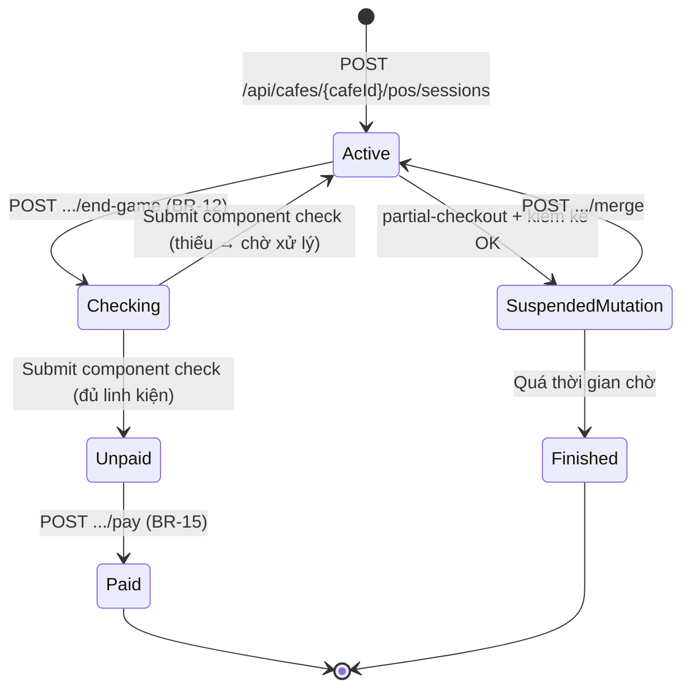

# ActiveSessionController

**Base route:** `/api/cafes/{cafeId}/sessions`  
**Controller:** `ActiveSessionController.cs`  
**Role:** Manager, CafeStaff — endpoint `alternative-cafes` cho phép anonymous

API vận hành phiên chơi tại quán: truy vấn, thanh toán (một phần/toàn bộ), ghép/tách nhóm, kiểm kê linh kiện, ghi nhận hao hụt. Tách ra từ `CafePosController` để rõ ràng theo concern.

> **Liên quan:** [cafe-pos.md](./cafe-pos.md) để biết start/end phiên, [payment.md](#) (booking-deposit flow), [settlement.md](./settlement.md) để biết giải ngân deposit.

---

## Endpoints

| Endpoint | Method | Mô tả | BR |
|----------|--------|--------|----|
| `/{sessionId}` | GET | Chi tiết phiên chơi | — |
| `/{sessionId}/end-game` | POST | Trả game — chuyển sang kiểm kê | BR-12 |
| `/{sessionId}/games/check` | POST | Submit bảng kiểm kê linh kiện | BR-12 |
| `/{sessionId}/games` | POST | Gán thêm game vào phiên | — |
| `/{sessionId}/checkout` | POST | Thanh toán toàn bộ sau kiểm kê | BR-15 |
| `/{sessionId}/partial-checkout` | POST | Thanh toán một phần (về sớm) | BR-12, BR-14 |
| `/{sessionId}/guest-slots` | POST | Thêm khách vô danh | BR-13 |
| `/{sessionId}/pay` | POST | Thanh toán hóa đơn tổng | BR-15, BR-09 |
| `/{sessionId}/merge` | POST | Ghép thành viên vào nhóm mới | — |
| `/{sessionId}/members/add` | POST | Thêm thành viên đến muộn | — |
| `/{sessionId}/inventory-loss` | POST | Ghi nhận hao hụt trước phiên | — |
| `/alternative-cafes` | GET | Gợi ý quán thay thế (public) | — |

**Header:** `Authorization: Bearer <manager-or-staff-token>`

---

## GET /api/cafes/{cafeId}/sessions/{sessionId}

Chi tiết phiên chơi: `startedAt`, `elapsedMinutes`, `estimatedRemainingMinutes`, members, games, deposit applied, total amount, status.

**Response codes:**
- `200` — Trả về `ActiveSessionDto`
- `401` — Thiếu/sai token
- `403` — Không có quyền vận hành quán
- `404` — Không tìm thấy phiên
- `500` — Lỗi hệ thống

---

## POST /api/cafes/{cafeId}/sessions/{sessionId}/end-game

Trả game từ khách → session chuyển `ACTIVE → CHECKING`. Bắt buộc trước khi checkout (BR-12).

**Response codes:**
- `200` — Đã trả game, chờ kiểm kê
- `409` — Phiên không ở trạng thái `ACTIVE`

---

## POST /api/cafes/{cafeId}/sessions/{sessionId}/games/check

Submit bảng kiểm kê linh kiện số hóa. Nhân viên đếm từng `component` → thiếu → cộng `penaltyFee` vào session, đánh dấu `MissingComponents`.

**Body:**
```json
{
  "sessionGameId": "guid",
  "results": [
    { "componentTemplateId": "guid", "actualQuantity": 3, "expectedQuantity": 5 }
  ]
}
```

**Response codes:**
- `200` — Đã lưu checklist
- `400` — `results` rỗng
- `409` — Phiên không ở trạng thái `CHECKING`
- `404` — Không tìm thấy phiên hoặc game

> **BR-12:** Sau khi đủ kiểm kê → mở khóa in hóa đơn (cho `partial-checkout` & `checkout`).

---

## POST /api/cafes/{cafeId}/sessions/{sessionId}/games

Gán thêm hộp game vào phiên (Exception 6 — nhóm tự ý lấy thêm game).

**Body:**
```json
{ "barcode": "BV-..." }
```

**Response codes:**
- `200` — Đã gán game vào phiên
- `400` — Game đã được gán trước đó
- `404` — Không tìm thấy game theo barcode

---

## POST /api/cafes/{cafeId}/sessions/{sessionId}/checkout

Thanh toán toàn bộ phiên sau khi kiểm kê linh kiện xong. Phiên chuyển `CHECKING → UNPAID` (hoặc thẳng `PAID` nếu không có deposit), trả hóa đơn tóm tắt.

**Body:** kết quả kiểm kê cuối cùng (nếu chưa gửi qua `/games/check`).

**Response codes:**
- `200` — Phiên chuyển `UNPAID`/`PAID`, trả bill summary
- `400` — Thiếu kiểm kê hoặc dữ liệu không hợp lệ
- `404` — Không tìm thấy phiên

---

## POST /api/cafes/{cafeId}/sessions/{sessionId}/partial-checkout

Thanh toán một phần khi có thành viên về sớm (Exception 4). Phiên chuyển sang `CHECKING` và **khóa in hóa đơn** cho đến khi kiểm kê (BR-12).

**Body:**
```json
{
  "memberUserIds": ["guid-1", "guid-2"],
  "applyDeposit": true
}
```

**Response codes:**
- `200` — Phiên chuyển `CHECKING`; chờ kiểm kê
- `400` — Danh sách thành viên rỗng

---

## POST /api/cafes/{cafeId}/sessions/{sessionId}/guest-slots

Thêm khách vô danh (BR-13 — không app/điện thoại hết pin). `GuestSlot` chạy đếm giờ cùng các thành viên khác nhưng **không chịu trách nhiệm tài sản**.

**Body:**
```json
{ "displayName": "Khách A" }
```

**Response codes:**
- `200` — Đã thêm khách vô danh
- `400` — Thiếu `displayName`

---

## POST /api/cafes/{cafeId}/sessions/{sessionId}/pay

Thanh toán hóa đơn tổng của phiên (BR-15):

```
TotalAmount = Subtotal (tiền giờ) + PenaltyAmount (phí phạt linh kiện) − DepositAppliedAmount (cọc đã trừ 1 lần BR-09)
```

**Body:**
```json
{
  "paymentMethod": "SePay",
  "penaltyItems": [
    { "sessionMemberId": "guid", "componentTemplateId": "guid", "penaltyFee": 15000 }
  ]
}
```

**Response codes:**
- `200` — Thanh toán thành công; phiên chuyển `PAID`
- `400` — Phiên không ở `UNPAID` hoặc dữ liệu sai
- `409` — Phiên không ở `UNPAID`

---

## POST /api/cafes/{cafeId}/sessions/{sourceSessionId}/merge

Ghép thành viên từ phiên cũ sang phiên mới (Exception 4 — A3 nhảy nhóm). Thành viên phải ở trạng thái `SUSPENDED_MUTATION` (đã kiểm kê ở nhóm cũ).

**Body:**
```json
{
  "memberUserId": "guid",
  "targetSessionId": "guid"
}
```

**Response codes:**
- `200` — Đã ghép thành viên vào nhóm mới
- `400` — Thành viên không ở `SUSPENDED_MUTATION`
- `404` — Không tìm thấy phiên hoặc thành viên
- `409` — Phiên đích không hoạt động

> **Lưu ý:** Thời gian đã có mặt tại quán của thành viên **không ngắt quãng**.

---

## POST /api/cafes/{cafeId}/sessions/{sessionId}/members/add

Thêm thành viên đến muộn vào nhóm đang chơi (Exception 8). Tách riêng mốc thời gian bắt đầu tính tiền cho người đến muộn.

**Body:**
```json
{ "userIds": ["guid-1", "guid-2"] }
```

**Response codes:**
- `200` — Đã thêm thành viên
- `400` — Phiên không hoạt động
- `404` — Không tìm thấy phiên

---

## POST /api/cafes/{cafeId}/sessions/{sessionId}/inventory-loss

Ghi nhận hao hụt linh kiện **trước phiên** (Exception 7 — nhân viên ca chiều phát hiện thiếu từ ca sáng). Hệ thống chặn tính phí phạt cho nhóm khách mới và truy ngược ca trước.

**Body:**
```json
{
  "sessionGameId": "guid",
  "missingComponents": [
    { "componentTemplateId": "guid", "missingQuantity": 2 }
  ],
  "notes": "Phát hiện thiếu từ ca sáng, đã audit."
}
```

**Response codes:**
- `200` — Đã ghi nhận hao hụt
- `404` — Không tìm thấy phiên

---

## GET /api/cafes/{cafeId}/sessions/alternative-cafes

**Public** (không cần token). Gợi ý quán thay thế khi quán mục tiêu hết chỗ (Exception 1).

**Query:**

| Param | Type | Required | Mô tả |
|-------|------|----------|--------|
| `gameTemplateId` | Guid | ✅ | Tựa game |
| `memberCount` | int | ✅ | Số người cần chỗ |
| `scheduledTime` | DateTime | ✅ | Giờ hẹn |

**Response 200:** danh sách quán gợi ý (cùng game + còn đủ chỗ + trong khu vực lân cận).

---

## State machine



---

## BR mapping

| BR | Áp dụng |
|----|---------|
| BR-09 | Cấn trừ deposit 1 lần duy nhất vào hóa đơn tổng |
| BR-12 | Khóa in hóa đơn khi `CHECKING` (partial checkout) |
| BR-13 | `GuestSlot` không chịu trách nhiệm tài sản |
| BR-14 | Phí phạt không gán vào `GuestSlot` |
| BR-15 | `TotalAmount = Subtotal + Penalty − DepositApplied` |
| BR-17 | Chỉ nhân viên POS được kết thúc/tách nhóm/tính tiền |