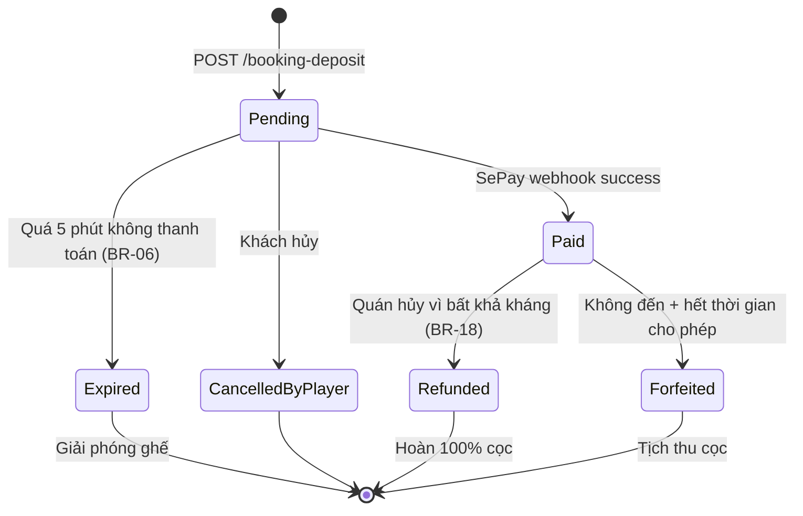
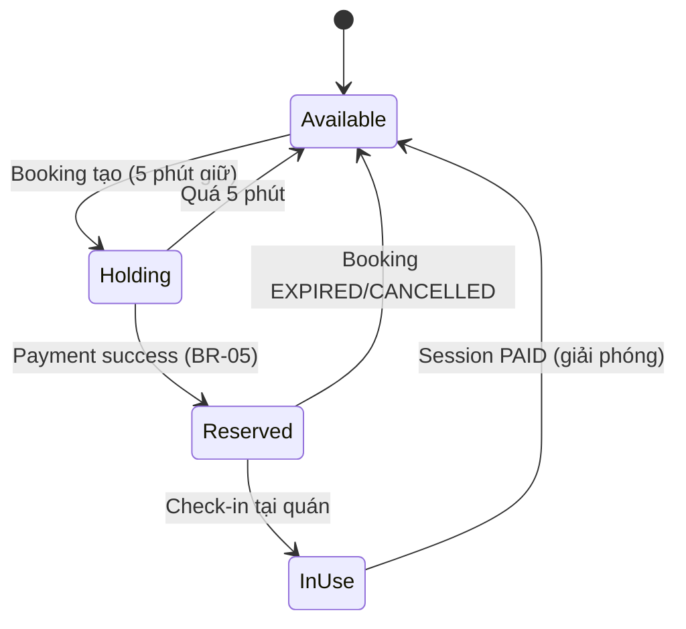

# Booking flow & Payment

> **Lưu ý quan trọng:** Tài liệu này tham chiếu tới `BookingController` đã cũ. Hiện tại **không có** `BookingController` riêng — flow booking/deposit đi qua `PaymentController` và webhook SePay.

## Vị trí thực tế của các endpoint

| Tính năng | Controller thực tế | Endpoint |
|-----------|---------------------|----------|
| Tạo booking + tạo deposit | `PaymentController` | `POST /api/payments/booking-deposit` |
| Regenerate QR cho deposit | `PaymentController` | `POST /api/payments/booking-deposit/{depositId}/regenerate-qr` |
| Refund booking | `PaymentController` | `POST /api/payments/booking-deposit/refund` |
| Webhook SePay xử lý thanh toán deposit | `SePayWebhookController` | `POST /api/payments/sepay/webhook` |
| Thanh toán session (POS) | `PaymentController` | `POST /api/payments/session-payment` |
| Manual confirm (fallback) | `PaymentController` | `POST /api/payments/manual-confirm` |

> **Xem đầy đủ:** [payment.md](./payment.md), [sepay-webhook.md](./sepay-webhook.md), [sepay-account.md](./sepay-account.md), [sepay-payment-flow.mdc](../../.cursor/rules/sepay-payment-flow.mdc).

---

## Luồng booking — cập nhật

### Happy path

```
1. Mobile: POST /api/v1/lobbies (tạo lobby)
   → Lobby status = Open

2. Members join → LobbyFull
   → Server tạo "intent" để đặt cọc

3. Mobile: POST /api/payments/booking-deposit
   Body: { cafeId, lobbyId?, scheduledStartTime, seatCount, amount }
   → Status: PENDING_DEPOSIT
   → BookingDeposit.QrUrl, QrExpiresAt = Now + 5min
   → SeatSlot: AVAILABLE → HOLDING

4. Customer quét QR → thanh toán qua SePay/VietQR
   → SePay gửi webhook → SePayWebhookController
   → POST /api/payments/sepay/webhook
   → PaymentService.HandleSePayWebhookAsync
   → BookingDeposit.Status = Paid
   → SeatSlot: HOLDING → RESERVED
   → Lobby.Status = Full → Ready for check-in

5. Customer đến quán → POS quét QR booking
   → ActiveSession tạo với DepositAppliedAmount
   → SeatSlot: RESERVED → IN_USE
```

### Exception paths

| Tình huống | Xử lý |
|------------|-------|
| Quá 5 phút không thanh toán (BR-06) | Background job → `BookingDeposit.Status = Expired`, SeatSlot về `AVAILABLE` |
| Quán hết chỗ thực tế (Exception 1) | Trả 409 + suggest quán thay thế qua `ActiveSessionController.GetAlternativeCafes` |
| Khách đến muộn quá 30 phút (Exception 5) | `BookingDeposit.Status = Expired`, tịch thu cọc theo `DepositRefundPolicy` |
| Webhook SePay timeout/fail | Retry exponential backoff (max 3 lần); fallback VietQR static QR |
| Quán hủy vì bất khả kháng (Exception 9, BR-18) | `BookingDeposit.Status = Refunded`, hoàn 100% cọc |

---

## State machine — `BookingDeposit`



## State machine — `SeatSlot`



---

## API liên quan

- **Payment API chi tiết:** [payment.md](./payment.md) — tất cả endpoint của `PaymentController`.
- **Deposit flow:** [sepay-webhook.md](./sepay-webhook.md), [sepay-account.md](./sepay-account.md)
- **Lobby flow:** [lobby.md](./lobby.md)
- **POS session flow:** [cafe-pos.md](./cafe-pos.md), [active-session.md](./active-session.md)
- **Settlement (giải ngân):** [settlement.md](./settlement.md)
- **Business rules:** [sepay-payment-flow.mdc](../../.cursor/rules/sepay-payment-flow.mdc), [boardverse.mdc](../../.cursor/rules/boardverse.mdc) (BR-05, BR-06, BR-09)