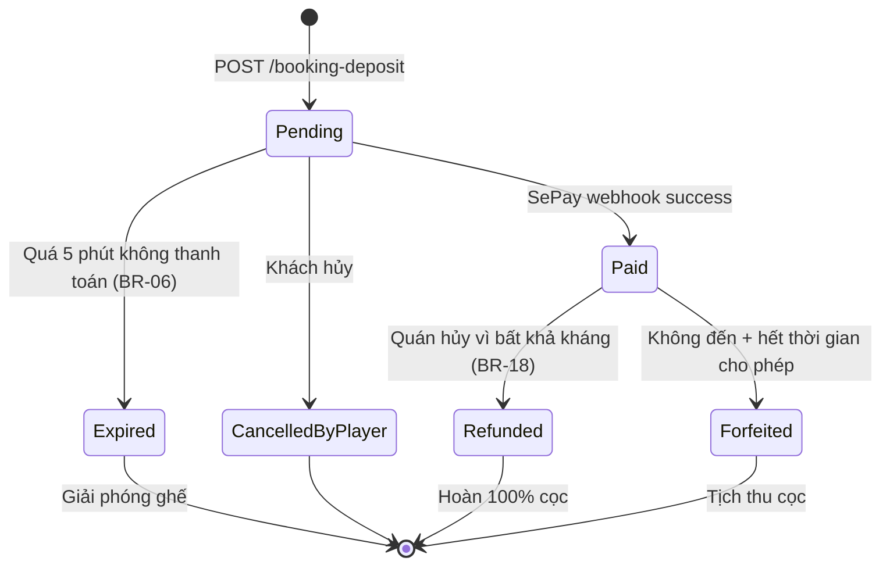
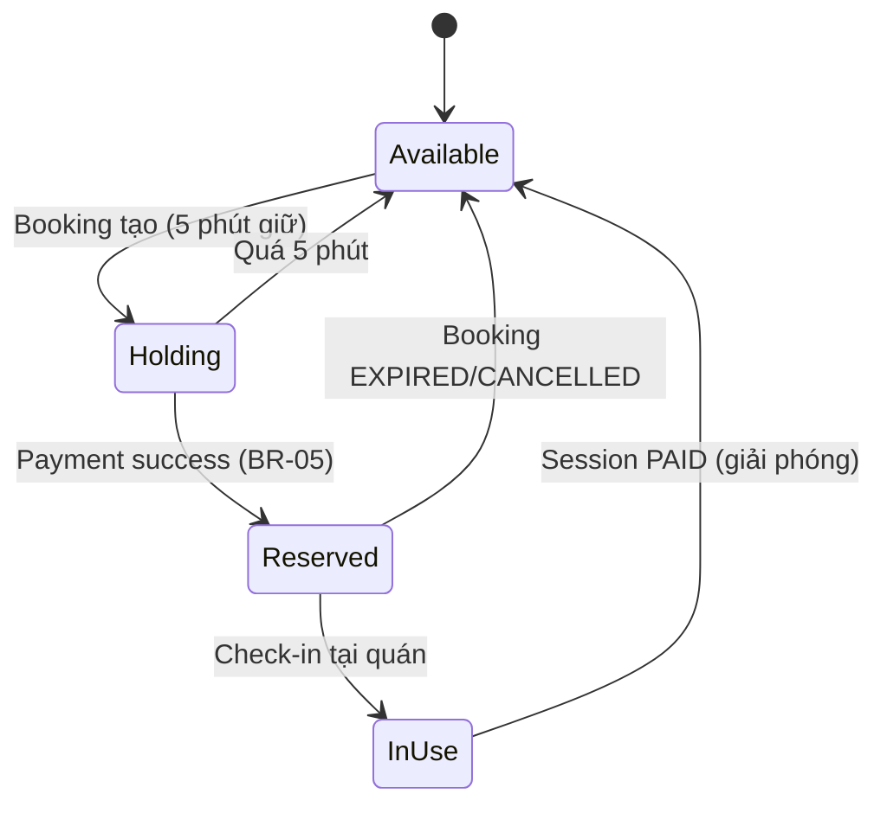

# Booking API (DEPRECATED)

> **⚠️ DEPRECATION NOTICE — Phase 1 (2026-08-12)**
>
> **`BookingController.cs` đang trong quá trình deprecate.**
> - **Flow A (MỚI — recommended):** Dùng [reservation.md](./reservation.md) với `/api/v1/reservations/*`
> - **Flow B (CŨ — booking.md này):** `/api/bookings/*` sẽ bị xóa ở Phase 4 khi FE xác nhận không còn sử dụng
> - Migration guide: [time-slot-fixed-end-design.md](../time-slot-fixed-end-design.md) §13.1
>
> **Controllers:**
> - `BookingController.cs` (`/api/bookings`) — **Flow B CŨ**, đang deprecated ✅ (Phase 1)
> - `BookingRatingController.cs` — Karma cross-rating (vẫn dùng cho cả 2 flows)
> - **Reservation flow (Flow A MỚI):** xem [reservation.md](./reservation.md)
>
> **Feature flag (2026-08-15):** Toàn bộ controller `/api/bookings/*` được gate bởi `LegacyBookingSettings.Enabled`
> (config section `LegacyBooking`). Khi `Enabled = false`, mọi endpoint trả `410 Gone` với header
> `Deprecation: true` + body hướng dẫn migrate sang `/api/v1/reservations/*`. Trên production
> (Render) hiện đang `Enabled = true` — chuyển sang `false` qua env `LegacyBooking__Enabled=false` sau khi
> FE xác nhận không còn gọi `/api/bookings/*`. Sunset cuối cùng: `Wed, 31 Dec 2026 23:59:59 GMT`.
>
> **Domain phụ trách:** Tạo booking (legacy), check-in/out, theo dõi trạng thái session, no-show vote, cross-rating.
>
> | Flow liên quan | Doc |
> |---|---|
> | Payment + SePay deposit | [payment.md](./payment.md) |
> | POS session payment + settlement | [cafe-pos.md](./cafe-pos.md) |
> | Webhook SePay xử lý deposit | [sepay-webhook.md](./sepay-webhook.md) |
> | Lobby flow | [lobby.md](./lobby.md) |
> | **Reservation flow (MỚI — recommended)** | [reservation.md](./reservation.md) |
> | **Time-slot fixed-end design (FE-facing v2.5)** | [../time-slot-fixed-end-design.md](../time-slot-fixed-end-design.md) |

---

## Quick FE Reference — Booking → Reservation mapping (2026-08-12)

> **Nếu bạn đang integrate FE mới (mobile app, web admin) — hãy dùng flow `Reservation` (MỚI) thay vì `Booking` cũ.**

| Tên trong flow Booking cũ | Tên thực tế (Entity/Field) | URL mới (Reservation flow) |
|---|---|---|
| `bookingId` (Guid) | `Reservation.Id` (Guid) | `GET /api/v1/reservations/{id}` |
| `bookingCode` / `verificationQRCode` | `Reservation.ReservationCode` (8-char alphanumeric uppercase) | Lookup trong POS qua `POST /api/cafes/{cafeId}/pos/check-in` với `code` |
| `startTime` (user nhập) | `playDate` (DateOnly) + `timeSlot` (enum Morning/Afternoon/Evening/LateNight) + `preferredStartTime?` (TimeOnly) | Trong body của `POST /api/v1/reservations/quote` |
| `endTime` / `scheduleEndTime` (user nhập) | **KHÔNG CÓ field** — auto-resolve: `playDate + TimeSlot.startTime..endTime` (qua `CafeSchedule.GetEndTime(timeSlot)`) | — |
| `Booking.status` enum (PENDING/CONFIRMED/CHECKED_IN/COMPLETED/...) | `ReservationStatus` enum (Holding/Confirmed/CheckedIn/Completed/Cancelled/NoShow) + `LobbyStatus` enum + `ActiveSessionStatus` enum | Trả về trong `ReservationResponseDto` |
| Deposit (VND qua SePay) | `Reservation.DepositAmount` (BVC) + `Wallet.HeldBalance` + Ledger entry `DEPOSIT_HOLD` | Trả trong `ReservationResponseDto` |
| `WalkInBooking` qua `POST /api/pos/walk-in-bookings` | `WalkInBooking` entity (giữ nguyên) | `POST /api/v1/reservations/walkin` |
| `WalkInWindow` qua `GET /api/pos/walk-in-windows` | `WalkInWindow` entity (giữ nguyên) | `GET /api/v1/reservations/walkin/windows` |
| `BookingExtension` qua `POST /api/bookings/{id}/extend` | ✅ Đã migrate: `POST /api/v1/reservations/{id}/extend` (Phase 3) |
| `Booking.Cancel` qua `DELETE /api/bookings/{id}` | `Reservation.CancelAsync` | `POST /api/v1/reservations/{id}/cancel` |

**Nguyên tắc:**
- Mọi flow online (player app tạo lobby, đặt cọc, cancel, extend) → gọi `/api/v1/reservations/...`.
- Mọi POS check-in / end session → gọi `/api/cafes/{cafeId}/pos/...`.
- `Booking` cũ chỉ còn cho backward-compat (SePay per-member deposit BR-22) và walk-in legacy.

Xem chi tiết FE-facing flow + state machine + edge cases tại:
[`../time-slot-fixed-end-design.md`](../time-slot-fixed-end-design.md) (Section 0.1, 1.3, 2.1, 10, 11).

---

## Kiến trúc 2-flow song song

Hệ thống BoardVerse hiện có **2 cách đặt chỗ** chạy song song, dùng **2 entities khác nhau làm root**. Cả hai đều link về cùng `Lobby` và `ActiveSession` ở downstream.

### So sánh nhanh

| Khía cạnh | Flow A — **Reservation (MỚI)** | Flow B — **Booking (CŨ)** |
|---|---|---|
| Entry point | `POST /api/v1/reservations/confirm` | `POST /api/bookings` |
| Root entity | `Reservation` | `Booking` |
| Tiền cọc | **BVC wallet** (Ledger-based) | **SePay gateway** (BookingDeposit) |
| Per-member deposit | Không (Host trả toàn bộ) | Có (`BookingGroupCode` per-member) |
| Matchmaking | Lobby tuyển đến `minPlayers`, tạo atomic với Reservation | **KHÔNG qua Lobby.** Walk-in (`LobbyId = null`) hoặc legacy lobby cũ |
| End time | Auto-resolve từ `TimeSlot` enum | User nhập `scheduleEndTime` |
| Used by | Mobile app qua Lobby → Reservation | SePay webhook flow + Walk-in |
| State | `ReservationService` (atomic BVC) | `BookingService` + `BookingDepositService` (SePay) |
| Customer điển hình | Player đặt qua app online | Walk-in player + time-slot model |

### Diagram tổng quan

```
                     ┌───────────────────────┐
                     │        Lobby          │
                     │                       │
                     │  .ReservationId ──────┼──────► Reservation  (Flow A — MỚI, BVC)
                     │  .BookingId      ──────┼──────► Booking      (Flow B — CŨ, SePay)
                     └─────────────┬─────────┘
                                   │
                                   ▼
                          ActiveSession
                                   │
                                   ▼
                         CafePosService.Pay
                                   │
                  ┌────────────────┼────────────────┐
                  ▼                                 ▼
        Flow A: ReservationService          Flow B: RefundController +
            .CompleteAndCaptureAsync             CafePosService.Settle
        (BVC → settlement)                   (refund SePay / cash)
```

### Khi nào dùng flow nào?

| Tình huống | Dùng flow nào | Lý do |
|---|---|---|
| Player tạo lobby qua app + chờ đủ người | **Flow A — Reservation** | Chuẩn của MVP, dùng BVC |
| Player qua app walk-in đến quán (không qua lobby) | **Flow B — WalkInBooking** | `Booking.WalkInWindowId` FK |
| Lobby legacy tạo trước khi deploy Reservation | **Flow B — Booking** | Backward compat |
| SePay per-member deposit (BR-22) | **Flow B — Booking** + `BookingDeposit` | Spec gốc của SePay flow |
| Time-slot fixed-end (`scheduleEndTime` user nhập) | **Flow B — TimeSlotBooking** | Doc mới §10.1 chưa migrate sang Reservation |
| POS extend session | **Flow B — BookingExtension** | Service đang query `Booking` entity |

### Lưu ý quan trọng khi code

1. **KHÔNG gọi `IBookingRepository` từ Reservation flow** — `ReservationService.cs` chỉ dùng `IReservationRepository`. Ngược lại, `BookingService.cs` không gọi `ReservationService`.
2. **Cả 2 flow cùng dùng `Lobby` và `ActiveSession`**: POS scan QR nhận diện cả 2 loại code (`ReservationCode` hoặc `BookingCode`).
3. **Khi migrate booking → reservation** (tương lai): cần ETL qua DB. Hiện tại cả 2 đều live.

---

## REST Endpoints — `BookingController` (Flow B — CŨ)

| Method | Path | Role | Mô tả |
|---|---|---|---|
| `POST` | `/api/bookings` | Player (Host lobby) | Tạo booking từ lobby đã lock |
| `GET` | `/api/bookings/{bookingId}` | Player (owner), Manager, Admin | Chi tiết booking |
| `GET` | `/api/bookings/{bookingId}/session-status` | Player (lobby member đã check-in), Manager, Admin | Realtime session status (Task #8) |
| `GET` | `/api/bookings/lobby/{lobbyId}` | Player (lobby member), Manager, Admin | Booking theo lobby |
| `GET` | `/api/bookings/cafe/{cafeId}` | Player (summary rút gọn), Manager/CafeStaff/Admin (full) | Bookings theo quán (Task #14) |
| `PATCH` | `/api/bookings/{bookingId}` | Player (Host lobby) | Cập nhật bàn/giờ/số người |
| `DELETE` | `/api/bookings/{bookingId}` | Player (Host lobby) | Hủy booking |
| `POST` | `/api/bookings/{bookingId}/check-in` | Manager, CafeStaff | ~~Removed~~ — dùng `POST /api/cafes/{cafeId}/pos/check-in` (BR §21A.7) |
| `POST` | `/api/cafes/{cafeId}/pos/check-in` | Manager, CafeStaff | Check-in tại quán theo `code` (ReservationCode / BookingCode) |
| `POST` | `/api/bookings/{bookingId}/check-out` | Manager, CafeStaff | ~~Removed~~ — `ReservationService.CompleteAndCaptureAsync` khi ActiveSession PAID (BR-REVENUE-01) |

> ⚠️ **Technical debt**: `ReservationService` (Flow A) **không hoàn toàn độc lập** với `Booking` (Flow B). Ở cuối `CompleteAndCaptureAsync`, `TriggerKarmaAggregationAsync` được gọi — query `BookingDeposits` table trực tiếp và gọi `IBookingRatingService.AggregateBookingOutcomesAsync(bookingId)`. Điều này do 3 entity `BookingRating` / `BookingNoShowVote` / `KarmaShortPlayRecord` hiện chỉ có `BookingId` FK, chưa có `ReservationId`. Reservation-only lobby (không bao giờ tạo Booking) sẽ **skip Karma aggregation**. Xem chi tiết tại [`.cursor/rules/booking-vs-reservation.mdc` §II-A](../../.cursor/rules/booking-vs-reservation.mdc) — đang DEFER.


## REST Endpoints — `TimeSlotBookingController`

> **⚠️ DEPRECATION NOTICE — 2026-08-12:**
>
> `TimeSlotBookingController` (3 endpoints: `availability` / `check-in` / `end`) thuộc flow Booking cũ với user-tự-nhập `scheduleEndTime`. Đã migrate sang flow Reservation mới (auto end time từ `TimeSlot` enum).
>
> **FE mới tuyệt đối KHÔNG gọi các endpoint dưới.** Thay bằng:
>
> | Tính năng | Endpoint cũ (DEPRECATED) | Endpoint mới (USE THIS) |
> |---|---|---|
> | Check availability | `GET /api/bookings/availability` | `POST /api/v1/reservations/quote` |
> | Check-in | `POST /api/bookings/{id}/check-in` | `POST /api/cafes/{cafeId}/pos/check-in` |
> | End session | `POST /api/bookings/{id}/end` | `POST /api/cafes/{cafeId}/pos/sessions/{sessionId}/end` |
>
> Xem chi tiết FE-facing migration tại [`../time-slot-fixed-end-design.md`](../time-slot-fixed-end-design.md) (Section 10.1 + 11).

**Controller:** `TimeSlotBookingController.cs` (`/api/bookings`)
**Domain:** Time-slot booking với Fixed End Time (legacy).

|| Method | Path | Role | Mô tả |
||---|---|---|---|
|| `GET` | `/api/bookings/availability` | Player | Check availability cho slot |
|| `POST` | `/api/bookings/{bookingId}/check-in` | Manager, CafeStaff | Check-in booking |
|| `POST` | `/api/bookings/{bookingId}/end` | Manager, CafeStaff | Kết thúc session + refund + WalkInWindow |

Xem chi tiết tại [time-slot-fixed-end-design.md](../time-slot-fixed-end-design.md).

## REST Endpoints — `BookingRatingController`

| Method | Path | Role | Mô tả |
|---|---|---|---|
| `POST` | `/api/bookings/{bookingId}/no-show-votes` | Player (lobby member) | Submit vote vắng mặt (Task #4) |
| `POST` | `/api/bookings/{bookingId}/ratings` | Player (lobby member) | Submit cross-rating (Task #5) |
| `GET` | `/api/bookings/{bookingId}/ratings/status` | Player (lobby member) | Trạng thái rating của voter |

Xem chi tiết tại [booking-rating.md](./booking-rating.md).

---

## Luồng booking — cập nhật

### Happy path

```
1. Mobile: POST /api/v1/lobbies (tạo lobby)
   → Lobby status = Open

2. Members join → LobbyFull
   → Server tạo "intent" để đặt cọc

3. Mobile: POST /api/payments/booking-deposit
   Body: { cafeId, lobbyId?, scheduledStartTime, seatCount, amount }
   → Status: PENDING_DEPOSIT
   → BookingDeposit.QrUrl, QrExpiresAt = Now + 5min
   → SeatSlot: AVAILABLE → HOLDING

4. Customer quét QR → thanh toán qua SePay/VietQR
   → SePay gửi webhook → SePayWebhookController
   → POST /api/payments/sepay/webhook
   → PaymentService.HandleSePayWebhookAsync
   → BookingDeposit.Status = Paid
   → SeatSlot: HOLDING → RESERVED
   → Lobby.Status = Full → Ready for check-in

5. Customer đến quán → POS quét QR booking
   → Kiểm tra Booking.Status == Confirmed (chưa check-in)
   → ActiveSession tạo với DepositAppliedAmount = 0 (không trừ cọc)
   → Booking.Status = CheckedIn (cập nhật sau check-in)
   → SeatSlot: RESERVED → IN_USE
```

### Booking Status Flow (Updated)

```
Confirmed → CheckedIn (khi POS quét mã đặt chỗ thành công)
```

**Bug Fix:** Trước đây `StartSessionFromBookingAsync` không cập nhật `Booking.Status`. Bây giờ:
1. Kiểm tra `Booking.Status == CheckedIn` → ngăn chặn check-in 2 lần
2. Sau khi tạo session thành công → `Booking.Status = CheckedIn`

**P1 Fix #6: Race Condition Prevention**

Để ngăn chặn overbooking khi nhiều user đặt cùng bàn cùng lúc:

1. `CreateBookingAsync` sử dụng **pessimistic locking** với `FOR UPDATE SKIP LOCKED`
2. Toàn bộ flow tạo booking được wrap trong transaction
3. Kiểm tra xung đột chỉ áp dụng cho `BookingStatus != Cancelled` (Confirmed/CheckedIn mới là xung đột)

```csharp
// BookingRepository.GetConflictingBookingsWithLockAsync
SELECT * FROM "Bookings"
WHERE "CafeTableId" = @tableId
AND "Status" != @cancelled
AND "ScheduledStartTime" < @endTime
AND "ScheduleEndTime" > @startTime
FOR UPDATE SKIP LOCKED
```

### Exception paths

| Tình huống | Xử lý |
|------------|-------|
| Quá 5 phút không thanh toán (BR-06) | Background job → `BookingDeposit.Status = Expired`, SeatSlot về `AVAILABLE` |
| Quán hết chỗ thực tế (Exception 1) | Trả 409 + suggest quán thay thế qua `GET /api/cafes/{cafeId}/sessions/alternative-cafes` |
| Khách đến muộn quá 30 phút (Exception 5) | `BookingDeposit.Status = Expired`, tịch thu cọc theo `DepositRefundPolicy` |
| Webhook SePay timeout/fail | Retry exponential backoff (max 3 lần); fallback VietQR static QR |
| Quán hủy vì bất khả kháng (Exception 9, BR-18) | `BookingDeposit.Status = Refunded`, hoàn 100% cọc |

---

## State machine — `BookingDeposit`


```mermaid
stateDiagram-v2
    [*] --> Pending: POST /booking-deposit
    Pending --> Paid: SePay webhook success
    Pending --> Expired: Quá 5 phút không thanh toán (BR-06)
    Pending --> CancelledByPlayer: Khách hủy
    Paid --> Refunded: Quán hủy vì bất khả kháng (BR-18)
    Paid --> Forfeited: Không đến + hết thời gian cho phép
    Expired --> [*]: Giải phóng ghế
    CancelledByPlayer --> [*]
    Refunded --> [*]: Hoàn 100% cọc
    Forfeited --> [*]: Tịch thu cọc
```

## State machine — `SeatSlot`


```mermaid
stateDiagram-v2
    [*] --> Available
    Available --> Holding: Booking tạo (5 phút giữ)
    Holding --> Reserved: Payment success (BR-05)
    Holding --> Available: Quá 5 phút
    Reserved --> InUse: Check-in tại quán
    Reserved --> Available: Booking EXPIRED/CANCELLED
    InUse --> Available: Session PAID (giải phóng)
```

---

## API liên quan

- **Payment API chi tiết:** [payment.md](./payment.md) — tất cả endpoint của `PaymentController`.
- **Deposit flow:** [sepay-webhook.md](./sepay-webhook.md), [sepay-account.md](./sepay-account.md)
- **Lobby flow:** [lobby.md](./lobby.md)
- **POS session flow:** [cafe-pos.md](./cafe-pos.md) (canonical)
- **Settlement (giải ngân):** [settlement.md](./settlement.md)
- **Business rules:** [sepay-payment-flow.mdc](../../.cursor/rules/sepay-payment-flow.mdc), [boardverse.mdc](../../.cursor/rules/boardverse.mdc) (BR-05, BR-06, BR-09)

---

## Booking — Mobile gaps (bổ sung 2026-08-01)

Các endpoint bổ sung theo `booking-payment-gaps.md` (Tasks #7, #8, #9, #12, #13, #14).

### Coverage status — 10/15 ✅ / 5 còn lại ⚠️

| # | Task | Endpoint / Method | Role | Phân loại | Status |
|---|------|--------------------|------|-----------|--------|
| 1 | Available tables | `GET /api/cafes/{cafeId}/available-tables` | Player | Bắt buộc | ✅ Done (`CafeBookingController.GetAvailableTables`) |
| 2 | Availability (time-slot) | `GET /api/cafes/{cafeId}/availability` | Player | Bắt buộc | ✅ Done (`CafeBookingController.GetAvailability`) |
| 3 | Walk-in booking (`lobbyId=null`) | `POST /api/bookings` (allow `lobbyId=null`) | Player | Bắt buộc | ✅ Done (`BookingService.CreateBookingAsync` chấp nhận `lobbyId=null`) |
| 4 | No-show-votes | `POST /api/bookings/{bookingId}/no-show-votes` | Player | Bắt buộc | ✅ Done (`BookingRatingService.SubmitNoShowVoteAsync`) |
| 5 | Ratings POST + GET status + aggregate | `POST/GET /api/bookings/{bookingId}/ratings` | Player | Bắt buộc | ✅ Done (`BookingRatingService.SubmitRatingsAsync` + `GetRatingStatusAsync` + `AggregateBookingOutcomesAsync`) |
| 6 | AuthZ Player GET deposit | `GET /api/payments/booking-deposit/{id}` | Player | Bắt buộc | ✅ Done (`PaymentController.GetBookingDeposit` cho phép Player owner) |
| 7 | SignalR booking events | realtime hub events | — | Nên có | ✅ Done (`BookingCheckedIn` / `BookingCheckedOut` / `BookingCancelled` / `BookingNoShowMarked`) |
| 8 | Session-status | `GET /api/bookings/{bookingId}/session-status` | Player | Nên có | ✅ Done (`BookingService.GetSessionStatusAsync`) |
| 9 | Push lobby auto-cancel | background job | — | Nên có | ✅ Done (`LobbyTimeoutJob` gọi `IPushNotificationService.SendToUsersAsync`) |
| 12 | Refund-policy | `PATCH /api/cafes/{cafeId}/deposit-refund-policy` | Manager | Nice-to-have | ✅ Done |
| 13 | Push khi Manager đổi giá + Update pricing-config | `PUT /api/cafes/{cafeId}/pricing-config` | Manager | Nice-to-have | ✅ Done (`CafeService.UpdatePricingConfigAsync` + SignalR event + push notification) |
| 14 | Bookings by cafe (Player view) | `GET /api/bookings/cafe/{cafeId}` | Player | Nice-to-have | ✅ Done (summary rút gọn theo role) |
| 15 | Validate `playerQuantity` PATCH | `PATCH /api/bookings/{id}` | Player | Bắt buộc sửa | ✅ Done (validate `playerQuantity ≤ lobby.CurrentMembers` + `≤ seatCount`) |
| 10 | BookingResponseDto fields | DTO bổ sung | — | Nên có | ✅ Done (thêm `CheckedInAt`, `CheckedInByUserId`, `LobbySummary`) |
| 11 | BookingDepositResponseDto fields | DTO bổ sung | — | Nên có | ✅ Done (thêm `BookingId`, `UserId`, `IsWalkIn`, `BookingGroupCode`) |

> **Tasks #9 + #13** đã wired với `IPushNotificationService` qua `FcmPushNotificationService` (Firebase Admin SDK). Cấu hình: `Firebase:Enabled=true` + `Firebase:ProjectId=boardverse-app` + `FIREBASE_CREDENTIALS_JSON` env var trên Render.

### KarmaLog audit trail — Task #5 side effect

Khi Staff thực hiện `POS check-out` (qua `ReservationService.CompleteAndCaptureAsync`) → tự động gọi `BookingRatingService.AggregateBookingOutcomesAsync(bookingId)`. Chi tiết aggregate workflow xem section [Aggregate Karma (Task #5)](#aggregate-karma-task-5) bên dưới.

> **Reuses existing `KarmaLog` table** (không tạo duplicate entity). `UserProfile.KarmaPoints` (int) làm source of truth. `KarmaLog.RelatedLobbyId` được dùng làm correlation id cho booking id. Công thức delta: `(avg - 3.0) * 10`, làm tròn về int qua `(int)Math.Round(delta)`. 12 unit tests passing.

> **No-show-votes validation window (Task #4):** Booking entity đã được bổ sung field `CheckedInAt` (DateTime?, nullable) + `CheckedInByUserId` (Guid?, nullable, FK → Users.Id) qua migration `20260801060358_AddCheckedInAtToBooking`. Khi Staff gọi `POST /api/cafes/{cafeId}/pos/check-in` (Reservation BVC flow) → backend set cả 2 field trên `Booking` entity. Vote window: voter chỉ được vote sau `CheckedInAt + 30 phút` (tránh vote ngay khi vừa check-in) và phải trước `ScheduleEndTime + 24h`.

### `GET /api/bookings/{bookingId}/session-status` — Task #8

**Role:** Player (chỉ member lobby đã check-in), Manager, Admin.

**Mục đích:** Mobile xem realtime ActiveSession status khi Staff thực hiện partial-checkout. Trả về: ai về sớm, bill bao nhiêu, phiên còn bao lâu, bill cuối dự kiến.

**Response 200:**
```json
{
  "statusCode": 200,
  "isSuccess": true,
  "data": {
    "bookingId": "uuid",
    "activeSessionId": "uuid",
    "sessionStatus": "Active",
    "startedAt": "2026-08-01T19:00:00Z",
    "currentDurationMinutes": 75,
    "members": [
      {
        "userId": "uuid",
        "username": "alice",
        "status": "LeftEarly",
        "leftAt": "2026-08-01T20:00:00Z",
        "partialBillAmount": 0,
        "partialBillPaid": false,
        "mergedIntoSessionId": null
      }
    ],
    "estimatedFinalBill": {
      "subtotal": 250000,
      "penalty": 0,
      "depositApplied": 50000,
      "total": 200000
    }
  }
}
```

**Lỗi:** `401`, `403` (không phải member), `404` (booking không tồn tại), `500`.

### `GET /api/bookings/cafe/{cafeId}` — Task #14 (Player view)

**Role:** Player (rút gọn summary), Manager/CafeStaff/Admin (full BookingResponseDto).

**Mục đích:** Mobile Discovery page hiển thị mật độ booking theo khung giờ. Player view trả summary fields — KHÔNG lộ `verificationQRCode`, `paymentRef`, `memberIds` (bảo mật).

**Response 200 (Player view):**
```json
{
  "statusCode": 200,
  "isSuccess": true,
  "data": [
    {
      "id": "uuid",
      "scheduledStartTime": "datetime",
      "scheduleEndTime": "datetime",
      "playerQuantity": 4,
      "status": "Confirmed"
    }
  ]
}
```

**Logic:** Backend tự detect role. Manager/CafeStaff/Admin → full DTO. Player → summary rút gọn.

### `PATCH /api/cafes/{cafeId}/deposit-refund-policy` — Task #12

**Role:** Manager (chỉ chủ quán).

**BR-18:** Manager cấu hình 1 trong 3 chính sách:
- `Full` (0): hoàn 100% cọc khi hủy
- `Partial` (1): hoàn theo bậc thang theo thời gian trước giờ hẹn
- `None` (2): không hoàn, tịch thu cọc về BoardVerse

**Request body:**
```json
{
  "policy": "Partial",
  "partialTiers": [
    { "minHoursBeforeScheduled": 24, "refundPercent": 50 },
    { "minHoursBeforeScheduled": 12, "refundPercent": 25 },
    { "minHoursBeforeScheduled": 0, "refundPercent": 0 }
  ]
}
```

**Validation:**
- `Policy=Partial` mà không có `partialTiers` → 400
- `partialTiers` tối đa 5 bậc
- 2 bậc cùng `minHoursBeforeScheduled` → 400
- `RefundPercent` ngoài 0-100 → 400

**Lỗi:** `400`, `403`, `404`, `500`.

### `PUT /api/cafes/{cafeId}/pricing-config` — Task #13

**Role:** Manager (chỉ chủ quán).

**BR-04:** Chỉ cho phép cập nhật khi quán đóng cửa (`IsPricingLocked=false`). Sau khi update → broadcast SignalR event `CafePricingChanged` cho member có booking trong tuần.

**Request body:**
```json
{
  "billingModel": "TimeBased",
  "basePrice": 90000,
  "tieredBlockRate": 25000,
  "tieredBlockMinutes": 15
}
```

**Response 200:**
```json
{
  "statusCode": 200,
  "isSuccess": true,
  "data": {
    "cafeId": "uuid",
    "billingModel": "TimeBased",
    "basePrice": 90000,
    "tieredBlockRate": 25000,
    "tieredBlockMinutes": 15,
    "isPricingLocked": false,
    "operationalProfileUpdatedAt": "2026-08-01T15:00:00Z",
    "affectedBookingsCount": 12
  }
}
```

**Lỗi:** `400`, `403`, `404`, `409` (quán đang hoạt động), `500`.

---

### `Bookings/{id}/check-out` — Aggregate Karma (Task #5)

**Role:** Manager/Staff (chỉ người có quyền POS).

**Mục đích:** Khi Staff check-out booking, backend tự động gọi `BookingRatingService.AggregateBookingOutcomesAsync(bookingId)` để:

1. **Cross-rating:** Đọc các `BookingRating` rows chưa aggregate (`IsAggregated = false`). Với mỗi user được rate, tính `avgScore = (attitude + sportsmanship + punctuality) / 3` của tất cả voters → `delta = (avgScore - 3.0) * 10`. Cộng/trừ `UserProfile.KarmaPoints` và ghi `KarmaLog` (Source = `PlayerCrossRating`, Category = `CrossRating`).
2. **No-show confirm:** Đọc các `BookingNoShowVote`. Với mỗi userId xuất hiện trong `> 50%` votes → trừ 10 `KarmaPoints` (Source = `SystemAutomatic`, Category = `NoShow`).
3. **Forfeit deposit:** Nếu no-show user có `BookingDeposit` ở `Paid` và `RefundPolicy = None` → set `Status = Forfeited` + ghi `KarmaLog` audit row (Source = `SystemAutomatic`, Category = `NoShow`).
4. **Idempotent:** Set `IsAggregated = true` cho tất cả rating rows. Staff có thể bấm check-out lại nhiều lần mà không tính trùng.

**Signature summary**:

```csharp
Task<BookingRatingAggregationResultDto> AggregateBookingOutcomesAsync(Guid bookingId);
```

**Response DTO (return value, hiện không exposed qua HTTP — internal booking workflow):**
```json
{
  "bookingId": "uuid",
  "aggregatedAt": "2026-08-01T20:00:00Z",
  "ratingsProcessed": 4,
  "karmaDeltaByUser": {
    "userId-A": 10.0,
    "userId-B": -5.0
  },
  "noShowConfirmedMembers": ["userId-C"],
  "forfeitedDepositIds": ["deposit-D"],
  "totalKarmaDelta": -5.0
}
```

**Audit log (`KarmaLog` table):**

| Field | Value |
|-------|-------|
| `UserId` | UserId bị ảnh hưởng Karma |
| `Source` | `PlayerCrossRating` (cross-rating) / `SystemAutomatic` (no-show + forfeit) |
| `ViolationCategory` | `CrossRating` / `NoShow` |
| `KarmaPointsChange` | Delta áp dụng (int) |
| `KarmaBefore` / `KarmaAfter` | Snapshot trước/sau |
| `Reason` | Human-readable audit message |
| `RelatedLobbyId` | Correlation → `BookingId` |
| `IsAdminAdjustment` | `false` |

**Edge cases:**
- Booking ở `PendingDeposit` / `Cancelled` → 409 Conflict (không aggregate).
- Không có rating rows chưa aggregate + không có no-show vote → return empty result, không có side effect.
- Aggregate lỗi → log error, KHÔNG fail check-out (staff có thể replay).

---

## SignalR realtime events — Tasks #7, #9, #13

Hub: `/hubs/lobby` (đã có cho Lobby). Các event mới:

### Groups

| Group | Format | Subscribe | Mục đích |
|-------|--------|-----------|----------|
| Booking | `booking-{bookingId}` | `JoinBookingGroup(bookingId)` | Nhận event `BookingCheckedIn`, `BookingCheckedOut`, `BookingCancelled`, `BookingNoShowMarked` |
| Cafe | `cafe-{cafeId}` | `JoinCafeGroup(cafeId)` | Nhận event `CafePricingChanged` |
| Lobby | `{lobbyId}` | `JoinLobby(lobbyId)` (đã có) | `LobbyAutoCancelled`, `LobbyTimeout` |

### Events

| Event | Trigger | Payload |
|-------|---------|---------|
| `BookingCheckedIn` | Sau `POST /api/cafes/{cafeId}/pos/check-in` (BR §21A.7) | `{ bookingId, checkedInAt, checkedInBy }` |
| `BookingCheckedOut` | Sau khi ActiveSession `PAID` (POS `CompleteAndCaptureAsync`) | `{ bookingId, checkedOutAt, totalAmount }` |
| `BookingCancelled` | Sau `DELETE /bookings/{id}` hoặc manager cancel | `{ bookingId, cancelledBy, reason, refundStatus }` |
| `BookingNoShowMarked` | Sau khi Staff check-out + aggregate votes | `{ bookingId, noShowMemberIds, karmaDeltas }` |
| `LobbyAutoCancelled` | `LobbyTimeoutJob` (BR-08) | `{ lobbyId, cafeId, cafeName, scheduledTime, reason }` |
| `LobbyTimeout` | (giữ nguyên) | `{ lobbyId, message }` |
| `CafePricingChanged` | `PUT /cafes/{id}/pricing-config` | `{ cafeId, cafeName, oldFirstHourPrice, newFirstHourPrice, effectiveDate, affectedBookingsCount }` |

### Mobile client join/leave

```javascript
// Join khi mở BookingDetailPage
await connection.invoke("JoinBookingGroup", bookingId);

// Leave khi đóng page
await connection.invoke("LeaveBookingGroup", bookingId);
```

**Tại sao thay polling:** Polling 5s có độ trễ; SignalR realtime giải quyết "single check-in" flow.

---

## Legacy Cleanup Job (2026-08-15)

Vì Booking legacy có thể bị kẹt ở `PendingDeposit` hoặc `Confirmed` quá giờ
mà **không có job nào xử lý** (Flow A dùng Reservation có `ReservationNoShowDetectionJob` riêng),
BoardVerse thêm `LegacyBookingCleanupJob` để quét dọn:

| Status | Điều kiện stale | Hành động |
|---|---|---|
| `PendingDeposit` | `ScheduledStartTime < now - PendingDepositGraceMinutes` (default 30) | Set `Status = NoShow`, bump `UpdatedAt` |
| `Confirmed` | `ScheduledStartTime < now - ConfirmedGraceMinutes` (default 30) AND `CheckedInAt = null` | Set `Status = NoShow`, bump `UpdatedAt` |
| `CheckedIn` (Confirmed + có `CheckedInAt`) | — | **Không chạm** |
| `Cancelled` / `NoShow` (terminal) | — | **Không chạm** |
| Tương lai | `ScheduledStartTime > now` | **Không chạm** |

**Source:** `BoardVerse.API/BackgroundServices/LegacyBookingCleanupJob.cs` +
`BoardVerse.Services/Services/LegacyBookingCleanupService.cs`. Hosted service chạy mỗi
`LegacyBooking.CleanupIntervalMinutes` (default 5 phút), batch size `CleanupBatchSize` (default 100).

**Lưu ý quan trọng:** Job KHÔNG forfeit BVC vì legacy Booking không có `Reservation.DepositAmount`
flow — host chưa bao giờ trả BVC nên không có gì để forfeit. Tương tự với WalkInWindow:
WalkInWindow chỉ sinh ra từ `ReservationNoShowDetectionJob`, không từ job này.

**Test:** `BoardVerse.Tests/Services/LegacyBookingCleanupServiceTests.cs` (10 test cases).

### Config reference

```jsonc
// appsettings.json hoặc appsettings.Production.json
{
  "LegacyBooking": {
    "Enabled": true,                 // false → toàn bộ /api/bookings/* trả 410 Gone
    "CleanupJobEnabled": true,       // false → tắt job, giữ controller hoạt động
    "CleanupIntervalMinutes": 5,
    "PendingDepositGraceMinutes": 30,
    "ConfirmedGraceMinutes": 30,
    "CleanupBatchSize": 100
  }
}
```

**Trên Render (production):** override qua env `LegacyBooking__Enabled=false`,
`LegacyBooking__CleanupJobEnabled=false` (sau khi FE xác nhận không còn dùng).

---

## Rollout timeline — Phase 1 → Phase 4

| Giai đoạn | Hành động | Người chịu trách nhiệm | Verification |
|---|---|---|---|
| **Phase 1 (2026-08-15)** ✅ | Thêm `[LegacyBookingGate]` + `LegacyBooking:Enabled=true` (default). Doc cập nhật, controller đánh dấu `[Obsolete]`. `LegacyBookingCleanupJob` chạy mỗi 5 phút. | BE | Build OK, 15 unit tests, 1985 integration tests pass. |
| **Phase 2 (TBD - sau 2 tuần)** | Theo dõi logs `LegacyBookingCleanupService` → confirm không có booking stale mới. FE Owner verify không còn log HTTP 4xx/5xx từ `/api/bookings/*`. | BE + FE | Log scan + Grafana dashboard. |
| **Phase 3 (TBD - sau 4 tuần)** | Set `LegacyBooking:Enabled=false` trên **staging** trước. Tất cả `/api/bookings/*` trả `410 Gone` với header `Deprecation: true`. Smoke test: gọi `/api/bookings/{id}` → 410 + body hướng dẫn client chuyển sang `/api/v1/reservations/{id}`. | BE + QA | Manual Swagger + cURL. |
| **Phase 3.5 (TBD - 1 tuần sau Phase 3)** | Sau khi staging confirm OK, **flip trên production**: `LegacyBooking__Enabled=false` env trên Render. BookingController + BookingRatingController return 410. | BE on-call | Check logs `/api/bookings/*` 24h đầu → kỳ vọng 410. |
| **Phase 4 (TBD - 31 Dec 2026)** | Sunset cuối cùng. Xóa `BookingController`, `BookingRatingController`, `LegacyBookingGateAttribute`, `LegacyBookingCleanupJob`, `LegacyBookingSettings` + entity `Booking` + `BookingDeposit` (sau ETL). Background job cleanup có thể tắt trước ở Phase 3.5. | BE | EF migration `RemoveLegacyBooking` + manual prod smoke test. |

> **Rollback:** Phase 3/3.5 chỉ là feature flag → rollback cực nhanh bằng cách set
> `LegacyBooking__Enabled=true` lại. Phase 4 cần reverse migration (giữ nguyên file
> backup code).