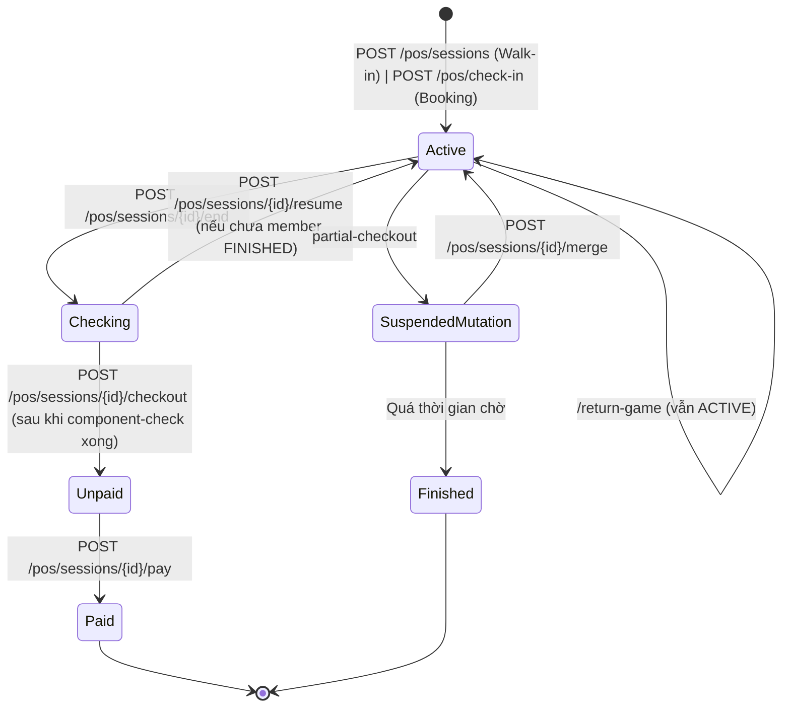

# CafePosController

**Base route:** `/api/cafes/{cafeId}/pos`
**Controller:** `CafePosController.cs`
**Role:** Manager hoặc CafeStaff

API vận hành quầy: bàn, kho hộp game, phiên chơi, kiểm kê, khách vô danh, thanh toán một phần và thanh toán toàn bộ.

> **Lưu ý (cập nhật 05/08/2026):** `ActiveSessionController` đã được **gộp vào đây**. Toàn bộ endpoint `/api/cafes/{cafeId}/sessions/*` cũ giờ nằm trong `CafePosController` dưới base route `/api/cafes/{cafeId}/pos/sessions/*`. Xem [active-session.md](./active-session.md) (deprecated).

## Endpoints

| Endpoint | Method | Mô tả | Controller |
|----------|--------|--------|------------|
| `/tables` | GET | Sơ đồ bàn realtime | `CafePosController` |
| `/tables` | PUT | Đồng bộ sơ đồ bàn (Name + SeatCount + SortOrder) — hỗ trợ 2 shape | `CafePosController` |
| `/tables/{tableId}` | PATCH | Cập nhật một phần thông tin bàn (Name / SeatCount / SortOrder) | `CafePosController` |
| `/boxes` | GET | Danh sách hộp game | `CafePosController` |
| `/boxes/by-barcode/{barcode}` | GET | Tra cứu hộp sau khi quét POS | `CafePosController` |
| `/sessions/active` | GET | Phiên đang chơi | `CafePosController` |
| `/sessions/unpaid` | GET | Phiên chờ thanh toán (POS nag staff) | `CafePosController` |
| `/sessions/paid` | GET | Phiên đã thanh toán (end-of-day report, paginated) | `CafePosController` |
| `/sessions/{sessionId}` | GET | Chi tiết 1 phiên chơi (GAP-1) | `CafePosController` |

> **⚠️ Lưu ý timezone cho `GET /sessions/paid`** (Bug #4 fix):
> - `fromDate`/`toDate` là **UTC date** (theo `DateTime.UtcNow`).
> - Client phải convert local date → UTC date trước khi gọi.
> - VD: POS ở VN (UTC+7) lúc 09:00 sáng 11/08 VN → UTC = 02:00 ngày 11/08 → gửi `fromDate=2026-08-11&toDate=2026-08-11`.
> - Nếu client gửi local date mà không convert → query sai ngày (lệch ±1 ngày tùy timezone).
> - Khuyến nghị: client dùng `DateTime.UtcNow.ToString("yyyy-MM-dd")` thay vì `DateTime.Now.ToString(...)`.
| `/bookings/{bookingCode}` | GET | Preview booking trước check-in (AC 1.1) | `CafePosController` |
| `/sessions` | POST | Giao game cho bàn — bắt đầu phiên chơi (POS scan barcode) | `CafePosController` |
| `/check-in` | POST | **POS check-in (canonical):** Staff quét QR (ReservationCode \| BookingCode legacy) để kích hoạt phiên chơi cho cả nhóm (BR §21A.7) | `CafePosController` |
| `/check-in-tokens` | POST | **POS tạo QR cho player scan (BR §21A.7):** Staff bấm tạo token → server sinh token → trả QR payload. Player dùng app scan QR → `POST /api/check-in/scan-qr` để check-in. | `CafePosController` |
| `/sessions/{sessionId}/end` | POST | **Kết thúc phiên chơi** → session `CHECKING`, hộp → `Available`/`Maintenance` | `CafePosController` |
| `/sessions/{sessionId}/resume` | POST | **Khôi phục phiên từ `CHECKING` → `ACTIVE`** khi nhân viên bấm nhầm (GAP-1) | `CafePosController` |
| `/sessions/{sessionGameId}/component-checklist` | GET | Lấy mô tả bảng kiểm kê linh kiện của 1 game trong phiên (`ComponentChecklistDto` — chỉ ExpectedQuantity, chưa verify) | `CafePosController` |
| `/sessions/component-check` | POST | Submit kết quả kiểm kê linh kiện (`ComponentCheckResultDto` — có ActualQuantity + PenaltyFee + TotalPenaltyAmount). **[Penalty #1]** Hỗ trợ `responsibleMemberId` per-component để phân bổ phí phạt cho member cụ thể. | `CafePosController` |
| `/sessions/component-check/reset` | POST | Reset checklist để kiểm tra lại khi bấm sai (GAP-25) | `CafePosController` |
| `/boxes/{boxId}/component-history` | GET | **[Box history #1]** Lịch sử kiểm kê thiếu linh kiện của 1 hộp qua các phiên trước (staff kiểm tra trước khi giao hộp). | `CafePosController` |
| `/sessions/{sessionId}/return-game` | POST | Trả 1 game sớm: tính `surcharge_fine`, cập nhật box status (session vẫn ACTIVE) | `CafePosController` |
| `/sessions/{sessionId}/games` | POST | Gán thêm game vào phiên (Exception 6) | `CafePosController` |
| `/sessions/{sessionId}/guest-slots` | POST | Thêm khách vô danh (BR-13) | `CafePosController` |
| `/sessions/{sessionId}/members/add` | POST | Thêm thành viên đến muộn (Exception 8) | `CafePosController` |
| `/sessions/{sessionId}/inventory-loss` | POST | Ghi nhận hao hụt trước phiên (Exception 7) | `CafePosController` |
| `/sessions/{sessionId}/checkout` | POST | Thanh toán toàn bộ sau kiểm kê (BR-15) | `CafePosController` |
| `/sessions/{sessionId}/partial-checkout` | POST | Thanh toán một phần khi có người về sớm (BR-12, BR-14) | `CafePosController` |
| `/sessions/{sessionId}/pay` | POST | Thanh toán hóa đơn tổng (BR-15, BR-09) | `CafePosController` |
| `/sessions/{sourceSessionId}/merge` | POST | Ghép thành viên sang nhóm mới (Exception 4) | `CafePosController` |

---

## GET /api/cafes/{cafeId}/pos/tables

Lấy sơ đồ bàn realtime cho Web POS. Trả `CafeTableStatusDto[]` gồm `Id`, `Name`, `SortOrder`, `SeatCount`, `Status` và `IsActive`.

**Role:** Manager — chủ quán; CafeStaff — đã được gắn vào quán.

### Self-healing status (Gap-Fix)

`Status` trả về **không** chỉ đọc thẳng cột `CafeTables.Status` trong DB. Service derive realtime từ bảng `ActiveSessions`:

- Nếu tồn tại `ActiveSessions` với `CafeTableId` tương ứng **và** `Status ∈ {Active, Checking, Unpaid}` (session chưa thanh toán) → bàn được trả về `Status = "InUse"`, **bất chấp** cột `CafeTables.Status` trong DB có bị stale (do manual SQL fixup, migration dở, hoặc bug path nào đó trước đó không update).
- Nếu không có session đang chạy → dùng cached `CafeTables.Status` (giữ `Reserved`, `EventInProgress` hoặc `Available`).

Mục đích: đảm bảo UI POS luôn thấy đúng bàn nào đang có khách, không bị "Bàn X đang chơi nhưng vẫn hiện Available trong sơ đồ".

### Query params

| Param | Type | Default | Mô tả |
|-------|------|---------|--------|
| `includeOnlyAvailable` | bool | `true` | Lọc theo `Status`. `false` = trả tất cả bàn (kể cả `InUse`, `Reserved`, `EventInProgress`) để màn hình POS monitor thấy đúng trạng thái từng bàn. |
| `includeInactive` | bool | `false` | Lọc theo `IsActive` (soft-delete). `true` = trả cả bàn đã ẩn (`IsActive=false`) — dùng cho debug/manager audit. |
| `statuses` | string CSV | — | Filter theo `Status` cụ thể, vd `statuses=InUse`, `statuses=InUse,Reserved,EventInProgress`. **Khi set, ghi đè `includeOnlyAvailable`** (luôn trả đủ các status trong list). |

### Response 200

```json
{
  "status": 200,
  "message": "Lấy danh sách bàn thành công.",
  "data": [
    {
      "id": "f1a2b3c4-...",
      "name": "Bàn 1",
      "sortOrder": 0,
      "seatCount": 4,
      "status": "Available",
      "isActive": true
    },
    {
      "id": "a9b8c7d6-...",
      "name": "Bàn VIP",
      "sortOrder": 5,
      "seatCount": 8,
      "status": "InUse",
      "isActive": true
    }
  ]
}
```

### Response 400 — invalid `statuses`

Khi một giá trị trong `statuses` không parse được enum `CafeTableStatus`:

```json
{
  "status": 400,
  "message": "Trạng thái bàn không hợp lệ: 'Garbage'. Giá trị hợp lệ: Available, InUse, Reserved, EventInProgress.",
  "data": null
}
```

Giá trị hợp lệ: `Available`, `InUse`, `Reserved`, `EventInProgress`.

### Ví dụ

```bash
# Lấy chỉ bàn đang có khách (InUse)
curl -G "https://api.boardverse.local/api/cafes/{cafeId}/pos/tables" \
     --data-urlencode "statuses=InUse" \
     -H "Authorization: Bearer {token}"

# Lấy bàn InUse + Reserved (POS monitor)
curl -G "https://api.boardverse.local/api/cafes/{cafeId}/pos/tables" \
     --data-urlencode "statuses=InUse,Reserved" \
     -H "Authorization: Bearer {token}"

# Audit bàn đã ẩn (soft-deleted) — manager view
curl -G "https://api.boardverse.local/api/cafes/{cafeId}/pos/tables" \
     --data-urlencode "includeOnlyAvailable=false" \
     --data-urlencode "includeInactive=true" \
     -H "Authorization: Bearer {token}"
```

### Status codes

| Code | Ý nghĩa |
|------|---------|
| 200 | OK — trả danh sách bàn (có thể rỗng). |
| 400 | `statuses` chứa giá trị không hợp lệ. |
| 401 | Thiếu token, token hết hạn hoặc token không hợp lệ. |
| 403 | Không phải Manager chủ quán hoặc CafeStaff chưa được gắn quán. |
| 404 | Quán không tồn tại hoặc không ở trạng thái ACTIVE. |
| 500 | Lỗi hệ thống không mong đợi. |

---

## PUT /api/cafes/{cafeId}/pos/tables

Đồng bộ toàn bộ sơ đồ bàn — tạo mới, đổi tên, đổi SeatCount, hoặc xóa mềm bàn không còn trong layout.

**Role:** Manager — phải là chủ quán (ManagerId của cafe).

**Body — hỗ trợ 2 shape (chọn 1, không gửi cả 2):**

### Shape A (legacy) — chỉ tên

```json
{
  "tableNames": ["Bàn 1", "Bàn 2", "Bàn 3"]
}
```

- Bàn mới → SeatCount mặc định 4.
- Bàn đã tồn tại (match case-insensitive theo Name) → chỉ cập nhật Name/SortOrder, **giữ nguyên SeatCount**.
- Bàn active không có trong list → soft-delete (IsActive=false) nếu Status = Available.

### Shape B (mới) — Name + SeatCount + SortOrder

```json
{
  "tables": [
    { "name": "Bàn 1", "seatCount": 4, "sortOrder": 0 },
    { "name": "Bàn VIP", "seatCount": 8, "sortOrder": 1 },
    { "name": "Bàn 3", "seatCount": 6 }
  ]
}
```

- `seatCount` 1–50; `sortOrder` 0–9999; cả 2 đều optional.
- Bàn mới → dùng SeatCount từ payload, hoặc default 4 nếu null.
- Bàn đã tồn tại (match case-insensitive theo Name) → cập nhật Name/SortOrder, **SeatCount chỉ ghi đè khi payload có giá trị** (nếu null → giữ nguyên).
- Bàn active không có trong list → soft-delete nếu Status = Available.
- `sortOrder` null → dùng index trong mảng.

**Validation:**
- Phải có ít nhất 1 phần tử trong `tableNames` hoặc `tables`.
- Không được gửi cả 2 shape cùng lúc → 400.
- `name` 1–100 ký tự, trim khoảng trắng 2 đầu.
- `seatCount` 1–50; `sortOrder` 0–9999.

**Cơ chế matching (quan trọng cho rename):**

Để tránh làm đứt FK từ `Booking` / `ActiveSession` (link theo `CafeTableId`), hệ thống match theo 3 phase:

1. **Phase 1 — Match by Name** (case-insensitive): tìm bàn active hoặc inactive trùng tên → giữ nguyên `Id`, cập nhật `Name`/`SortOrder`/`SeatCount`. Đây là "rename trực tiếp" (giữ cùng vị trí hoặc đổi tên).
2. **Phase 2 — Match by SortOrder** (rename ngầm): với target chưa match ở Phase 1, nếu có bàn active ở cùng `SortOrder` index (chưa matched) → coi như rename, gán target đó cho bàn đó. **Giữ nguyên `Id`**.
3. **Phase 3 — Tạo mới**: target còn lại chưa match → tạo bàn mới với `Id` mới.

**Soft-delete:** bàn active không nằm trong matchedIds và không có trong payload (theo tên) → chỉ soft-delete (`IsActive=false`) nếu `Status = Available`. Bàn đang có session chạy (`Status ∈ {InUse, Reserved, EventInProgress}`) **không bị soft-delete** để bảo toàn lịch sử.

**SeatCount semantics:**

| Trường hợp | Kết quả |
|---|---|
| Tạo bàn mới, `seatCount = null` | Default 4 |
| Tạo bàn mới, `seatCount = 8` | 8 |
| Match bàn cũ, `seatCount = null` | Giữ nguyên seatCount hiện tại |
| Match bàn cũ, `seatCount = 8` | Ghi đè thành 8 |
| Bàn active không nằm trong list, `Status = Available` | Soft-delete (`IsActive=false`) |
| Bàn active không nằm trong list, `Status ≠ Available` | Giữ nguyên (an toàn) |

**Ví dụ rename:**

DB có:
- `Bàn 1` (Id=`A`, SeatCount=4, SortOrder=0)
- `Bàn 2` (Id=`B`, SeatCount=4, SortOrder=1)

Payload rename cả 2:
```json
{"tables": [
  {"name": "VIP", "seatCount": 8, "sortOrder": 0},
  {"name": "Standard", "seatCount": 4, "sortOrder": 1}
]}
```

Kết quả:
- Bàn có `Id=A` được rename thành "VIP", SeatCount=8 (giữ Id).
- Bàn có `Id=B` được rename thành "Standard", SeatCount=4 (giữ Id).
- Booking/ActiveSession cũ link tới `Id=A` và `Id=B` vẫn còn nguyên — **không mất lịch sử**.

**Response 200:** `CafeTableStatusDto[]` (danh sách bàn sau sync).

**Lỗi:**
- `400` payload rỗng / gửi cả 2 shape / seatCount ngoài 1–50 / sortOrder ngoài 0–9999 / name trống.
- `401` thiếu token.
- `403` không phải Manager chủ quán.
- `404` không tìm thấy quán.

**Ví dụ curl:**
```bash
# Shape A — legacy
curl -X PUT "https://api.boardverse.local/api/cafes/{cafeId}/pos/tables" \
  -H "Authorization: Bearer <manager-jwt>" \
  -H "Content-Type: application/json" \
  -d '{"tableNames": ["Bàn 1", "Bàn 2", "Bàn 3"]}'

# Shape B — mới (set SeatCount ngay khi tạo / đổi tên)
curl -X PUT "https://api.boardverse.local/api/cafes/{cafeId}/pos/tables" \
  -H "Authorization: Bearer <manager-jwt>" \
  -H "Content-Type: application/json" \
  -d '{"tables": [
        {"name": "Bàn 1", "seatCount": 4, "sortOrder": 0},
        {"name": "Bàn VIP", "seatCount": 8, "sortOrder": 1}
      ]}'
```

**Sau khi sync → `TableLayoutJson` (cache trên `Cafe`) được tự động refresh** với danh sách tên bàn active theo SortOrder.

---

## PATCH /api/cafes/{cafeId}/pos/tables/{tableId}

Cập nhật một phần thông tin bàn. Dùng để **đổi `SeatCount` cho từng bàn** (ảnh hưởng đến `AvailableSeats` cho booking — BR-05).

**Role:** Manager — phải là chủ quán (ManagerId của cafe). CafeStaff không được phép.

**Path params:**
- `cafeId` (guid): mã định danh quán.
- `tableId` (guid): mã định danh bàn cần cập nhật.

**Body mẫu** (tất cả field optional — chỉ field gửi mới được cập nhật):
```json
{
  "name": "Bàn 1 (VIP)",
  "seatCount": 8,
  "sortOrder": 0
}
```

**Validation:**
- `name`: 1–100 ký tự, trim khoảng trắng 2 đầu; không được trùng với bàn active khác trong quán (case-insensitive).
- `seatCount`: 1–50 (range cố định cho boardgame cafe).
- `sortOrder`: 0–9999.
- Ít nhất một trong 3 field phải được gửi — nếu không sẽ trả `400`.
- Bàn **không được có `ActiveSession` đang chạy** (`Status ∈ {Active, Checking, Unpaid}`). Khi có session phải kết thúc phiên trước khi đổi `SeatCount` (vì lý do BR-05: `AvailableSeats = sum(SeatCount)` runtime).

**Response 200:** `CafeTableStatusDto`
```json
{
  "id": "guid",
  "name": "Bàn 1 (VIP)",
  "sortOrder": 0,
  "seatCount": 8,
  "status": "Available"
}
```

**Lỗi:**
- `400` Validation — không có trường nào / name dài quá / seatCount ngoài 1–50 / sortOrder ngoài 0–9999 / name trống.
- `401` thiếu token.
- `403` không phải Manager chủ quán.
- `404` không tìm thấy bàn trong quán.
- `409` bàn đang có phiên chơi hoạt động, hoặc tên bàn đã trùng với bàn khác.

**Differ vs `PUT /tables`:**
| | `PUT /tables` (sync all) | `PATCH /tables/{tableId}` (partial) |
|--|---|---|
| Use case | Manager thiết kế lại toàn bộ sơ đồ | Tinh chỉnh 1 bàn (SeatCount, đổi tên) |
| Shape | `tableNames[]` (legacy) hoặc `tables[]` (Name + SeatCount + SortOrder) | `name`, `seatCount`, `sortOrder` từng bàn |
| SeatCount? | ✅ (shape mới) / ❌ (shape cũ giữ nguyên) | ✅ cập nhật được |
| Xóa mềm? | ✅ tự động (bàn không có trong list) | ❌ giữ nguyên |
| Khi có session? | ✅ cập nhật được | ❌ bị chặn |

**Ví dụ curl:**
```bash
curl -X PATCH "https://api.boardverse.local/api/cafes/{cafeId}/pos/tables/{tableId}" \
  -H "Authorization: Bearer <manager-jwt>" \
  -H "Content-Type: application/json" \
  -d '{"seatCount": 8}'
```

---

## GET /api/cafes/{cafeId}/pos/bookings/{bookingCode}

Preview thông tin booking trước khi check-in.

**AC 1.1:** Hiển thị danh sách thành viên + game info TRƯỚC khi check-in.

**Query params:**
- `bookingCode` (path): Mã đặt chỗ (OrderId)

**Response 200:**
```json
{
  "bookingCode": "BV12345678",
  "depositStatus": "Paid",
  "depositAmount": 50000,
  "scheduledStartTime": "2026-08-01T19:00:00Z",
  "registeredMemberCount": 4,
  "canCheckIn": true,
  "host": {
    "userId": "guid",
    "displayName": "Nguyễn Văn A",
    "avatarUrl": "https://...",
    "karmaScore": 85
  },
  "lobby": {
    "lobbyId": "guid",
    "gameName": "Catan",
    "minPlayers": 3,
    "maxPlayers": 4,
    "currentMemberCount": 4
  }
}
```

**Lỗi:**
- `401` thiếu token
- `403` không đủ quyền
- `404` không tìm thấy booking

---

## POST /api/cafes/{cafeId}/pos/check-in

**POS check-in (canonical — BR §21A.7):** Staff quét QR (ReservationCode mới hoặc BookingCode legacy) để kích hoạt phiên chơi cho cả nhóm.

Server tự động phân biệt 2 format mã qua `ReservationCodeDetector`:

| Format | Format mẫu | Flow |
|---|---|---|
| **ReservationCode (mới)** | `ABC234XY` — 8 ký tự alphanumeric uppercase, exclude `0/1/I/O` | `ReservationService.CheckInAsync` (BVC atomic + outbox) |
| **BookingCode (legacy)** | `BV12345678` | `BookingDeposit` lookup (VND flow) |

**AC 1.2:** Nhân viên bấm xác nhận check-in → Trạng thái bàn chuyển sang Occupied.

**AC 1.3:** `DepositAppliedAmount = 0` — Thanh toán session KHÔNG trừ tiền cọc (BR-09 mới).

**AC 1.4:** Gửi SignalR notification `SessionActivated` để mobile app cập nhật "Đang chơi tại quán".

**Idempotent:** Scan cùng QR trả cùng response (cùng `ActiveSessionId`). Idempotency key `pos-checkin:{code}`.

**Validate (BR §21A.7 step 3):**
- Reservation thuộc đúng `cafeId` của staff (cross-cafe guard).
- Reservation `Status == Confirmed`.
- Time window: từ `scheduledTime - 30 phút` (early grace) đến `timeSlot.endTime + 30 phút` (late grace).
- Game match: `reservation.GameId == box.GameTemplateId`.
- Status flip atomic: `Reservation Held → CheckedIn` + `Lobby Open → InProgress` + `SeatInventory Held → InUse` + `GameInventory Held → InUse` + Outbox `LobbyCheckedIn`.

**Body mẫu (Reservation flow — mới):**
```json
{
  "code": "ABC234XY",
  "cafeTableId": "guid",
  "barcode": "BV-bbbbbbbb-xxxxxxxx-001"
}
```

**Body mẫu (Booking flow — legacy, vẫn hoạt động):**
```json
{
  "code": "BV12345678",
  "cafeTableId": "guid",
  "barcode": "BV-bbbbbbbb-xxxxxxxx-001"
}
```

> **Breaking change:** Endpoint cũ `POST /api/cafes/{cafeId}/pos/sessions/from-booking` đã được thay thế bằng `POST /api/cafes/{cafeId}/pos/check-in`. Field `bookingCode` đổi thành `code` (chấp nhận cả 2 format).

**Response 201:** `ActiveSessionDto`

**Lỗi:**
- `400` mã check-in không hợp lệ / ngoài time window
- `401` thiếu token
- `403` không đủ quyền vận hành quán
- `404` quán, bàn hoặc game không tồn tại
- `409` reservation không thuộc cafe, sai cafe, chưa `Confirmed`, sai game, hoặc bàn/hộp không khả dụng
- `500` lỗi hệ thống không mong đợi

---

## POST /api/cafes/{cafeId}/pos/check-in-tokens

**POS tạo QR cho player scan check-in (BR §21A.7 — 2 chiều check-in).**

Staff bấm "Tạo QR mời khách scan" → server sinh token 16-char alphanumeric → lưu DB → trả QR payload. Player mở app → scan QR POS → `POST /api/check-in/scan-qr` để check-in vào cùng reservation.

Token có TTL 30 phút mặc định (tối đa 240 phút). Mỗi token chỉ dùng 1 lần. Có thể gắn với 1 reservation cụ thể; nếu trống → token dùng cho walk-in/general.

**Role:** Manager (chủ quán) hoặc CafeStaff thuộc cafe.

**Body — `CreatePosCheckInTokenRequestDto`:**

```json
{
  "reservationId": "guid",
  "ttlMinutes": 30
}
```

| Field | Type | Required | Description |
|-------|------|----------|-------------|
| `reservationId` | guid | No | Gắn token với reservation cụ thể. Nếu null → token dùng chung (walk-in/general). |
| `ttlMinutes` | int | No | TTL token (phút). Mặc định 30. Tối đa 240. |

**Response 201 — `PosCheckInTokenDto`:**

```json
{
  "id": "guid",
  "cafeId": "guid",
  "reservationId": "guid-or-null",
  "token": "ABCDEFGHJKLMNPQR",
  "qrPayload": "boardverse://check-in?token=ABCDEFGHJKLMNPQR",
  "createdAt": "2026-08-07T10:00:00Z",
  "expiresAt": "2026-08-07T10:30:00Z"
}
```

**Token format:** 16 ký tự alphanumeric uppercase, loại trừ `0/1/I/O` để tránh nhầm lẫn khi quét.

**QR payload** là deep-link URI — client hiển thị dưới dạng QR code image. Khi player scan:

```bash
# Player gọi (không qua CafeId route)
POST /api/check-in/scan-qr
{
  "token": "ABCDEFGHJKLMNPQR"
}
```

**Lỗi:**
- `400` — TTL âm hoặc vượt giới hạn 240 phút.
- `401` thiếu token.
- `403` không đủ quyền vận hành quán.
- `404` quán hoặc reservation không tồn tại.
- `409` reservation không thuộc cafe hiện tại.
- `500` lỗi hệ thống.

**Ví dụ curl:**

```bash
# Staff tạo token cho reservation cụ thể
curl -X POST "https://api.boardverse.local/api/cafes/{cafeId}/pos/check-in-tokens" \
  -H "Authorization: Bearer <staff-jwt>" \
  -H "Content-Type: application/json" \
  -d '{ "reservationId": "guid", "ttlMinutes": 30 }'

# Staff tạo token chung cho walk-in
curl -X POST "https://api.boardverse.local/api/cafes/{cafeId}/pos/check-in-tokens" \
  -H "Authorization: Bearer <staff-jwt>" \
  -H "Content-Type: application/json" \
  -d '{ "ttlMinutes": 60 }'
```

---

## POST /api/cafes/{cafeId}/pos/sessions

POS quét barcode và chọn bàn → tạo `ActiveSession`, đặt hộp `InUse`, bàn `InUse` nếu đang trống.

**Body mẫu:**

```json
{
  "cafeTableId": "table-id",
  "barcode": "BV-bbbbbbbb-xxxxxxxx-002",
  "bookingId": "booking-id",
  "lobbyId": "lobby-id",
  "initialMemberUserIds": ["user-id-1"]
}
```

**Response 201:** `ActiveSessionDto` — `startedAt`, `elapsedMinutes`, `estimatedRemainingMinutes`, `defaultPlayTimeMinutes`.

**Lỗi:** `404` bàn/barcode; `409` hộp không Available, đã có session, hoặc bàn Reserved/Event.

---

## POST /api/cafes/{cafeId}/pos/sessions/{sessionId}/end

Kết thúc phiên chơi — trả hộp game và giải phóng bàn nếu không còn session khác.

**Bug Fix:** Sau khi trả game (ReturnGameAsync), trạng thái hộp game được cập nhật:
- Nếu **không có linh kiện hỏng**: Box → `Available` (sẵn sàng cho phiên tiếp theo)
- Nếu **có linh kiện hỏng**: Box → `Maintenance` (cần bảo trì trước khi dùng lại)

**Response 200:** Phiên đã đóng; hộp về Available/Maintenance; bàn về Available khi không còn session trên bàn đó.

**Lỗi:** `404` không tìm thấy phiên; `500` lỗi hệ thống.

---

## SignalR Notifications

**Hub:** `/hubs/pos`

Khi check-in thành công, hệ thống gửi event `SessionActivated` đến mobile app.

**Event Payload:**
```json
{
  "eventType": "SessionActivated",
  "sessionId": "guid",
  "cafeId": "guid",
  "cafeName": "Board Game Cafe",
  "hostId": "guid",
  "timestamp": "2026-08-01T19:00:00Z"
}
```

**Mobile app cần:**
1. Connect đến `/hubs/pos`
2. Gọi `JoinUserNotifications(userId)` để subscribe notifications cá nhân
3. Listen event `SessionActivated` để cập nhật UI → "Đang chơi tại quán"

---

## Luồng test

```powershell
# 1. Login staff/manager
# 2. GET .../pos/bookings/{bookingCode}  (preview booking)
#    → Xem thông tin: host, game, số người, trạng thái cọc
# 3. POST .../pos/check-in  (POS check-in)
#    → Tạo session, bàn → InUse, gửi SignalR notification
# 4. POST .../pos/sessions/{id}/end
#    → Kết thúc phiên
```

---

## Chi tiết các endpoint mới (cập nhật 05/08/2026)

### GET /api/cafes/{cafeId}/pos/sessions/{sessionId}

Trả về chi tiết 1 phiên chơi: `startedAt`, `elapsedMinutes`, `estimatedRemainingMinutes`, members, games, deposit applied, total amount, status, host info.

**Dùng khi:** Frontend cần load lại session sau SignalR reconnect, hoặc sau khi submit component-check để refresh `Status`.

**Response 200:** `ActiveSessionDto`

---

### POST /api/cafes/{cafeId}/pos/sessions/{sessionId}/resume

Khôi phục phiên từ `CHECKING` → `ACTIVE` khi nhân viên bấm "Trả game" nhầm.

**Điều kiện:**
- Session đang ở `CHECKING`
- Chưa có thành viên nào được thanh toán (chưa có `Member.Status = FINISHED`)

**Response 200:** `ActiveSessionDto` — phiên đã quay về `ACTIVE`, tất cả boxes chưa bị reset trạng thái.

**Lỗi:** `409` — Phiên không ở `CHECKING`, hoặc đã có member được thanh toán (không thể undo).

---

### GET /api/cafes/{cafeId}/pos/sessions/{sessionGameId}/component-checklist

Lấy mô tả bảng kiểm kê linh kiện của 1 game trong phiên — trả về các linh kiện cần kiểm với **số lượng kỳ vọng** từ `GameComponentTemplate`. Endpoint **không** có dữ liệu thực tế / phí phạt — chỉ là danh sách mô tả để staff đếm trước khi submit.

**Role:** Manager (chủ quán) hoặc CafeStaff thuộc cafe.

**Path params:**
- `cafeId` (guid): mã quán.
- `sessionGameId` (guid): mã `ActiveSessionGame` cần kiểm kê.

**Response 200 — `ComponentChecklistDto`:**
```json
{
  "sessionGameId": "guid",
  "gameTemplateId": "guid",
  "gameName": "Catan",
  "components": [
    { "componentId": "guid", "componentName": "Road tile",   "componentKind": 0, "expectedQuantity": 15 },
    { "componentId": "guid", "componentName": "Settlement",  "componentKind": 1, "expectedQuantity": 20 },
    { "componentId": "guid", "componentName": "City",        "componentKind": 1, "expectedQuantity": 4  }
  ]
}
```

**Trường hợp không có component nào (`Components = []`):** Game template không cấu hình linh kiện → trả về danh sách rỗng. Staff vẫn có thể submit `markAllValid=true` để đóng kiểm kê.

**Lỗi:**
- `401` thiếu token.
- `403` không thuộc cafe.
- `404` không tìm thấy session game hoặc không thuộc cafe này.
- `500` lỗi hệ thống.

**Ví dụ curl:**
```bash
curl -X GET "https://api.boardverse.local/api/cafes/{cafeId}/pos/sessions/{sessionGameId}/component-checklist" \
  -H "Authorization: Bearer <staff-jwt>"
```

---

### POST /api/cafes/{cafeId}/pos/sessions/component-check

Xác nhận kiểm kê linh kiện và tính phí phạt nếu thiếu. **BR-12:** Sau khi submit thành công → mở khóa in hóa đơn cho session.

**Role:** Manager (chủ quán) hoặc CafeStaff thuộc cafe.

**Điều kiện tiên quyết:**
- `ActiveSession.Status == Checking` (đã qua bước "Trả game" — `POST /sessions/{id}/end`).
- `ActiveSessionGame.CheckStatus == NotChecked` (chưa submit lần nào — idempotent check).

**Body — `SubmitComponentCheckRequestDto`:**

```json
{
  "sessionGameId": "guid",
  "markAllValid": false,
  "results": [
    { "componentId": "guid-road",   "actualQuantity": 14, "responsibleMemberId": "guid-member-A" },
    { "componentId": "guid-city",   "actualQuantity": 4,  "responsibleMemberId": null }
  ]
}
```

> **Penalty #1 (2026-08-08):** Mỗi component thiếu có thể gán `responsibleMemberId` (optional).
> - **Có memberId**: penalty sẽ được cộng vào `member.PenaltyAmount` trong `MemberInvoiceDto`.
> - **null**: penalty được cộng chung vào `session.PenaltyAmount` mà không phân bổ cho member cụ thể.
> - **BR-14**: KHÔNG được gán memberId cho `Guest_Slot` → `400 PenaltyCannotAssignToGuestSlot`.
> - MemberId phải thuộc session → `400 ComponentPenaltyMemberNotInSession` nếu không.

**2 mode:**

| Mode | `markAllValid` | `results` | Hành vi |
|---|---|---|---|
| **All valid (nhanh)** | `true` | `[]` (bỏ qua) | Tự động `ActualQuantity = ExpectedQuantity` cho mọi component, `TotalPenaltyAmount = 0`, `CheckStatus = Verified`. Vẫn insert 1 bộ dòng audit (`ComponentCheckResults`) để truy vết staff bấm AllValid. `ResponsibleMemberId` luôn `null`. |
| **Chi tiết** | `false` | Bắt buộc (mỗi component trong template = 1 dòng) | Tính `penalty = (ExpectedQuantity − ActualQuantity) × PenaltyFee` cho từng component. Tổng cộng vào `TotalPenaltyAmount`. Lưu `ResponsibleMemberId` nếu client gửi (chỉ áp dụng khi component bị thiếu). Nếu có component thiếu → `CheckStatus = MissingComponents`; nếu đủ hết → `Verified`. |

**Validation:**
- `results` phải chứa TẤT CẢ component trong template (mỗi component = 1 dòng). Component nào thiếu → `400 Thiếu kết quả kiểm tra cho N linh kiện: ...` (liệt kê tên các component chưa nhập).
- `ActualQuantity` phải `>= 0` cho mọi component → `400` nếu có số âm.
- ComponentId trong `results` phải thuộc template của session game → nếu không → `400 ComponentNotBelongToGame`.
- Không được trùng `componentId` trong `results` → `400 duplicate component IDs`.
- Component thiếu mà **không có `CafeGameComponentPenalty` cấu hình** → `PenaltyFee = 0` cho dòng đó + log warning (staff vẫn tiếp tục được, không chặn).

**H8 Fix (2026-08-09):**
- Trước fix: component thiếu entry trong `results` → mặc định `actualQty = 0` → trigger penalty mất (0 < expectedQty) → phạt nhầm khi staff lỡ quên nhập 1 component.
- Sau fix: validate `results` phải cover TẤT CẢ components của game. Thiếu → 400 liệt kê cụ thể components bị thiếu + số lượng. Phạt chỉ trigger khi staff **chủ động** nhập ActualQuantity < ExpectedQuantity.
- File: `CafePosService.SubmitComponentCheckAsync` dòng ~1216.

**Response 200 — `ComponentCheckResultDto`:**
```json
{
  "sessionGameId": "guid",
  "gameTemplateId": "guid",
  "gameName": "Catan",
  "checkStatus": 2,
  "checkedAt": "2026-08-06T12:34:56Z",
  "totalPenaltyAmount": 5000,
  "components": [
    { "componentId": "guid-road",  "componentName": "Road tile",  "componentKind": 0, "expectedQuantity": 15, "actualQuantity": 14, "penaltyFee": 5000, "responsibleMemberId": "guid-member-A" },
    { "componentId": "guid-city",  "componentName": "City",       "componentKind": 1, "expectedQuantity": 4,  "actualQuantity": 4,  "penaltyFee": 0,    "responsibleMemberId": null }
  ]
}
```

**`checkStatus` enum:**
- `0` = `NotChecked`
- `1` = `Verified` — đủ hết, hoặc `markAllValid=true`
- `2` = `MissingComponents` — có ít nhất 1 component thiếu

**Side effect — audit trail:** Mỗi lần submit thành công, insert 1 bộ dòng vào bảng `ComponentCheckResults` (1 dòng / component / session game). Admin có thể query:
- `WHERE ActiveSessionGameId = X` → staff nào verify lúc nào, đếm thật hay bấm AllValid.
- Phân biệt staff kiểm tra thật (`ActualQuantity < ExpectedQuantity`) vs bấm `markAllValid` (`ActualQuantity = ExpectedQuantity`).

**Lỗi:**
- `400` `ComponentNotBelongToGame` / `duplicate component IDs`.
- `401` thiếu token.
- `403` không thuộc cafe.
- `404` không tìm thấy session game hoặc không thuộc cafe.
- `409` đã kiểm tra rồi (`ComponentCheckAlreadyDone`) hoặc session không ở `CHECKING`.
- `500` lỗi hệ thống.

**Ví dụ curl:**
```bash
# Mode 1: All valid
curl -X POST "https://api.boardverse.local/api/cafes/{cafeId}/pos/sessions/component-check" \
  -H "Authorization: Bearer <staff-jwt>" \
  -H "Content-Type: application/json" \
  -d '{ "sessionGameId": "guid", "markAllValid": true, "results": [] }'

# Mode 2: Chi tiết
curl -X POST "https://api.boardverse.local/api/cafes/{cafeId}/pos/sessions/component-check" \
  -H "Authorization: Bearer <staff-jwt>" \
  -H "Content-Type: application/json" \
  -d '{
    "sessionGameId": "guid",
    "markAllValid": false,
    "results": [
      { "componentId": "guid-road", "actualQuantity": 14 },
      { "componentId": "guid-city", "actualQuantity": 4 }
    ]
  }'
```

---

### POST /api/cafes/{cafeId}/pos/sessions/component-check/reset?sessionGameId={guid}

Reset lại checklist linh kiện của 1 game trong session về trạng thái chưa kiểm kê.

**Dùng khi:** Staff đã bấm Submit nhưng nhập sai số lượng linh kiện → cần kiểm tra lại.

**Side effect:** Xóa hết `ComponentCheckResult` thuộc session game này (audit trail cho lần submit trước). Khi staff submit lại → insert bộ dòng mới.

**Response 200:** `ComponentChecklistDto` mới (chỉ chứa `ExpectedQuantity`).

**Lưu ý phân biệt response model:**

| Endpoint | Response type | Có `ActualQuantity` / `PenaltyFee`? |
|---|---|---|
| `GET /sessions/{sessionGameId}/component-checklist` | `ComponentChecklistDto` | ❌ Không — chỉ mô tả linh kiện cần kiểm |
| `POST /sessions/component-check` (`markAllValid=true`) | `ComponentCheckResultDto` | ✅ = `ExpectedQuantity` (staff cam kết "đủ hết" nhưng không đếm chi tiết) |
| `POST /sessions/component-check` (`markAllValid=false`) | `ComponentCheckResultDto` | ✅ = số nhân viên đếm được (có thể < `ExpectedQuantity` nếu thiếu) |
| `POST /sessions/component-check/reset` | `ComponentChecklistDto` | ❌ Không — reset về chưa kiểm |

**Audit trail:** Mỗi lần submit thành công, một bộ dòng `ComponentCheckResult` (mỗi component 1 dòng) được lưu vĩnh viễn. Admin có thể dùng query `WHERE ActiveSessionGameId = X` để:
- Xem staff nào verify lúc nào
- Phân biệt staff kiểm tra thật (ActualQuantity thay đổi) vs bấm `markAllValid`
- Truy vết khiếu nại khách về "thiếu linh kiện"

**Lỗi:** `409` — Phiên không ở `CHECKING`, hoặc session game không tồn tại.

---

### GET /api/cafes/{cafeId}/pos/boxes/{boxId}/component-history

Lấy lịch sử kiểm kê linh kiện của một hộp game (CafeInventoryBox). **Box history #1:** Staff dùng trước khi giao hộp cho khách phiên mới — biết ngay hộp này từng thiếu linh kiện ở phiên trước, kiểm tra kỹ hơn lúc nhận/giao.

**Role:** Manager (chủ quán) hoặc CafeStaff thuộc cafe.

**Điều kiện:**
- `boxId` phải tồn tại.
- Box phải thuộc `cafeId` trong URL → nếu không → `409 BoxCafeMismatch`.
- `sessionId` (optional): nếu truyền, session phải thuộc cùng `cafeId` → nếu không → `404 SessionNotInCafe`.

**Query (optional):**
- `sessionId` (Guid): nếu truyền → chỉ trả incidents của phiên đó. Bỏ qua hoặc `Guid.Empty` → trả tất cả incidents của hộp (audit mode).

**Trả về:**
- Danh sách các `ActiveSessionGame` của box này có `CheckStatus = MissingComponents`, sắp xếp theo `CheckedAt DESC`.
- Mỗi incident kèm danh sách linh kiện thiếu + staff đã kiểm kê + member chịu trách nhiệm (nếu có).
- Trả danh sách rỗng (`200`) nếu hộp chưa từng bị ghi nhận `MissingComponents`.

**Response 200 — `BoxComponentHistoryDto`:**

```json
{
  "boxId": "guid-box",
  "boxLabel": "BARCODE-001",
  "barcode": "BARCODE-001",
  "gameTemplateId": "guid-template",
  "gameName": "Catan",
  "totalIncidents": 2,
  "incidents": [
    {
      "sessionGameId": "guid-sg",
      "sessionId": "guid-session",
      "checkedAt": "2026-08-07T19:23:00Z",
      "staffId": "guid-staff",
      "staffName": "Staff_a3b4c5d6",
      "totalPenaltyAmount": 5000,
      "missingComponents": [
        {
          "componentId": "guid-road",
          "componentName": "Road tile",
          "componentKind": 0,
          "expectedQuantity": 15,
          "actualQuantity": 14,
          "missingQuantity": 1,
          "penaltyFee": 5000,
          "responsibleMemberId": "guid-member-A",
          "responsibleMemberName": "User_a1b2c3d4"
        }
      ]
    }
  ]
}
```

**Lỗi:**
- `401` thiếu token.
- `403` không thuộc cafe.
- `404` `BoxNotFoundById` — không tìm thấy hộp.
- `404` Session không tồn tại trong quán (khi truyền `sessionId`).
- `409` `BoxCafeMismatch` — hộp thuộc quán khác.
- `500` lỗi hệ thống.

**Ví dụ curl:**
```bash
# Lấy tất cả incidents của hộp (audit mode)
curl -X GET "https://api.boardverse.local/api/cafes/{cafeId}/pos/boxes/{boxId}/component-history" \
  -H "Authorization: Bearer <staff-jwt>"

# Chỉ lấy incidents của 1 phiên cụ thể (checkout modal)
curl -X GET "https://api.boardverse.local/api/cafes/{cafeId}/pos/boxes/{boxId}/component-history?sessionId={sessionId}" \
  -H "Authorization: Bearer <staff-jwt>"
```

---

## ComponentCheckResult (audit trail)

Mỗi session game sau khi verify sẽ có 1 bộ dòng trong bảng `ComponentCheckResults`:

| Cột | Mô tả |
|---|---|
| `Id` | PK |
| `ActiveSessionGameId` | FK → session game đã verify |
| `GameComponentTemplateId` | FK → linh kiện trong template |
| `ExpectedQuantity` | Số theo template tại thời điểm verify (snapshot) |
| `ActualQuantity` | Số nhân viên đếm được (hoặc = `ExpectedQuantity` nếu `markAllValid`) |
| `PenaltyFee` | Phí phạt cho dòng này (= `0` nếu đủ) |
| `ResponsibleMemberId` | **[Penalty #1]** Member chịu trách nhiệm penalty này (nullable). `null` = penalty cộng chung vào session. Set = penalty cộng vào `MemberInvoiceDto.PenaltyAmount` của member tương ứng trong `PaySessionAsync`. BR-14: không được set cho `Guest_Slot`. |
| `StaffId` | Staff thực hiện kiểm kê |
| `CheckedAt` | Thời điểm verify |

**Khác `ComponentLossReport`:**

| | `ComponentCheckResult` | `ComponentLossReport` |
|---|---|---|
| Trigger | BR-12 kiểm kê cuối phiên | Exception 7 ghi nhận hao hụt ngoài phiên |
| FK session | Required (`ActiveSessionGameId`) | Optional (`ActiveSessionId` nullable) |
| Ảnh hưởng hóa đơn | CÓ (cộng vào `TotalPenaltyAmount`) | KHÔNG (audit-only) |
| Granularity | Per-component (audit chi tiết) | Per-incident (free-form text) |

---

### POST /api/cafes/{cafeId}/pos/sessions/{sessionId}/return-game <a id="return-game-deprecated"></a>

> **⚠️ DEPRECATED từ 2026-08-10 — Sẽ bị xóa trong BoardVerse v2.0.**
> Endpoint này set `session.SurchargeFine` (dead field) nhưng **không ảnh hưởng hóa đơn**.
> Staff phải nhập penalty qua `POST /api/cafes/{cafeId}/pos/sessions/component-check` thay thế.
> Mọi response trả về kèm header:
> - `Deprecation: true`
> - `Sunset: Wed, 31 Dec 2026 23:59:59 GMT` (sau ngày này → 410 Gone)

Trả 1 game **trước khi** end session — session vẫn `ACTIVE`.

**Body:**
```json
{
  "inventoryBoxId": "guid",
  "damagedComponents": [
    {
      "componentId": "guid",
      "missingQuantity": 0,
      "damagedQuantity": 1
    }
  ]
}
```

**Hành vi (legacy — KHÔNG dùng cho flow mới):**
- Tính `surcharge_fine = sum(missingQuantity × PenaltyFee + damagedQuantity × PenaltyFee)`
- Set `session.SurchargeFine = totalFine` (chỉ set field này, KHÔNG ghi `ComponentCheckResult`)
- Nếu có linh kiện hỏng → box → `Maintenance`
- Nếu không hỏng → box → `Available`
- **Session KHÔNG end** — vẫn `ACTIVE`

> **Lý do deprecated:** `SurchargeFine` không được đọc bởi `PaySession`. Single source of truth
> cho penalty giờ là `ComponentCheckResult.ResponsibleMemberId` (submit lúc component-check).
> Xem thêm: `POST /sessions/component-check` và `POST /sessions/{id}/pay`.

**Response 200:**
```json
{
  "sessionId": "guid",
  "inventoryBoxId": "guid",
  "surchargeFine": 15000,
  "hasDamagedComponents": true,
  "boxMaintenanceStatus": "Maintenance"
}
```

**Lỗi:** `404` — Không tìm thấy phiên/hộp; `409` — Hộp không thuộc phiên này.

---

## Các luồng nghiệp vụ chính

### Luồng 1: Vào quán với ReservationCode (BVC)

```powershell
# Bước 1: Staff quét QR của Host
GET /api/cafes/{cafeId}/pos/bookings/{code}
# → Trả BookingPreviewDto: host info, lobby info, deposit status, canCheckIn

# Bước 2: Staff bấm "Xác nhận check-in"
POST /api/cafes/{cafeId}/pos/check-in
{
  "code": "ABC234XY",          # ReservationCode (BVC flow)
  "cafeTableId": "guid",
  "barcode": "BV-xxxxxxxx-001",
  "idempotencyKey": "pos-checkin-abc234xy",
  "nonce": "random-once-key"
}
# → Reservation Held → CheckedIn (atomic)
# → Lobby Open → InProgress
# → SeatInventory Held → InUse
# → GameInventory Held → InUse
# → Outbox event LobbyCheckedIn
# → SignalR SessionActivated đến mobile app

# Bước 3: Xem chi tiết session
GET /api/cafes/{cafeId}/pos/sessions/{sessionId}
```

### Luồng 1b: Vào quán với QR POS (BR §21A.7 — 2 chiều)

Staff chọn "Tạo QR mời khách scan" → player tự check-in bằng điện thoại.

```powershell
# Bước 1: Staff tạo token QR
POST /api/cafes/{cafeId}/pos/check-in-tokens
{
  "reservationId": "guid",
  "ttlMinutes": 30
}
# → Trả PosCheckInTokenDto với token + QrPayload (deep-link URI)
# → Staff hiển thị QR trên màn hình POS

# Bước 2: Player mở app, quét QR
POST /api/check-in/scan-qr
{
  "token": "ABCDEFGHJKLMNPQR"
}
# → Backend lookup token, validate còn hiệu lực
# → Player là host/member của reservation
# → Auto-pick bàn + box available
# → Gọi CheckInByCodeAsync với reservationCode nội bộ
# → Mark token consumed, trả ActiveSession info
# → Player thấy "Đang chơi tại quán X"
```

### Luồng 2: Vào quán với BookingCode (legacy VND)

```powershell
# Giống Luồng 1, chỉ khác body code
POST /api/cafes/{cafeId}/pos/check-in
{
  "code": "BV12345678",        # BookingCode legacy
  "cafeTableId": "guid",
  "barcode": "BV-xxxxxxxx-001"
}
# → Routing qua BookingDeposit lookup (VND flow cũ)
```

### Luồng 3: Walk-in (không có booking)

Walk-in **không cần quét QR** — đi thẳng vào POS, staff tạo session cho họ.

```powershell
# Staff chọn bàn + scan barcode → tạo session bình thường
POST /api/cafes/{cafeId}/pos/sessions
{
  "cafeTableId": "guid",
  "barcode": "BV-xxxxxxxx-001",
  "initialMemberUserIds": ["user-id-1"]
}
# → ActiveSession tạo mới, box → InUse, table → InUse
```

> Walk-in không có reservation → không dùng `PosCheckInToken` (token yêu cầu reservationId). Staff tạo session trực tiếp qua `/sessions` endpoint.

### Luồng 4: Trong khi chơi

```powershell
# Thêm khách vô danh (BR-13: hết pin, không có app)
# Body chấp nhận cả "displayName" (chuẩn) và "username" (alias backward-compat).
# Nếu cả 2 đều gửi → ưu tiên displayName. Nếu cả 2 rỗng → 400.
POST /api/cafes/{cafeId}/pos/sessions/{id}/guest-slots
{
  "displayName": "Khách A"
}
# Hoặc alias:
POST /api/cafes/{cafeId}/pos/sessions/{id}/guest-slots
{
  "username": "Khách A"
}
# Response: trả về ActiveSessionDto — guest member có `isGuestSlot = true`,
# `userName = "Khách A"` (từ displayName hoặc username), `userId = null`.
# Validation: tên phải từ 2-100 ký tự; sai sẽ trả 400 với message Pos.GuestSlotDisplayNameInvalid.

# Thêm thành viên đến muộn (Exception 8)
POST /api/cafes/{cafeId}/pos/sessions/{id}/members/add
{
  "userIds": ["user-id-5", "user-id-6"]
}

# Gán thêm game (Exception 6: khách tự lấy thêm)
POST /api/cafes/{cafeId}/pos/sessions/{id}/games
{
  "barcode": "BV-xxxxxxxx-002"
}
```

### Luồng 5: Trả game sớm (chưa end session)

```powershell
# Trả 1 game, session vẫn ACTIVE
POST /api/cafes/{cafeId}/pos/sessions/{id}/return-game
{
  "inventoryBoxId": "guid",
  "damagedComponents": [
    { "componentId": "guid", "missingQuantity": 0, "damagedQuantity": 1 }
  ]
}
# → surcharge_fine cộng vào hóa đơn sau
# → box → Available hoặc Maintenance
# → Session: ACTIVE
```

### Luồng 6: Kiểm kê linh kiện (BR-12)

```powershell
# Bước 1: Lấy checklist cho 1 game trong session (đã end → CHECKING)
GET /api/cafes/{cafeId}/pos/sessions/{sessionGameId}/component-checklist
# → Trả ComponentChecklistDto: danh sách components với ExpectedQuantity

# Bước 2: Staff đếm linh kiện, submit kết quả

# Mode A: Tất cả hợp lệ (không đếm chi tiết)
POST /api/cafes/{cafeId}/pos/sessions/component-check
{
  "sessionGameId": "guid",
  "markAllValid": true,
  "results": []
}
# → CheckStatus = Verified, TotalPenaltyAmount = 0
# → Vẫn insert audit ComponentCheckResults (Actual = Expected) để truy vết

# Mode B: Đếm chi tiết từng linh kiện
POST /api/cafes/{cafeId}/pos/sessions/component-check
{
  "sessionGameId": "guid",
  "markAllValid": false,
  "results": [
    { "componentId": "guid-road", "actualQuantity": 14 },
    { "componentId": "guid-city", "actualQuantity": 4  }
  ]
}
# → Tính penalty = (Expected - Actual) × PenaltyFee cho từng component
# → CheckStatus = Verified (đủ) hoặc MissingComponents (thiếu)
# → TotalPenaltyAmount = tổng penalty → set trên ActiveSessionGame

# Bước 3: Nếu bấm sai → reset checklist (xóa audit trail cũ)
POST /api/cafes/{cafeId}/pos/sessions/component-check/reset?sessionGameId={guid}
# → CheckStatus về NotChecked, xóa hết ComponentCheckResults cũ
# → Staff submit lại t� đầu
```

### Luồng 6b: Trả game lấy hộp mới (Exception 6 + BR-12 — full flow)

> **Quy trình thay thế cho API deprecated `/sessions/{id}/return-game`.**
> Dùng khi nhóm đang chơi Catan, tự ý lên kệ lấy thêm game Splendor (không báo nhân viên).
> Khi nhóm mang cả 2 hộp ra trả, nhân viên quét barcode Splendor → endpoint `/games` đính vào session.

```powershell
# Bước 1: Bắt đầu session Catan (session.Active)
POST /api/cafes/{cafeId}/pos/sessions
{
  "cafeTableId": "...",
  "barcode": "BV-xxxxxxxx-001"  # Catan box
}

# Bước 2: Đính thêm Splendor box vào session (Exception 6)
# Yêu cầu: session.Status = Active
# Box status sẽ chuyển Available → InUse sau khi attach thành công.
POST /api/cafes/{cafeId}/pos/sessions/{id}/games
{
  "gameBarcode": "BV-xxxxxxxx-002"  # Splendor box
}
# Response: ActiveSessionDto với Games = [Catan, Splendor]

# Bước 3: Verify box Splendor đã InUse (qua endpoint GET single-box)
GET /api/cafes/{cafeId}/pos/boxes/by-barcode/{splendorBarcode}
# Response: status = InUse

# Bước 4: Nhóm chơi xong, bấm "Trả game" trên POS → session.Checking
POST /api/cafes/{cafeId}/pos/sessions/{id}/end

# Bước 5: Kiểm kê linh kiện cả 2 hộp (BR-12 — bắt buộc trước checkout)
# Lặp lại cho từng sessionGameId trong session.Games:
POST /api/cafes/{cafeId}/pos/sessions/component-check
{
  "sessionGameId": "{sessionGameId của Catan}",
  "markAllValid": true   # hoặc "results": [...] nếu thiếu linh kiện
}
# Response: ComponentCheckResultDto với checkStatus = Verified, totalPenaltyAmount = 0

# Bước 6: Checkout — chuyển Checking → Unpaid (BR-12)
POST /api/cafes/{cafeId}/pos/sessions/{id}/checkout
{
  "componentsVerified": true
}

# Bước 7: Pay — happy path cuối cùng
POST /api/cafes/{cafeId}/pos/sessions/{id}/pay
{
  "notes": "..."
}
```

**Đảm bảo đúng flow:**

| Bước | Endpoint | Điều kiện trước | Sau khi gọi |
|---|---|---|---|
| Attach game | `POST /games` | session.Active, box.Available | session.Active, box.InUse |
| End | `POST /end` | session.Active | session.Checking, cả 2 boxes.Available |
| Component-check | `POST /component-check` | session.Checking | sessionGame.CheckStatus = Verified |
| Checkout | `POST /checkout` | Tất cả sessionGames đã Verified | session.Unpaid |
| Pay | `POST /pay` | session.Unpaid | session.Paid |

**Negative cases:**

- Attach khi session.Checking/Unpaid/Paid → 409 (chỉ cho phép Active).
- Attach box đã InUse (đang trong session khác) → 409.
- Attach box không tồn tại → 404.
- Checkout khi còn sessionGame chưa Verified → 400 `ChecklistNotCompleteForGames`.
- Pay khi session chưa Unpaid → 409 `SessionMustBeUnpaidForPayment`.

**Test coverage:** xem `BoardVerse.Tests.Integration.ExceptionFlowIntegrationTests`:

- `Exception6_AttachExtraGame_AttachesAndMarksBoxInUse` — happy path attach + verify box InUse.
- `Exception6_AttachToCheckingSession_Returns409` — attach vào session không Active → 409.
- `Exception6_FullFlow_ReturnGame_AttachNewGame_Pay` — end-to-end 7 bước trên.

### Luồng 7: Kết thúc phiên chơi

```powershell
# Bước 1: Bấm "Trả game" trên POS
POST /api/cafes/{cafeId}/pos/sessions/{id}/end
# → session: ACTIVE → CHECKING
# → boxes trong session → Available/Maintenance (theo kết quả return-game)
# → table → Available khi không còn session khác

# Nếu bấm nhầm → khôi phục
POST /api/cafes/{cafeId}/pos/sessions/{id}/resume
# → CHECKING → ACTIVE (chỉ khi chưa có member FINISHED)
```

### Luồng 8: Thanh toán (BR-12, BR-15)

```powershell
# Bước 1: Checkout toàn bộ (sau khi kiểm kê xong)
POST /api/cafes/{cafeId}/pos/sessions/{id}/checkout
{
  "useExternalPayment": false
}
# → Tính Subtotal theo thời gian chơi × giá cafe
# → Áp dụng DepositAppliedAmount cho từng member (BR-22)
# → Member.TotalAmount = Subtotal + Penalty - DepositApplied
# → session.TotalAmount = tổng tất cả member
# → Status: CHECKING → UNPAID

# Bước 2: Pay (thanh toán hóa đơn tổng)
POST /api/cafes/{cafeId}/pos/sessions/{id}/pay
{
  "penaltyItems": [
    { "sessionGameId": "guid", "componentTemplateId": "guid", "missingQuantity": 1, "damagedQuantity": 0 }
  ]
}
# → Status: UNPAID → PAID
# → Boxes + tables + seats → Available
```

> **⚙️ Implementation notes (Fix I + J + K — 2026-08-10):**
> - **Fix I (single source Subtotal):** Subtotal chỉ tính tại `Checkout` (line 733 `CompleteCheckoutAsync`).
>   Pay **không** tính lại để tránh drift khi `cafe.BasePrice` đổi giữa 2 phase.
>   Pay chỉ validate `session.Subtotal >= 0` (nếu âm → throw 409 "skip Checkout").
> - **Fix J (Lobby terminal guard):** Trước khi `CompleteAndCaptureAsync`, validate Lobby còn `InProgress`.
>   Nếu Lobby đã `Closed/TimeoutFailed/HostCancelled/RejectedByCafe/ExpiredByCafe` → skip capture
>   (đã refund ở BR-REFUND-01, capture sẽ double-credit). Payment vẫn commit cho cash invoice;
>   `PaySessionResponse.BvcCaptureStatus = SkippedLobbyTerminal`.
> - **Fix K (Status re-check trong transaction):** `Status == UNPAID` được validate **bên trong**
>   `BeginTransaction` block (race với concurrent pay cùng sessionId hoặc webhook tự pay).
>
> **🐛 Audit gaps fix (2026-08-15):**
> - **GAP-01 (Amount tolerance):** Webhook amount check dùng tolerance 1 VND thay vì `!=` strict,
>   tránh false-reject khi bank rounding lệch 1-2 VND.
> - **GAP-02 (Currency validation):** Webhook phải có `Currency == "VND"`; reject nếu khác.
> - **GAP-03 (Session terminal guard):** Nếu `session.Status == Closed` (terminal) mà webhook vẫn
>   success → KHÔNG gọi PaySessionCore; log warning + audit record để staff refund manual.
> - **GAP-05 (BVC capture idempotency):** `ReservationService.CompleteAndCaptureAsync` dùng
>   key `capture-{reservationId}` (deterministic) thay vì `capture-{reservationId}-{Ticks}` để
>   tránh double-capture khi webhook retry/scheduler race.
> - **GAP-06 (Table/box release fail):** `ReleaseSessionTableAndBoxAsync` chạy SAU commit —
>   giờ wrap try/catch + log error, background job sẽ retry release nếu fail.
> - **GAP-07 (WalkInWindow metric):** Structured log `walkin_window_creation_failed` + sessionId
>   để monitor fail rate qua Grafana/Loki.
> - **GAP-08 (Lobby close fail):** `ReleaseMembersAndCloseLobbyAsync` giờ try/catch — fail vẫn
>   commit payment để customer không mất tiền.
> - **GAP-09 (Mock webhook session):** `DebugSessionPaymentController.MockSuccess` gọi qua
>   `PaymentService.HandleSePayWebhookAsync` thay vì update DB trực tiếp → debug chạy đúng flow thật.
> - **GAP-10 (Webhook audit table):** Mọi webhook nhận được ghi vào `PaymentWebhookAudits`
>   table (payload + result + sessionId) để admin query/debug/refund.
> - **GAP-11 (Amount mismatch counter):** `PaymentWebhookAudits` index `(Result, ProcessedAt)` để
>   query `count(Result='amount_mismatch', since=...)` — alert nếu > 5/giờ.
> - **GAP-12 (Penalty idempotent):** `member.PenaltyAmount = penalty.PenaltyAmount` thay vì `+=`
>   để tránh cộng dồn khi webhook retry.
> - **GAP-13 (AddLateMember guard):** `Status != Paid && Status != Closed` — không cho add member
>   vào session đã terminal.
> - **GAP-14 (WalkInWindow idempotent):** Trước khi tạo WalkInWindow mới, check
>   `GetActiveWindowByReservationIdAsync` — nếu đã có → trả về window cũ (no-op).
>
> **🐛 Bug fixes phát hiện khi review (Bug #1, #3, #4 — 2026-08-10):**
> - **Bug #1 (member.Subtotal duplicate):** `BuildMemberInvoices` tính lại `memberSubtotal` từ
>   `LeftAt - JoinedAt` → khác với `session.Subtotal` (persist từ Checkout) nếu `cafe.BasePrice` đổi.
>   Fix: đọc `member.TotalMinutesPlayed` đã persist tại CompleteCheckoutAsync (line 739-743).
>   Đồng thời xóa dead code `originalSessionStarts` (GAP-12 đã được giải quyết từ Checkout).
> - **Bug #3 (BR-09 latent violation):** Code `memberTotal = Subtotal + Penalty - memberDeposit` trái
>   ngược comment "BR-09: Deposit KHÔNG trừ". Field `member.DepositAppliedAmount` luôn = 0 theo
>   BR-09 nên vô hại, nhưng nếu BR-22 per-member deposit được activate sẽ trigger double-trừ.
>   Fix: bỏ `- memberDeposit`, vẫn include `DepositAppliedAmount` trong DTO để UI hiển thị + audit.
> - **Bug #4 (string compare fragility):** `bvcCaptureStatus` dùng string + `Enum.Parse` cuối method
>   dễ sai khi rename enum value. Fix: dùng `BvcCaptureStatus` enum trực tiếp, bỏ `Enum.Parse`.

### Luồng 9: Thanh toán một phần (Exception 4 — nhóm về sớm)

> **Cập nhật 2026-08-08:** `partial-checkout` yêu cầu session phải ở `CHECKING` trước
> (GAP-29 / BR-12: bắt buộc trả game về quầy + kiểm kê linh kiện trước khi cho về sớm).
> Flow đầy đủ: end → partial-checkout → component-check → checkout → pay.

```powershell
# Bước 0: BẮT BUỘC — Trả game về quầy để kiểm kê (session: ACTIVE → CHECKING).
# Không có bước này → partial-checkout trả 409 SessionMustBeCheckingForPartialCheckout.
POST /api/cafes/{cafeId}/pos/sessions/{id}/end

# Bước 1: Chọn member về sớm (session vẫn ở CHECKING).
POST /api/cafes/{cafeId}/pos/sessions/{id}/partial-checkout
{
  "memberIds": ["member-1", "member-2"]
}
# → Members chọn về → SUSPENDED_MUTATION (treo chờ kiểm kê).
# → Members KHÔNG chọn → vẫn PLAYING (tiếp tục chơi).
# → session.IsCheckingInventory = true.
# → session vẫn ở CHECKING.
# → KHÔNG cho in hóa đơn cho đến khi component-check xong.

# Bước 2: Kiểm kê linh kiện (BR-12) — staff có thể gán ResponsibleMemberId
# cho từng linh kiện thiếu (Penalty #1) để phân bổ phí phạt cho member cụ thể.
POST /api/cafes/{cafeId}/pos/sessions/component-check
{
  "sessionGameId": "guid",
  "markAllValid": false,
  "results": [
    { "componentId": "guid-road", "actualQuantity": 14, "responsibleMemberId": "guid-member-1" }
  ]
}
# → CheckStatus = MissingComponents
# → TotalPenaltyAmount lưu xuống ActiveSessionGame + audit ComponentCheckResult
# → Penalty #1: penalty cho member-1 sẽ xuất hiện trong MemberInvoiceDto.PenaltyAmount

# Bước 3: Member còn lại có thể merge sang nhóm khác (chỉ khi
# member đã ở SUSPENDED_MUTATION + target session ACTIVE + cùng cafe)
POST /api/cafes/{cafeId}/pos/sessions/{sourceSessionId}/merge
{
  "memberId": "guid-member-3",
  "targetSessionId": "guid"
}

# Bước 4: Sau khi kiểm kê xong → checkout toàn session → UNPAID → pay → PAID
POST /api/cafes/{cafeId}/pos/sessions/{id}/checkout
POST /api/cafes/{cafeId}/pos/sessions/{id}/pay
{ "notes": "Optional ghi chú" }
# Pay KHÔNG cần PenaltyItems nữa — tự động lấy từ ComponentCheckResult.ResponsibleMemberId
```

### Luồng 10: Exception 7 — Hao hụt trước phiên

```powershell
POST /api/cafes/{cafeId}/pos/sessions/{id}/inventory-loss
{
  "sessionGameId": "guid",
  "missingComponents": [
    { "componentTemplateId": "guid", "missingQuantity": 2 }
  ],
  "notes": "Phát hiện thiếu từ ca sáng, đã audit."
}
```

---

## State machine



---

## BR mapping

| BR | Áp dụng |
|----|---------|
| BR-09 | Thanh toán session KHÔNG trừ tiền cọc (`DepositAppliedAmount = 0`). Deposit là phí giữ chỗ BoardVerse. |
| BR-12 | Khóa in hóa đơn khi `CHECKING` (partial checkout). **[Penalty #1]** Mỗi component thiếu lưu `ResponsibleMemberId` (nullable) để phân bổ phí phạt. **[Box history #1]** `GET /boxes/{boxId}/component-history` để staff tra lịch sử thiếu linh kiện qua các phiên trước. |
| BR-13 | `GuestSlot` không chịu trách nhiệm tài sản |
| BR-14 | Phí phạt không gán vào `GuestSlot` (`PenaltyCannotAssignToGuestSlot`) |
| BR-15 | `TotalAmount = Subtotal + Penalty − DepositApplied` |
| BR-17 | Chỉ nhân viên POS được kết thúc/tách nhóm/tính tiền |
| BR-22 | Mỗi member có deposit riêng, áp dụng per-member trong checkout |

---

## Liên quan

- **Payment cleanup contract**: [payment.md](./payment.md) §"Session Payment Lifecycle Cleanup" — cùng `IActiveSessionRepository.CompleteSessionPaymentCleanupAsync` được gọi bởi `/pay`, manual-confirm, và SePay webhook.
- **Webhook handling**: [sepay-webhook.md](./sepay-webhook.md) — SePay/VietQR gateway callback handler.
- **State machine canonical**: [boardverse.mdc §V](../../.cursor/rules/boardverse.mdc) — đặc tả transition cho `ActiveSession`, `Lobby`, `SeatSlot`.
- **Deprecated**: [active-session.md](./active-session.md) — endpoint cũ `/api/cafes/{cafeId}/sessions/*` đã được gộp vào đây.
