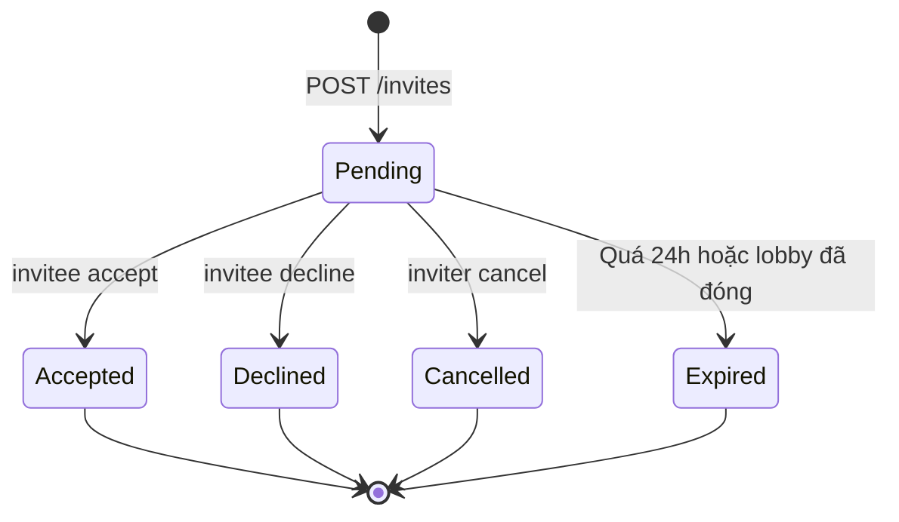

# LobbyInviteController

**Base route:** `/api/v1/lobbies`
**Controller:** `LobbyInviteController.cs`
**Role:** Player — đã đăng nhập

API mời bạn vào lobby, accept/decline lời mời, lấy share code (copy &amp; share qua link).

> **Lưu ý visibility:**
> - **Public lobby** (`IsPrivate = false`): mọi user có thể join qua `/search` hoặc share code; host cũng có thể gửi invite cho bạn bè.
> - **Private lobby** (`IsPrivate = true`): KHÔNG hiện trong `/search`. Chỉ join được qua lời mời (`/invites`) hoặc share code (`/join-by-code`).

## Endpoints

| Endpoint | Method | Role | Mô tả |
|----------|--------|------|-------|
| `/{lobbyId}/invites` | POST | Member | Gửi lời mời cho 1 user |
| `/invites/{inviteId}/accept` | POST | Invitee | Accept → tự động join lobby |
| `/invites/{inviteId}/decline` | POST | Invitee | Từ chối lời mời |
| `/invites/{inviteId}` | DELETE | Inviter | Hủy lời mời đã gửi |
| `/invites/me/pending` | GET | Player | Inbox: lời mời lobby đang chờ |
| `/invites/me?status=` | GET | Player | Tất cả lời mời lobby (filter optional) |
| `/{lobbyId}/share-info` | GET | Member | Lấy Lobby ID + Share Code để copy |
| `/join-by-code` | POST | Player | Join lobby bằng share code |

**Header bắt buộc:** `Authorization: Bearer <player-token>`

---

## Luồng tích hợp

### Host mời bạn vào lobby

```
Host: POST /api/v1/lobbies/{lobbyId}/invites
   Body: { "inviteeId": "...", "message": "Vào chơi Catan chung nhé!" }
   → 201 Created (status = Pending)

Invitee: GET /api/v1/lobbies/invites/me/pending
   → Thấy invite từ Host

Invitee: POST /api/v1/lobbies/invites/{inviteId}/accept
   → 200 OK, status = Accepted, tự động join lobby
```

### Host share link qua mã ngắn

```
Host: GET /api/v1/lobbies/{lobbyId}/share-info
   → { lobbyId, shareCode: "K7H3NP9X", isPrivate, lobbyStatus }

Host copy mã shareCode và gửi qua Messenger / Zalo / SMS
   → Đường link: boardverse://lobby/join?code=K7H3NP9X

Bạn được mời: POST /api/v1/lobbies/join-by-code
   Body: { "shareCode": "K7H3NP9X" }
   → 200 OK, đã join lobby (kể cả lobby private)
```

---

## POST /api/v1/lobbies/{lobbyId}/invites

Gửi lời mời tham gia lobby.

**Điều kiện:**
- Current user phải là thành viên active của lobby.
- Lobby đang ở trạng thái `Open` hoặc `Full` (chưa `InProgress`/`Closed`).
- Invitee chưa là thành viên.
- Chưa có invite `Pending` giữa (lobbyId, inviteeId).

**Body:**
```json
{
  "inviteeId": "<guid>",
  "message": "Vào chơi Catan nhé!"
}
```

| Field | Required | Mô tả |
|-------|----------|--------|
| `inviteeId` | ✅ | Mã người được mời. |
| `message` | ❌ | Lời nhắn (≤ 300 ký tự). |

**Response 201:** `LobbyInviteResponseDto` — `inviteId`, `lobbyId`, `inviter`, `invitee`, `status = Pending`, `expiresAt` (24h sau khi gửi).

**Lỗi:**
- `400` mời chính mình.
- `403` không phải thành viên lobby / bị inviter block.
- `404` không tìm thấy lobby.
- `409` đã có pending invite / lobby đã đóng.

---

## POST /api/v1/lobbies/invites/{inviteId}/accept

Accept lời mời. Sau khi accept:
1. Service tự động gọi `JoinLobbyAsync` → user thành thành viên active.
2. SignalR broadcast `MemberJoined` cho cả lobby.

**Path param:** `inviteId` (Guid).

**Response 200:** `LobbyInviteResponseDto` với status = `Accepted`.

**Lỗi:**
- `403` không phải invitee.
- `404` không tìm thấy invite.
- `409` lobby đã đóng/đầy hoặc invite không còn Pending.

---

## POST /api/v1/lobbies/invites/{inviteId}/decline

Từ chối lời mời.

**Response 200:** status = `Declined`.

---

## DELETE /api/v1/lobbies/invites/{inviteId}

Inviter hủy lời mời đã gửi.

**Lỗi:**
- `403` không phải người gửi.
- `409` không ở `Pending`.

---

## GET /api/v1/lobbies/invites/me/pending

Inbox lời mời lobby đang chờ (status = `Pending`, chưa hết hạn).

---

## GET /api/v1/lobbies/invites/me

Tất cả lời mời lobby của current user.

**Query param:**
- `status` (optional) — `Pending` / `Accepted` / `Declined` / `Expired` / `Cancelled`.

---

## GET /api/v1/lobbies/{lobbyId}/share-info

Lấy `lobbyId` + `shareCode` (8 ký tự uppercase alphanumeric) để client hiển thị nút copy.

**Authorization:** chỉ thành viên của lobby mới xem được share code.

**Response 200:**
```json
{
  "data": {
    "lobbyId": "<guid>",
    "shareCode": "K7H3NP9X",
    "isPrivate": false,
    "lobbyStatus": "Open"
  }
}
```

---

## POST /api/v1/lobbies/join-by-code

Join lobby bằng share code (8 ký tự).

**Body:**
```json
{ "shareCode": "K7H3NP9X" }
```

**Response 200:** `LobbyResponseDto` — current user đã trở thành thành viên.

**Lỗi:**
- `400` share code trống / sai format.
- `404` share code không tồn tại.
- `409` đã là thành viên / lobby đầy / lobby đã đóng.

> **Public lobby:** có thể join bằng share code mà không cần là bạn bè của host.
> **Private lobby:** chỉ join được bằng share code (được host chia sẻ) hoặc qua invite.

---

## State machine — `LobbyInvite`



## Business rules

| BR | Áp dụng |
|----|---------|
| BR-LOBBY-INVITE-01 | Một (LobbyId, InviteeId) chỉ có 1 Pending record tại 1 thời điểm. |
| BR-LOBBY-INVITE-02 | Inviter phải là thành viên active của lobby. |
| BR-LOBBY-INVITE-03 | Invitee không được là thành viên active của lobby. |
| BR-LOBBY-INVITE-04 | Inviter không được block invitee (Friend.Blocked). |

## Liên quan

- **Friends:** [friend.md](./friend.md) — mời user vào friend list trước khi gửi lobby invite.
- **Lobby:** [lobby.md](./lobby.md) — tạo/join/leave lobby; check `IsPrivate` + `ShareCode` trong response.