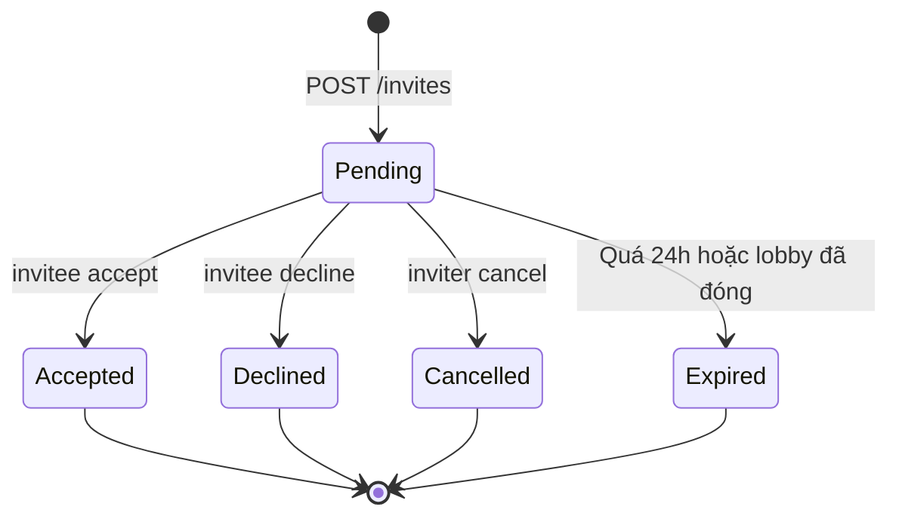

# LobbyInviteController

**Base route:** `/api/v1/lobbies`
**Controller:** `LobbyInviteController.cs`
**Role:** Player — đã đăng nhập

API mời bạn vào lobby, accept/decline lời mời, lấy share code (copy &amp; share qua link).

> **Lưu ý visibility:**
> - **Public lobby** (`IsPrivate = false`): mọi user có thể join qua `/search` hoặc share code; host cũng có thể gửi invite cho bạn bè.
> - **Private lobby** (`IsPrivate = true`): KHÔNG hiện trong `/search`. Chỉ join được qua lời mời (`/invites`) hoặc share code (`/join-by-code`).

## Endpoints

| Endpoint | Method | Role | Mô tả |
|----------|--------|------|-------|
| `/{lobbyId}/invites` | POST | Member | Gửi lời mời cho 1 user |
| `/{lobbyId}/invites?status=` | GET | Member | Lịch sử lời mời của lobby |
| `/invites/{inviteId}/accept` | POST | Invitee | Accept → tự động join lobby |
| `/invites/{inviteId}/decline` | POST | Invitee | Từ chối lời mời |
| `/invites/{inviteId}/resend` | POST | Inviter / Host | Gửi lại invite đã Decline/Expired/Cancelled |
| `/invites/{inviteId}` | DELETE | Inviter | Hủy lời mời đã gửi |
| `/invites/me/pending` | GET | Player | Inbox: lời mời lobby đang chờ |
| `/invites/me?status=` | GET | Player | Tất cả lời mời lobby (filter optional) |
| `/{lobbyId}/share-info` | GET | Member | Lấy Lobby ID + Share Code để copy |
| `/{lobbyId}/invitable-friends` | GET | Member | Danh sách bạn bè + cờ trạng thái để mời |
| `/join-by-code` | POST | Player | Join lobby bằng share code |

**Header bắt buộc:** `Authorization: Bearer <player-token>`

---

## Luồng tích hợp

### Host mời bạn vào lobby

```
Host: POST /api/v1/lobbies/{lobbyId}/invites
   Body: { "inviteeId": "...", "message": "Vào chơi Catan chung nhé!" }
   → 201 Created (status = Pending)

Invitee: GET /api/v1/lobbies/invites/me/pending
   → Thấy invite từ Host

Invitee: POST /api/v1/lobbies/invites/{inviteId}/accept
   → 200 OK, status = Accepted, tự động join lobby
```

### Host share link qua mã ngắn

```
Host: GET /api/v1/lobbies/{lobbyId}/share-info
   → { lobbyId, shareCode: "K7H3NP9X", isPrivate, lobbyStatus }

Host copy mã shareCode và gửi qua Messenger / Zalo / SMS
   → Đường link: boardverse://lobby/join?code=K7H3NP9X

Bạn được mời: POST /api/v1/lobbies/join-by-code
   Body: { "shareCode": "K7H3NP9X" }
   → 200 OK, đã join lobby (kể cả lobby private)
```

---

## POST /api/v1/lobbies/{lobbyId}/invites

Gửi lời mời tham gia lobby.

**Điều kiện:**
- Current user phải là thành viên active của lobby.
- Lobby đang ở trạng thái `Open` hoặc `Full` (chưa `InProgress`/`Closed`).
- Invitee chưa là thành viên.
- Chưa có invite `Pending` giữa (lobbyId, inviteeId).

**Body:**
```json
{
  "inviteeId": "<guid>",
  "message": "Vào chơi Catan nhé!"
}
```

| Field | Required | Mô tả |
|-------|----------|--------|
| `inviteeId` | ✅ | Mã người được mời. |
| `message` | ❌ | Lời nhắn (≤ 300 ký tự). |

**Response 201:** `LobbyInviteResponseDto` — `inviteId`, `lobbyId`, `inviter`, `invitee`, `status = Pending`, `expiresAt` (24h sau khi gửi).

**Lỗi:**
- `400` mời chính mình.
- `403` không phải thành viên lobby / bị inviter block.
- `404` không tìm thấy lobby.
- `409` đã có pending invite / lobby đã đóng.

---

## POST /api/v1/lobbies/invites/{inviteId}/accept

Accept lời mời. Sau khi accept:
1. Service tự động gọi `JoinLobbyAsync` → user thành thành viên active.
2. SignalR broadcast `MemberJoined` cho cả lobby.

**Path param:** `inviteId` (Guid).

**Response 200:** `LobbyInviteResponseDto` với status = `Accepted`.

**Lỗi:**
- `403` không phải invitee.
- `404` không tìm thấy invite.
- `409` lobby đã đóng/đầy hoặc invite không còn Pending.

---

## POST /api/v1/lobbies/invites/{inviteId}/decline

Từ chối lời mời.

**Response 200:** status = `Declined`.

---

## DELETE /api/v1/lobbies/invites/{inviteId}

Inviter hủy lời mời đã gửi.

**Lỗi:**
- `403` không phải người gửi.
- `409` không ở `Pending`.

---

## GET /api/v1/lobbies/invites/me/pending

Inbox lời mời lobby đang chờ (status = `Pending`, chưa hết hạn).

---

## GET /api/v1/lobbies/invites/me

Tất cả lời mời lobby của current user.

**Query param:**
- `status` (optional) — `Pending` / `Accepted` / `Declined` / `Expired` / `Cancelled`.

---

## GET /api/v1/lobbies/{lobbyId}/share-info

Lấy `lobbyId` + `shareCode` (8 ký tự uppercase alphanumeric) để client hiển thị nút copy.

**Authorization:** chỉ thành viên của lobby mới xem được share code.

**Response 200:**
```json
{
  "data": {
    "lobbyId": "<guid>",
    "shareCode": "K7H3NP9X",
    "isPrivate": false,
    "lobbyStatus": "Open"
  }
}
```

---

## GET /api/v1/lobbies/{lobbyId}/invites

Lấy lịch sử lời mời của lobby (Pending / Accepted / Declined / Expired / Cancelled).

**Authorization:** chỉ thành viên active của lobby mới gọi được.

**Query param:**
- `status` (optional) — `Pending` / `Accepted` / `Declined` / `Expired` / `Cancelled`.
- `limit` (optional, mặc định 100, tối đa 200).

**Response 200:** `IReadOnlyList<LobbyInviteResponseDto>` — sắp xếp theo `CreatedAt` desc.

**Lỗi:** `400` status filter sai · `401` thiếu token · `403` không phải thành viên · `404` lobby không tồn tại.

> **Luồng gợi ý:** sau khi mời 10 friend, host có thể mở tab "Đã mời" (`status=Pending`) để xem ai chưa phản hồi, hoặc tab "Đã từ chối" (`status=Declined`) để quyết định resend.

---

## POST /api/v1/lobbies/invites/{inviteId}/resend

Gửi lại 1 invite đã ở trạng thái terminal (`Declined` / `Expired` / `Cancelled`). 
Tạo **record mới** (giữ lịch sử invite cũ), reset `ExpiresAt = now + 24h`.

**Authorization:** chỉ inviter cũ hoặc host lobby mới gửi lại được.

**Path param:** `inviteId` (Guid).

**Response 201:** `LobbyInviteResponseDto` — invite mới với ID khác invite cũ, status = `Pending`.

**Lỗi:**
- `403` không phải inviter cũ / host.
- `404` không tìm thấy invite / lobby.
- `409` invite đã được `Accepted` / đã có Pending mới giữa (lobby, invitee) / lobby đã đóng / invitee đã là member / vi phạm rate limit (BR-LOBBY-INVITE-10).

**Lưu ý BR-LOBBY-INVITE-01:** tạo record mới thay vì mutate row cũ để giữ audit trail; mỗi `(LobbyId, InviteeId)` chỉ có 1 Pending tại 1 thời điểm.

---

## POST /api/v1/lobbies/join-by-code

Join lobby bằng share code (8 ký tự).

**Body:**
```json
{ "shareCode": "K7H3NP9X" }
```

**Response 200:** `LobbyResponseDto` — current user đã trở thành thành viên.

**Lỗi:**
- `400` share code trống / sai format.
- `404` share code không tồn tại.
- `409` đã là thành viên / lobby đầy / lobby đã đóng.

> **Public lobby:** có thể join bằng share code mà không cần là bạn bè của host.
> **Private lobby:** chỉ join được bằng share code (được host chia sẻ) hoặc qua invite.

---

## GET /api/v1/lobbies/{lobbyId}/invitable-friends

Lấy danh sách bạn bè (`Friendship.Accepted`) của current user kèm **trạng thái mời cho lobby cụ thể** để client render UI danh sách mời — không cần gọi thêm `/friends` riêng.

**Authorization:** chỉ thành viên active của lobby mới gọi được.

**Query param:**
- `search` (optional) — từ khóa tìm username (case-insensitive contains).
- `onlineOnly` (optional, default `false`) — chỉ lấy friend `Online` / `RecentlyActive`.
- `minKarma` (optional) — lọc bạn có `KarmaPoints >=` giá trị này.
- `status` (optional, comma-separated) — filter theo nhiều `LobbyInviteFriendStatus`. VD: `Invitable,InvitePending`. Hợp lệ: `Invitable` / `InvitePending` / `InviteAccepted` / `InviteNotPending` / `AlreadyMember` / `BlockedByMe` / `BlockedByThem` / `LobbyClosed`.
- `limit` (optional, mặc định 100, tối đa 200) — giới hạn kết quả.

**Response 200:** `IReadOnlyList<LobbyInvitableFriendDto>`.

Mỗi item chứa:

| Field | Type | Mô tả |
|---|---|---|
| `userId` | Guid | Mã friend. |
| `username` | string | Tên hiển thị. |
| `avatarUrl` | string? | Avatar. |
| `karmaPoints` | int | Điểm karma. |
| `gamerTier` | string? | Tier (Bronze/Silver/Gold/...). |
| `activityStatus` | string | Online / RecentlyActive / Away / Offline. |
| `lastActiveAt` | DateTime? | Lần cuối online. |
| `friendsSince` | DateTime | Ngày kết bạn. |
| `inviteStatus` | enum | Trạng thái mời (xem bảng dưới). |
| `latestInviteId` | Guid? | ID invite gần nhất (Pending nếu có). |
| `latestInviteStatus` | string? | Pending / Accepted / Declined / Expired / Cancelled. |
| `isInLobby` | bool | `true` nếu đã là thành viên active. |
| `hasPendingInvite` | bool | `true` nếu đã gửi Pending invite. |
| `isBlocked` | bool | `true` nếu 1 trong 2 bên block. |

**Bảng `inviteStatus`:**

| Giá trị | UI đề xuất |
|---|---|
| `Invitable` | Nút **"Mời"**. |
| `InvitePending` | Nút **"Đã gửi"** (disabled) + nút **"Hủy lời mời"**. |
| `InviteAccepted` | Hiển thị "Đã chấp nhận" (disabled, lịch sử). |
| `InviteNotPending` | Lời mời cũ bị Declined/Expired/Cancelled — có thể gửi lại → nút **"Mời"**. |
| `AlreadyMember` | Hiển thị "Đã trong phòng" (disabled). |
| `BlockedByThem` / `BlockedByMe` | Ẩn khỏi danh sách hoặc disable hoàn toàn. |
| `LobbyClosed` | Disable — "Phòng đã đóng". |

**Thứ tự sắp xếp:** `Invitable` → `InvitePending` → `InviteAccepted` → các status khác → trong cùng status sort theo Karma giảm dần → Username alphabet.

**Ví dụ response:**
```json
{
  "data": [
    {
      "userId": "11111111-...",
      "username": "minh_an",
      "avatarUrl": "https://cdn/avatar1.jpg",
      "karmaPoints": 320,
      "gamerTier": "Gold",
      "activityStatus": "Online",
      "lastActiveAt": "2026-08-06T12:30:00Z",
      "friendsSince": "2025-12-01T08:00:00Z",
      "inviteStatus": "Invitable",
      "latestInviteId": null,
      "latestInviteStatus": null,
      "isInLobby": false,
      "hasPendingInvite": false,
      "isBlocked": false
    },
    {
      "userId": "22222222-...",
      "username": "lan_anh",
      "karmaPoints": 180,
      "inviteStatus": "InvitePending",
      "latestInviteId": "abcd1234-...",
      "latestInviteStatus": "Pending",
      "hasPendingInvite": true,
      "isInLobby": false,
      "isBlocked": false
    },
    {
      "userId": "33333333-...",
      "username": "tuan_anh",
      "inviteStatus": "AlreadyMember",
      "isInLobby": true,
      "hasPendingInvite": false,
      "isBlocked": false
    }
  ]
}
```

**Lỗi:**
- `400` status filter không hợp lệ.
- `401` thiếu token.
- `403` không phải thành viên lobby.
- `404` không tìm thấy lobby.

**Ví dụ filter:**

```http
# Chỉ lấy friend đang online + Karma >= 100 + search "minh"
GET /api/v1/lobbies/{lobbyId}/invitable-friends
  ?onlineOnly=true&minKarma=100&search=minh

# Chỉ lấy những friend đã có pending invite (để hiển thị tab "Đã mời")
GET /api/v1/lobbies/{lobbyId}/invitable-friends?status=InvitePending

# Lấy những friend có thể mời + đã mời (ẩn member/blocked)
GET /api/v1/lobbies/{lobbyId}/invitable-friends?status=Invitable,InvitePending
```

---

## State machine — `LobbyInvite`


```mermaid
stateDiagram-v2
    [*] --> Pending: POST /invites
    Pending --> Accepted: invitee accept
    Pending --> Declined: invitee decline
    Pending --> Cancelled: inviter cancel
    Pending --> Expired: Quá 24h hoặc lobby đã đóng
    Accepted --> [*]
    Declined --> [*]
    Cancelled --> [*]
    Expired --> [*]
```

## Business rules

| BR | Áp dụng |
|----|---------|
| BR-LOBBY-INVITE-01 | Một (LobbyId, InviteeId) chỉ có 1 Pending record tại 1 thời điểm. |
| BR-LOBBY-INVITE-02 | Inviter phải là thành viên active của lobby. |
| BR-LOBBY-INVITE-03 | Invitee không được là thành viên active của lobby. |
| BR-LOBBY-INVITE-04 | Inviter không được block invitee (Friend.Blocked). |

## Liên quan

- **Friends:** [friend.md](./friend.md) — mời user vào friend list trước khi gửi lobby invite.
- **Lobby:** [lobby.md](./lobby.md) — tạo/join/leave lobby; check `IsPrivate` + `ShareCode` trong response.