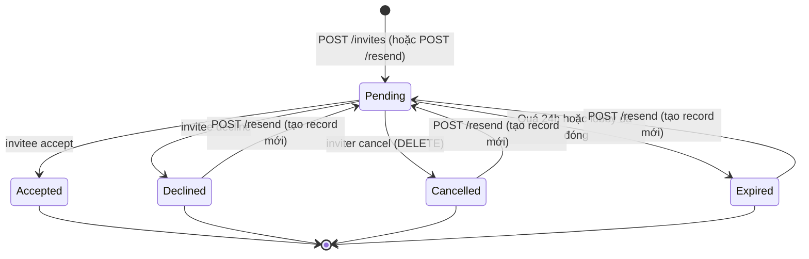
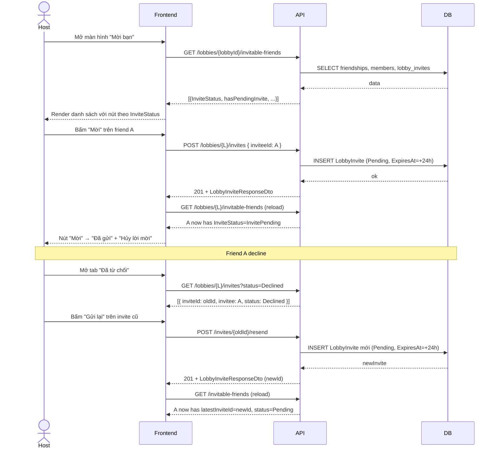

# LobbyInviteController

**Base route:** `/api/v1/lobbies`
**Controller:** `LobbyInviteController.cs`
**Role:** Player — đã đăng nhập

API mời bạn vào lobby, accept/decline/cancel/resend lời mời, lấy share code, lấy danh sách bạn bè kèm trạng thái mời.

> **Lưu ý visibility:**
> - **Public lobby** (`IsPrivate = false`): mọi user có thể join qua `/search` hoặc share code; host cũng có thể gửi invite cho bạn bè.
> - **Private lobby** (`IsPrivate = true`): KHÔNG hiện trong `/search`. Chỉ join được qua lời mời (`/invites`) hoặc share code (`/join-by-code`).
> - **Private lobby:** inviter BẮT BUỘC phải là bạn bè `Accepted` của invitee (BR-LOBBY-INVITE-05).

---

## Endpoints

| Endpoint | Method | Role | Mô tả |
|----------|--------|------|-------|
| `/{lobbyId}/invites` | POST | Member | Gửi lời mời cho 1 user |
| `/{lobbyId}/invites?status=` | GET | Member | Lịch sử lời mời của lobby |
| `/invites/{inviteId}/accept` | POST | Invitee | Accept → tự động join lobby |
| `/invites/{inviteId}/decline` | POST | Invitee | Từ chối lời mời |
| `/invites/{inviteId}/resend` | POST | Inviter / Host | Gửi lại invite đã Decline/Expired/Cancelled |
| `/invites/{inviteId}` | DELETE | Inviter | Hủy lời mời đã gửi |
| `/invites/me/pending` | GET | Player | Inbox: lời mời lobby đang chờ |
| `/invites/me?status=` | GET | Player | Tất cả lời mời lobby (filter optional) |
| `/{lobbyId}/share-info` | GET | Member | Lấy Lobby ID + Share Code để copy |
| `/{lobbyId}/invitable-friends` | GET | Member | Danh sách bạn bè + cờ trạng thái để mời |
| `/join-by-code` | POST | Player | Join lobby bằng share code |

**Header bắt buộc:** `Authorization: Bearer <player-token>`.

**Format response thành công:**
```json
{
  "success": true,
  "message": "...",
  "data": { ... }
}
```

**Format response lỗi:**
```json
{
  "success": false,
  "message": "Phòng chờ đã đóng hoặc không còn khả dụng.",
  "data": null
}
```

---

## Tại sao cần `/invitable-friends`?

**Vấn đề UI cũ (nếu dùng `/friends` rồi tự map):**

1. FE phải gọi `GET /friends` → lấy danh sách bạn.
2. Với mỗi friend, FE phải gọi thêm `GET /invites?status=Pending` để biết đã gửi invite chưa → N+1 query.
3. FE phải gọi `GET /lobbies/{lobbyId}` để check `MaxMembers` → biết friend đã là member chưa.
4. FE phải tự check `Friend.Blocked` → ẩn/disable nút.
5. Sắp xếp, filter status, tất cả do FE tự làm → dễ bug + tốn bandwidth.

**Cách mới:** 1 request duy nhất `GET /lobbies/{lobbyId}/invitable-friends` trả về danh sách friend + **server quyết định** `InviteStatus` + `IsInLobby` + `HasPendingInvite` + `IsBlocked`. FE chỉ cần switch theo enum để render nút.

**Server-authoritative:** client không tự tính `currentPlayers` / `MaxMembers` / `PendingInvite` — backend xác nhận (BR-REQUIRED 17.2 Server Authoritative).

---

## Luồng tích hợp

### Host mời bạn (UI 1 danh sách phẳng)

```
# 1. Lấy danh sách bạn kèm state mời cho lobby
Host: GET /api/v1/lobbies/{lobbyId}/invitable-friends
  → 200 OK, [{userId, inviteStatus, hasPendingInvite, isInLobby, ...}, ...]

# 2. UI render switch theo inviteStatus:
#    - Invitable      → "Mời" (enable)
#    - InvitePending  → "Đã gửi" + "Hủy lời mời" (disable nút Mời)
#    - AlreadyMember  → "Đã trong phòng" (disable)
#    - BlockedByXxx   → ẩn
#    - LobbyClosed    → disable (phòng đã đóng)

# 3. Host bấm "Mời" → gọi POST /invites
Host: POST /api/v1/lobbies/{lobbyId}/invites
  Body: { "inviteeId": "...", "message": "Vào chơi Catan chung nhé!" }
  → 201 Created (status = Pending)

# 4. Reload danh sách để cập nhật nút
Host: GET /api/v1/lobbies/{lobbyId}/invitable-friends
  → friend đó giờ có inviteStatus = "InvitePending"
```

### Host gửi lại invite cho người đã từ chối

```
# 1. Mở tab "Đã từ chối" trong lobby
Host: GET /api/v1/lobbies/{lobbyId}/invites?status=Declined
  → [{ inviteId: "abc", inviteeUsername: "lan_anh", status: "Declined", ... }]

# 2. Host bấm "Gửi lại" trên 1 invite
Host: POST /api/v1/lobbies/invites/{inviteId}/resend
  → 201 Created, trả về invite MỚI (id khác), status = Pending, expiresAt = now + 24h
```

### Invitee nhận và accept

```
Invitee: GET /api/v1/lobbies/invites/me/pending
  → Thấy invite từ Host

Invitee: POST /api/v1/lobbies/invites/{inviteId}/accept
  → 200 OK, status = Accepted, tự động join lobby
```

### Host share link qua mã ngắn

```
Host: GET /api/v1/lobbies/{lobbyId}/share-info
  → { lobbyId, shareCode: "K7H3P2", isPrivate, lobbyStatus }

Host copy mã shareCode và gửi qua Messenger / Zalo / SMS
  → Đường link: boardverse://lobby/join?code=K7H3P2

Bạn được mời: POST /api/v1/lobbies/join-by-code
  Body: { "shareCode": "K7H3P2" }
  → 200 OK, đã join lobby (kể cả lobby private)
```

---

## POST /api/v1/lobbies/{lobbyId}/invites

Gửi lời mời tham gia lobby.

**Điều kiện:**
- Current user phải là thành viên active của lobby (BR-LOBBY-INVITE-02).
- Lobby đang ở trạng thái `Open` hoặc `Full` (chưa `InProgress`/`Closed`).
- Invitee chưa là thành viên (BR-LOBBY-INVITE-03).
- Chưa có invite `Pending` giữa (lobbyId, inviteeId) (BR-LOBBY-INVITE-01).
- Private lobby: inviter phải là bạn bè `Accepted` của invitee (BR-LOBBY-INVITE-05).
- Không được block 2 chiều (BR-LOBBY-INVITE-04).
- Không vượt rate limit (BR-LOBBY-INVITE-10).

**Body:**
```json
{
  "inviteeId": "<guid>",
  "message": "Vào chơi Catan nhé!"
}
```

| Field | Required | Mô tả |
|-------|----------|--------|
| `inviteeId` | ✅ | Mã người được mời. |
| `message` | ❌ | Lời nhắn (≤ 300 ký tự). |

**Response 201:** `LobbyInviteResponseDto` — `inviteId`, `lobbyId`, `inviter`, `invitee`, `status = Pending`, `expiresAt` (24h sau khi gửi).

**Lỗi:**
- `400` mời chính mình.
- `403` không phải thành viên lobby / bị inviter block / không phải bạn bè (private).
- `404` không tìm thấy lobby.
- `409` đã có pending invite / lobby đã đóng / invitee đã là member.
- `429` vượt rate limit (BR-LOBBY-INVITE-10).

---

## GET /api/v1/lobbies/{lobbyId}/invites

Lấy lịch sử lời mời của lobby (Pending / Accepted / Declined / Expired / Cancelled).

**Authorization:** chỉ thành viên active của lobby mới gọi được.

**Query param:**
- `status` (optional) — `Pending` / `Accepted` / `Declined` / `Expired` / `Cancelled`.
- `limit` (optional, mặc định 100, tối đa 200).

**Response 200:** `IReadOnlyList<LobbyInviteResponseDto>` — sắp xếp theo `CreatedAt` desc.

**Ví dụ response:**
```json
{
  "data": [
    {
      "inviteId": "abc-123",
      "lobbyId": "lobby-uuid",
      "lobbyName": "Catan 4 người tối CN",
      "gameName": "Catan",
      "scheduledStartTime": "2026-08-10T19:00:00Z",
      "inviterId": "host-uuid",
      "inviterUsername": "host_main",
      "inviteeId": "friend-uuid",
      "inviteeUsername": "minh_an",
      "status": "Pending",
      "createdAt": "2026-08-06T10:00:00Z",
      "expiresAt": "2026-08-07T10:00:00Z",
      "respondedAt": null,
      "message": "Vào chơi Catan nhé!"
    }
  ]
}
```

**Lỗi:** `400` status filter sai · `401` thiếu token · `403` không phải thành viên · `404` lobby không tồn tại.

> **Luồng gợi ý:** sau khi mời 10 friend, host có thể mở tab "Đã mời" (`status=Pending`) để xem ai chưa phản hồi, hoặc tab "Đã từ chối" (`status=Declined`) để quyết định resend.

---

## POST /api/v1/lobbies/invites/{inviteId}/accept

Accept lời mời. Sau khi accept:
1. Service tự động gọi `JoinLobbyAsync` → user thành thành viên active.
2. SignalR broadcast `MemberJoined` cho cả lobby.
3. Với private lobby: re-check friendship tại thời điểm accept (BR-LOBBY-INVITE-07).

**Path param:** `inviteId` (Guid).

**Response 200:** `LobbyInviteResponseDto` với status = `Accepted`.

**Lỗi:**
- `403` không phải invitee / private lobby + unfriend trước accept.
- `404` không tìm thấy invite.
- `409` lobby đã đóng/đầy hoặc invite không còn Pending.

---

## POST /api/v1/lobbies/invites/{inviteId}/decline

Từ chối lời mời.

**Response 200:** `LobbyInviteResponseDto` với status = `Declined`.

**Lỗi:**
- `403` không phải invitee.
- `404` không tìm thấy invite.
- `409` invite không ở `Pending`.

---

## POST /api/v1/lobbies/invites/{inviteId}/resend

Gửi lại 1 invite đã ở trạng thái terminal (`Declined` / `Expired` / `Cancelled`).
Tạo **record mới** (giữ lịch sử invite cũ), reset `ExpiresAt = now + 24h`.

**Authorization:** chỉ inviter cũ hoặc host lobby mới gửi lại được.

**Path param:** `inviteId` (Guid).

**Response 201:** `LobbyInviteResponseDto` — invite mới với ID khác invite cũ, status = `Pending`.

**Lỗi:**
- `403` không phải inviter cũ / host.
- `404` không tìm thấy invite / lobby.
- `409` invite đã được `Accepted` / đã có Pending mới giữa (lobby, invitee) / lobby đã đóng / invitee đã là member / vi phạm rate limit (BR-LOBBY-INVITE-10).

**Lưu ý BR-LOBBY-INVITE-01:** tạo record mới thay vì mutate row cũ để giữ audit trail; mỗi `(LobbyId, InviteeId)` chỉ có 1 Pending tại 1 thời điểm.

---

## DELETE /api/v1/lobbies/invites/{inviteId}

Inviter hủy lời mời đã gửi (khi còn Pending).

**Lỗi:**
- `403` không phải người gửi.
- `404` không tìm thấy invite.
- `409` invite không ở `Pending`.

**Response:** `204 No Content`.

---

## GET /api/v1/lobbies/invites/me/pending

Inbox lời mời lobby đang chờ (status = `Pending`, chưa hết hạn).

**Response 200:** `IReadOnlyList<LobbyInviteResponseDto>`.

**Ví dụ response:**
```json
{
  "data": [
    {
      "inviteId": "abc-123",
      "lobbyId": "lobby-uuid",
      "lobbyName": "Catan 4 người tối CN",
      "gameName": "Catan",
      "scheduledStartTime": "2026-08-10T19:00:00Z",
      "inviterId": "host-uuid",
      "inviterUsername": "host_main",
      "inviteeId": "current-user-uuid",
      "inviteeUsername": "current_user",
      "status": "Pending",
      "createdAt": "2026-08-06T10:00:00Z",
      "expiresAt": "2026-08-07T10:00:00Z",
      "respondedAt": null,
      "message": "Vào chơi Catan nhé!"
    }
  ]
}
```

---

## GET /api/v1/lobbies/invites/me

Tất cả lời mời lobby của current user (filter optional).

**Query param:**
- `status` (optional) — `Pending` / `Accepted` / `Declined` / `Expired` / `Cancelled`.

**Response 200:** `IReadOnlyList<LobbyInviteResponseDto>` — sắp xếp `CreatedAt` desc.

**Lỗi:** `400` status filter sai · `401` thiếu token.

---

## GET /api/v1/lobbies/{lobbyId}/share-info

Lấy `lobbyId` + `shareCode` (6 ký tự uppercase alphanumeric, bộ ký tự `ABCDEFGHJKLMNPQRSTUVWXYZ23456789` — bỏ `0/O/1/I/L` để tránh nhầm) để client hiển thị nút copy.

**Authorization:** chỉ thành viên của lobby mới xem được share code.

**Response 200:**
```json
{
  "data": {
    "lobbyId": "<guid>",
    "shareCode": "K7H3P2",
    "isPrivate": false,
    "lobbyStatus": "Open"
  }
}
```

**Lỗi:** `401` thiếu token · `403` không phải thành viên · `404` lobby không tồn tại.

---

## POST /api/v1/lobbies/join-by-code

Join lobby bằng share code (6 ký tự).

**Body:**
```json
{ "shareCode": "K7H3P2" }
```

**Response 200:** `LobbyResponseDto` — current user đã trở thành thành viên.

**Lỗi:**
- `400` share code trống / sai format.
- `404` share code không tồn tại.
- `409` đã là thành viên / lobby đầy / lobby đã đóng.

> **Public lobby:** có thể join bằng share code mà không cần là bạn bè của host.
> **Private lobby:** chỉ join được bằng share code (được host chia sẻ) hoặc qua invite. BR-LOBBY-PRIVACY-03: private lobby chỉ cho user là bạn bè `Accepted` của ít nhất 1 thành viên active mới join được.

---

## GET /api/v1/lobbies/{lobbyId}/invitable-friends

Lấy danh sách bạn bè (`Friendship.Accepted`) của current user kèm **trạng thái mời cho lobby cụ thể** để client render UI danh sách mời — không cần gọi thêm `/friends` riêng.

**Authorization:** chỉ thành viên active của lobby mới gọi được.

**Query param:**
- `search` (optional) — từ khóa tìm username (case-insensitive contains).
- `onlineOnly` (optional, default `false`) — chỉ lấy friend `Online` / `RecentlyActive`.
- `minKarma` (optional) — lọc bạn có `KarmaPoints >=` giá trị này.
- `status` (optional, comma-separated) — filter theo nhiều `LobbyInviteFriendStatus`. VD: `Invitable,InvitePending`. Hợp lệ: `Invitable` / `InvitePending` / `InviteAccepted` / `InviteNotPending` / `AlreadyMember` / `BlockedByMe` / `BlockedByThem` / `LobbyClosed`.
- `limit` (optional, mặc định 100, tối đa 200) — giới hạn kết quả.

**Response 200:** `IReadOnlyList<LobbyInvitableFriendDto>`.

Mỗi item chứa:

| Field | Type | Mô tả |
|---|---|---|
| `userId` | Guid | Mã friend. |
| `username` | string | Tên hiển thị. |
| `avatarUrl` | string? | Avatar. |
| `karmaPoints` | int | Điểm karma. |
| `gamerTier` | string? | Tier (Bronze/Silver/Gold/...). |
| `activityStatus` | string | Online / RecentlyActive / Away / Offline. |
| `lastActiveAt` | DateTime? | Lần cuối online. |
| `friendsSince` | DateTime | Ngày kết bạn. |
| `inviteStatus` | enum | Trạng thái mời (xem bảng dưới). |
| `latestInviteId` | Guid? | ID invite gần nhất (Pending nếu có). |
| `latestInviteStatus` | string? | Pending / Accepted / Declined / Expired / Cancelled. |
| `isInLobby` | bool | `true` nếu đã là thành viên active. |
| `hasPendingInvite` | bool | `true` nếu đã gửi Pending invite. |
| `isBlocked` | bool | `true` nếu 1 trong 2 bên block. |

**Bảng `inviteStatus`:**

| Giá trị | UI đề xuất | Khi nào xảy ra |
|---|---|---|
| `Invitable` | Nút **"Mời"** (enable). | Chưa từng gửi invite, hoặc invite cũ đã Declined/Expired/Cancelled — có thể mời lại. |
| `InvitePending` | Nút **"Đã gửi"** (disabled) + nút **"Hủy lời mời"**. | Invite gần nhất status = Pending và chưa hết hạn. |
| `InviteAccepted` | Hiển thị "Đã chấp nhận" (disabled, lịch sử). | Invite gần nhất Accepted, friend rời lobby → có thể mời lại. |
| `InviteNotPending` | Nút **"Mời"** (enable). | Invite cũ bị Declined/Expired/Cancelled. |
| `AlreadyMember` | Hiển thị "Đã trong phòng" (disabled). | Friend đã là `LobbyMember.IsActive = true`. |
| `BlockedByThem` | Ẩn hoặc disable hoàn toàn. | Friend đã block current user. |
| `BlockedByMe` | Ẩn hoặc disable hoàn toàn. | Current user đã block friend. |
| `LobbyClosed` | Disable — "Phòng đã đóng". | Lobby status ≠ Open và ≠ Full. |

**Thứ tự sắp xếp mặc định** (server-side):
1. `InviteStatus` theo enum order (Invitable trước → LobbyClosed cuối).
2. Trong cùng status: `KarmaPoints` DESC (gamer hoạt động mạnh lên đầu).
3. Cuối cùng: `Username` A-Z.

**Ví dụ response:**
```json
{
  "data": [
    {
      "userId": "11111111-0000-0000-0000-000000000000",
      "username": "minh_an",
      "avatarUrl": "https://cdn/avatar1.jpg",
      "karmaPoints": 320,
      "gamerTier": "Gold",
      "activityStatus": "Online",
      "lastActiveAt": "2026-08-06T12:30:00Z",
      "friendsSince": "2025-12-01T08:00:00Z",
      "inviteStatus": "Invitable",
      "latestInviteId": null,
      "latestInviteStatus": null,
      "isInLobby": false,
      "hasPendingInvite": false,
      "isBlocked": false
    },
    {
      "userId": "22222222-0000-0000-0000-000000000000",
      "username": "lan_anh",
      "avatarUrl": "https://cdn/avatar2.jpg",
      "karmaPoints": 180,
      "gamerTier": "Silver",
      "activityStatus": "RecentlyActive",
      "lastActiveAt": "2026-08-06T08:15:00Z",
      "friendsSince": "2026-01-15T10:00:00Z",
      "inviteStatus": "InvitePending",
      "latestInviteId": "abcd1234-0000-0000-0000-000000000000",
      "latestInviteStatus": "Pending",
      "isInLobby": false,
      "hasPendingInvite": true,
      "isBlocked": false
    },
    {
      "userId": "33333333-0000-0000-0000-000000000000",
      "username": "tuan_anh",
      "avatarUrl": null,
      "karmaPoints": 95,
      "gamerTier": "Bronze",
      "activityStatus": "Offline",
      "lastActiveAt": "2026-08-04T22:00:00Z",
      "friendsSince": "2026-03-01T14:00:00Z",
      "inviteStatus": "AlreadyMember",
      "latestInviteId": null,
      "latestInviteStatus": null,
      "isInLobby": true,
      "hasPendingInvite": false,
      "isBlocked": false
    }
  ]
}
```

**Lỗi:**
- `400` status filter không hợp lệ.
- `401` thiếu token.
- `403` không phải thành viên lobby.
- `404` không tìm thấy lobby.

**Ví dụ filter:**

```http
# Chỉ lấy friend đang online + Karma >= 100 + search "minh"
GET /api/v1/lobbies/{lobbyId}/invitable-friends
  ?onlineOnly=true&minKarma=100&search=minh

# Chỉ lấy những friend đã có pending invite (để hiển thị tab "Đã mời")
GET /api/v1/lobbies/{lobbyId}/invitable-friends?status=InvitePending

# Lấy những friend có thể mời + đã mời (ẩn member/blocked)
GET /api/v1/lobbies/{lobbyId}/invitable-friends?status=Invitable,InvitePending
```

---

## State machine — `LobbyInvite`


```mermaid
stateDiagram-v2
    [*] --> Pending: POST /invites (hoặc POST /resend)
    Pending --> Accepted: invitee accept
    Pending --> Declined: invitee decline
    Pending --> Cancelled: inviter cancel (DELETE)
    Pending --> Expired: Quá 24h hoặc lobby đã đóng
    Declined --> Pending: POST /resend (tạo record mới)
    Expired --> Pending: POST /resend (tạo record mới)
    Cancelled --> Pending: POST /resend (tạo record mới)
    Accepted --> [*]
    Declined --> [*]
    Cancelled --> [*]
    Expired --> [*]
```

> **Lưu ý:** resend KHÔNG mutate row cũ — luôn tạo record mới (giữ audit trail).
> BR-LOBBY-INVITE-01: mỗi `(LobbyId, InviteeId)` chỉ có 1 Pending tại 1 thời điểm.

---

## Sequence diagram — Flow mời + resend khi bị decline


```mermaid
sequenceDiagram
    actor Host
    participant FE as Frontend
    participant API
    participant DB

    Host->>FE: Mở màn hình "Mời bạn"
    FE->>API: GET /lobbies/{lobbyId}/invitable-friends
    API->>DB: SELECT friendships, members, lobby_invites
    DB-->>API: data
    API-->>FE: [{InviteStatus, hasPendingInvite, ...}]
    FE-->>Host: Render danh sách với nút theo InviteStatus

    Host->>FE: Bấm "Mời" trên friend A
    FE->>API: POST /lobbies/{L}/invites { inviteeId: A }
    API->>DB: INSERT LobbyInvite (Pending, ExpiresAt=+24h)
    DB-->>API: ok
    API-->>FE: 201 + LobbyInviteResponseDto
    FE->>API: GET /lobbies/{L}/invitable-friends (reload)
    API-->>FE: A now has InviteStatus=InvitePending
    FE-->>Host: Nút "Mời" → "Đã gửi" + "Hủy lời mời"

    Note over Host,DB: Friend A decline
    Host->>FE: Mở tab "Đã từ chối"
    FE->>API: GET /lobbies/{L}/invites?status=Declined
    API-->>FE: [{ inviteId: oldId, invitee: A, status: Declined }]

    Host->>FE: Bấm "Gửi lại" trên invite cũ
    FE->>API: POST /invites/{oldId}/resend
    API->>DB: INSERT LobbyInvite mới (Pending, ExpiresAt=+24h)
    DB-->>API: newInvite
    API-->>FE: 201 + LobbyInviteResponseDto (newId)
    FE->>API: GET /invitable-friends (reload)
    API-->>FE: A now has latestInviteId=newId, status=Pending
```

---

## Business rules

| BR | Áp dụng |
|----|---------|
| **BR-LOBBY-INVITE-01** | Một `(LobbyId, InviteeId)` chỉ có 1 Pending record tại 1 thời điểm. |
| **BR-LOBBY-INVITE-02** | Inviter phải là thành viên active của lobby. |
| **BR-LOBBY-INVITE-03** | Invitee không được là thành viên active của lobby. |
| **BR-LOBBY-INVITE-04** | Inviter/Invitee không được block nhau (BR-FRIEND-02). |
| **BR-LOBBY-INVITE-05** | Private lobby: inviter BẮT BUỘC phải là bạn bè `Accepted` của invitee. |
| **BR-LOBBY-INVITE-06** | Accept invite tự động `JoinLobbyAsync` (validate đầy đủ). Nếu fail → giữ `Pending`, không auto-decline. |
| **BR-LOBBY-INVITE-07** | Private lobby: re-check friendship tại thời điểm accept. |
| **BR-LOBBY-INVITE-08** | Invite hết hạn sau 24h (`ExpiresAt = CreatedAt + 24h`). Cron job đánh `Expired`. |
| **BR-LOBBY-INVITE-09** | Lobby terminal → tất cả pending invite chuyển `Expired` ngay. |
| **BR-LOBBY-INVITE-10** | Rate limit: 20 pending invite nhận / user / ngày, 30 invite gửi / user / ngày. |
| **BR-LOBBY-PRIVACY-02** | `ShareCode` sinh unique 6 ký tự alphanumeric uppercase (bộ ký tự bỏ `0/O/1/I/L`). Chỉ thành viên active mới xem được. |
| **BR-LOBBY-PRIVACY-03** | Private lobby: chỉ user là bạn bè `Accepted` của ít nhất 1 thành viên active mới join được bằng share code. |

---

## Known limitations

1. **Pagination:** `invitable-friends` hiện trả tối đa 200 bạn (`limit` max 200). User có > 200 bạn sẽ cần phân trang — **chưa hỗ trợ** cursor/skip. Tạm thời dùng filter `search` để thu hẹp.
2. **Stats endpoint:** chưa có `GET /invitable-friends/stats` trả tổng theo status. Hiện tại FE phải tự count từ response để render badge `("Đã mời (3)")`. Xem xét thêm khi cần.
3. **Bulk invite:** chưa có `POST /invites/bulk` gửi nhiều friend cùng lúc. Hiện tại host phải loop gọi `POST /invites` từng friend — tốn N round-trip + có thể vướng rate limit.
4. **Real-time:** chưa có SignalR broadcast khi invite accept/decline/cancel. FE phải poll hoặc reload sau action.
5. **Auto-expire:** cron job `lobby_invite_expire` chưa có trong codebase hiện tại. Tạm thời expire chỉ check tại thời điểm query (lazy check), chưa có background sweeper.

---

## Error message taxonomy

Tất cả lỗi liên quan invite nằm trong `ApiErrorMessages.LobbyInvite.*` (file `BoardVerse.Core/Messages/ApiErrorMessages.cs`):

| Constant | Message |
|---|---|
| `InviteNotFound(id)` | Không tìm thấy lời mời '{id}'. |
| `CannotInviteSelf` | Không thể mời chính mình vào phòng chờ. |
| `InviteeAlreadyMember` | Người được mời đã là thành viên của phòng chờ. |
| `PendingInviteAlreadyExists` | Đã có lời mời đang chờ với người dùng này cho lobby này. |
| `InviterNotMember` | Chỉ thành viên của phòng chờ mới có thể gửi lời mời. |
| `InviteNotPending` | Lời mời này không ở trạng thái chờ phản hồi. |
| `NotInviteRecipient` | Bạn không phải người nhận của lời mời này. |
| `InviteExpired` | Lời mời đã hết hạn hoặc lobby không còn khả dụng. |
| `PrivateLobbyInviterMustBeFriend` | Phòng chờ riêng tư chỉ cho phép mời bạn bè đã chấp nhận. |
| `LobbyClosedOrUnavailable` | Phòng chờ đã đóng hoặc không còn khả dụng. |
| `LobbyFullCannotAcceptInvite` | Phòng chờ đã đủ người. Không thể chấp nhận lời mời này. |
| `PrivateLobbyRequiresActiveFriendship` | Phòng chờ riêng tư yêu cầu quan hệ bạn bè đang hoạt động. |
| `OnlyInviterCanCancel` | Chỉ người gửi lời mời mới có thể hủy lời mời. |
| `OnlyLobbyMemberCanViewShareCode` | Chỉ thành viên phòng chờ mới có thể xem mã chia sẻ. |
| `InviteRateLimitExceeded` | Bạn đã gửi/nhận quá nhiều lời mời trong ngày. Thử lại sau. |
| `InviteInvalidStatus(status)` | Trạng thái lời mời không hợp lệ: '{status}'. |

---

## Liên quan

- **Friends:** [friend.md](./friend.md) — mời user vào friend list trước khi gửi lobby invite. Hữu ích cho UI mời bạn nhanh.
- **Lobby:** [lobby.md](./lobby.md) — tạo/join/leave lobby; check `IsPrivate` + `ShareCode` trong response.
- **Lobby Hub:** [lobby-hub.md](./lobby-hub.md) — SignalR real-time events khi member join/leave/send message.
