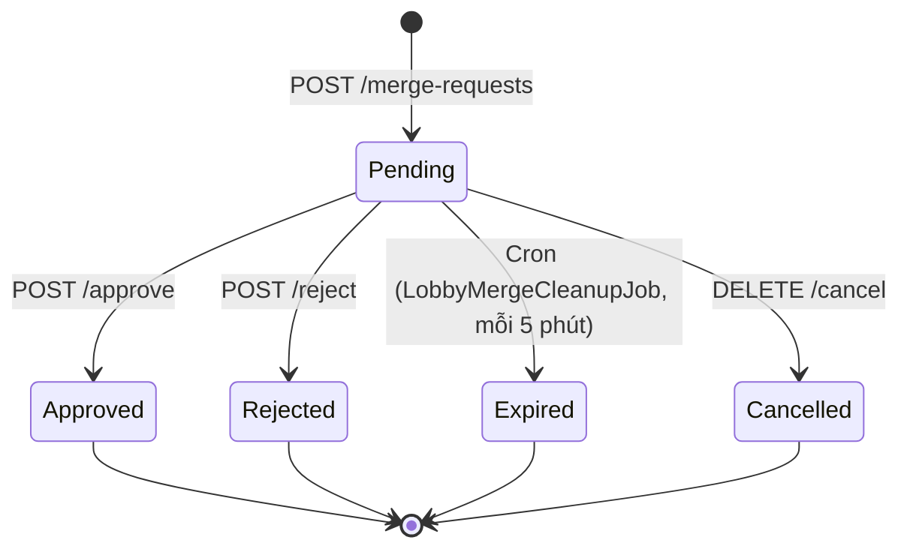

# LobbyMergeController

**Base route:** `/api/cafes/{cafeId}/lobby-merge`
**Controller:** `LobbyMergeController.cs`
**Role:** Manager, CafeStaff — phải thuộc quán đang vận hành (`IsManagerOrStaffAsync`)

Ghép nhóm lobby (Lobby Merge). Theo **Exception Path §4 — boardverse-business-context.mdc**.

**Kịch bản:** Nhóm A (A1, A2, A3, A4) đang chơi. A1, A2 về sớm. A3 muốn chuyển sang Nhóm B (đang active tại quán). Staff quét mã A3 → `POST /merge-requests` → duyệt → A3 được ghép vào Nhóm B.

> **Liên quan:**
> - [lobby.md](./lobby.md) — Lobby entity + SignalR events mới cho merge
> - [reservation.md](./reservation.md) — Reservation.IsAbsorbed + AbsorbedIntoReservationId
> - [active-session.md](./active-session.md) — ActiveSessionMember.OriginalLobbyId / OriginalReservationId
> - [cafe-pos.md](./cafe-pos.md) — POS workflow chuẩn

---

## Mục lục

- [Luồng nghiệp vụ](#luồng-nghiệp-vụ)
- [LobbyMergeRequest entity](#lobbymergerequest-entity)
- [LobbyMember.PreviousLobbyId](#lobbymemberpreviouslobbyid)
- [Reservation.IsAbsorbed fields](#reservationisabsorbed-fields)
- [ActiveSessionMember.OriginalLobbyId](#activesessionmemberoriginallobbyid)
- [REST Endpoints](#rest-endpoints)
- [SignalR events](#signalr-events)
- [State machine — merge request](#state-machine--merge-request)
- [Demo mode](#demo-mode)
- [Business rules áp dụng](#business-rules-áp-dụng)
- [Audit log](#audit-log)

---

## Luồng nghiệp vụ

```
1. Staff quét mã định danh của A3 tại POS
   → POST /api/cafes/{cafeId}/lobby-merge/merge-requests
     Body: { sourceLobbyId: <Nhóm A>, targetLobbyId: <Nhóm B> }

2. Backend tạo LobbyMergeRequest (status = Pending)
   → Kiểm tra:
     - Target lobby đang active (status = InProgress)
     - Chưa có request pending cho cùng (SourceLobbyId, TargetLobbyId)
     - A3 là member active của Nhóm A
     - Ghế khả dụng đủ (AvailableSeats >= sourceActiveMembers)

3. Staff duyệt:
   → POST /api/cafes/{cafeId}/lobby-merge/merge-requests/{requestId}/approve

4. Backend thực hiện atomic transaction:
   a. FOR UPDATE lock trên ActiveSession đích (BR-REQUIRED §17.4)
   b. Kiểm tra lịch chồng lấn member (BR-USER-LIMIT-02) + cap deposit (BR-USER-LIMIT-03)
   c. Nếu deposit Nguồn chưa captured → giải phóng BVC (DEPOSIT_RELEASE)
      Nếu deposit Nguồn đã captured → KHÔNG refund (no-show/forfeit đã xử lý)
   d. Chuyển A3 từ LobbyMember Nguồn → LobbyMember Đích
      (LobbyMember.PreviousLobbyId = Nhóm A)
   e. ActiveSessionMember.OriginalLobbyId = Nhóm A
   f. ActiveSessionMember.OriginalReservationId = Reservation Nguồn
   g. Nếu Nguồn không còn member nào → Reservation Nguồn.IsAbsorbed = true
      → AbsorbedIntoReservationId = Reservation Đích
   h. Broadcast SignalR: LobbyMergedInto (Nhóm B) + MemberJoinedFromMerge (Nhóm B)
   i. Insert LobbyMergeAuditLog

5. Staff từ chối:
   → POST /api/cafes/{cafeId}/lobby-merge/merge-requests/{requestId}/reject
   → Không thay đổi lobby/session/reservation
```

---

## LobbyMergeRequest entity

`BoardVerse.Core/Entities/LobbyMergeRequest.cs`

| Field | Type | Mô tả |
|---|---|---|
| `Id` | Guid | Mã yêu cầu ghép |
| `CafeId` | Guid | Cafe đang vận hành |
| `SourceLobbyId` | Guid | Lobby nguồn (Nhóm A) |
| `TargetLobbyId` | Guid | Lobby đích (Nhóm B) |
| `MemberUserId` | Guid | User muốn chuyển nhóm (A3) |
| `Status` | `LobbyMergeRequestStatus` enum | Pending / Approved / Rejected / Expired / Cancelled |
| `Reason` | string? | Lý do ghép (staff nhập) |
| `RequestedByUserId` | Guid | Staff tạo request |
| `ReviewedByUserId` | Guid? | Staff duyệt/từ chối |
| `ReviewNote` | string? | Ghi chú khi duyệt/từ chối |
| `IdempotencyKey` | string? | Key chống trùng |
| `CreatedAt` | DateTime | Thời điểm tạo |
| `ExpiresAt` | DateTime | Hết hạn (mặc định +24h) |

### Enum LobbyMergeRequestStatus

`BoardVerse.Core/Enum/LobbyMergeRequestStatus.cs`

| Value | Mô tả |
|---|---|
| `Pending` | Đang chờ duyệt |
| `Approved` | Đã duyệt, ghép nhóm thành công |
| `Rejected` | Bị từ chối bởi staff |
| `Expired` | Hết hạn (cron job) |
| `Cancelled` | Đã hủy bởi người tạo hoặc staff |

---

## LobbyMember.PreviousLobbyId

`BoardVerse.Core/Entities/LobbyMember.cs` — field mới được thêm.

| Field | Type | Mô tả |
|---|---|---|
| `PreviousLobbyId` | Guid? | Lobby nguồn mà member vừa rời đi do ghép nhóm |

Dùng để trace nguồn gốc member khi query lịch sử ghép. Khi member ghép thành công:
- `LobbyMember.LobbyId` = TargetLobbyId (Nhóm B)
- `LobbyMember.PreviousLobbyId` = SourceLobbyId (Nhóm A, nullable — null cho member bình thường không qua merge)

---

## Reservation.IsAbsorbed fields

`BoardVerse.Core/Entities/Reservation.cs` — fields mới được thêm.

| Field | Type | Mô tả |
|---|---|---|
| `IsAbsorbed` | bool | True khi reservation bị hấp thu vào reservation khác (nghĩa là không còn active) |
| `AbsorbedIntoReservationId` | Guid? | Reservation đích đã hấp thu reservation này |
| `AbsorbedAt` | DateTime? | Thời điểm bị hấp thu |

**Khi nào được set:**
- Khi Nguồn không còn member nào sau merge → `Reservation.IsAbsorbed = true`
- `AbsorbedIntoReservationId` = Reservation Đích
- Reservation Nguồn không bị xóa — vẫn tồn tại trong DB để phục vụ audit trail + Karma history

---

## ActiveSessionMember.OriginalLobbyId

`BoardVerse.Core/Entities/ActiveSessionMember.cs` — fields mới được thêm.

| Field | Type | Mô tả |
|---|---|---|
| `OriginalLobbyId` | Guid? | Lobby gốc mà member tham gia trước khi ghép |
| `OriginalReservationId` | Guid? | Reservation gốc trước khi bị absorb |

Dùng để:
- Trace nguồn gốc member trong session đích
- Karma aggregation đúng cho trường hợp member ghép nhóm (BR-REFUND-05)

---

## REST Endpoints

| Endpoint | Method | Mô tả | Auth |
|---|---|---|---|
| `/merge-requests` | POST | Tạo yêu cầu ghép nhóm | Manager, CafeStaff |
| `/merge-requests/{requestId}` | GET | Lấy chi tiết một request | Manager, CafeStaff |
| `/merge-requests/pending` | GET | Danh sách request đang chờ | Manager, CafeStaff |
| `/merge-requests/{requestId}/approve` | POST | Duyệt — thực hiện ghép | Manager, CafeStaff |
| `/merge-requests/{requestId}/reject` | POST | Từ chối request | Manager, CafeStaff |
| `/lobbies/{lobbyId}/merge-history` | GET | Lịch sử ghép nhóm (audit log) | Manager, CafeStaff |
| `/lobbies/{lobbyId}/merge-requests` | GET | Tất cả request của một lobby | Manager, CafeStaff |
| `/merge-requests/{requestId}` | DELETE | Hủy request (chỉ Pending) | Manager, CafeStaff |

---

## POST /api/cafes/{cafeId}/lobby-merge/merge-requests

Tạo yêu cầu ghép nhóm. Staff POS gọi khi scan mã member A3 muốn nhập vào Nhóm B đang active.

**Role:** Manager, CafeStaff — phải thuộc quán `cafeId`.

**Demo mode:** `X-Bypass-Demo-Locks: true` header hoặc `?bypassDemoLocks=true` bỏ qua BR-USER-LIMIT-02/03 khi approve.

### Request

```json
{
  "sourceLobbyId": "guid-nhom-a",
  "targetLobbyId": "guid-nhom-b",
  "reason": "Khách muốn chuyển sang nhóm bạn",
  "idempotencyKey": "MERGE-a3-user-id-1234567890"
}
```

| Field | Type | Required | Mô tả |
|---|---|---|---|
| `sourceLobbyId` | Guid | ✅ | Lobby nguồn — nhóm mà member muốn rời (Nhóm A) |
| `targetLobbyId` | Guid | ✅ | Lobby đích — nhóm đang active tại quán (Nhóm B) |
| `reason` | string | ❌ | Lý do ghép (max 500 ký tự) |
| `idempotencyKey` | string | ❌ | Key chống trùng (format đề xuất: `MERGE-{memberId}-{timestampMs}`) |

### Validation

- Staff phải thuộc quán `cafeId`
- `sourceLobbyId` và `targetLobbyId` phải thuộc cùng `cafeId`
- `targetLobbyId` phải đang `InProgress` (active session)
- `sourceLobbyId` phải đang `InProgress` (member đang chơi tại quán)
- Chưa có `Pending` request nào cho cùng `(sourceLobbyId, targetLobbyId)`
- Ghế khả dụng đủ cho các member đang active ở Nguồn
- Member muốn ghép phải là `IsActive = true` trong Nguồn

### Response 201

```json
{
  "statusCode": 201,
  "message": "Tạo yêu cầu ghép nhóm thành công!",
  "data": {
    "id": "guid-request",
    "sourceLobbyId": "guid-nhom-a",
    "targetLobbyId": "guid-nhom-b",
    "sourceLobbyName": "Nhóm A",
    "targetLobbyName": "Nhóm B",
    "requestedByUserId": "staff-user-id",
    "requestedByUserName": "Nguyen Van Staff",
    "status": "Pending",
    "statusText": "Đang chờ duyệt",
    "sourceMembersCount": 2,
    "sourceActiveMembersAtRequest": 2,
    "reason": "Khách muốn chuyển sang nhóm bạn",
    "expiresAt": "2026-09-24T11:30:00Z",
    "combinedCount": 6,
    "seatCapacity": 8,
    "fitsCapacity": true,
    "createdAt": "2026-09-23T11:30:00Z"
  }
}
```

### Lỗi

| Code | Khi nào | Message |
|---|---|---|
| `400` | Dữ liệu không hợp lệ | `ValidationFailed` |
| `401` | Thiếu token | `Unauthorized` |
| `403` | Không thuộc quán | `AccessForbidden` |
| `404` | Lobby không tồn tại | `LobbyNotFound` |
| `409` | Lobby đích không active | `TargetLobbyNotActive` |
| `409` | Đã có request pending | `MergeRequestAlreadyExists` |
| `409` | Không đủ ghế | `InsufficientSeatsForMerge` |
| `500` | Lỗi hệ thống | `InternalServerError` |

---

## POST /api/cafes/{cafeId}/lobby-merge/merge-requests/{requestId}/approve

Duyệt yêu cầu ghép nhóm — thực hiện atomic trong transaction.

**Role:** Manager, CafeStaff — phải thuộc quán `cafeId`.

**BR-REQUIRED §17.4:** FOR UPDATE lock trên `ActiveSession` đích để tránh race condition.

**Demo mode:** `X-Bypass-Demo-Locks: true` header hoặc `?bypassDemoLocks=true` bỏ qua BR-USER-LIMIT-02/03.

### Request

```json
{
  "reviewNote": "Đã xác nhận đủ chỗ, cho ghép"
}
```

| Field | Type | Required | Mô tả |
|---|---|---|---|
| `reviewNote` | string | ❌ | Ghi chú của staff khi duyệt (max 500 ký tự) |

### Response 200

```json
{
  "statusCode": 200,
  "message": "Ghép nhóm thành công!",
  "data": {
    "mergeRequestId": "guid-request",
    "sourceLobbyId": "guid-nhom-a",
    "targetLobbyId": "guid-nhom-b",
    "membersTransferred": 1,
    "targetActiveSessionId": "guid-session-nhom-b",
    "idempotencyKey": null
  }
}
```

### Validation tại Approve

1. Request phải ở status `Pending`
2. Request chưa hết hạn (`ExpiresAt > now`)
3. Target lobby phải đang `InProgress` (vẫn active)
4. Available seats >= số member active ở Nguồn
5. BR-USER-LIMIT-02: Kiểm tra lịch chồng lấn của member với reservation khác
6. BR-USER-LIMIT-03: Kiểm tra cap tổng `heldBalance` của member
7. Deposit Nguồn chưa captured → giải phóng BVC (DEPOSIT_RELEASE); đã captured → không refund

### Lỗi

| Code | Khi nào | Message |
|---|---|---|
| `400` | Dữ liệu không hợp lệ | `ValidationFailed` |
| `401` | Thiếu token | `Unauthorized` |
| `403` | Không thuộc quán | `AccessForbidden` |
| `404` | Request không tồn tại | `MergeRequestNotFound` |
| `409` | Request không còn Pending | `MergeRequestNotPending` |
| `409` | Request đã hết hạn | `MergeRequestExpired` |
| `409` | Lobby đích không còn active | `TargetLobbyNoLongerActive` |
| `409` | Không đủ ghế | `InsufficientSeatsForMerge` |
| `409` | Lịch chồng lấn | `UserScheduleOverlap` |
| `409` | Cap deposit vượt | `UserDepositCapExceeded` |
| `409` | Deposit đã captured | `SourceDepositAlreadyCaptured` |
| `500` | Lỗi hệ thống | `InternalServerError` |

---

## POST /api/cafes/{cafeId}/lobby-merge/merge-requests/{requestId}/reject

Từ chối yêu cầu ghép nhóm. Không thay đổi lobby/session/reservation.

**Role:** Manager, CafeStaff — phải thuộc quán `cafeId`.

### Request

```json
{
  "reviewNote": "Không đủ chỗ tại Nhóm B"
}
```

### Response 200

```json
{
  "statusCode": 200,
  "message": "Đã từ chối yêu cầu ghép nhóm.",
  "data": {
    "mergeRequestId": "guid",
    "status": "Rejected",
    "reviewedByUserName": "Nguyen Van Staff",
    "reviewedAt": "2026-09-23T11:45:00Z",
    "reviewNote": "Không đủ chỗ tại Nhóm B"
  }
}
```

### Lỗi

| Code | Khi nào |
|---|---|---|
| `401` | Thiếu token |
| `403` | Không thuộc quán |
| `404` | Request không tồn tại |
| `409` | Request không còn Pending |
| `500` | Lỗi hệ thống |

---

## GET /api/cafes/{cafeId}/lobby-merge/merge-requests/pending

Danh sách tất cả yêu cầu ghép nhóm đang chờ (status = Pending) của một quán.

**Role:** Manager, CafeStaff

### Response 200

```json
{
  "statusCode": 200,
  "message": "OK",
  "data": [
    {
      "id": "guid-request-1",
      "sourceLobbyId": "guid-nhom-a",
      "targetLobbyId": "guid-nhom-b",
      "sourceLobbyName": "Nhóm A",
      "targetLobbyName": "Nhóm B",
      "requestedByUserId": "staff-id",
      "requestedByUserName": "Nguyen Van Staff",
      "status": "Pending",
      "statusText": "Đang chờ duyệt",
      "sourceMembersCount": 2,
      "sourceActiveMembersAtRequest": 2,
      "reason": null,
      "expiresAt": "2026-09-24T11:30:00Z",
      "combinedCount": 6,
      "seatCapacity": 8,
      "fitsCapacity": true,
      "createdAt": "2026-09-23T11:30:00Z"
    }
  ]
}
```

---

## GET /api/cafes/{cafeId}/lobby-merge/lobbies/{lobbyId}/merge-history

Lấy lịch sử ghép nhóm (audit log) của một lobby. Bao gồm các action: `MergeRequested`, `MergeApproved`, `MergeRejected`, `MemberTransferred`, `SourceLobbyDissolved`.

**Role:** Manager, CafeStaff

### Response 200

```json
{
  "statusCode": 200,
  "message": "OK",
  "data": [
    {
      "id": "guid-log-1",
      "mergeRequestId": "guid-request",
      "sourceLobbyId": "guid-nhom-a",
      "targetLobbyId": "guid-nhom-b",
      "performedByUserId": "staff-id",
      "performedByUserName": "Nguyen Van Staff",
      "action": "MergeApproved",
      "metadata": "{ \"memberIds\": [\"a3-user-id\"], \"depositRefunded\": true }",
      "success": true,
      "errorMessage": null,
      "createdAt": "2026-09-23T11:45:00Z"
    }
  ]
}
```

---

## GET /api/cafes/{cafeId}/lobby-merge/lobbies/{lobbyId}/merge-requests

Lấy tất cả yêu cầu ghép nhóm của một lobby (bất kể trạng thái).

**Role:** Manager, CafeStaff

### Response 200

Danh sách `LobbyMergeRequestDto[]` — bao gồm Pending, Approved, Rejected, Expired, Cancelled.

---

## DELETE /api/cafes/{cafeId}/lobby-merge/merge-requests/{requestId}

Hủy yêu cầu ghép nhóm. Chỉ hủy được khi status = Pending.

**Role:** Manager, CafeStaff

### Response 200

```json
{
  "statusCode": 200,
  "message": "Đã hủy yêu cầu ghép nhóm.",
  "data": {
    "mergeRequestId": "guid",
    "status": "Cancelled"
  }
}
```

### Lỗi

| Code | Khi nào |
|---|---|---|
| `401` | Thiếu token |
| `403` | Không thuộc quán |
| `404` | Request không tồn tại |
| `409` | Request không còn Pending |
| `500` | Lỗi hệ thống |

---

## SignalR events

LobbyHub phát các events mới cho merge:

| Event | Payload | Trigger |
|---|---|---|
| `LobbyMergedInto` | `{ LobbyId, MergedFromLobbyId, MergedMemberUserId, MergedMemberName, Timestamp }` | Member ghép thành công vào lobby đích |
| `MemberJoinedFromMerge` | `{ LobbyId, Member: LobbyMemberDto, Timestamp }` | Member xuất hiện trong lobby đích sau merge (để client refresh danh sách) |

---

## State machine — merge request



---

## Demo mode

Bật qua HTTP header `X-Bypass-Demo-Locks: true` hoặc query `?bypassDemoLocks=true` trên môi trường testing.

Khi bật, các ràng buộc sau được bypass khi **approve merge**:

| BR gốc | Hành vi demo |
|---|---|
| BR-USER-LIMIT-02 | Bỏ qua kiểm tra lịch chồng lấn member |
| BR-USER-LIMIT-03 | Bỏ qua kiểm tra cap tổng heldBalance |

Xem chi tiết: [lobby.md](./lobby.md#demo-mode-bypass-lobby-constraints).

---

## Business rules áp dụng

| BR | Áp dụng |
|---|---|
| **BR-REQUIRED §17.4** | FOR UPDATE lock trên ActiveSession đích, atomic transaction |
| **BR-USER-LIMIT-02** | Kiểm tra lịch chồng lấn member với reservation khác (+30 phút buffer) |
| **BR-USER-LIMIT-03** | Cap tổng heldBalance member không vượt giới hạn |
| **BR-REFUND-01/02** | Deposit Nguồn chưa captured → giải phóng BVC (DEPOSIT_RELEASE); đã captured → không refund |
| **BR-REFUND-05** | Member về sớm sau khi ghép → tính playedRatio từ `CheckedInAt` gốc |
| **BR-NEW-10 (cooling-off)** | Không áp dụng trong luồng merge tại quán |

---

## Audit log

Tất cả thao tác merge được ghi vào `LobbyMergeAuditLog` (append-only):

| Field | Mô tả |
|---|---|
| `Id` | Mã audit log |
| `MergeRequestId` | Yêu cầu ghép liên quan |
| `SourceLobbyId` | Lobby nguồn |
| `TargetLobbyId` | Lobby đích |
| `SourceReservationId` | Reservation nguồn |
| `TargetReservationId` | Reservation đích |
| `SourceActiveSessionId` | Active session nguồn |
| `TargetActiveSessionId` | Active session đích |
| `PerformedByUserId` | Staff/user thực hiện |
| `Action` | `MergeRequested`, `MergeApproved`, `MergeRejected`, `MergeExpired`, `MemberTransferred`, `ReservationAbsorbed` |
| `Metadata` | JSON: `{ "memberIds": [...], "depositRefunded": true/false }` |
| `Success` | Thành công hay thất bại |
| `ErrorMessage` | Lỗi chi tiết nếu thất bại |
| `CreatedAt` | Thời điểm thực hiện |

Background job `LobbyMergeCleanupJob` chạy mỗi **5 phút**, đánh `Expired` các request Pending đã quá `ExpiresAt`.
