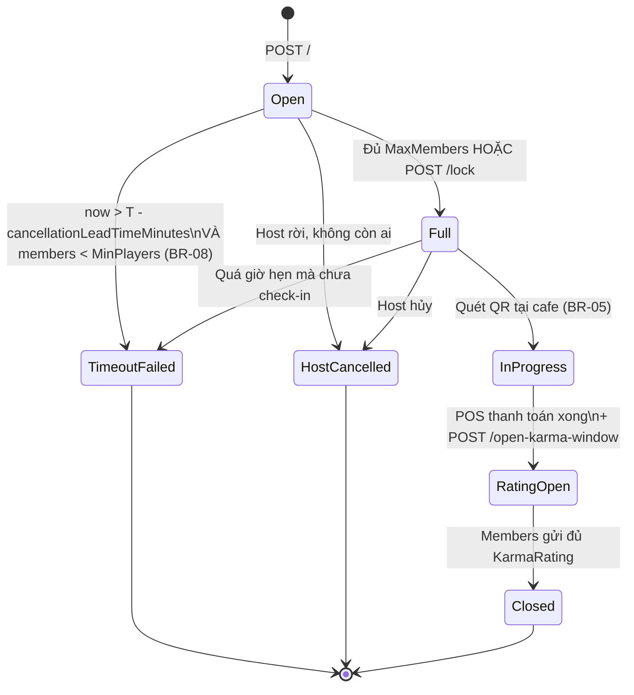

# LobbyController

**Base route:** `/api/v1/lobbies`  
**Controller:** `LobbyController.cs`  
**Hub route:** `/hubs/lobby` (SignalR)  
**Role:** Player — đã đăng nhập (JWT bearer)

API phòng chờ trực tuyến: tạo phòng, tham gia, rời phòng, tìm phòng theo game, đóng phòng, khóa phòng để bắt đầu ghép đội và mở cửa sổ đánh giá Karma sau khi POS thanh toán xong.

Tuân thủ business rules:
- **BR-07:** `MaxMembers <= SeatCount` của booking liên kết
- **BR-08:** Lobby timeout nếu trước giờ hẹn mà chưa đủ `MinPlayers`
- **BR-10:** Member filter theo Karma (không theo Elo)

## Mục lục

- [REST Endpoints](#rest-endpoints)
- [SignalR Hub](#signalr-hub)
- [Luồng tích hợp](#luồng-tích-hợp)
- [State machine](#state-machine)

---

## REST Endpoints

| Endpoint | Method | Mô tả | Auth |
|----------|--------|--------|------|
| `/` | POST | Tạo phòng chờ mới | Player |
| `/{lobbyId}/join` | POST | Tham gia phòng chờ | Player |
| `/{lobbyId}/leave` | POST | Rời phòng chờ | Player |
| `/{lobbyId}` | GET | Tra cứu chi tiết phòng | Player |
| `/search` | POST | Tìm phòng theo tựa game + location + Karma | Player |
| `/{lobbyId}/close` | POST | Đóng phòng (Host only) | Host |
| `/{lobbyId}/lock` | POST | Khóa phòng để ghép đội (Host only) | Host |
| `/{lobbyId}/open-karma-window` | POST | Mở cửa sổ đánh giá Karma sau thanh toán (Host only) | Host |

> **Auth:** Tất cả endpoints yêu cầu `Authorization: Bearer <jwt>`. Token lấy từ `/api/v1/auth/login`.

---

## POST /api/v1/lobbies

Tạo phòng chờ. Host đặt giờ chơi, tựa game và sức chứa tối đa.

**Role:** Player

**Body mẫu:**

```json
{
  "gameTemplateId": "catan-uuid",
  "scheduledStartTime": "2026-07-10T19:00:00Z",
  "maxMembers": 4,
  "cancellationLeadTimeMinutes": 30
}
```

| Field | Required | Description |
|-------|----------|-------------|
| `gameTemplateId` | ✅ | UUID tựa game muốn chơi |
| `scheduledStartTime` | ✅ | ISO 8601 UTC, phải > now + 30 phút |
| `maxMembers` | ✅ | 2-4 (theo luật Splendor/Catan) |
| `cancellationLeadTimeMinutes` | ✅ | Timeout trước giờ hẹn (BR-08, mặc định 30) |

**Response 201:** `LobbyResponseDto` — `status = Open`, danh sách thành viên chỉ có Host.

**Response codes:**
- `201` — Tạo thành công
- `400` — Thiếu field, maxMembers ngoài [2,4], thời gian không hợp lệ
- `401` — Thiếu token / token hết hạn
- `404` — Không tìm thấy game
- `500` — Lỗi hệ thống

**Side effect:** Broadcast SignalR `MemberJoined` cho Host (xem [SignalR Hub](#signalr-hub)).

---

## POST /api/v1/lobbies/{lobbyId}/join

Tham gia phòng chờ. Hệ thống kiểm tra:
- `MaxMembers` chưa đầy (BR-07)
- Nếu lobby đã có `bookingId` liên kết → kiểm tra `Booking.SeatCount`
- Filter Karma theo `minKarmaScore` của lobby (BR-10)

**Role:** Player

**Response 200:** `LobbyResponseDto` cập nhật danh sách thành viên.

**Response codes:**
- `200` — Join thành công
- `401` — Thiếu token
- `404` — Không tìm thấy phòng chờ
- `409` — Phòng đã đầy / đã tham gia / không đủ Karma
- `500` — Lỗi hệ thống

**Side effect:**
- Broadcast SignalR `MemberJoined` cho cả lobby
- Nếu vừa đủ → broadcast `LobbyFull`

---

## POST /api/v1/lobbies/{lobbyId}/leave

Rời phòng chờ.

- **Member rời:** cập nhật danh sách, status giữ nguyên
- **Host rời:** phòng chuyển `HOST_CANCELLED`, broadcast `LobbyCancelled`

**Role:** Player

**Response 200:** `LobbyResponseDto`.

**Response codes:**
- `200` — Rời thành công
- `401` — Thiếu token
- `404` — Không tìm thấy phòng
- `500` — Lỗi hệ thống

---

## GET /api/v1/lobbies/{lobbyId}

Tra cứu chi tiết phòng: thông tin, danh sách members, booking liên kết (nếu có), `ratingOpenedAt`.

**Role:** Player

**Response 200:** `LobbyResponseDto`.

**Response codes:**
- `200` — Trả về thông tin lobby
- `401` — Thiếu token
- `404` — Không tìm thấy phòng
- `500` — Lỗi hệ thống

---

## POST /api/v1/lobbies/search

Tìm phòng chờ đang mở theo tựa game + location + Karma filter (BR-10).

**Role:** Player

**Body mẫu:**

```json
{
  "gameTemplateId": "catan-uuid",
  "latitude": 10.776889,
  "longitude": 106.700806,
  "radiusKm": 5,
  "minKarmaScore": 80
}
```

| Field | Required | Description |
|-------|----------|-------------|
| `gameTemplateId` | ✅ | UUID tựa game |
| `latitude` | ❌ | Vĩ độ (location-based) |
| `longitude` | ❌ | Kinh độ |
| `radiusKm` | ❌ | Bán kính tìm kiếm (km) |
| `minKarmaScore` | ❌ | Karma tối thiểu (BR-10, mặc định 0) |

**Response 200:** danh sách `LobbyResponseDto`.

**Response codes:**
- `200` — Trả về danh sách (có thể rỗng)
- `400` — Thiếu `gameTemplateId`
- `401` — Thiếu token
- `500` — Lỗi hệ thống

---

## POST /api/v1/lobbies/{lobbyId}/close

Đóng phòng chờ thủ công (host muốn giải tán trước giờ).

**Role:** Player — chỉ Host

**Response 200:** `LobbyResponseDto` — `status = Closed`.

**Response codes:**
- `200` — Đóng thành công
- `401` — Thiếu token
- `403` — Không phải Host
- `404` — Không tìm thấy phòng
- `500` — Lỗi hệ thống

---

## POST /api/v1/lobbies/{lobbyId}/lock

Khóa phòng để chuyển sang booking flow. Chỉ Host. Chuyển `OPEN → FULL`.

**Role:** Player — chỉ Host

**Response 200:** `LobbyResponseDto` — `status = Full`.

**Response codes:**
- `200` — Khóa thành công
- `401` — Thiếu token
- `403` — Không phải Host
- `404` — Không tìm thấy phòng
- `409` — Phòng không ở trạng thái `Open`
- `500` — Lỗi hệ thống

**Side effect:** Broadcast SignalR `LobbyFull` cho toàn bộ members.

---

## POST /api/v1/lobbies/{lobbyId}/open-karma-window

Mở cửa sổ đánh giá Karma sau khi phiên chơi kết thúc và POS thanh toán xong. Chỉ Host.

Sau khi mở, status chuyển sang `RatingOpen` và members có thể gửi KarmaRating qua `/api/v1/karma-ratings`.

**Role:** Player — chỉ Host

**Response 200:** `LobbyResponseDto` — `ratingOpenedAt` được cập nhật.

**Response codes:**
- `200` — Mở cửa sổ thành công
- `401` — Thiếu token
- `403` — Không phải Host
- `404` — Không tìm thấy phòng
- `500` — Lỗi hệ thống

---

## SignalR Hub

Lobby sử dụng **SignalR** (WebSocket-first, fallback Server-Sent Events / Long Polling) để đẩy real-time updates tới tất cả client đang mở app.

### Connection

```
WebSocket URL: wss://api.boardverse.vn/hubs/lobby?access_token=<jwt>
```

SignalR tự negotiate: client gọi `POST /hubs/lobby/negotiate?access_token=<jwt>` để lấy connection token, sau đó upgrade lên WebSocket.

**Auth:** Hub có `[Authorize]` — yêu cầu JWT hợp lệ trong query string `access_token`.

### Client → Server methods

| Method | Param | Mục đích |
|--------|-------|---------|
| `JoinLobby(lobbyId)` | `Guid` | Subscribe vào group của lobby |
| `LeaveLobby(lobbyId)` | `Guid` | Unsubscribe |
| `SubscribeNearbyLobbies(latitude, longitude, radiusKm)` | `double, double, double` | Subscribe group `nearby:{lat:F2}:{lng:F2}:{radius}` cho location-based broadcast |

### Server → Client events

| Event | Payload | Trigger | BR |
|-------|---------|---------|-----|
| `MemberJoined` | `{ LobbyId, Member: LobbyMemberDto, Timestamp }` | User mới join lobby | BR-07, BR-10 |
| `MemberLeft` | `{ LobbyId, MemberId, Timestamp }` | User rời lobby | — |
| `LobbyFull` | `{ LobbyId, Message, Timestamp }` | Đủ MaxMembers / Host khóa | BR-07 |
| `LobbyCancelled` | `{ LobbyId, Reason, Timestamp }` | Host hủy lobby | — |
| `LobbyTimeout` | `{ LobbyId, Message, Timestamp }` | Timeout do thiếu người | BR-08 |
| `BookingConfirmed` | `{ LobbyId, BookingId, Message, Timestamp }` | Booking cọc thành công → chuyển sang cafe | BR-05 |

### Client subscribe flow

```javascript
// 1. Connect
const connection = new signalR.HubConnectionBuilder()
    .withUrl("/hubs/lobby", { accessTokenFactory: () => getJwt() })
    .withAutomaticReconnect()
    .build();

// 2. Register handlers
connection.on("MemberJoined", (e) => refreshLobbyMembers(e.Member));
connection.on("MemberLeft", (e) => removeMember(e.MemberId));
connection.on("LobbyFull", (e) => navigateToBooking(e.LobbyId));
connection.on("LobbyTimeout", (e) => showTimeoutMessage());
connection.on("BookingConfirmed", (e) => navigateToCafeCheckIn(e.BookingId));

// 3. Start
await connection.start();

// 4. Subscribe lobby
await connection.invoke("JoinLobby", lobbyId);
```

### Group management

- Mỗi lobby = 1 SignalR group theo `lobbyId.ToString()`
- Client phải gọi `JoinLobby(lobbyId)` SAU khi connect thành công
- Trước khi navigate away → gọi `LeaveLobby(lobbyId)` để cleanup
- `withAutomaticReconnect()` tự re-subscribe vào các groups sau reconnect

---

## Luồng tích hợp

### Happy path: ghép đội → đặt cọc

1. Host tạo lobby → `Open`. App subscribe `JoinLobby(lobbyId)`.
2. Members `POST /search` để tìm lobby → `POST /join`.
3. Server broadcast `MemberJoined` real-time → tất cả app refresh UI.
4. Khi đủ `MaxMembers` (hoặc Host gọi `/lock`) → `Full`.
5. Server broadcast `LobbyFull` → app tự navigate sang đặt cọc flow.
6. Host thanh toán cọc thành công (qua `/api/v1/payments/booking-deposit`).
7. Webhook payment success → server broadcast `BookingConfirmed` cho lobby.
8. Nhóm đến cafe quét QR check-in → status chuyển `InProgress`.
9. POS thanh toán xong → Host gọi `/open-karma-window` → status `RatingOpen`.
10. Members gửi KarmaRating → lobby `Closed`.

### Exception path: timeout (BR-08)

1. Lobby `Open`, giờ hẹn = T.
2. Background job check mỗi 5 phút: nếu `now > T - cancellationLeadTimeMinutes` VÀ `Members.Count < MinPlayers` → chuyển `TimeoutFailed`.
3. Server broadcast `LobbyTimeout` cho toàn bộ members.
4. App hiển thị thông báo + cleanup UI.

### Exception path: Host rời

1. Host gọi `/leave` (hoặc app disconnect đột ngột).
2. Nếu lobby còn members khác → chọn member tiếp theo làm Host (theo `JoinedAt asc`).
3. Nếu không còn ai → status `HostCancelled`.
4. Broadcast `LobbyCancelled` với reason phù hợp.

---

## State machine



| State | Description | BR |
|-------|-------------|-----|
| `Open` | Lobby mới tạo, đang tuyển thành viên | BR-08 |
| `Full` | Đủ người, sẵn sàng đặt cọc | BR-07 |
| `InProgress` | Nhóm đang chơi tại cafe | — |
| `RatingOpen` | Sau thanh toán, đang đánh giá Karma | — |
| `Closed` | Hoàn tất | — |
| `TimeoutFailed` | Hết hạn không đủ người | BR-08 |
| `HostCancelled` | Host hủy | — |

---

## Ví dụ tích hợp end-to-end

```javascript
// === Mobile app: Host flow ===

// 1. Create lobby
const lobby = await api.post("/api/v1/lobbies", {
    gameTemplateId: "catan-uuid",
    scheduledStartTime: "2026-07-10T19:00:00Z",
    maxMembers: 4,
    cancellationLeadTimeMinutes: 30
});

// 2. Connect SignalR + subscribe
const connection = new signalR.HubConnectionBuilder()
    .withUrl("/hubs/lobby", { accessTokenFactory: () => jwt })
    .build();

connection.on("MemberJoined", (e) => addToMemberList(e.Member));
connection.on("MemberLeft", (e) => removeFromList(e.MemberId));
connection.on("LobbyFull", async (e) => {
    // 3. Auto-navigate to deposit
    navigateToDepositScreen(e.LobbyId);
});

await connection.start();
await connection.invoke("JoinLobby", lobby.id);

// 4. (UI updates as members join via real-time events)

// 5. After deposit success, server broadcasts BookingConfirmed → app navigates to cafe
```