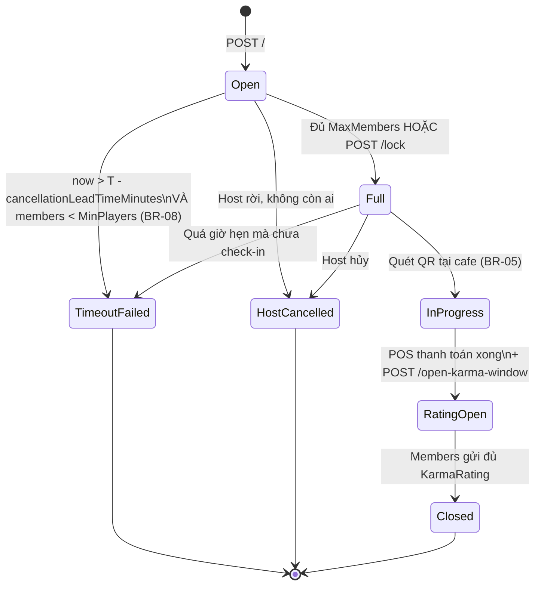

# LobbyController

**Base route:** `/api/v1/lobbies`
**Controller:** `LobbyController.cs`
**Hub route:** `/hubs/lobby` (SignalR)
**Role:** Player — đã đăng nhập (JWT bearer)

API phòng chờ trực tuyến: tạo phòng, tham gia, rời phòng, tìm phòng theo game, đóng phòng, khóa phòng để bắt đầu ghép đội và mở cửa sổ đánh giá Karma sau khi POS thanh toán xong.

> **🔗 Related docs:**
> - [reservation.md](./reservation.md) — API tạo lobby atomic qua `POST /api/v1/reservations/confirm`
> - [../time-slot-fixed-end-design.md](../time-slot-fixed-end-design.md) — Time-slot + fixed-end design (FE-facing v2.0)
> - [lobby-invite.md](./lobby-invite.md) — Invite + share code
> - [friend.md](./friend.md) — Friend system (cho invite private lobby)

> **⚠️ DEPRECATION NOTICE — Phase 2 (BR §XXI-B.1)**
>
> - `POST /api/v1/lobbies` (CreateLobby) **đã deprecated** trả về `410 Gone`.
> - Tạo lobby phải qua flow mới: `POST /api/v1/reservations/quote` → `POST /api/v1/reservations/confirm` (xem `docs/api/reservation.md`).
> - Lobby hiện chỉ được tạo bởi `ReservationService.ConfirmAsync` (atomic transaction BR-REQUIRED §17.4).
> - Toàn bộ endpoint khác (join, leave, search, cancel, transfer-host, kick, ready, messages…) vẫn hoạt động bình thường.

Tuân thủ business rules:
- **BR-07:** `MaxMembers <= SeatCount` của booking liên kết
- **BR-08:** Lobby timeout nếu trước giờ hẹn mà chưa đủ `MinPlayers`
- **BR-10:** Member filter theo Karma (không theo Elo)

## Mục lục

- [REST Endpoints](#rest-endpoints)
- [SignalR Hub](#signalr-hub)
- [Luồng tích hợp](#luồng-tích-hợp)
- [State machine](#state-machine)

---

## REST Endpoints

## Visibility — Public vs Private lobby

| Trường | Public (mặc định) | Private |
|--------|-------------------|---------|
| `IsPrivate` | `false` | `true` |
| Hiện trong `/search` | ✅ | ❌ |
| Join qua `/search` + `/{id}/join` | ✅ | ❌ |
| Join qua share code (`/join-by-code`) | ✅ | ✅ |
| Join qua invite (`/invites/.../accept`) | ✅ | ✅ |
| Host gửi invite cho bạn bè | ✅ | ✅ |

> Lobby response luôn trả về `lobbyId` (Guid) và `shareCode` (8 ký tự). Thành viên dùng `GET /{lobbyId}/share-info` để lấy mã copy &amp; share.

## Luồng mời bạn vào lobby

```
1. Player A tạo lobby: POST /api/v1/lobbies (IsPrivate = false/true)
   → Response có lobbyId + shareCode

2a. Mời qua friend list (recommended cho private lobby):
    - Player A mời Player B làm bạn: POST /api/v1/friends/requests
    - Player B accept: POST /api/v1/friends/requests/{id}/accept
    - Player A gửi lobby invite: POST /api/v1/lobbies/{lobbyId}/invites
       Body: { inviteeId: "<Player B id>" }
    - Player B accept invite: POST /api/v1/lobbies/invites/{inviteId}/accept
      → Tự động join lobby

2b. Share code (nhanh cho cả public/private):
    - Player A copy shareCode: GET /api/v1/lobbies/{lobbyId}/share-info
    - Gửi qua Messenger / Zalo
    - Player B vào app → POST /api/v1/lobbies/join-by-code
       Body: { shareCode: "K7H3NP9X" }
    → Đã join lobby
```

Xem chi tiết API:
- Friend: [friend.md](./friend.md)
- Lobby invite + share code: [lobby-invite.md](./lobby-invite.md)

---

## REST Endpoints

| Endpoint | Method | Mô tả | Auth |
|----------|--------|--------|------|
| `/` | POST | Tạo phòng chờ mới | Player |
| `/{lobbyId}/join` | POST | Tham gia phòng chờ | Player |
| `/{lobbyId}/leave` | POST | Rời phòng chờ | Player |
| `/{lobbyId}` | GET | Tra cứu chi tiết phòng | Player |
| `/search` | POST | Tìm phòng theo tựa game + location + Karma | Player |
| `/{lobbyId}/close` | POST | Đóng phòng — chuyển status Closed (Host only) | Host |
| `/{lobbyId}` | DELETE | Giải tán lobby — hard delete (Host only) | Host |
| `/{lobbyId}/lock` | POST | Khóa phòng để ghép đội (Host only) | Host |
| `/{lobbyId}/open-karma-window` | POST | Mở cửa sổ đánh giá Karma sau thanh toán (Host only) | Host |
| `/{lobbyId}/invites` | POST | Gửi lời mời tham gia lobby | Member |
| `/invites/{inviteId}/accept` | POST | Accept lời mời (tự động join) | Invitee |
| `/invites/{inviteId}/decline` | POST | Từ chối lời mời | Invitee |
| `/invites/{inviteId}` | DELETE | Hủy lời mời đã gửi | Inviter |
| `/invites/me/pending` | GET | Inbox: lời mời lobby đang chờ | Player |
| `/invites/me?status=` | GET | Tất cả lời mời lobby (filter) | Player |
| `/{lobbyId}/share-info` | GET | Lấy Lobby ID + Share Code để copy | Member |
| `/join-by-code` | POST | Join lobby bằng share code | Player |
| `/discoverable` | GET | Browse lobby public đang mở (filter optional geo + game) | Player |
| `/hosted` | GET | Lobby do user đang host | Player |
| `/joined` | GET | Lobby user đang tham gia làm member | Player |
| `/{lobbyId}` | PATCH | Host cập nhật thông tin lobby (description, maxMembers, isPrivate, minKarmaScore, ...) | Host |
| `/{lobbyId}/transfer-host` | POST | Host chuyển quyền host cho member khác | Host |
| `/{lobbyId}/kick` | POST | Host kick thành viên khỏi lobby | Host |
| `/{lobbyId}/ready` | POST | Member bấm Ready/Unready (cho phép ở Open/Full/Viable; auto InProgress khi tất cả Ready; timeout 20p không Ready sau khi Full) | Player |
| `/{lobbyId}/report` | POST | Báo cáo lobby vi phạm | Player |
| `/{lobbyId}/messages` | POST | Gửi tin nhắn chat trong lobby | Host hoặc active member |
| `/{lobbyId}/messages` | GET | Lấy lịch sử chat (cursor pagination) | Host hoặc active member |

> **Auth:** Tất cả endpoints yêu cầu `Authorization: Bearer <jwt>`. Token lấy từ `/api/v1/auth/login`.

---

## POST /api/v1/lobbies

> **⛔ DEPRECATED — trả 410 Gone.** Dùng [`POST /api/v1/reservations/quote` + `POST /api/v1/reservations/confirm`](reservation.md) thay thế. BR §XXI-B.1 yêu cầu lobby chỉ được tạo thông qua atomic transaction BVC + seat + game copy.

Tạo phòng chờ. Host đặt giờ chơi, tựa game và sức chứa tối đa.

**Role:** Player

**Response 410:**

```json
{
  "statusCode": 410,
  "message": "EndpointDeprecated",
  "data": {
    "message": "Tạo lobby phải qua flow reservation mới (BVC). Hãy dùng POST /api/v1/reservations/quote → POST /api/v1/reservations/confirm.",
    "newEndpoint": "POST /api/v1/reservations/confirm",
    "deprecatedAt": "2026-08-02T17:50:00Z"
  }
}
```

---

## POST /api/v1/lobbies/{lobbyId}/join

Tham gia phòng chờ. Hệ thống kiểm tra:
- `MaxMembers` chưa đầy (BR-07)
- Nếu lobby đã có `bookingId` liên kết → kiểm tra `Booking.SeatCount`
- Filter Karma theo `minKarmaScore` của lobby (BR-10)

**Role:** Player

**Response 200:** `LobbyResponseDto` cập nhật danh sách thành viên.

**Response codes:**
- `200` — Join thành công
- `401` — Thiếu token
- `404` — Không tìm thấy phòng chờ
- `409` — Phòng đã đầy / đã tham gia / không đủ Karma
- `500` — Lỗi hệ thống

**Concurrency (H4 — fix 2026-08-09):**
- Endpoint wrap transaction và lock row lobby qua `SELECT ... FOR UPDATE` (PostgreSQL).
- Đảm bảo 2 request `join` đồng thời không thể cùng vượt `MaxMembers` (BR-07).
- Trước fix: read không lock → race condition → lobby có thể vượt `MaxMembers`.
- Pattern copy từ `ActiveSessionService.PaySessionAsync` (null-safe cho unit test mock).
- Helper: `LobbyRepository.GetByIdForUpdateAsync(lobbyId)` + `BeginTransactionAsync()`.

**Side effect:**
- Broadcast SignalR `MemberJoined` cho cả lobby
- Nếu vừa đủ → broadcast `LobbyFull`

---

## POST /api/v1/lobbies/{lobbyId}/leave

Rời phòng chờ.

- **Member rời:** cập nhật danh sách, status giữ nguyên
- **Host rời:** phòng chuyển `HOST_CANCELLED`, broadcast `LobbyCancelled`

**Role:** Player

**Response 200:** `LobbyResponseDto`.

**Response codes:**
- `200` — Rời thành công
- `401` — Thiếu token
- `404` — Không tìm thấy phòng
- `500` — Lỗi hệ thống

---

## GET /api/v1/lobbies/{lobbyId}

Tra cứu chi tiết phòng: thông tin, danh sách members, booking liên kết (nếu có), `ratingOpenedAt`.

**Role:** Player

**Response 200:** `LobbyResponseDto`.

**Response codes:**
- `200` — Trả về thông tin lobby
- `401` — Thiếu token
- `404` — Không tìm thấy phòng
- `500` — Lỗi hệ thống

---

## POST /api/v1/lobbies/search

Tìm phòng chờ đang mở theo tựa game + location + Karma filter (BR-10).
BR-USER-LIMIT-02: Nếu `excludeSelfOverlapping = true`, loại bỏ các lobby trùng lịch với user (+30 phút buffer).

**Role:** Player

**Body mẫu:**

```json
{
  "gameTemplateId": "catan-uuid",
  "latitude": 10.776889,
  "longitude": 106.700806,
  "radiusKm": 5,
  "minKarmaScore": 80,
  "excludeSelfOverlapping": true
}
```

| Field | Required | Description |
|-------|----------|-------------|
| `gameTemplateId` | ✅ | UUID tựa game |
| `latitude` | ❌ | Vĩ độ (location-based) |
| `longitude` | ❌ | Kinh độ |
| `radiusKm` | ❌ | Bán kính tìm kiếm (km) |
| `minKarmaScore` | ❌ | Karma tối thiểu (BR-10, mặc định 0) |
| `excludeSelfOverlapping` | ❌ | Loại bỏ lobby trùng lịch với user (BR-USER-LIMIT-02). Mặc định `false` |

**Response 200:** danh sách `LobbyResponseDto`.

**Response codes:**
- `200` — Trả về danh sách (có thể rỗng)
- `400` — Thiếu `gameTemplateId`
- `401` — Thiếu token
- `500` — Lỗi hệ thống

---

## GET /api/v1/lobbies/discoverable

Khám phá tất cả lobby **public + đang mở** (`IsPrivate = false`, `Status = Open`) để bất kỳ player nào cũng có thể thấy và join.

Khác với `POST /search`, endpoint này **không bắt buộc `gameTemplateId`** — phù hợp cho màn hình "Browse lobbies" trên mobile. Có thể filter optional theo game + bán kính địa lý, sort theo khoảng cách khi có geo.

BR-USER-LIMIT-02: Nếu `excludeSelfOverlapping = true`, loại bỏ các lobby trùng lịch với user (+30 phút buffer).

**Role:** Player — đã đăng nhập

**Query params:**

| Param | Required | Description |
|-------|----------|-------------|
| `gameTemplateId` | ❌ | UUID tựa game — chỉ lấy lobby của game này |
| `latitude` | ❌ | Vĩ độ của user (bắt buộc cùng `longitude` + `radiusKm`) |
| `longitude` | ❌ | Kinh độ của user |
| `radiusKm` | ❌ | Bán kính (km), `(0, 500]` |
| `limit` | ❌ | Số lobby tối đa, `1–100`, mặc định `50` |
| `excludeSelfOverlapping` | ❌ | Loại bỏ lobby trùng lịch với user (BR-USER-LIMIT-02). Mặc định `false` |

**Ví dụ:**

```http
GET /api/v1/lobbies/discoverable?gameTemplateId=44444444-4444-4444-4444-444444444444&latitude=10.78&longitude=106.70&radiusKm=10&limit=20&excludeSelfOverlapping=true
Authorization: Bearer <jwt>
```

**Response 200:** danh sách `LobbyResponseDto` (kèm `distanceKm` nếu truyền geo).

**Behavior:**
- Lobby private bị **loại hoàn toàn** khỏi kết quả.
- Lobby status khác `Open` (Full / InProgress / TimeoutFailed / Closed / HostCancelled) bị loại.
- Nếu có geo: áp dụng bounding-box pre-filter ở DB, sau đó Haversine precise + filter `distanceKm <= radiusKm`, sort theo distance asc.
- Không có geo: sort theo `CreatedAt` desc.
- Nếu `excludeSelfOverlapping = true`: loại bỏ các lobby trùng `playDate + timeSlot` với lịch hiện tại của user (+30 phút buffer).

**Response codes:**
- `200` — Trả về danh sách (có thể rỗng)
- `400` — Thiếu 1 trong 3 tham số geo, hoặc `limit`/`radiusKm` ngoài phạm vi
- `401` — Thiếu token
- `500` — Lỗi hệ thống

**Khi nào dùng:**
- Màn hình "Browse lobbies" / "Khám phá" — list tất cả phòng public mở gần user.
- Kết hợp với `GET /hosted` + `GET /joined` để hiển thị đầy đủ các lobby liên quan tới user trên mobile.

---

## POST /api/v1/lobbies/{lobbyId}/close

Đóng phòng chờ thủ công (host muốn giải tán trước giờ).

**Role:** Player — chỉ Host

**Response 200:** `LobbyResponseDto` — `status = Closed`.

**Response codes:**
- `200` — Đóng thành công
- `401` — Thiếu token
- `403` — Không phải Host
- `404` — Không tìm thấy phòng
- `500` — Lỗi hệ thống

---

## DELETE /api/v1/lobbies/{lobbyId}

Host giải tán lobby — **hard delete** toàn bộ records (`Lobby`, `LobbyMember`, `LobbyMessage`, `LobbyInvite`, `LobbyReport`).
Chỉ host được gọi. Không áp dụng khi lobby đã check-in / đang chơi / đã đóng / đang rating.

Giải phóng `Reservation` về `Holding` (nếu có) để host tạo lobby mới cùng `playDate + timeSlot`.

**Role:** Player — chỉ Host

**Body (optional):**

```json
{
  "reason": "Không tìm đủ người chơi"
}
```

**Response 200:** `DissolveLobbyResponseDto`

```json
{
  "statusCode": 200,
  "message": "Phòng chờ đã được giải tán.",
  "data": {
    "lobbyId": "<guid>",
    "reservationId": "<guid>",
    "reason": "Không tìm đủ người chơi",
    "dissolvedAt": "2026-08-04T10:00:00Z"
  }
}
```

**Response codes:**
- `200` — Giải tán thành công
- `401` — Thiếu token
- `403` — Không phải Host
- `404` — Không tìm thấy phòng
- `409` — Lobby đang ở trạng thái không cho phép dissolve (xem danh sách bên dưới)
- `500` — Lỗi hệ thống

**Response 409 — Lobby đang ở trạng thái không cho phép dissolve:**

```json
{
  "statusCode": 409,
  "message": "Không thể giải tán lobby ở trạng thái 'InProgress'. Phòng đã đóng hoặc đang trong phiên chơi."
}
```

**Side effect:**
- Hard delete: `Lobby` + `LobbyMember` + `LobbyMessage` + `LobbyInvite` + `LobbyReport`.
- `Reservation.Status` chuyển về `Holding` (nếu đang `Confirmed`).

**Trạng thái không cho phép dissolve:**
- `InProgress` — đang chơi
- `Closed` — đã đóng
- `RatingOpen` — đang đánh giá
- `HostCancelled` / `TimeoutFailed` / `RejectedByCafe` / `ExpiredByCafe` — đã terminal

---

## POST /api/v1/lobbies/{lobbyId}/lock

Khóa phòng để chuyển sang booking flow. Chỉ Host. Chuyển `OPEN → FULL`.

**Role:** Player — chỉ Host

**Response 200:** `LobbyResponseDto` — `status = Full`.

**Response codes:**
- `200` — Khóa thành công
- `401` — Thiếu token
- `403` — Không phải Host
- `404` — Không tìm thấy phòng
- `409` — Phòng không ở trạng thái `Open`
- `500` — Lỗi hệ thống

**Side effect:** Broadcast SignalR `LobbyFull` cho toàn bộ members.

---

## POST /api/v1/lobbies/{lobbyId}/open-karma-window

Mở cửa sổ đánh giá Karma sau khi phiên chơi kết thúc và POS thanh toán xong. Chỉ Host.

Sau khi mở, status chuyển sang `RatingOpen` và members có thể gửi KarmaRating qua `/api/v1/karma-ratings`.

**Role:** Player — chỉ Host

**Response 200:** `LobbyResponseDto` — `ratingOpenedAt` được cập nhật.

**Response codes:**
- `200` — Mở cửa sổ thành công
- `401` — Thiếu token
- `403` — Không phải Host
- `404` — Không tìm thấy phòng
- `500` — Lỗi hệ thống

---

## SignalR Hub

Lobby sử dụng **SignalR** (WebSocket-first, fallback Server-Sent Events / Long Polling) để đẩy real-time updates tới tất cả client đang mở app.

### Connection

```
WebSocket URL: wss://api.boardverse.vn/hubs/lobby?access_token=<jwt>
```

SignalR tự negotiate: client gọi `POST /hubs/lobby/negotiate?access_token=<jwt>` để lấy connection token, sau đó upgrade lên WebSocket.

**Auth:** Hub có `[Authorize]` — yêu cầu JWT hợp lệ trong query string `access_token`.

### Client → Server methods

| Method | Param | Mục đích |
|--------|-------|---------|
| `JoinLobby(lobbyId)` | `Guid` | Subscribe vào group của lobby |
| `LeaveLobby(lobbyId)` | `Guid` | Unsubscribe |
| `SubscribeNearbyLobbies(latitude, longitude, radiusKm)` | `double, double, double` | Subscribe group `nearby:{lat:F2}:{lng:F2}:{radius}` cho location-based broadcast |

### Server → Client events

| Event | Payload | Trigger | BR |
|-------|---------|---------|-----|
| `MemberJoined` | `{ LobbyId, Member: LobbyMemberDto, Timestamp }` | User mới join lobby | BR-07, BR-10 |
| `MemberLeft` | `{ LobbyId, MemberId, Timestamp }` | User rời lobby | — |
| `LobbyFull` | `{ LobbyId, Message, Timestamp }` | Đủ MaxMembers / Host khóa | BR-07 |
| `LobbyCancelled` | `{ LobbyId, Reason, Timestamp }` | Host hủy lobby | — |
| `LobbyTimeout` | `{ LobbyId, Message, Timestamp }` | Timeout do thiếu người | BR-08 |
| `BookingConfirmed` | `{ LobbyId, BookingId, Message, Timestamp }` | Booking cọc thành công → chuyển sang cafe | BR-05 |

### Client subscribe flow

```javascript
// 1. Connect
const connection = new signalR.HubConnectionBuilder()
    .withUrl("/hubs/lobby", { accessTokenFactory: () => getJwt() })
    .withAutomaticReconnect()
    .build();

// 2. Register handlers
connection.on("MemberJoined", (e) => refreshLobbyMembers(e.Member));
connection.on("MemberLeft", (e) => removeMember(e.MemberId));
connection.on("LobbyFull", (e) => navigateToBooking(e.LobbyId));
connection.on("LobbyTimeout", (e) => showTimeoutMessage());
connection.on("BookingConfirmed", (e) => navigateToCafeCheckIn(e.BookingId));

// 3. Start
await connection.start();

// 4. Subscribe lobby
await connection.invoke("JoinLobby", lobbyId);
```

### Group management

- Mỗi lobby = 1 SignalR group theo `lobbyId.ToString()`
- Client phải gọi `JoinLobby(lobbyId)` SAU khi connect thành công
- Trước khi navigate away → gọi `LeaveLobby(lobbyId)` để cleanup
- `withAutomaticReconnect()` tự re-subscribe vào các groups sau reconnect

---

## Luồng tích hợp

### Happy path: ghép đội → đặt cọc

1. Host tạo lobby → `Open`. App subscribe `JoinLobby(lobbyId)`.
2. Members `POST /search` để tìm lobby → `POST /join`.
3. Server broadcast `MemberJoined` real-time → tất cả app refresh UI.
4. Khi đủ `MaxMembers` (hoặc Host gọi `/lock`) → `Full`.
5. Server broadcast `LobbyFull` → app tự navigate sang đặt cọc flow.
6. Host thanh toán cọc thành công (qua `/api/v1/payments/booking-deposit`).
7. Webhook payment success → server broadcast `BookingConfirmed` cho lobby.
8. Nhóm đến cafe quét QR check-in → status chuyển `InProgress`.
9. POS thanh toán xong → Host gọi `/open-karma-window` → status `RatingOpen`.
10. Members gửi KarmaRating → lobby `Closed`.

### Exception path: timeout (BR-08)

1. Lobby `Open`, giờ hẹn = T.
2. Background job check mỗi 5 phút: nếu `now > T - cancellationLeadTimeMinutes` VÀ `Members.Count < MinPlayers` → chuyển `TimeoutFailed`.
3. Server broadcast `LobbyTimeout` cho toàn bộ members.
4. App hiển thị thông báo + cleanup UI.

### Exception path: Host rời

1. Host gọi `/leave` (hoặc app disconnect đột ngột).
2. Nếu lobby còn members khác → chọn member tiếp theo làm Host (theo `JoinedAt asc`).
3. Nếu không còn ai → status `HostCancelled`.
4. Broadcast `LobbyCancelled` với reason phù hợp.

---

## GET /api/v1/lobbies/discoverable

Xem tại [Lobby.md#discoverable](#get-apiv1lobbiesdiscoverable) — đã có ở trên.

---

## GET /api/v1/lobbies/hosted

Lấy danh sách lobby do user hiện tại host (cả còn active lẫn đã đóng).

**Role:** Player — đã đăng nhập

**Response 200:** `LobbyResponseDto[]` — sắp xếp theo `CreatedAt` desc.

**Response codes:**
- `200` — Trả danh sách (có thể rỗng)
- `401` — Thiếu token
- `500` — Lỗi hệ thống

**Use case:** Mobile tab "Phòng của tôi" — hiển thị lobby host đang tuyển + đã đóng.

---

## GET /api/v1/lobbies/joined

Lấy danh sách lobby user hiện tại đang tham gia với vai trò member.

**Role:** Player — đã đăng nhập

**Response 200:** `LobbyResponseDto[]` — chỉ trả lobby còn active, status khác `Closed`/`Cancelled`.

**Response codes:**
- `200` — Trả danh sách
- `401` — Thiếu token
- `500` — Lỗi hệ thống

**Use case:** Mobile tab "Đang tham gia" — danh sách lobby member.

---

## PATCH /api/v1/lobbies/{lobbyId}

Host cập nhật thông tin lobby (description, MaxMembers, IsPrivate, MinKarmaScore, ...) trước khi start.

**Role:** Player — chỉ Host hiện tại

**Body mẫu** (tất cả field optional — chỉ field gửi mới được cập nhật):
```json
{
  "description": "Cần 2 người chơi Catan, level trung bình",
  "maxMembers": 5,
  "isPrivate": false,
  "minKarmaScore": 80
}
```

**Validate:**
- `maxMembers` ≥ số member hiện tại (nếu giảm → 409).
- Lobby chưa `Closed` / đã start → 409.
- `minKarmaScore` trong `[0, 100]` (BR-10).
- MVP không hỗ trợ "xóa" requirement (set null) — host tạo lobby mới nếu muốn gỡ.

**Response 200:** `LobbyResponseDto` — đã cập nhật.

**Response codes:**
- `200` — Cập nhật thành công
- `400` — Dữ liệu không hợp lệ (`minKarmaScore` ngoài `[0, 100]`)
- `401` — Thiếu token
- `403` — Không phải Host
- `404` — Không tìm thấy lobby
- `409` — Lobby đã đóng/đang chơi hoặc maxMembers < currentMembers
- `500` — Lỗi hệ thống

---

## BR-10: MinKarmaScore

Lobby có thể yêu cầu member tối thiểu đạt `MinKarmaScore` điểm Karma khi join.

| Field | Type | Range | Default | Mô tả |
|---|---|---|---|---|
| `MinKarmaScore` | `int?` | `[0, 100]` | `null` (= không yêu cầu) | Karma tối thiểu BR-10. |

**Flow:**
1. **Create** lobby: `POST /api/v1/reservations/confirm` (atomic, BR-REQUIRED §17.4) — host truyền `minKarmaScore` qua `ReservationQuote` (xem `docs/api/reservation.md`).
2. **Update** lobby: `PATCH /api/v1/lobbies/{lobbyId}` — host thay đổi `minKarmaScore` (chỉ khi lobby chưa `InProgress` / `Closed` / `HostCancelled` / `TimeoutFailed`).
3. **Join** lobby: `POST /api/v1/lobbies/{lobbyId}/join` — server validate `member.KarmaPoints >= lobby.MinKarmaScore` (nếu có). Vi phạm → 403 `KarmaRequirementNotMet`.
4. **Search** lobby: `POST /api/v1/lobbies/search` — client filter `minKarmaScore` (đã có từ trước).

**Lưu ý MVP:**
- Chỉ cho phép tăng/giảm `MinKarmaScore` (set integer). Không thể "xóa requirement" bằng `null` qua PATCH (tránh race với member đang pending). Host muốn gỡ → tạo lobby mới.
- Elo KHÔNG dùng cho filter lobby (chỉ dùng trong phân hệ Giải đấu).
- Validate range `[0, 100]` ở cả DTO (`[Range]`) và runtime (BR-10 không vượt quá scale Karma mặc định).

---

## POST /api/v1/lobbies/{lobbyId}/transfer-host

Host chuyển quyền host cho thành viên khác trong lobby.

**Role:** Player — chỉ Host hiện tại

**Body mẫu:**
```json
{ "newHostUserId": "guid" }
```

**Validate:**
- `newHostUserId` phải đang là member ACTIVE của lobby (không phải host cũ).
- Lobby chưa `Closed` / `Cancelled`.

**Response 200:** `LobbyResponseDto` — `HostUserId` đã đổi.

**Response codes:**
- `200` — Chuyển host thành công
- `400` — Target user không hợp lệ
- `401` — Thiếu token
- `403` — Không phải Host hiện tại
- `404` — Không tìm thấy lobby hoặc target user không phải member
- `409` — Lobby không ở trạng thái cho phép
- `500` — Lỗi hệ thống

---

## POST /api/v1/lobbies/{lobbyId}/kick

Host kick thành viên khỏi lobby.

**Role:** Player — chỉ Host

**Body mẫu:**
```json
{
  "targetUserId": "guid",
  "reason": "Không phù hợp với nhóm"
}
```

**Validate:**
- Host không thể kick chính mình → 400.
- Target phải đang là member ACTIVE.

**Response 200:** `LobbyResponseDto` — `Members` đã cập nhật.

**Response codes:**
- `200` — Kick thành công
- `400` — Host tự kick mình
- `401` — Thiếu token
- `403` — Không phải Host
- `404` — Không tìm thấy target
- `500` — Lỗi hệ thống

**Side effect:**
- Member bị kick nhận SignalR `MemberKicked`.
- Nếu `currentPlayers < minPlayers` → lobby quay lại `Open` (tuyển tiếp).

---

## POST /api/v1/lobbies/{lobbyId}/ready

Member bấm Ready/Unready để xác nhận tham gia lobby. Cho phép gọi khi lobby còn
ở các trạng thái `Open`, `Full`, `Viable`. **Không bắt buộc** lobby phải FULL mới cho Ready
(sửa từ phiên bản trước theo BR-LOBBY-READY-01).

**Role:** Player — chỉ member ACTIVE (không bị Kicked/Left)

**Body mẫu:**
```json
{ "isReady": true }
```

**Behavior (BR-LOBBY-READY-01/02/03):**

| Điều kiện | Kết quả |
|---|---|
| Member bấm Ready lần đầu | `member.Status = Ready`, ghi `ReadyAt` |
| Member bấm Unready | `member.Status = Joined`, clear `ReadyAt` |
| Lobby vừa đạt `MaxMembers` (do member join hoặc host lock) | `lobby.Status = Full`, ghi `FullAt = now` |
| Tất cả member ACTIVE đều Ready VÀ `≥ MinPlayers` | `lobby.Status = InProgress` (auto-flip) |
| Lobby đã Full 20 phút mà chưa có ai Ready | Scheduler timeout → `TimeoutFailed`, lý do `LobbyReadyTimeout` |
| Scheduler đến `ScheduledStartTime - leadTime` mà `readyCount < MinPlayers` | `TimeoutFailed`, lý do `NotEnoughReadyMembers` |
| Member bị `Kicked` hoặc `Left` | Không thể Ready, trả 409 |
| Lobby đã terminal (TimeoutFailed/HostCancelled/Closed/...) | 409 `LobbyNotReadyForReady` |

**Response 200:** trả `LobbyResponseDto` với status mới nhất.

**Response codes:**
- `200` — Cập nhật ready
- `401` — Thiếu token
- `403` — Không phải member
- `404` — Không tìm thấy lobby
- `409` — Lobby đã đóng hoặc member đã bị Kicked/Left
- `500` — Lỗi hệ thống

**Lưu ý vận hành:**
- `FullAt` được reset về `null` khi lobby rời trạng thái Full (vd: member rời khiến ActiveMembers < MaxMembers).
- Hằng số timeout `Lobby.ReadyTimeoutMinutes = 20` đặt trong entity, có thể cấu hình sau.

---

## POST /api/v1/lobbies/{lobbyId}/report

Member báo cáo lobby vi phạm.

**Role:** Player — không phải Host của lobby đó

**Body mẫu:**
```json
{
  "category": "Harassment",
  "reason": "Host quấy rối thành viên khác"
}
```

**Validate:**
- Không được tự report lobby mình host.

**Response 201:** Report đã gửi, kèm `ReportId`.

**Response codes:**
- `201` — Report thành công
- `400` — Là Host của lobby (không thể self-report)
- `401` — Thiếu token
- `404` — Không tìm thấy lobby
- `500` — Lỗi hệ thống

---

## POST /api/v1/lobbies/{lobbyId}/messages

Gửi tin nhắn chat trong lobby.

**Role:** Player — Host hoặc active member

**Body mẫu:**
```json
{ "content": "Mọi người ơi, 19h nhé!" }
```

**Validate:**
- `content`: 1–1000 ký tự.

**Response 201:** `LobbyMessageDto` (id, content, senderUserId, createdAt).

**Response codes:**
- `201` — Gửi thành công
- `400` — Nội dung không hợp lệ
- `401` — Thiếu token
- `403` — Không phải host hoặc active member
- `404` — Không tìm thấy lobby
- `500` — Lỗi hệ thống

---

## GET /api/v1/lobbies/{lobbyId}/messages

Lấy lịch sử chat (cursor pagination).

**Role:** Player — Host hoặc active member

**Query params:**

| Param | Type | Required | Description |
|-------|------|----------|-------------|
| `beforeCursor` | datetime | No | Lấy message trước thời điểm này (ISO 8601). |
| `limit` | int | No | Số lượng tối đa (1-200, default 50). |

**Response 200:** `LobbyMessageDto[]` — sắp xếp tăng dần theo `CreatedAt`.

**Response codes:**
- `200` — Trả danh sách (có thể rỗng)
- `401` — Thiếu token
- `403` — Không phải host hoặc active member
- `404` — Không tìm thấy lobby
- `500` — Lỗi hệ thống

---

## State machine


```mermaid
stateDiagram-v2
    [*] --> Open: POST /
    Open --> Full: Đủ MaxMembers HOẶC POST /lock
    Open --> TimeoutFailed: now > T - cancellationLeadTimeMinutes\nVÀ members < MinPlayers (BR-08)
    Open --> HostCancelled: Host rời, không còn ai
    Full --> InProgress: Quét QR tại cafe (BR-05)
    Full --> HostCancelled: Host hủy
    Full --> TimeoutFailed: Quá giờ hẹn mà chưa check-in
    InProgress --> RatingOpen: POS thanh toán xong\n+ POST /open-karma-window
    RatingOpen --> Closed: Members gửi đủ KarmaRating
    TimeoutFailed --> [*]
    HostCancelled --> [*]
    Closed --> [*]
```

| State | Description | BR |
|-------|-------------|-----|
| `Open` | Lobby mới tạo, đang tuyển thành viên | BR-08 |
| `Full` | Đủ người, sẵn sàng đặt cọc | BR-07 |
| `InProgress` | Nhóm đang chơi tại cafe | — |
| `RatingOpen` | Sau thanh toán, đang đánh giá Karma | — |
| `Closed` | Hoàn tất | — |
| `TimeoutFailed` | Hết hạn không đủ người | BR-08 |
| `HostCancelled` | Host hủy | — |

### Trạng thái mới (BR-NEW-11)

| State | Description | Triển khai |
|-------|-------------|-------------|
| `PendingActivation` | Lobby đang được tạo trong atomic transaction | `ReservationService.ConfirmAsync` |
| `PendingCafeApproval` | Chờ cafe duyệt (playDate > 2 ngày) | `HandleCafeApprovalAsync` |
| `RejectedByCafe` | Cafe từ chối lobby | Hoàn 100% BVC, `CancelledByCafe` |
| `ExpiredByCafe` | Cafe không duyệt trong 24h | Hoàn 100% BVC, `CancelledByCafe` |
| `Viable` | Đạt minPlayers, vẫn nhận thêm | — |

> **Chi tiết Cafe Approval:** Xem [reservation.md](./reservation.md#get-idcafe-approval)

---

## Ví dụ tích hợp end-to-end

```javascript
// === Mobile app: Host flow ===

// 1. Create lobby
const lobby = await api.post("/api/v1/lobbies", {
    gameTemplateId: "catan-uuid",
    scheduledStartTime: "2026-07-10T19:00:00Z",
    maxMembers: 4,
    cancellationLeadTimeMinutes: 30
});

// 2. Connect SignalR + subscribe
const connection = new signalR.HubConnectionBuilder()
    .withUrl("/hubs/lobby", { accessTokenFactory: () => jwt })
    .build();

connection.on("MemberJoined", (e) => addToMemberList(e.Member));
connection.on("MemberLeft", (e) => removeFromList(e.MemberId));
connection.on("LobbyFull", async (e) => {
    // 3. Auto-navigate to deposit
    navigateToDepositScreen(e.LobbyId);
});

await connection.start();
await connection.invoke("JoinLobby", lobby.id);

// 4. (UI updates as members join via real-time events)

// 5. After deposit success, server broadcasts BookingConfirmed → app navigates to cafe
```