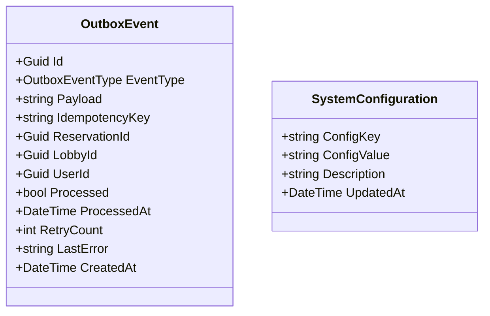

# 1.3 Entity-Relationship Diagram (ERD) — BoardVerse Backend

Tài liệu này mô tả **toàn bộ 72 entity** (POCO) trong `BoardVerse.Core/Entities/`. Mỗi entity được liệt kê với **đầy đủ field, PK, FK, navigation property, status enum và audit field**.

> Số lượng: **72 entity** (không phải 71 — `PaymentWebhookAudit` nằm trong folder Entities/Entities/ nhưng bị thiếu trong danh sách liệt kê trước đó; file này đã bao gồm).

Nội dung:
1. Tổng quan 72 entity theo nhóm nghiệp vụ.
2. Entity-Relationship Diagram tổng thể (ERD).
3. Class diagram theo cụm nghiệp vụ.
4. Bảng chi tiết 72 entity — đầy đủ field, FK, navigation property.
5. Quan hệ trọng yếu giữa các entity (BR mapping).
6. Audit / Status / Timestamp fields quy ước chung.

---

## 1.3.1 Tổng quan 72 entity theo nhóm

| Nhóm | Entity | Số |
|---|---|---|
| **Account / Identity** | `User`, `UserProfile`, `RefreshToken`, `DeviceToken` | 4 |
| **Friend / Social** | `FriendNote`, `FriendReport`, `Friendship` | 3 |
| **Karma / Rating** | `PlayerKarmaRating`, `KarmaLog`, `KarmaShortPlayRecord` | 3 |
| **Risk / Moderation** | `PlayerRiskScore`, `PlayerAlert`, `PlayerActionHistory`, `RiskScoreHistory`, `Wallet` | 5 |
| **Cafe / Partner** | `Cafe`, `CafeConfig`, `CafeScheduleOverride`, `CafeShift`, `CafeStaff`, `CafeTable`, `CafePartnerApplication` | 7 |
| **Cafe Inventory** | `CafeGameInventory`, `CafeInventoryBox`, `CafeGameComponentPenalty`, `ComponentLossReport`, `ComponentCheckResult` | 5 |
| **Game Catalog** | `GameTemplate`, `GameComponentTemplate`, `GameTemplateCategory`, `Category` | 4 |
| **Game Inventory (atomic)** | `SeatInventory`, `GameInventory` | 2 |
| **Booking (legacy Flow B)** | `Booking`, `BookingDeposit`, `BookingRating`, `BookingNoShowVote` | 4 |
| **Reservation (Flow A — mới)** | `Reservation`, `WalkInBooking`, `WalkInWindow` | 3 |
| **Active Session / POS** | `ActiveSession`, `ActiveSessionGame`, `ActiveSessionMember`, `PosCheckInToken` | 4 |
| **Lobby / Match** | `Lobby`, `LobbyMember`, `LobbyInvite`, `LobbyMessage`, `LobbyReport`, `LobbyAtRiskWarning`, `LobbyNotificationSent`, `MatchHistory`, `MatchHistoryParticipant`, `MatchResult` | 10 |
| **Tournament** | `Tournament`, `TournamentParticipant`, `TournamentMatchBracket`, `TournamentMatchEloContribution`, `TournamentWaitlist`, `TournamentSpectator` | 6 |
| **BVC Wallet / Payment** | `BvcLedgerEntry`, `BvcTopUpRequest`, `BvcRefundRequest`, `Transaction`, `RefundTransaction`, `SePayAccount`, `CafeSettlement`, `PaymentWebhookAudit` | 8 |
| **System / Outbox** | `OutboxEvent`, `SystemConfiguration`, `DepositSnapshot` (owned type) | 3 |
| **Player location** | `PlayerLocationHistory` | 1 |
| **Tổng cộng** | | **72** |

---

## 1.3.2 Entity-Relationship Diagram (ERD) tổng thể

```mermaid
erDiagram
 User ||--o| UserProfile : "1-0..1"
 User ||--o{ RefreshToken : "has many"
 User ||--o{ DeviceToken : "has many"
 User ||--o{ Friendship : "is Requester/Addressee"
 User ||--o{ FriendNote : "Owner"
 User ||--o{ FriendReport : "Reporter/Target"
 User ||--o{ Wallet : "1-1"
 User ||--o{ BvcLedgerEntry : "has many"
 User ||--o{ BvcTopUpRequest : "creates"
 User ||--o{ BvcRefundRequest : "requests"
 User ||--o{ PlayerLocationHistory : "logs"
 User ||--o{ PlayerKarmaRating : "rates"
 User ||--o{ KarmaLog : "history"
 User ||--o{ KarmaShortPlayRecord : "history"
 User ||--o{ PlayerRiskScore : "1-1"
 User ||--o{ PlayerAlert : "alerts"
 User ||--o{ PlayerActionHistory : "audited"
 User ||--o{ RiskScoreHistory : "daily snapshot"
 User ||--o{ CafePartnerApplication : "submits/reviews"
 User ||--o{ CafeStaff : "is staff"
 User ||--o{ CafeShift : "opens/closes"
 User ||--o{ Lobby : "hosts"
 User ||--o{ LobbyMember : "joins"
 User ||--o{ LobbyInvite : "sends/receives"
 User ||--o{ LobbyMessage : "posts"
 User ||--o{ LobbyReport : "reports"
 User ||--o{ Reservation : "is Host"
 User ||--o{ ActiveSession : "is Host"
 User ||--o{ ActiveSessionMember : "participates"
 User ||--o{ Booking : "creates"
 User ||--o{ BookingDeposit : "deposits"
 User ||--o{ BookingRating : "rates"
 User ||--o{ BookingNoShowVote : "votes"
 User ||--o{ Transaction : "owns"
 User ||--o{ MatchResult : "submits"
 User ||--o{ MatchHistoryParticipant : "participates"
 User ||--o| MatchHistory : "wins"
 User ||--o{ TournamentParticipant : "enters"
 User ||--o{ TournamentSpectator : "watches"
 User ||--o{ TournamentWaitlist : "queues"
 User ||--o{ TournamentMatchBracket : "plays"

 Cafe ||--o{ CafeConfig : "1-1"
 Cafe ||--o{ CafeScheduleOverride : "overrides"
 Cafe ||--o{ CafeStaff : "employs"
 Cafe ||--o{ CafeTable : "tables"
 Cafe ||--o{ CafeGameInventory : "stocks"
 Cafe ||--o{ CafeGameComponentPenalty : "via inventory"
 Cafe ||--o{ CafeShift : "shifts"
 Cafe ||--o| CafePartnerApplication : "from"
 Cafe ||--o| SePayAccount : "configures"
 Cafe ||--o{ SeatInventory : "tracks"
 Cafe ||--o{ GameInventory : "tracks"
 Cafe ||--o{ Reservation : "hosts"
 Cafe ||--o{ ActiveSession : "hosts"
 Cafe ||--o{ Booking : "hosts"
 Cafe ||--o{ BookingDeposit : "collects"
 Cafe ||--o{ Tournament : "hosts"
 Cafe ||--o{ CafeSettlement : "settles"
 Cafe ||--o{ ComponentLossReport : "tracks"
 Cafe ||--o{ WalkInBooking : "accepts"
 Cafe ||--o{ WalkInWindow : "opens"
 Cafe ||--o{ Transaction : "originates"
 Cafe ||--o| User : "Manager"

 CafeGameInventory ||--o{ CafeInventoryBox : "boxes"
 CafeGameInventory ||--o{ CafeGameComponentPenalty : "penalties"
 CafeGameInventory ||--|| GameTemplate : "stocks"
 CafeGameInventory ||--o{ ActiveSessionGame : "lends"
 CafeGameInventory ||--o{ ActiveSession : "active session"
 CafeGameInventory ||--o{ ComponentLossReport : "loss"
 CafeInventoryBox ||--o{ ComponentLossReport : "loss"

 GameTemplate ||--o{ GameComponentTemplate : "has components"
 GameTemplate ||--o{ GameTemplateCategory : "tagged"
 GameTemplate ||--o{ CafeGameInventory : "stocked"
 GameTemplate ||--o{ GameInventory : "available"
 GameTemplate ||--o{ Reservation : "is Game"
 GameTemplate ||--o{ ActiveSession : "is Game"
 GameTemplate ||--o{ ActiveSessionGame : "played"
 GameTemplate ||--o{ Lobby : "is Game"
 GameTemplate ||--o{ MatchHistory : "match"
 GameTemplate ||--o{ Tournament : "is Game"

 Category ||--o{ GameTemplateCategory : "tagged"

 Reservation ||--o| Lobby : "creates"
 Reservation ||--o| ActiveSession : "transitions to"
 Reservation ||--o| WalkInWindow : "creates on early-end"
 Reservation ||--o{ BvcLedgerEntry : "ledger"
 Reservation ||--o{ BookingRating : "rated"
 Reservation ||--o{ BookingNoShowVote : "voted"
 Reservation ||--o{ KarmaShortPlayRecord : "short play"
 Reservation ||--o{ RefundTransaction : "refund"
 Reservation ||--o{ OutboxEvent : "events"
 Reservation ||--|| SeatInventory : "holds"
 Reservation ||--|| GameInventory : "holds"
 Reservation }o--|| Cafe : "at"
 Reservation }o--|| User : "host"
 Reservation }o--|| GameTemplate : "game"

 Lobby ||--o{ LobbyMember : "members"
 Lobby ||--o{ LobbyInvite : "invites"
 Lobby ||--o{ LobbyMessage : "chat"
 Lobby ||--o{ LobbyReport : "reports"
 Lobby ||--o{ LobbyAtRiskWarning : "warnings"
 Lobby ||--o{ LobbyNotificationSent : "notifications"
 Lobby ||--o{ MatchHistory : "match"
 Lobby ||--o{ MatchResult : "results"
 Lobby ||--o{ PlayerKarmaRating : "ratings"
 Lobby ||--o| ActiveSession : "becomes"
 Lobby }o--o| Reservation : "from"
 Lobby }o--o| BookingDeposit : "deposit"
 Lobby }o--|| User : "host"
 Lobby }o--o| Cafe : "at"
 Lobby }o--|| GameTemplate : "game"

 Booking ||--o| BookingDeposit : "deposit"
 Booking ||--o{ BookingRating : "rated"
 Booking ||--o{ BookingNoShowVote : "voted"
 Booking }o--o| Lobby : "from"
 Booking }o--|| Cafe : "at"
 Booking }o--|| CafeTable : "table"

 ActiveSession ||--o{ ActiveSessionMember : "members"
 ActiveSession ||--o{ ActiveSessionGame : "games"
 ActiveSession ||--o{ BookingDeposit : "session deposit"
 ActiveSession ||--o{ CafeSettlement : "settles"
 ActiveSession ||--o{ ComponentLossReport : "loss"
 ActiveSession }o--|| Cafe : "at"
 ActiveSession }o--o| CafeTable : "table"
 ActiveSession }o--o| CafeInventoryBox : "box"
 ActiveSession }o--|| GameTemplate : "game"
 ActiveSession }o--|| User : "host"
 ActiveSession }o--o| Lobby : "from"

 ActiveSessionGame ||--o{ ComponentCheckResult : "results"
 ActiveSessionGame }o--|| CafeInventoryBox : "box"
 ActiveSessionGame }o--|| GameTemplate : "game"

 ActiveSessionMember }o--o| User : "user"
 ActiveSessionMember }o--o| BookingDeposit : "deposit"

 Tournament ||--o{ TournamentParticipant : "roster"
 Tournament ||--o{ TournamentMatchBracket : "matches"
 Tournament ||--o{ TournamentSpectator : "watchers"
 Tournament ||--o{ TournamentWaitlist : "queue"
 Tournament }o--|| Cafe : "at"
 Tournament }o--|| User : "manager"
 Tournament }o--|| GameTemplate : "game"

 TournamentMatchBracket ||--o{ TournamentMatchEloContribution : "elo deltas"
 TournamentMatchBracket }o--o| User : "P1/P2/P3/P4"
 TournamentMatchBracket }o--o| User : "winner"

 TournamentParticipant }o--o| User : "user"

 SePayAccount }o--o| Cafe : "for"
 BvcTopUpRequest }o--|| User : "user"
 BvcRefundRequest }o--|| User : "user"
 OutboxEvent }o--o| Reservation : "source"

 Friendship }o--|| User : "Requester"
 Friendship }o--|| User : "Addressee"

 FriendNote }o--|| User : "Owner"
 FriendNote }o--|| User : "Friend"

 FriendReport }o--|| User : "Reporter"
 FriendReport }o--|| User : "TargetUser"

 PlayerKarmaRating }o--|| Lobby : "rated"
 PlayerKarmaRating }o--|| User : "Rater"
 PlayerKarmaRating }o--|| User : "Target"

 WalkInBooking }o--|| WalkInWindow : "in"
 WalkInBooking }o--o| Cafe : "at"
 WalkInBooking }o--o| ActiveSession : "session"

 WalkInWindow }o--o| Reservation : "from"
 WalkInWindow }o--|| Cafe : "at"

 BookingNoShowVote }o--|| User : "voter"
 BookingNoShowVote }o--o| Booking : "for"
 BookingNoShowVote }o--o| Reservation : "for"

 BookingRating }o--|| User : "voter"
 BookingRating }o--o| Booking : "for"
 BookingRating }o--o| Reservation : "for"

 MatchHistory ||--o{ MatchHistoryParticipant : "players"
 MatchHistoryParticipant }o--|| User : "user"

 MatchResult }o--|| User : "user"
 MatchResult }o--|| Lobby : "in"

 CafeSettlement }o--|| Cafe : "for"
 CafeSettlement }o--o| ActiveSession : "from"
 CafeSettlement }o--o| BookingDeposit : "from"

 ComponentCheckResult }o--|| ActiveSessionGame : "for"
 ComponentCheckResult }o--|| GameComponentTemplate : "component"
 ComponentCheckResult }o--|| User : "staff"

 ComponentLossReport }o--|| Cafe : "at"
 ComponentLossReport }o--o| ActiveSession : "session"
 ComponentLossReport }o--o| CafeInventoryBox : "box"

 CafeTable }o--|| Cafe : "at"

 GameComponentTemplate }o--|| GameTemplate : "for"

 GameTemplateCategory }o--|| GameTemplate : "for"
 GameTemplateCategory }o--|| Category : "tag"
```



---

## 1.3.3 Class Diagram theo cụm nghiệp vụ

### A. Cluster User / Identity / Friend / Karma / Risk

```mermaid
classDiagram
 class User {
 +Guid Id
 +string Username
 +string Email
 +string PhoneNumber
 +string PasswordHash
 +UserRole Role
 +string Provider
 +string ProviderId
 +bool IsEmailVerified
 +string EmailVerificationToken
 +DateTime EmailVerificationTokenExpiresAt
 +string PasswordResetToken
 +DateTime PasswordResetTokenExpiresAt
 +bool IsActive
 +string BlockReason
 +DateTime BlockedAt
 +UserAccountStatus AccountStatus
 +DateTime LockoutEndDate
 +DateTime LastLoginAt
 +DateTime CreatedAt
 +DateTime UpdatedAt
 }

 class UserProfile {
 +Guid Id
 +string AvatarUrl
 +string AvatarBorderUrl
 +string CoverPhotoUrl
 +string FavoriteGamesJson
 +PlayerPlayMode PreferredPlayMode
 +string Bio
 +int KarmaPoints
 +GamerTier GamerTier
 +DateTime LastWarningAt
 +DateTime KarmaRestrictedUntil
 +int GlobalElo
 +int Level
 +int CurrentExp
 +string FirstName
 +string LastName
 +DateOnly DateOfBirth
 +double LastKnownLatitude
 +double LastKnownLongitude
 +DateTime LastLocationUpdatedAt
 +PlayerLocationSource LastLocationSource
 +string LastResolvedDistrict
 +string LastResolvedCity
 +string LastResolvedCountry
 +string LastResolvedDisplayName
 +DateTime LastResolvedAt
 +bool IsActive
 +bool IsFriendListPublic
 +string AcceptFriendRequestsFrom
 +int FriendLimit
 +DateTime LastActiveAt
 +DateTime UpdatedAt
 }

 class RefreshToken {
 +Guid Id
 +string Token
 +bool IsRevoked
 +DateTime CreatedAt
 +DateTime RevokedAt
 }

 class DeviceToken {
 +Guid Id
 +string Token
 +string Platform
 +string AppVersion
 +string DeviceModel
 +DateTime CreatedAt
 +DateTime LastSeenAt
 +bool IsInvalidated
 }

 class Friendship {
 +Guid Id
 +Guid RequesterId
 +Guid AddresseeId
 +FriendshipStatus Status
 +string Message
 +DateTime AcceptedAt
 +DateTime AddresseeReadAt
 +Guid BlockerUserId
 +DateTime CreatedAt
 +DateTime UpdatedAt
 }

 class FriendNote {
 +Guid Id
 +Guid OwnerUserId
 +Guid FriendUserId
 +string Alias
 +string Note
 +string Tags
 +DateTime CreatedAt
 +DateTime UpdatedAt
 }

 class FriendReport {
 +Guid Id
 +Guid ReporterId
 +Guid TargetUserId
 +FriendReportCategory Category
 +string Reason
 +string Status
 +Guid ReviewedByAdminId
 +string AdminNote
 +DateTime CreatedAt
 +DateTime ReviewedAt
 }

 class Wallet {
 +Guid Id
 +long AvailableBalance
 +long HeldBalance
 +long TotalActiveDeposit
 +decimal RiskMultiplier
 +int RiskScore
 +RiskLevel RiskLevel
 +bool IsCoolingOff
 +DateTime CoolingOffExpiresAt
 +AccountStatus AccountStatus
 +DateTime CreatedAt
 +DateTime UpdatedAt
 }

 class PlayerKarmaRating {
 +Guid Id
 +Guid LobbyId
 +Guid RaterUserId
 +Guid TargetUserId
 +string TagsJson
 +decimal KarmaDeltaApplied
 +DateTime CreatedAt
 }

 class KarmaLog {
 +Guid Id
 +Guid UserId
 +KarmaViolationCategory ViolationCategory
 +KarmaLogSource Source
 +decimal KarmaPointsChange
 +int KarmaBefore
 +int KarmaAfter
 +string Reason
 +Guid RelatedLobbyId
 +Guid PerformedByUserId
 +bool IsAdminAdjustment
 +DateTime CreatedAt
 }

 class KarmaShortPlayRecord {
 +Guid Id
 +Guid ReservationId
 +Guid UserId
 +int PlayedMinutes
 +int ScheduledMinutes
 +decimal PlayedRatio
 +int KarmaDelta
 +decimal KarmaPointsAdded
 +int TotalKarmaScore
 +KarmaRecordStatus Status
 +DateTime CreatedAt
 +bool AppealRequested
 +string AppealReason
 +DateTime AppealReviewedAt
 +Guid AppealReviewedBy
 +bool AppealApproved
 }

 class PlayerRiskScore {
 +Guid Id
 +int RiskScore
 +RiskLevel RiskLevel
 +string Signals
 +DateTime LastUpdated
 +string AdminNote
 +Guid AdminActionBy
 +DateTime AdminActionAt
 +DateTime CreatedAt
 }

 class PlayerAlert {
 +Guid Id
 +Guid UserId
 +PlayerAlertType AlertType
 +PlayerAlertSeverity Severity
 +string Signals
 +int RiskScoreSnapshot
 +DateTime CreatedAt
 +Guid AcknowledgedBy
 +DateTime AcknowledgedAt
 +PlayerAlertStatus Status
 +string ResolutionNote
 }

 class PlayerActionHistory {
 +Guid Id
 +Guid UserId
 +AdminActionType ActionType
 +Guid ActionBy
 +string Reason
 +string Metadata
 +DateTime CreatedAt
 +DateTime ExpiresAt
 }

 class RiskScoreHistory {
 +Guid Id
 +Guid UserId
 +int RiskScore
 +RiskLevel RiskLevel
 +string Signals
 +DateOnly SnapshotDate
 +DateTime CreatedAt
 }

 class PlayerLocationHistory {
 +Guid Id
 +Guid UserId
 +double Latitude
 +double Longitude
 +PlayerLocationSource Source
 +DateTime RecordedAt
 +string ResolvedDistrict
 +string ResolvedCity
 +string ResolvedCountry
 +string ResolvedDisplayName
 }

 User "1" --o| "1" UserProfile : has
 User "1" --o{ "*" RefreshToken : has
 User "1" --o{ "*" DeviceToken : has
 User "1" --o{ "*" Friendship : is party
 User "1" --o{ "*" FriendNote : owns/receives
 User "1" --o{ "*" FriendReport : reporter/target
 User "1" --o| "1" Wallet : owns
 User "1" --o{ "*" PlayerKarmaRating : rates
 User "1" --o{ "*" KarmaLog : has history
 User "1" --o{ "*" KarmaShortPlayRecord : has history
 User "1" --o| "1" PlayerRiskScore : has
 User "1" --o{ "*" PlayerAlert : receives
 User "1" --o{ "*" PlayerActionHistory : audited
 User "1" --o{ "*" RiskScoreHistory : snapshots
 User "1" --o{ "*" PlayerLocationHistory : logs
```

### B. Cluster Cafe / Partner / Inventory

```mermaid
classDiagram
 class Cafe {
 +Guid Id
 +string Name
 +string Address
 +double Latitude
 +double Longitude
 +Point Location
 +string PhoneNumber
 +string Description
 +Guid ManagerId
 +int TotalSeats
 +CafePartnerOperationalStatus PartnerOperationalStatus
 +string PartnerOperationalStatusReason
 +DateTime PartnerOperationalStatusChangedAt
 +TimeSpan WeekdayOpen
 +TimeSpan WeekdayClose
 +TimeSpan WeekendOpen
 +TimeSpan WeekendClose
 +int NumberOfTables
 +int NumberOfPrivateRooms
 +string SpaceImageUrlsJson
 +int NumberOfGamesOwned
 +string PopularGamesList
 +bool HasGameMaster
 +CafePartnerBillingModel BillingModel
 +decimal BasePrice
 +decimal TieredBlockRate
 +int TieredBlockMinutes
 +string TableLayoutJson
 +DateTime OperationalProfileUpdatedAt
 +bool IsPricingLocked
 +decimal DepositPercentage
 +int DefaultHoldDurationMinutes
 +string SePayMerchantId
 +string SePayApiKey
 +string SePaySecretKey
 +string SePayReturnUrl
 +string SePayBankCode
 +string SePayAccountNumber
 +Guid SePayAccountId
 +DepositRefundPolicy RefundPolicy
 +string RefundTiersJson
 +bool IsActive
 +DateTime CreatedAt
 +DateTime UpdatedAt
 }

 class CafeConfig {
 +Guid Id
 +Guid CafeId
 +int Capacity
 +int MaxLobbiesPerUserPerDay
 +int MaxPlayersPerLobbySameDay
 +int MaxPlayersPerLobby1Day
 +int MaxPlayersPerLobby2Days
 +int MaxPlayersPerLobby3To4Days
 +int MaxPlayersPerLobby5To7Days
 +long MinDepositSameDay
 +long MinDeposit1Day
 +long MinDeposit2Days
 +long MinDeposit3To4Days
 +long MinDeposit5To7Days
 +bool RequireApprovalForDistant
 +int DistantThresholdDays
 +int ApprovalTimeoutHours
 +long MaxTotalDepositPerUser
 +int RecruitmentDeadlineBufferMinutes
 +int CancellationGraceMinutes
 +long DepositRatePerPerson
 +DateTime CreatedAt
 +DateTime UpdatedAt
 }

 class CafeScheduleOverride {
 +Guid Id
 +Guid CafeId
 +TimeSlot TimeSlot
 +TimeOnly StartTime
 +TimeOnly EndTime
 +bool IsClosed
 +DateOnly EffectiveFrom
 +DateOnly EffectiveTo
 +DateTime CreatedAt
 +DateTime UpdatedAt
 }

 class CafeShift {
 +Guid Id
 +Guid CafeId
 +Guid OpenedByUserId
 +Guid ClosedByUserId
 +DateTime OpenedAt
 +DateTime ClosedAt
 +decimal OpeningCashBalance
 +decimal ClosingCashBalance
 +decimal TotalRevenue
 +int TotalSessions
 +ShiftStatus Status
 }

 class CafeStaff {
 +Guid Id
 +Guid UserId
 +DateTime JoinedAt
 }

 class CafeTable {
 +Guid Id
 +Guid CafeId
 +string Name
 +int SortOrder
 +int SeatCount
 +CafeTableStatus Status
 +bool IsActive
 +DateTime CreatedAt
 +DateTime UpdatedAt
 }

 class CafePartnerApplication {
 +Guid Id
 +string CafeName
 +string Address
 +double Latitude
 +double Longitude
 +string PhoneNumber
 +string RepresentativeEmail
 +string BusinessLicense
 +string BusinessLicenseImageUrl
 +CafePartnerApplicationStatus Status
 +string RejectionReason
 +DateTime ApprovedAt
 +Guid SubmittedByUserId
 +Guid ReviewedByAdminId
 +DateTime ReviewedAt
 +Guid CreatedManagerUserId
 +Guid CreatedCafeId
 +DateTime SubmittedAt
 +DateTime UpdatedAt
 }

 class CafeGameInventory {
 +Guid Id
 +Guid CafeId
 +Guid GameTemplateId
 +CafeGameInventoryStatus Status
 +bool IsActive
 +DateTime CreatedAt
 +DateTime UpdatedAt
 }

 class CafeInventoryBox {
 +Guid Id
 +Guid CafeGameInventoryId
 +string Barcode
 +CafeGameInventoryStatus Status
 +bool IsActive
 +DateTime CreatedAt
 +DateTime UpdatedAt
 }

 class CafeGameComponentPenalty {
 +Guid Id
 +Guid CafeGameInventoryId
 +Guid GameComponentTemplateId
 +DateTime CreatedAt
 +DateTime UpdatedAt
 }

 class ComponentLossReport {
 +Guid Id
 +Guid CafeId
 +Guid ActiveSessionId
 +Guid CafeInventoryBoxId
 +Guid ReportedByUserId
 +string LossDescription
 +decimal TotalPenaltyAmount
 +string Notes
 +DateTime CreatedAt
 }

 class ComponentCheckResult {
 +Guid Id
 +Guid ActiveSessionGameId
 +Guid GameComponentTemplateId
 +int ActualQuantity
 +decimal PenaltyFee
 +Guid ResponsibleMemberId
 +Guid StaffId
 +DateTime CheckedAt
 }

 class SeatInventory {
 +Guid Id
 +Guid CafeId
 +DateOnly PlayDate
 +int TotalSeats
 +int HeldSeats
 +int InUseSeats
 +uint RowVersion
 +DateTime CreatedAt
 +DateTime UpdatedAt
 }

 class GameInventory {
 +Guid Id
 +Guid CafeId
 +Guid GameId
 +DateOnly PlayDate
 +int TotalCopies
 +int HeldCopies
 +int InUseCopies
 +uint RowVersion
 +DateTime CreatedAt
 +DateTime UpdatedAt
 }

 Cafe "1" --o| "1" CafeConfig : has
 Cafe "1" --o{ "*" CafeScheduleOverride : overrides
 Cafe "1" --o{ "*" CafeStaff : employs
 Cafe "1" --o{ "*" CafeTable : tables
 Cafe "1" --o{ "*" CafeGameInventory : stocks
 Cafe "1" --o{ "*" CafeShift : runs
 Cafe "1" --o| "1" CafePartnerApplication : from
 Cafe "1" --o{ "*" SeatInventory : tracks
 Cafe "1" --o{ "*" GameInventory : tracks
 Cafe "1" --o{ "*" ComponentLossReport : reports

 CafeGameInventory "1" --o{ "*" CafeInventoryBox : boxes
 CafeGameInventory "1" --o{ "*" CafeGameComponentPenalty : penalties
```

### C. Cluster Game Catalog

```mermaid
classDiagram
 class GameTemplate {
 +Guid Id
 +string NameSearchKey
 +string SearchAliasesKey
 +string ThumbnailUrl
 +string Description
 +int BggId
 +DateTime BggSyncedAt
 +bool IsActive
 +bool IsTournamentSupported
 +int TournamentMaxScorePerPlayer
 +int TournamentMinPlayersPerTable
 +DateTime CreatedAt
 +DateTime UpdatedAt
 }

 class GameComponentTemplate {
 +Guid Id
 +Guid GameTemplateId
 +string ComponentName
 +BoardGameComponentKind ComponentKind
 +DateTime CreatedAt
 }

 class GameTemplateCategory {
 +Guid Id
 +Guid CategoryId
 +DateTime CreatedAt
 }

 class Category {
 +Guid Id
 +string Name
 +string Slug
 +string Description
 +int SortOrder
 +bool IsActive
 +DateTime CreatedAt
 +DateTime UpdatedAt
 }

 GameTemplate "1" --o{ "*" GameComponentTemplate : has
 GameTemplate "1" --o{ "*" GameTemplateCategory : tagged
 Category "1" --o{ "*" GameTemplateCategory : tagged
```

### D. Cluster Reservation / Walk-in / Booking

```mermaid
classDiagram
 class Reservation {
 +Guid Id
 +Guid HostId
 +Guid CafeId
 +Guid GameId
 +DateOnly PlayDate
 +TimeSlot TimeSlot
 +TimeOnly PreferredStartTime
 +TimeOnly PreferredEndTime
 +DateTime RecruitmentDeadline
 +DateTime ScheduledStartTime
 +DateTime ScheduledEndTime
 +int MinPlayers
 +int MaxPlayers
 +DepositSnapshot DepositConfigSnapshot
 +long DepositAmount
 +long MinDepositApplied
 +decimal RiskMultiplier
 +ReservationStatus Status
 +int CurrentPlayers
 +int ExtensionCount
 +DateTime ExtendedEndTime
 +Guid LobbyId
 +Guid SeatInventoryId
 +Guid GameInventoryId
 +string IdempotencyKey
 +string ReservationCode
 +DateTime CreatedAt
 +DateTime UpdatedAt
 +DateTime CheckedInAt
 +int TableNumber
 +DateTime ActualEndAt
 +decimal PlayedRatio
 +SessionEndReason EndReason
 +Guid WalkInWindowId
 +Guid CancelledBy
 +string CancelReason
 }

 class DepositSnapshot {
 +int MaxPlayers
 +long BaseDeposit
 +decimal RiskMultiplier
 +long FinalDeposit
 +long MinDepositApplied
 +string PricingModel
 }

 class WalkInBooking {
 +Guid Id
 +Guid WalkInWindowId
 +Guid CafeId
 +string GuestName
 +string GuestPhone
 +DateTime StartTime
 +DateTime EndTime
 +int Seats
 +decimal HourlyRate
 +decimal TotalAmount
 +WalkInPaymentStatus PaymentStatus
 +Guid PosStaffId
 +Guid ActiveSessionId
 +WalkInBookingStatus Status
 +DateTime CreatedAt
 }

 class WalkInWindow {
 +Guid Id
 +Guid SourceReservationId
 +Guid CafeId
 +DateTime WindowStart
 +DateTime WindowEnd
 +int TotalSeats
 +int AvailableSeats
 +int HeldSeats
 +int InUseSeats
 +uint Version
 +WalkInWindowStatus Status
 +DateTime CreatedAt
 +DateTime ExpiresAt
 }

 class Booking {
 +Guid Id
 +Guid LobbyId
 +Guid CafeId
 +Guid CafeTableId
 +DateTime ScheduledStartTime
 +DateTime ScheduleEndTime
 +BookingStatus Status
 +string VerificationQRCode
 +int PlayerQuantity
 +DateTime CheckedInAt
 +Guid CheckedInByUserId
 +int TableNumber
 +DateTime CreatedAt
 +DateTime UpdatedAt
 }

 class BookingDeposit {
 +Guid Id
 +string OrderId
 +Guid ActiveSessionId
 +Guid BookingId
 +Guid UserId
 +Guid CafeId
 +Guid CafeManagerId
 +decimal Amount
 +DepositRefundPolicy RefundPolicy
 +BookingDepositStatus Status
 +string TransferContent
 +string SePayTransactionId
 +string SePayTransferId
 +DateTime PaidAt
 +DateTime ReleasedAt
 +DateTime RefundedAt
 +DateTime ForfeitedAt
 +string QrUrl
 +DateTime QrExpiresAt
 +DateTime LastQrRegeneratedAt
 +DateTime ScheduledAt
 +DateTime CreatedAt
 +DateTime UpdatedAt
 }

 class BookingRating {
 +Guid Id
 +Guid BookingId
 +Guid ReservationId
 +Guid VoterUserId
 +string RatingsJson
 +DateTime SubmittedAt
 +bool IsAggregated
 +DateTime AggregatedAt
 }

 class BookingNoShowVote {
 +Guid Id
 +Guid BookingId
 +Guid ReservationId
 +Guid VoterUserId
 +string AbsentMemberIdsJson
 +DateTime VotedAt
 +DateTime UpdatedAt
 }

 Reservation "1" --|| "1" DepositSnapshot : embeds
 Reservation "1" --o{ "*" BookingRating : rated by
 Reservation "1" --o{ "*" BookingNoShowVote : voted by
 Booking "1" --o| "1" BookingDeposit : deposit
 Booking "1" --o{ "*" BookingRating : rated by
 Booking "1" --o{ "*" BookingNoShowVote : voted by

 WalkInWindow "1" --o{ "*" WalkInBooking : contains
 WalkInWindow "1" --o| "1" Reservation : source
```

### E. Cluster Active Session / POS

```mermaid
classDiagram
 class ActiveSession {
 +Guid Id
 +Guid CafeId
 +Guid HostId
 +Guid CafeTableId
 +Guid CafeInventoryBoxId
 +Guid GameTemplateId
 +Guid LobbyId
 +bool IsCheckingInventory
 +bool HasMissingComponents
 +decimal PenaltyAmount
 +string OrderId
 +string TransferContent
 +GroupSessionStatus Status
 +DateTime StartedAt
 +DateTime EndedAt
 +bool IsPaused
 +DateTime PausedAt
 +int TotalMinutesPlayed
 +decimal Subtotal
 +decimal DepositAppliedAmount
 +decimal TotalAmount
 +decimal SurchargeFine
 +DateTime PaidAt
 +DateTime CreatedAt
 +DateTime UpdatedAt
 }

 class ActiveSessionGame {
 +Guid Id
 +Guid ActiveSessionId
 +Guid CafeInventoryBoxId
 +Guid GameTemplateId
 +ComponentCheckStatus CheckStatus
 +DateTime CheckedAt
 +Guid CheckedByStaffId
 +decimal TotalPenaltyAmount
 +DateTime AttachedAt
 +DateTime CreatedAt
 +DateTime UpdatedAt
 }

 class ActiveSessionMember {
 +Guid Id
 +Guid ActiveSessionId
 +Guid UserId
 +bool IsGuestSlot
 +string GuestDisplayName
 +string GuestPhoneNumber
 +Guid OriginalSessionId
 +IndividualSessionStatus Status
 +DateTime JoinedAt
 +DateTime LeftAt
 +int TotalMinutesPlayed
 +decimal PenaltyAmount
 +string PenaltyReason
 +bool IsPenaltyPaid
 +bool IsCheckedOut
 +DateTime CheckedOutAt
 +decimal DepositAppliedAmount
 +Guid DepositId
 +DateTime CreatedAt
 +DateTime UpdatedAt
 }

 class PosCheckInToken {
 +Guid Id
 +Guid CafeId
 +Guid ReservationId
 +string Token
 +Guid CreatedByStaffId
 +DateTime CreatedAt
 +DateTime ExpiresAt
 +bool IsRevoked
 +DateTime ConsumedAt
 +Guid ConsumedByUserId
 +Guid ResultActiveSessionId
 }

 ActiveSession "1" --o{ "*" ActiveSessionGame : plays
 ActiveSession "1" --o{ "*" ActiveSessionMember : members
 ActiveSessionGame "1" --o{ "*" ComponentCheckResult : checks
```

### F. Cluster Lobby / Match

```mermaid
classDiagram
 class Lobby {
 +Guid Id
 +Guid HostUserId
 +Guid GameTemplateId
 +Guid CafeId
 +Guid BookingId
 +Guid ReservationId
 +DateOnly PlayDate
 +TimeSlot TimeSlot
 +TimeOnly PreferredStartTime
 +TimeOnly PreferredEndTime
 +DateTime RecruitmentDeadline
 +long MinDeposit
 +DepositSnapshot DepositSnapshot
 +DateTime CafeApprovalDeadline
 +Guid CafeApprovedByUserId
 +DateTime CafeApprovedAt
 +string CafeRejectionReason
 +DateTime ScheduledStartTime
 +double Latitude
 +double Longitude
 +int CancellationLeadTimeMinutes
 +int MaxMembers
 +int MinPlayers
 +int MinKarmaScore
 +int SeatCount
 +bool IsPrivate
 +string ShareCode
 +string Description
 +string CoverImageUrl
 +Guid ActiveSessionId
 +LobbyStatus Status
 +DateTime RatingOpenedAt
 +DateTime ClosedAt
 +string ClosedReason
 +DateTime FullAt
 +DateTime CreatedAt
 +DateTime UpdatedAt
 }

 class LobbyMember {
 +Guid Id
 +Guid LobbyId
 +Guid UserId
 +DateTime JoinedAt
 +bool IsActive
 +bool IsHost
 +LobbyMemberStatus Status
 +DateTime ReadyAt
 +DateTime LeftAt
 }

 class LobbyInvite {
 +Guid Id
 +Guid LobbyId
 +Guid InviterId
 +Guid InviteeId
 +LobbyInviteStatus Status
 +DateTime ExpiresAt
 +DateTime RespondedAt
 +string Message
 +DateTime CreatedAt
 }

 class LobbyMessage {
 +Guid Id
 +Guid LobbyId
 +Guid SenderId
 +string Content
 +bool IsSystem
 +DateTime CreatedAt
 }

 class LobbyReport {
 +Guid Id
 +Guid ReporterId
 +Guid LobbyId
 +LobbyReportCategory Category
 +string Reason
 +string Status
 +Guid ReviewedByAdminId
 +string AdminNote
 +DateTime CreatedAt
 +DateTime ReviewedAt
 }

 class LobbyAtRiskWarning {
 +Guid Id
 +Guid LobbyId
 +DateTime WarnedAt
 +int CurrentPlayers
 +int MinPlayers
 }

 class LobbyNotificationSent {
 +Guid Id
 +Guid LobbyId
 +LobbyNotificationMilestone Milestone
 +DateTime SentAt
 +Guid RecipientUserId
 }

 class MatchHistory {
 +Guid Id
 +Guid LobbyId
 +Guid GameTemplateId
 +MatchConsensusStatus Status
 +Guid WinnerUserId
 +bool IsDraw
 +DateTime FinalizedAt
 }

 class MatchHistoryParticipant {
 +Guid Id
 +Guid MatchHistoryId
 +Guid UserId
 +MatchOutcome ReportedOutcome
 +int EloBefore
 +int EloAfter
 +int EloDelta
 }

 class MatchResult {
 +Guid Id
 +Guid LobbyId
 +Guid UserId
 +MatchOutcome Outcome
 +DateTime SubmittedAt
 +DateTime UpdatedAt
 }

 Lobby "1" --o{ "*" LobbyMember : members
 Lobby "1" --o{ "*" LobbyInvite : invites
 Lobby "1" --o{ "*" LobbyMessage : chat
 Lobby "1" --o{ "*" LobbyReport : reports
 Lobby "1" --o{ "*" LobbyAtRiskWarning : warnings
 Lobby "1" --o{ "*" LobbyNotificationSent : sends
 Lobby "1" --o{ "*" MatchResult : results
 Lobby "1" --o{ "*" PlayerKarmaRating : ratings
 Lobby "1" --o{ "*" MatchHistory : match

 MatchHistory "1" --o{ "*" MatchHistoryParticipant : players
```

### G. Cluster Tournament

```mermaid
classDiagram
 class Tournament {
 +Guid Id
 +Guid CafeId
 +Guid CreatedByManagerId
 +string Title
 +string Description
 +Guid GameTemplateId
 +DateTime StartTime
 +DateTime RegistrationDeadline
 +int RoundDurationMinutes
 +int MinParticipants
 +int MaxParticipants
 +decimal EntryFee
 +int TotalRounds
 +int PreliminaryRounds
 +int FinalistCount
 +bool HasThirdPlaceMatch
 +int CurrentRound
 +DateTime StartedAt
 +int MinKarmaRequirement
 +int MinEloRequirement
 +int MaxEloRequirement
 +TournamentPairingMode PairingMode
 +string Round1PairingsJson
 +string Round2PairingsJson
 +string Round3PairingsJson
 +string FinalPairingsJson
 +int WinnerKarmaBonus
 +int FinalistKarmaBonus
 +int NoShowKarmaPenalty
 +string CancellationReason
 +DateTime CancelledAt
 +bool AutoExtendOnShortage
 +int MaxExtensionCount
 +int ExtensionMinutesPerAttempt
 +int ExtensionCount
 +int ActualPreliminaryRounds
 +bool StartedWithShortage
 +bool IsFinalEloSynced
 +TournamentStatus Status
 +DateTime CreatedAt
 +DateTime UpdatedAt
 }

 class TournamentParticipant {
 +Guid Id
 +Guid TournamentId
 +Guid UserId
 +DateTime RegisteredAt
 +int KarmaAtRegistration
 +DateTime CheckedInAt
 +Guid CheckedInByStaffId
 +bool IsWalkIn
 +string WalkInDisplayName
 +string WalkInPhoneNumber
 +Guid RegisteredByStaffId
 +int JoinedRoundNumber
 +TournamentParticipantStatus Status
 +int TotalPrestigePoints
 +int TotalCardsBought
 +int FinalRank
 +int InitialElo
 +int SwissWins
 +int SwissDraws
 +int SwissLosses
 +int EloDelta
 +int FinalElo
 +DateTime CreatedAt
 +DateTime UpdatedAt
 }

 class TournamentMatchBracket {
 +Guid Id
 +Guid TournamentId
 +int RoundNumber
 +int MatchNumber
 +bool IsFinal
 +Guid Player1Id
 +Guid Player2Id
 +Guid Player3Id
 +Guid Player4Id
 +int Player1Score
 +int Player2Score
 +int Player3Score
 +int Player4Score
 +int Player1CardsBought
 +int Player2CardsBought
 +int Player3CardsBought
 +int Player4CardsBought
 +Guid WinnerPlayerId
 +bool EloApplied
 +int EloKFactorUsed
 +TournamentMatchStatus Status
 +DateTime ScheduledStartTime
 +DateTime ActualStartTime
 +DateTime ActualEndTime
 +Guid RecordedByStaffId
 +string Notes
 +DateTime CreatedAt
 +DateTime UpdatedAt
 }

 class TournamentMatchEloContribution {
 +Guid Id
 +Guid MatchId
 +Guid ParticipantId
 +int EloDelta
 +DateTime CreatedAt
 }

 class TournamentWaitlist {
 +Guid Id
 +Guid TournamentId
 +Guid UserId
 +int Position
 +TournamentWaitlistStatus Status
 +DateTime JoinedAt
 +DateTime OfferedAt
 +DateTime OfferExpiresAt
 +DateTime ConfirmedAt
 }

 class TournamentSpectator {
 +Guid Id
 +Guid TournamentId
 +Guid UserId
 +DateTime JoinedAt
 +DateTime LeftAt
 }

 Tournament "1" --o{ "*" TournamentParticipant : roster
 Tournament "1" --o{ "*" TournamentMatchBracket : matches
 Tournament "1" --o{ "*" TournamentSpectator : watchers
 Tournament "1" --o{ "*" TournamentWaitlist : queue

 TournamentMatchBracket "1" --o{ "*" TournamentMatchEloContribution : elo deltas
```

### H. Cluster Payment / Wallet / SePay / Settlement

```mermaid
classDiagram
 class BvcLedgerEntry {
 +Guid Id
 +Guid UserId
 +LedgerEntryType Type
 +long Amount
 +Guid RelatedBookingId
 +Guid RelatedReservationId
 +Guid RelatedLobbyId
 +string RelatedPaymentRef
 +string IdempotencyKey
 +long BalanceSnapshot
 +string Note
 +DateTime CreatedAt
 }

 class BvcTopUpRequest {
 +Guid Id
 +Guid UserId
 +string OrderId
 +long AmountVnd
 +long ExpectedBvc
 +string IdempotencyKey
 +BvcTopUpStatus Status
 +Guid LedgerEntryId
 +string GatewayTransactionId
 +DateTime CreatedAt
 +DateTime ExpiresAt
 +DateTime PaidAt
 +DateTime UpdatedAt
 }

 class BvcRefundRequest {
 +Guid Id
 +Guid UserId
 +Guid RelatedLedgerEntryId
 +long RequestedAmountBvc
 +long ApprovedAmountBvc
 +string PlayerReason
 +string IdempotencyKey
 +string AdminNote
 +RefundRequestStatus Status
 +Guid ResolvedByAdminId
 +DateTime ResolvedAt
 +Guid ResultLedgerEntryId
 +DateTime CreatedAt
 +DateTime UpdatedAt
 }

 class Transaction {
 +Guid Id
 +Guid UserId
 +Guid CafeId
 +decimal Amount
 +string Currency
 +string Gateway
 +string GatewayTransactionId
 +string GatewayResponseCode
 +string GatewayResponseMessage
 +TransactionStatus Status
 +TransactionType Type
 +TransactionDirection Direction
 +string FromAccount
 +string ToAccount
 +string Notes
 +DateTime CreatedAt
 +DateTime CompletedAt
 +DateTime UpdatedAt
 }

 class RefundTransaction {
 +Guid Id
 +Guid ReservationId
 +long OriginalDeposit
 +long RefundAmount
 +long ForfeitAmount
 +decimal PlayedRatio
 +RefundReason Reason
 +bool IsOverridden
 +Guid OverriddenBy
 +string OverrideReason
 +RefundStatus Status
 +string IdempotencyKey
 +DateTime CreatedAt
 +DateTime CompletedAt
 }

 class SePayAccount {
 +Guid Id
 +SePayAccountType AccountType
 +Guid CafeId
 +string MerchantId
 +string ApiKey
 +string SecretKey
 +string WebhookToken
 +string ApiBaseUrl
 +string BankCode
 +string AccountNumber
 +string AccountHolder
 +string ReturnUrl
 +string Environment
 +bool IsActive
 +Guid CreatedByUserId
 +Guid UpdatedByUserId
 +DateTime CreatedAt
 +DateTime UpdatedAt
 }

 class CafeSettlement {
 +Guid Id
 +Guid CafeId
 +Guid CafeManagerId
 +Guid ActiveSessionId
 +Guid BookingDepositId
 +decimal DepositAmount
 +decimal FeeAmount
 +decimal NetTransferAmount
 +string SePayTransferId
 +CafeSettlementStatus Status
 +string FailureReason
 +DateTime TransferredAt
 +int RetryCount
 +DateTime NextRetryAt
 +Guid OverrideBy
 +DateTime OverrideAt
 +DateTime CreatedAt
 +DateTime UpdatedAt
 }

 class PaymentWebhookAudit {
 +Guid Id
 +string OrderId
 +string GatewayTransactionId
 +Guid SessionId
 +decimal Amount
 +string Currency
 +string Status
 +string Result
 +string Detail
 +string Payload
 +string RemoteIp
 +DateTime ProcessedAt
 }

 User "1" --o{ "*" BvcLedgerEntry : owns
 User "1" --o{ "*" BvcTopUpRequest : creates
 User "1" --o{ "*" BvcRefundRequest : requests
```

### I. Cluster System / Outbox / Configuration



---

## 1.3.4 Bảng chi tiết 72 entity

Mỗi entity được trình bày với:
- **PK**: primary key (`Guid Id`)
- **FK**: foreign key (Guid tham chiếu entity khác)
- **Field thường**: scalar property
- **Nav property**: `virtual` reference đến entity liên quan
- **Collection nav**: `virtual ICollection<T>` — quan hệ 1-n
- **Owned/embedded**: snapshot nhúng

Ký hiệu:
- `(PK)` — Primary Key
- `(FK→X)` — Foreign Key tham chiếu entity X
- `(nav)` — Navigation property (singleton)
- `(coll)` — Navigation collection (1-n)

---

### A. `ActiveSession`

| Field | Type | Note |
|---|---|---|
| `Id` | `Guid` | (PK) |
| `CafeId` | `Guid` | (FK→Cafe) |
| `HostId` | `Guid` | (FK→User) |
| `CafeTableId` | `Guid?` | (FK→CafeTable) |
| `CafeInventoryBoxId` | `Guid?` | (FK→CafeInventoryBox) |
| `GameTemplateId` | `Guid` | (FK→GameTemplate) |
| `LobbyId` | `Guid?` | (FK→Lobby) |
| `Games` | `ICollection<ActiveSessionGame>` | (coll) |
| `IsCheckingInventory` | `bool` | BR-12 gate |
| `HasMissingComponents` | `bool` | |
| `PenaltyAmount` | `decimal` | |
| `OrderId` | `string?` | |
| `TransferContent` | `string?` | SePay transfer content |
| `Status` | `GroupSessionStatus` | ACTIVE/CHECKING/UNPAID/PAID |
| `StartedAt` | `DateTime` | |
| `EndedAt` | `DateTime?` | |
| `IsPaused` | `bool` | |
| `PausedAt` | `DateTime?` | |
| `TotalMinutesPlayed` | `int` | |
| `Subtotal` | `decimal` | BR-15 |
| `DepositAppliedAmount` | `decimal` | BR-22 |
| `TotalAmount` | `decimal` | |
| `SurchargeFine` | `decimal` | |
| `CreatedAt` | `DateTime` | audit |
| `PaidAt` | `DateTime?` | |
| `UpdatedAt` | `DateTime` | audit |
| `Cafe` | `virtual Cafe` | (nav) |
| `CafeTable` | `virtual CafeTable?` | (nav) |
| `CafeInventoryBox` | `virtual CafeInventoryBox?` | (nav) |
| `GameTemplate` | `virtual GameTemplate` | (nav) |
| `Host` | `virtual User` | (nav) |
| `Lobby` | `virtual Lobby?` | (nav) |
| `Members` | `ICollection<ActiveSessionMember>` | (coll) |

---

### B. `ActiveSessionGame`

| Field | Type | Note |
|---|---|---|
| `Id` | `Guid` | (PK) |
| `ActiveSessionId` | `Guid` | (FK→ActiveSession) |
| `CafeInventoryBoxId` | `Guid` | (FK→CafeInventoryBox) |
| `GameTemplateId` | `Guid` | (FK→GameTemplate) |
| `AttachedAt` | `DateTime` | |
| `CreatedAt` | `DateTime` | audit |
| `CheckStatus` | `ComponentCheckStatus` | OK/MISSING/DAMAGED |
| `CheckedAt` | `DateTime?` | |
| `CheckedByStaffId` | `Guid?` | (FK→User) |
| `TotalPenaltyAmount` | `decimal` | |
| `UpdatedAt` | `DateTime` | audit |
| `ActiveSession` | `virtual ActiveSession` | (nav) |
| `CafeInventoryBox` | `virtual CafeInventoryBox` | (nav) |
| `GameTemplate` | `virtual GameTemplate` | (nav) |
| `CheckedByStaff` | `virtual User?` | (nav) |
| `ComponentCheckResults` | `ICollection<ComponentCheckResult>` | (coll) |

---

### C. `ActiveSessionMember`

| Field | Type | Note |
|---|---|---|
| `Id` | `Guid` | (PK) |
| `ActiveSessionId` | `Guid` | (FK→ActiveSession) |
| `UserId` | `Guid?` | (FK→User) — null nếu Guest_Slot |
| `IsGuestSlot` | `bool` | BR-13 |
| `GuestDisplayName` | `string?` | BR-13 |
| `GuestPhoneNumber` | `string?` | BR-13 |
| `OriginalSessionId` | `Guid?` | BR-Exception 4 — nhảy nhóm |
| `Status` | `IndividualSessionStatus` | PLAYING/SUSPENDED_MUTATION/FINISHED |
| `JoinedAt` | `DateTime` | |
| `LeftAt` | `DateTime?` | |
| `TotalMinutesPlayed` | `int` | |
| `PenaltyAmount` | `decimal` | |
| `PenaltyReason` | `string?` | |
| `IsPenaltyPaid` | `bool` | |
| `IsCheckedOut` | `bool` | |
| `CheckedOutAt` | `DateTime?` | |
| `DepositAppliedAmount` | `decimal` | BR-22 |
| `DepositId` | `Guid?` | (FK→BookingDeposit) BR-22 |
| `ActiveSession` | `virtual ActiveSession` | (nav) |
| `User` | `virtual User?` | (nav) |
| `CreatedAt` | `DateTime` | audit |
| `UpdatedAt` | `DateTime` | audit |

---

### D. `Booking` (Flow B — legacy)

| Field | Type | Note |
|---|---|---|
| `Id` | `Guid` | (PK) |
| `LobbyId` | `Guid?` | (FK→Lobby) |
| `CafeId` | `Guid` | (FK→Cafe) |
| `CafeTableId` | `Guid` | (FK→CafeTable) |
| `ScheduledStartTime` | `DateTime` | |
| `ScheduleEndTime` | `DateTime` | |
| `Status` | `BookingStatus` | BR-05/06 — PENDING_DEPOSIT/CONFIRMED/CHECKED_IN/EXPIRED/CANCELLED_* |
| `VerificationQRCode` | `string?` | POS scan |
| `PlayerQuantity` | `int` | BR-07 |
| `CheckedInAt` | `DateTime?` | |
| `CheckedInByUserId` | `Guid?` | (FK→User) |
| `TableNumber` | `int?` | |
| `CreatedAt` | `DateTime` | audit |
| `UpdatedAt` | `DateTime` | audit |
| `Lobby` | `virtual Lobby?` | (nav) |
| `Cafe` | `virtual Cafe` | (nav) |
| `CafeTable` | `virtual CafeTable` | (nav) |
| `BookingDeposit` | `virtual BookingDeposit?` | (nav) — 1-1 |
| `CheckedInByUser` | `virtual User?` | (nav) |
| `Ratings` | `ICollection<BookingRating>` | (coll) |
| `NoShowVotes` | `ICollection<BookingNoShowVote>` | (coll) |

---

### E. `BookingDeposit` (Flow B — per-member deposit BR-22)

| Field | Type | Note |
|---|---|---|
| `Id` | `Guid` | (PK) |
| `OrderId` | `string` | SePay order id (BV...) |
| `ActiveSessionId` | `Guid?` | (FK→ActiveSession) |
| `BookingId` | `Guid?` | (FK→Booking) |
| `UserId` | `Guid` | (FK→User) — BR-22 per-member |
| `CafeId` | `Guid` | (FK→Cafe) |
| `CafeManagerId` | `Guid` | (FK→User) |
| `Amount` | `decimal` | |
| `RefundPolicy` | `DepositRefundPolicy` | Full/Partial/None |
| `Status` | `BookingDepositStatus` | Pending/Paid/Refunded/Forfeited |
| `TransferContent` | `string?` | |
| `SePayTransactionId` | `string?` | |
| `SePayTransferId` | `string?` | |
| `PaidAt` | `DateTime?` | |
| `ReleasedAt` | `DateTime?` | |
| `RefundedAt` | `DateTime?` | |
| `ForfeitedAt` | `DateTime?` | |
| `QrUrl` | `string?` | |
| `QrExpiresAt` | `DateTime?` | BR-06 — 5 phút |
| `LastQrRegeneratedAt` | `DateTime?` | |
| `ScheduledAt` | `DateTime?` | |
| `CreatedAt` | `DateTime` | audit |
| `UpdatedAt` | `DateTime?` | audit |
| `Cafe` | `virtual Cafe` | (nav) |
| `User` | `virtual User` | (nav) |
| `ActiveSession` | `virtual ActiveSession?` | (nav) |
| `Booking` | `virtual Booking?` | (nav) |

---

### F. `BookingNoShowVote`

| Field | Type | Note |
|---|---|---|
| `Id` | `Guid` | (PK) |
| `BookingId` | `Guid?` | (FK→Booking) |
| `ReservationId` | `Guid?` | (FK→Reservation) |
| `VoterUserId` | `Guid` | (FK→User) |
| `AbsentMemberIdsJson` | `string` | JSON danh sách absent |
| `VotedAt` | `DateTime` | |
| `UpdatedAt` | `DateTime?` | audit |
| `Booking` | `virtual Booking` | (nav) |
| `Reservation` | `virtual Reservation?` | (nav) |
| `Voter` | `virtual User` | (nav) |

---

### G. `BookingRating`

| Field | Type | Note |
|---|---|---|
| `Id` | `Guid` | (PK) |
| `BookingId` | `Guid?` | (FK→Booking) |
| `ReservationId` | `Guid?` | (FK→Reservation) |
| `VoterUserId` | `Guid` | (FK→User) |
| `RatingsJson` | `string` | JSON ratings |
| `SubmittedAt` | `DateTime` | |
| `IsAggregated` | `bool` | |
| `AggregatedAt` | `DateTime?` | |
| `Booking` | `virtual Booking` | (nav) |
| `Reservation` | `virtual Reservation?` | (nav) |
| `Voter` | `virtual User` | (nav) |

---

### H. `BvcLedgerEntry` (sổ cái BVC — append-only)

| Field | Type | Note |
|---|---|---|
| `Id` | `Guid` | (PK) |
| `UserId` | `Guid` | (FK→User) |
| `Type` | `LedgerEntryType` | TOP_UP/DEPOSIT_HOLD/RELEASE/CAPTURE/FORFEIT/ADJUSTMENT |
| `Amount` | `long` | BVC, luôn dương |
| `RelatedBookingId` | `Guid?` | (FK→Booking) |
| `RelatedReservationId` | `Guid?` | (FK→Reservation) |
| `RelatedLobbyId` | `Guid?` | (FK→Lobby) |
| `RelatedPaymentRef` | `string?` | gateway transaction ref |
| `IdempotencyKey` | `string` | chống trùng |
| `BalanceSnapshot` | `long` | availableBalance sau entry |
| `Note` | `string?` | |
| `CreatedAt` | `DateTime` | audit |
| `User` | `virtual User` | (nav) |

---

### I. `BvcRefundRequest`

| Field | Type | Note |
|---|---|---|
| `Id` | `Guid` | (PK) |
| `UserId` | `Guid` | (FK→User) |
| `RelatedLedgerEntryId` | `Guid` | (FK→BvcLedgerEntry) |
| `RequestedAmountBvc` | `long` | |
| `ApprovedAmountBvc` | `long?` | |
| `PlayerReason` | `string` | |
| `IdempotencyKey` | `string` | |
| `AdminNote` | `string?` | |
| `Status` | `RefundRequestStatus` | Pending/Approved/Rejected |
| `ResolvedByAdminId` | `Guid?` | (FK→User) |
| `ResolvedAt` | `DateTime?` | |
| `ResultLedgerEntryId` | `Guid?` | (FK→BvcLedgerEntry) |
| `CreatedAt` | `DateTime` | audit |
| `UpdatedAt` | `DateTime` | audit |
| `User` | `virtual User` | (nav) |

---

### J. `BvcTopUpRequest`

| Field | Type | Note |
|---|---|---|
| `Id` | `Guid` | (PK) |
| `UserId` | `Guid` | (FK→User) |
| `OrderId` | `string` | SePay order id |
| `AmountVnd` | `long` | VND |
| `ExpectedBvc` | `long` | BVC |
| `IdempotencyKey` | `string` | |
| `Status` | `BvcTopUpStatus` | Pending/Paid/Failed/Expired |
| `LedgerEntryId` | `Guid?` | (FK→BvcLedgerEntry) |
| `GatewayTransactionId` | `string?` | |
| `CreatedAt` | `DateTime` | audit |
| `ExpiresAt` | `DateTime` | |
| `PaidAt` | `DateTime?` | |
| `UpdatedAt` | `DateTime?` | audit |
| `User` | `virtual User` | (nav) |

---

### K. `Cafe`

| Field | Type | Note |
|---|---|---|
| `Id` | `Guid` | (PK) |
| `Name` | `required string` | |
| `Address` | `required string` | |
| `Latitude` | `double?` | |
| `Longitude` | `double?` | |
| `Location` | `Point?` | PostGIS geography |
| `PhoneNumber` | `string?` | |
| `Description` | `string?` | |
| `ManagerId` | `Guid` | (FK→User) |
| `TotalSeats` | `int` | |
| `PartnerOperationalStatus` | `CafePartnerOperationalStatus?` | |
| `PartnerOperationalStatusReason` | `string?` | |
| `PartnerOperationalStatusChangedAt` | `DateTime?` | |
| `WeekdayOpen` | `TimeSpan?` | |
| `WeekdayClose` | `TimeSpan?` | |
| `WeekendOpen` | `TimeSpan?` | |
| `WeekendClose` | `TimeSpan?` | |
| `NumberOfTables` | `int` | |
| `NumberOfPrivateRooms` | `int` | |
| `SpaceImageUrlsJson` | `string` | JSON array |
| `NumberOfGamesOwned` | `int` | |
| `PopularGamesList` | `string` | |
| `HasGameMaster` | `bool` | |
| `BillingModel` | `CafePartnerBillingModel` | BR-01 TimeBased/FlatEntry |
| `BasePrice` | `decimal` | BR-01 |
| `TieredBlockRate` | `decimal?` | BR-16 |
| `TieredBlockMinutes` | `int` | BR-16 |
| `TableLayoutJson` | `string` | |
| `OperationalProfileUpdatedAt` | `DateTime?` | |
| `IsPricingLocked` | `bool` | BR-04 |
| `DepositPercentage` | `decimal` | BR-02/03 — max 50% |
| `DefaultHoldDurationMinutes` | `int` | BR-06 |
| `SePayMerchantId` | `string?` | |
| `SePayApiKey` | `string?` | |
| `SePaySecretKey` | `string?` | |
| `SePayReturnUrl` | `string?` | |
| `SePayBankCode` | `string?` | |
| `SePayAccountNumber` | `string?` | |
| `SePayAccountId` | `Guid?` | (FK→SePayAccount) |
| `RefundPolicy` | `DepositRefundPolicy` | BR-18 |
| `RefundTiersJson` | `string` | JSON |
| `CreatedAt` | `DateTime` | audit |
| `UpdatedAt` | `DateTime?` | audit |
| `IsActive` | `bool` | |
| `Manager` | `virtual User` | (nav) |
| `PartnerApplication` | `virtual CafePartnerApplication?` | (nav) |
| `SePayAccount` | `virtual SePayAccount?` | (nav) |
| `StaffMembers` | `ICollection<CafeStaff>` | (coll) |
| `Tables` | `ICollection<CafeTable>` | (coll) |
| `Inventories` | `ICollection<CafeGameInventory>` | (coll) |
| `ComponentLossReports` | `ICollection<ComponentLossReport>` | (coll) |

---

### L. `CafeConfig`

| Field | Type | Note |
|---|---|---|
| `Id` | `Guid` | (PK) |
| `CafeId` | `Guid` | (FK→Cafe) |
| `Capacity` | `int` | |
| `MaxLobbiesPerUserPerDay` | `int` | BR-NEW-02 |
| `MaxPlayersPerLobbySameDay` | `int` | BR-NEW-01 |
| `MaxPlayersPerLobby1Day` | `int` | BR-NEW-01 |
| `MaxPlayersPerLobby2Days` | `int` | BR-NEW-01 |
| `MaxPlayersPerLobby3To4Days` | `int` | BR-NEW-01 |
| `MaxPlayersPerLobby5To7Days` | `int` | BR-NEW-01 |
| `MinDepositSameDay` | `long` | BVC, BR-NEW-01 |
| `MinDeposit1Day` | `long` | BVC, BR-NEW-01 |
| `MinDeposit2Days` | `long` | BVC, BR-NEW-01 |
| `MinDeposit3To4Days` | `long` | BVC, BR-NEW-01 |
| `MinDeposit5To7Days` | `long` | BVC, BR-NEW-01 |
| `RequireApprovalForDistant` | `bool` | BR-NEW-11 |
| `DistantThresholdDays` | `int` | BR-NEW-11 |
| `ApprovalTimeoutHours` | `int` | BR-NEW-11 |
| `MaxTotalDepositPerUser` | `long` | BR-USER-LIMIT-03 |
| `RecruitmentDeadlineBufferMinutes` | `int` | BR-LOBBY-01a |
| `CancellationGraceMinutes` | `int` | BR-REFUND-03 |
| `DepositRatePerPerson` | `long` | BVC/người, BR-DEPOSIT-03 |
| `CreatedAt` | `DateTime` | audit |
| `UpdatedAt` | `DateTime` | audit |
| `Cafe` | `virtual Cafe?` | (nav) |

---

### M. `CafeGameComponentPenalty`

| Field | Type | Note |
|---|---|---|
| `Id` | `Guid` | (PK) |
| `CafeGameInventoryId` | `Guid` | (FK→CafeGameInventory) |
| `GameComponentTemplateId` | `Guid` | (FK→GameComponentTemplate) |
| `CreatedAt` | `DateTime` | audit |
| `UpdatedAt` | `DateTime` | audit |
| `CafeGameInventory` | `virtual CafeGameInventory` | (nav) |
| `GameComponentTemplate` | `virtual GameComponentTemplate` | (nav) |

---

### N. `CafeGameInventory`

| Field | Type | Note |
|---|---|---|
| `Id` | `Guid` | (PK) |
| `CafeId` | `Guid` | (FK→Cafe) |
| `GameTemplateId` | `Guid` | (FK→GameTemplate) |
| `Status` | `CafeGameInventoryStatus` | |
| `CreatedAt` | `DateTime` | audit |
| `UpdatedAt` | `DateTime` | audit |
| `IsActive` | `bool` | |
| `Cafe` | `virtual Cafe` | (nav) |
| `GameTemplate` | `virtual GameTemplate` | (nav) |
| `ComponentPenalties` | `ICollection<CafeGameComponentPenalty>` | (coll) |
| `Boxes` | `ICollection<CafeInventoryBox>` | (coll) |

---

### O. `CafeInventoryBox`

| Field | Type | Note |
|---|---|---|
| `Id` | `Guid` | (PK) |
| `CafeGameInventoryId` | `Guid` | (FK→CafeGameInventory) |
| `Barcode` | `string` | mã vạch vật lý |
| `Status` | `CafeGameInventoryStatus` | |
| `CreatedAt` | `DateTime` | audit |
| `UpdatedAt` | `DateTime?` | audit |
| `IsActive` | `bool` | |
| `CafeGameInventory` | `virtual CafeGameInventory` | (nav) |

---

### P. `CafePartnerApplication`

| Field | Type | Note |
|---|---|---|
| `Id` | `Guid` | (PK) |
| `CafeName` | `string` | |
| `Address` | `string` | |
| `Latitude` | `double?` | |
| `Longitude` | `double?` | |
| `PhoneNumber` | `string` | |
| `RepresentativeEmail` | `string` | |
| `BusinessLicense` | `string` | |
| `BusinessLicenseImageUrl` | `string?` | |
| `Status` | `CafePartnerApplicationStatus` | |
| `RejectionReason` | `string?` | |
| `ApprovedAt` | `DateTime?` | |
| `SubmittedByUserId` | `Guid?` | (FK→User) |
| `ReviewedByAdminId` | `Guid?` | (FK→User) |
| `ReviewedAt` | `DateTime?` | |
| `CreatedManagerUserId` | `Guid?` | (FK→User) |
| `CreatedCafeId` | `Guid?` | (FK→Cafe) |
| `SubmittedAt` | `DateTime` | audit |
| `UpdatedAt` | `DateTime` | audit |
| `SubmittedByUser` | `virtual User?` | (nav) |
| `ReviewedByAdmin` | `virtual User?` | (nav) |
| `CreatedManager` | `virtual User?` | (nav) |
| `CreatedCafe` | `virtual Cafe?` | (nav) |

---

### Q. `CafeScheduleOverride`

| Field | Type | Note |
|---|---|---|
| `Id` | `Guid` | (PK) |
| `CafeId` | `Guid` | (FK→Cafe) |
| `TimeSlot` | `TimeSlot` | BR-NEW-15 |
| `StartTime` | `TimeOnly?` | |
| `EndTime` | `TimeOnly?` | |
| `IsClosed` | `bool` | |
| `EffectiveFrom` | `DateOnly?` | |
| `EffectiveTo` | `DateOnly?` | |
| `CreatedAt` | `DateTime` | audit |
| `UpdatedAt` | `DateTime` | audit |
| `Cafe` | `virtual Cafe?` | (nav) |

---

### R. `CafeSettlement`

| Field | Type | Note |
|---|---|---|
| `Id` | `Guid` | (PK) |
| `CafeId` | `Guid` | (FK→Cafe) |
| `CafeManagerId` | `Guid` | (FK→User) |
| `ActiveSessionId` | `Guid?` | (FK→ActiveSession) |
| `BookingDepositId` | `Guid?` | (FK→BookingDeposit) |
| `DepositAmount` | `decimal` | |
| `FeeAmount` | `decimal?` | |
| `NetTransferAmount` | `decimal` | |
| `SePayTransferId` | `string?` | |
| `Status` | `CafeSettlementStatus` | |
| `FailureReason` | `string?` | |
| `TransferredAt` | `DateTime?` | |
| `CreatedAt` | `DateTime` | audit |
| `UpdatedAt` | `DateTime?` | audit |
| `RetryCount` | `int` | |
| `NextRetryAt` | `DateTime?` | |
| `OverrideBy` | `Guid?` | (FK→User) |
| `OverrideAt` | `DateTime?` | |

---

### S. `CafeShift`

| Field | Type | Note |
|---|---|---|
| `Id` | `Guid` | (PK) |
| `CafeId` | `Guid` | (FK→Cafe) |
| `OpenedByUserId` | `Guid` | (FK→User) |
| `ClosedByUserId` | `Guid?` | (FK→User) |
| `OpenedAt` | `DateTime` | |
| `ClosedAt` | `DateTime?` | |
| `OpeningCashBalance` | `decimal` | |
| `ClosingCashBalance` | `decimal` | |
| `TotalRevenue` | `decimal` | |
| `TotalSessions` | `int` | |
| `Status` | `ShiftStatus` | |
| `Cafe` | `virtual Cafe` | (nav) |

---

### T. `CafeStaff`

| Field | Type | Note |
|---|---|---|
| `Id` | `Guid` | (PK) |
| `UserId` | `Guid` | (FK→User) |
| `JoinedAt` | `DateTime` | |
| `Cafe` | `virtual Cafe` | (nav) |
| `User` | `virtual User` | (nav) |

---

### U. `CafeTable`

| Field | Type | Note |
|---|---|---|
| `Id` | `Guid` | (PK) |
| `CafeId` | `Guid` | (FK→Cafe) |
| `Name` | `string` | |
| `SortOrder` | `int` | |
| `SeatCount` | `int` | |
| `Status` | `CafeTableStatus` | AVAILABLE/HOLDING/RESERVED/IN_USE |
| `CreatedAt` | `DateTime` | audit |
| `UpdatedAt` | `DateTime?` | audit |
| `IsActive` | `bool` | |
| `Cafe` | `virtual Cafe` | (nav) |

---

### V. `Category`

| Field | Type | Note |
|---|---|---|
| `Id` | `Guid` | (PK) |
| `Name` | `string` | |
| `Slug` | `string` | |
| `Description` | `string?` | |
| `SortOrder` | `int` | |
| `IsActive` | `bool` | |
| `CreatedAt` | `DateTime` | audit |
| `UpdatedAt` | `DateTime` | audit |
| `GameTemplates` | `ICollection<GameTemplateCategory>` | (coll) |

---

### W. `ComponentCheckResult`

| Field | Type | Note |
|---|---|---|
| `Id` | `Guid` | (PK) |
| `ActiveSessionGameId` | `Guid` | (FK→ActiveSessionGame) |
| `GameComponentTemplateId` | `Guid` | (FK→GameComponentTemplate) |
| `ActualQuantity` | `int` | |
| `PenaltyFee` | `decimal` | |
| `ResponsibleMemberId` | `Guid?` | (FK→ActiveSessionMember) |
| `StaffId` | `Guid` | (FK→User) |
| `CheckedAt` | `DateTime` | |
| `ActiveSessionGame` | `virtual ActiveSessionGame` | (nav) |
| `GameComponentTemplate` | `virtual GameComponentTemplate` | (nav) |
| `Staff` | `virtual User` | (nav) |

---

### X. `ComponentLossReport`

| Field | Type | Note |
|---|---|---|
| `Id` | `Guid` | (PK) |
| `CafeId` | `Guid` | (FK→Cafe) |
| `ActiveSessionId` | `Guid?` | (FK→ActiveSession) |
| `CafeInventoryBoxId` | `Guid?` | (FK→CafeInventoryBox) |
| `ReportedByUserId` | `Guid` | (FK→User) |
| `LossDescription` | `string` | |
| `TotalPenaltyAmount` | `decimal` | |
| `Notes` | `string?` | |
| `CreatedAt` | `DateTime` | audit |
| `Cafe` | `virtual Cafe` | (nav) |
| `ActiveSession` | `virtual ActiveSession?` | (nav) |
| `CafeInventoryBox` | `virtual CafeInventoryBox?` | (nav) |

---

### Y. `DepositSnapshot` (owned type — nhúng trong `Reservation` / `Lobby`)

| Field | Type | Note |
|---|---|---|
| `MaxPlayers` | `int` | |
| `BaseDeposit` | `long` | BVC |
| `RiskMultiplier` | `decimal` | BR-DEPOSIT-04 |
| `FinalDeposit` | `long` | BVC |
| `MinDepositApplied` | `long` | BVC, BR-NEW-01 |
| `PricingModel` | `string?` | |

---

### Z. `DeviceToken`

| Field | Type | Note |
|---|---|---|
| `Id` | `Guid` | (PK) |
| `UserId` | `Guid` | (FK→User) |
| `Token` | `string` | FCM token |
| `Platform` | `string` | iOS/Android/Web |
| `AppVersion` | `string?` | |
| `DeviceModel` | `string?` | |
| `CreatedAt` | `DateTime` | audit |
| `LastSeenAt` | `DateTime?` | |
| `IsInvalidated` | `bool` | |

---

### AA. `FriendNote`

| Field | Type | Note |
|---|---|---|
| `Id` | `Guid` | (PK) |
| `OwnerUserId` | `Guid` | (FK→User) |
| `FriendUserId` | `Guid` | (FK→User) |
| `Alias` | `string` | tên gọi riêng |
| `Note` | `string?` | |
| `Tags` | `string?` | |
| `CreatedAt` | `DateTime` | audit |
| `UpdatedAt` | `DateTime` | audit |
| `Owner` | `virtual User` | (nav) |
| `Friend` | `virtual User` | (nav) |

---

### AB. `FriendReport`

| Field | Type | Note |
|---|---|---|
| `Id` | `Guid` | (PK) |
| `ReporterId` | `Guid` | (FK→User) |
| `TargetUserId` | `Guid` | (FK→User) |
| `Category` | `FriendReportCategory` | enum |
| `Reason` | `string` | |
| `Status` | `string` | open/resolved |
| `ReviewedByAdminId` | `Guid?` | (FK→User) |
| `AdminNote` | `string?` | |
| `CreatedAt` | `DateTime` | audit |
| `ReviewedAt` | `DateTime?` | |
| `Reporter` | `virtual User` | (nav) |
| `TargetUser` | `virtual User` | (nav) |

---

### AC. `Friendship`

| Field | Type | Note |
|---|---|---|
| `Id` | `Guid` | (PK) |
| `RequesterId` | `Guid` | (FK→User) |
| `AddresseeId` | `Guid` | (FK→User) |
| `Status` | `FriendshipStatus` | Pending/Accepted/Blocked |
| `Message` | `string?` | |
| `AcceptedAt` | `DateTime?` | |
| `UpdatedAt` | `DateTime` | audit |
| `CreatedAt` | `DateTime` | audit |
| `AddresseeReadAt` | `DateTime?` | |
| `BlockerUserId` | `Guid?` | (FK→User) — BR-LOBBY-INVITE-04 |
| `Requester` | `virtual User` | (nav) |
| `Addressee` | `virtual User` | (nav) |

---

### AD. `GameComponentTemplate`

| Field | Type | Note |
|---|---|---|
| `Id` | `Guid` | (PK) |
| `GameTemplateId` | `Guid` | (FK→GameTemplate) |
| `ComponentName` | `string` | |
| `ComponentKind` | `BoardGameComponentKind?` | enum |
| `CreatedAt` | `DateTime` | audit |
| `GameTemplate` | `virtual GameTemplate` | (nav) |

---

### AE. `GameInventory` (atomic — BR-REQUIRED §17.4)

| Field | Type | Note |
|---|---|---|
| `Id` | `Guid` | (PK) |
| `CafeId` | `Guid` | (FK→Cafe) |
| `GameId` | `Guid` | (FK→GameTemplate) |
| `PlayDate` | `DateOnly` | BR-NEW-04 |
| `TotalCopies` | `int` | |
| `HeldCopies` | `int` | |
| `InUseCopies` | `int` | |
| `RowVersion` | `uint` | optimistic concurrency |
| `CreatedAt` | `DateTime` | audit |
| `UpdatedAt` | `DateTime` | audit |
| `Cafe` | `virtual Cafe?` | (nav) |
| `Game` | `virtual GameTemplate?` | (nav) |

---

### AF. `GameTemplate`

| Field | Type | Note |
|---|---|---|
| `Id` | `Guid` | (PK) |
| `NameSearchKey` | `string` | normalized name |
| `SearchAliasesKey` | `string` | normalized aliases |
| `ThumbnailUrl` | `string?` | |
| `Description` | `string?` | |
| `BggId` | `int?` | BoardGameGeek ID |
| `BggSyncedAt` | `DateTime?` | |
| `IsActive` | `bool` | |
| `IsTournamentSupported` | `bool` | |
| `TournamentMaxScorePerPlayer` | `int` | |
| `TournamentMinPlayersPerTable` | `int` | |
| `CreatedAt` | `DateTime` | audit |
| `UpdatedAt` | `DateTime` | audit |
| `Components` | `ICollection<GameComponentTemplate>` | (coll) |
| `Categories` | `ICollection<GameTemplateCategory>` | (coll) |

---

### AG. `GameTemplateCategory` (bảng nối)

| Field | Type | Note |
|---|---|---|
| `Id` | `Guid` | (PK) |
| `GameTemplateId` | `Guid` | (FK→GameTemplate) |
| `CategoryId` | `Guid` | (FK→Category) |
| `CreatedAt` | `DateTime` | audit |
| `GameTemplate` | `virtual GameTemplate` | (nav) |
| `Category` | `virtual Category` | (nav) |

---

### AH. `KarmaLog`

| Field | Type | Note |
|---|---|---|
| `Id` | `Guid` | (PK) |
| `UserId` | `Guid` | (FK→User) |
| `ViolationCategory` | `KarmaViolationCategory` | enum |
| `Source` | `KarmaLogSource` | enum |
| `KarmaPointsChange` | `decimal` | |
| `KarmaBefore` | `int` | |
| `KarmaAfter` | `int` | |
| `Reason` | `string` | |
| `RelatedLobbyId` | `Guid?` | (FK→Lobby) |
| `PerformedByUserId` | `Guid?` | (FK→User) — null nếu system |
| `IsAdminAdjustment` | `bool` | |
| `CreatedAt` | `DateTime` | audit |
| `User` | `virtual User` | (nav) |
| `PerformedByUser` | `virtual User?` | (nav) |

---

### AI. `KarmaShortPlayRecord` (BR-REFUND-04/05)

| Field | Type | Note |
|---|---|---|
| `Id` | `Guid` | (PK) |
| `ReservationId` | `Guid` | (FK→Reservation) |
| `UserId` | `Guid` | (FK→User) |
| `PlayedMinutes` | `int` | |
| `ScheduledMinutes` | `int` | |
| `PlayedRatio` | `decimal` | |
| `KarmaDelta` | `int` | |
| `KarmaPointsAdded` | `decimal` | |
| `TotalKarmaScore` | `int` | |
| `Status` | `KarmaRecordStatus` | enum |
| `CreatedAt` | `DateTime` | audit |
| `AppealRequested` | `bool` | BR-RISK-10 |
| `AppealReason` | `string?` | |
| `AppealReviewedAt` | `DateTime?` | |
| `AppealReviewedBy` | `Guid?` | (FK→User) |
| `AppealApproved` | `bool?` | |
| `Reservation` | `virtual Reservation` | (nav) |
| `User` | `virtual User` | (nav) |

---

### AJ. `Lobby`

| Field | Type | Note |
|---|---|---|
| `Id` | `Guid` | (PK) |
| `HostUserId` | `Guid` | (FK→User) |
| `GameTemplateId` | `Guid` | (FK→GameTemplate) |
| `CafeId` | `Guid?` | (FK→Cafe) |
| `BookingId` | `Guid?` | (FK→BookingDeposit) — legacy |
| `ReservationId` | `Guid?` | (FK→Reservation) — mới |
| `PlayDate` | `DateOnly?` | BR-NEW-04 |
| `TimeSlot` | `TimeSlot?` | BR-NEW-15 |
| `PreferredStartTime` | `TimeOnly?` | |
| `PreferredEndTime` | `TimeOnly?` | |
| `RecruitmentDeadline` | `DateTime?` | BR-LOBBY-01 |
| `MinDeposit` | `long?` | BVC |
| `DepositSnapshot` | `DepositSnapshot?` | (owned) |
| `CafeApprovalDeadline` | `DateTime?` | BR-NEW-11 |
| `CafeApprovedByUserId` | `Guid?` | (FK→User) |
| `CafeApprovedAt` | `DateTime?` | |
| `CafeRejectionReason` | `string?` | |
| `ScheduledStartTime` | `DateTime?` | |
| `Latitude` | `double?` | |
| `Longitude` | `double?` | |
| `CancellationLeadTimeMinutes` | `int` | BR-LOBBY-01 |
| `MaxMembers` | `int` | |
| `MinPlayers` | `int` | BR-LOBBY-02 |
| `MinKarmaScore` | `int?` | BR-10 |
| `SeatCount` | `int?` | |
| `IsPrivate` | `bool` | BR-LOBBY-PRIVACY-01 |
| `ShareCode` | `string` | BR-LOBBY-PRIVACY-02 |
| `Description` | `string?` | |
| `CoverImageUrl` | `string?` | |
| `ActiveSessionId` | `Guid?` | (FK→ActiveSession) |
| `Status` | `LobbyStatus` | 12 trạng thái |
| `RatingOpenedAt` | `DateTime?` | |
| `ClosedAt` | `DateTime?` | |
| `ClosedReason` | `string?` | |
| `FullAt` | `DateTime?` | |
| `CreatedAt` | `DateTime` | audit |
| `UpdatedAt` | `DateTime` | audit |
| `HostUser` | `virtual User` | (nav) |
| `GameTemplate` | `virtual GameTemplate` | (nav) |
| `Cafe` | `virtual Cafe?` | (nav) |
| `Booking` | `virtual BookingDeposit?` | (nav) |
| `Reservation` | `virtual Reservation?` | (nav) |
| `ActiveSession` | `virtual ActiveSession?` | (nav) |
| `Members` | `ICollection<LobbyMember>` | (coll) |
| `Invites` | `ICollection<LobbyInvite>` | (coll) |
| `Messages` | `ICollection<LobbyMessage>` | (coll) |
| `NotificationSents` | `ICollection<LobbyNotificationSent>` | (coll) |
| `AtRiskWarnings` | `ICollection<LobbyAtRiskWarning>` | (coll) |

---

### AK. `LobbyAtRiskWarning`

| Field | Type | Note |
|---|---|---|
| `Id` | `Guid` | (PK) |
| `LobbyId` | `Guid` | (FK→Lobby) |
| `WarnedAt` | `DateTime` | BR-NEW-14 |
| `CurrentPlayers` | `int` | |
| `MinPlayers` | `int` | |
| `Lobby` | `virtual Lobby` | (nav) |

---

### AL. `LobbyInvite`

| Field | Type | Note |
|---|---|---|
| `Id` | `Guid` | (PK) |
| `LobbyId` | `Guid` | (FK→Lobby) |
| `InviterId` | `Guid` | (FK→User) |
| `InviteeId` | `Guid` | (FK→User) |
| `Status` | `LobbyInviteStatus` | Pending/Accepted/Declined/Expired/Cancelled |
| `ExpiresAt` | `DateTime` | BR-LOBBY-INVITE-08 — 24h |
| `RespondedAt` | `DateTime?` | |
| `Message` | `string?` | |
| `CreatedAt` | `DateTime` | audit |
| `Lobby` | `virtual Lobby` | (nav) |
| `Inviter` | `virtual User` | (nav) |
| `Invitee` | `virtual User` | (nav) |

---

### AM. `LobbyMember`

| Field | Type | Note |
|---|---|---|
| `Id` | `Guid` | (PK) |
| `LobbyId` | `Guid` | (FK→Lobby) |
| `UserId` | `Guid` | (FK→User) |
| `JoinedAt` | `DateTime` | |
| `IsActive` | `bool` | |
| `IsHost` | `bool` | |
| `Status` | `LobbyMemberStatus` | enum |
| `ReadyAt` | `DateTime?` | |
| `LeftAt` | `DateTime?` | |
| `Lobby` | `virtual Lobby` | (nav) |
| `User` | `virtual User` | (nav) |

---

### AN. `LobbyMessage`

| Field | Type | Note |
|---|---|---|
| `Id` | `Guid` | (PK) |
| `LobbyId` | `Guid` | (FK→Lobby) |
| `SenderId` | `Guid?` | (FK→User) — null nếu system |
| `Content` | `string` | |
| `IsSystem` | `bool` | |
| `CreatedAt` | `DateTime` | audit |
| `Lobby` | `virtual Lobby` | (nav) |
| `Sender` | `virtual User?` | (nav) |

---

### AO. `LobbyNotificationSent`

| Field | Type | Note |
|---|---|---|
| `Id` | `Guid` | (PK) |
| `LobbyId` | `Guid` | (FK→Lobby) |
| `Milestone` | `LobbyNotificationMilestone` | 48h/24h/2h/30p |
| `SentAt` | `DateTime` | |
| `RecipientUserId` | `Guid?` | (FK→User) |
| `Lobby` | `virtual Lobby` | (nav) |

---

### AP. `LobbyReport`

| Field | Type | Note |
|---|---|---|
| `Id` | `Guid` | (PK) |
| `ReporterId` | `Guid` | (FK→User) |
| `LobbyId` | `Guid` | (FK→Lobby) |
| `Category` | `LobbyReportCategory` | enum |
| `Reason` | `string` | |
| `Status` | `string` | |
| `ReviewedByAdminId` | `Guid?` | (FK→User) |
| `AdminNote` | `string?` | |
| `CreatedAt` | `DateTime` | audit |
| `ReviewedAt` | `DateTime?` | |
| `Reporter` | `virtual User` | (nav) |
| `Lobby` | `virtual Lobby` | (nav) |

---

### AQ. `MatchHistory`

| Field | Type | Note |
|---|---|---|
| `Id` | `Guid` | (PK) |
| `LobbyId` | `Guid` | (FK→Lobby) |
| `GameTemplateId` | `Guid` | (FK→GameTemplate) |
| `Status` | `MatchConsensusStatus` | enum |
| `WinnerUserId` | `Guid?` | (FK→User) |
| `IsDraw` | `bool` | |
| `FinalizedAt` | `DateTime` | |
| `Lobby` | `virtual Lobby` | (nav) |
| `GameTemplate` | `virtual GameTemplate` | (nav) |
| `WinnerUser` | `virtual User?` | (nav) |
| `Participants` | `ICollection<MatchHistoryParticipant>` | (coll) |

---

### AR. `MatchHistoryParticipant`

| Field | Type | Note |
|---|---|---|
| `Id` | `Guid` | (PK) |
| `MatchHistoryId` | `Guid` | (FK→MatchHistory) |
| `UserId` | `Guid` | (FK→User) |
| `ReportedOutcome` | `MatchOutcome` | Win/Lose/Draw |
| `EloBefore` | `int` | |
| `EloAfter` | `int` | |
| `EloDelta` | `int` | |
| `MatchHistory` | `virtual MatchHistory` | (nav) |
| `User` | `virtual User` | (nav) |

---

### AS. `MatchResult`

| Field | Type | Note |
|---|---|---|
| `Id` | `Guid` | (PK) |
| `LobbyId` | `Guid` | (FK→Lobby) |
| `UserId` | `Guid` | (FK→User) |
| `Outcome` | `MatchOutcome` | Win/Lose/Draw |
| `SubmittedAt` | `DateTime` | |
| `UpdatedAt` | `DateTime` | audit |
| `Lobby` | `virtual Lobby` | (nav) |
| `User` | `virtual User` | (nav) |

---

### AT. `OutboxEvent` (Transactional Outbox — BR-REQUIRED §17.5)

| Field | Type | Note |
|---|---|---|
| `Id` | `Guid` | (PK) |
| `EventType` | `OutboxEventType` | LobbyActivated/ReservationHeld/DepositHeld/LobbyConfirmed/LobbyTimeout |
| `Payload` | `string` | JSON |
| `IdempotencyKey` | `string` | |
| `ReservationId` | `Guid?` | (FK→Reservation) |
| `LobbyId` | `Guid?` | (FK→Lobby) |
| `UserId` | `Guid?` | (FK→User) |
| `CreatedAt` | `DateTime` | audit |
| `Processed` | `bool` | |
| `ProcessedAt` | `DateTime?` | |
| `RetryCount` | `int` | |
| `LastError` | `string?` | |
| `Reservation` | `virtual Reservation?` | (nav) |

---

### AU. `PaymentWebhookAudit`

| Field | Type | Note |
|---|---|---|
| `Id` | `Guid` | (PK) |
| `OrderId` | `string` | |
| `GatewayTransactionId` | `string?` | |
| `SessionId` | `Guid?` | (FK→ActiveSession) |
| `Amount` | `decimal` | |
| `Currency` | `string` | |
| `Status` | `string` | |
| `Result` | `string` | |
| `Detail` | `string?` | |
| `Payload` | `string` | JSON |
| `RemoteIp` | `string?` | |
| `ProcessedAt` | `DateTime` | audit |

---

### AV. `PlayerActionHistory` (audit admin actions)

| Field | Type | Note |
|---|---|---|
| `Id` | `Guid` | (PK) |
| `UserId` | `Guid` | (FK→User) |
| `User` | `User?` | (nav) |
| `ActionType` | `AdminActionType` | warn/suspend_7d/suspend_30d/ban/reset_score/verify_required/multi_account_confirmed |
| `ActionBy` | `Guid` | (FK→User) — admin hoặc "system" |
| `Reason` | `string` | |
| `Metadata` | `string?` | JSON |
| `CreatedAt` | `DateTime` | audit |
| `ExpiresAt` | `DateTime?` | cho suspend có hạn |

---

### AW. `PlayerAlert` (BR-RISK-02)

| Field | Type | Note |
|---|---|---|
| `Id` | `Guid` | (PK) |
| `UserId` | `Guid` | (FK→User) |
| `User` | `User?` | (nav) |
| `AlertType` | `PlayerAlertType` | auto_threshold_crossed/multi_account_detected/manual_report/admin_flagged |
| `Severity` | `PlayerAlertSeverity` | info/warning/critical |
| `Signals` | `string?` | JSON array signal IDs |
| `RiskScoreSnapshot` | `int` | |
| `CreatedAt` | `DateTime` | audit |
| `AcknowledgedBy` | `Guid?` | (FK→User) |
| `AcknowledgedAt` | `DateTime?` | |
| `Status` | `PlayerAlertStatus` | open/acknowledged/resolved/dismissed |
| `ResolutionNote` | `string?` | |

---

### AX. `PlayerKarmaRating`

| Field | Type | Note |
|---|---|---|
| `Id` | `Guid` | (PK) |
| `LobbyId` | `Guid` | (FK→Lobby) |
| `RaterUserId` | `Guid` | (FK→User) |
| `TargetUserId` | `Guid` | (FK→User) |
| `TagsJson` | `string` | KarmaRatingTag array |
| `KarmaDeltaApplied` | `decimal` | |
| `CreatedAt` | `DateTime` | audit |
| `Lobby` | `virtual Lobby` | (nav) |
| `RaterUser` | `virtual User` | (nav) |
| `TargetUser` | `virtual User` | (nav) |

---

### AY. `PlayerLocationHistory`

| Field | Type | Note |
|---|---|---|
| `Id` | `Guid` | (PK) |
| `UserId` | `Guid` | (FK→User) |
| `Latitude` | `double` | |
| `Longitude` | `double` | |
| `Source` | `PlayerLocationSource` | GPS/IP/Manual |
| `RecordedAt` | `DateTime` | |
| `ResolvedDistrict` | `string?` | |
| `ResolvedCity` | `string?` | |
| `ResolvedCountry` | `string?` | |
| `ResolvedDisplayName` | `string?` | |
| `User` | `virtual User` | (nav) |

---

### AZ. `PlayerRiskScore` (BR-RISK-01)

| Field | Type | Note |
|---|---|---|
| `Id` | `Guid` | (PK) |
| `RiskScore` | `int` | 0-100 |
| `RiskLevel` | `RiskLevel` | Low/Medium/High/Critical |
| `Signals` | `string?` | JSON dict SIG-01..SIG-10 |
| `LastUpdated` | `DateTime` | |
| `AdminNote` | `string?` | |
| `AdminActionBy` | `Guid?` | (FK→User) |
| `AdminActionAt` | `DateTime?` | |
| `CreatedAt` | `DateTime` | audit |

---

### BA. `PosCheckInToken` (chống QR replay)

| Field | Type | Note |
|---|---|---|
| `Id` | `Guid` | (PK) |
| `CafeId` | `Guid` | (FK→Cafe) |
| `ReservationId` | `Guid?` | (FK→Reservation) |
| `Token` | `string` | nonce |
| `CreatedByStaffId` | `Guid` | (FK→User) |
| `CreatedAt` | `DateTime` | audit |
| `ExpiresAt` | `DateTime` | |
| `IsRevoked` | `bool` | |
| `ConsumedAt` | `DateTime?` | |
| `ConsumedByUserId` | `Guid?` | (FK→User) |
| `ResultActiveSessionId` | `Guid?` | (FK→ActiveSession) |
| `Cafe` | `virtual Cafe?` | (nav) |
| `Reservation` | `virtual Reservation?` | (nav) |
| `CreatedByStaff` | `virtual User?` | (nav) |
| `ConsumedByUser` | `virtual User?` | (nav) |

---

### BB. `RefreshToken`

| Field | Type | Note |
|---|---|---|
| `Id` | `Guid` | (PK) |
| `UserId` | `Guid` | (FK→User) |
| `Token` | `required string` | JWT refresh |
| `IsRevoked` | `bool` | |
| `CreatedAt` | `DateTime` | audit |
| `RevokedAt` | `DateTime?` | |
| `User` | `User?` | (nav) |

---

### BC. `RefundTransaction`

| Field | Type | Note |
|---|---|---|
| `Id` | `Guid` | (PK) |
| `ReservationId` | `Guid` | (FK→Reservation) |
| `OriginalDeposit` | `long` | BVC |
| `RefundAmount` | `long` | BVC |
| `ForfeitAmount` | `long` | BVC |
| `PlayedRatio` | `decimal?` | |
| `Reason` | `RefundReason` | enum |
| `IsOverridden` | `bool` | |
| `OverriddenBy` | `Guid?` | (FK→User) |
| `OverrideReason` | `string?` | |
| `Status` | `RefundStatus` | |
| `IdempotencyKey` | `string` | |
| `CreatedAt` | `DateTime` | audit |
| `CompletedAt` | `DateTime?` | |
| `Reservation` | `virtual Reservation?` | (nav) |

---

### BD. `Reservation` (Flow A — mới, primary)

| Field | Type | Note |
|---|---|---|
| `Id` | `Guid` | (PK) |
| `HostId` | `Guid` | (FK→User) — BR-DEPOSIT-01 |
| `CafeId` | `Guid` | (FK→Cafe) |
| `GameId` | `Guid` | (FK→GameTemplate) |
| `PlayDate` | `DateOnly` | BR-NEW-04 |
| `TimeSlot` | `TimeSlot` | BR-NEW-15 |
| `PreferredStartTime` | `TimeOnly?` | optional |
| `PreferredEndTime` | `TimeOnly?` | optional |
| `RecruitmentDeadline` | `DateTime` | BR-LOBBY-01 |
| `ScheduledStartTime` | `DateTime` | BR-RESV-02 |
| `ScheduledEndTime` | `DateTime` | BR-RESV-02 |
| `MinPlayers` | `int` | BR-LOBBY-02 |
| `MaxPlayers` | `int` | BR-NEW-01 |
| `DepositConfigSnapshot` | `DepositSnapshot` | (owned) |
| `DepositAmount` | `long` | BVC |
| `MinDepositApplied` | `long` | BVC |
| `RiskMultiplier` | `decimal` | BR-DEPOSIT-04 |
| `Status` | `ReservationStatus` | 12 trạng thái |
| `CurrentPlayers` | `int` | mirror từ Lobby |
| `ExtensionCount` | `int` | BR-EXT-* |
| `ExtendedEndTime` | `DateTime?` | BR-EXT-* |
| `LobbyId` | `Guid?` | (FK→Lobby) |
| `SeatInventoryId` | `Guid?` | (FK→SeatInventory) |
| `GameInventoryId` | `Guid?` | (FK→GameInventory) |
| `IdempotencyKey` | `string` | chống trùng |
| `ReservationCode` | `string` | 8-char alphanumeric POS scan |
| `CreatedAt` | `DateTime` | audit |
| `UpdatedAt` | `DateTime` | audit |
| `CheckedInAt` | `DateTime?` | |
| `TableNumber` | `int?` | |
| `ActualEndAt` | `DateTime?` | |
| `PlayedRatio` | `decimal?` | |
| `EndReason` | `SessionEndReason?` | |
| `WalkInWindowId` | `Guid?` | (FK→WalkInWindow) |
| `CancelledBy` | `Guid?` | (FK→User) |
| `CancelReason` | `string?` | |
| `WalkInWindow` | `virtual WalkInWindow?` | (nav) |
| `Host` | `virtual User?` | (nav) |
| `Cafe` | `virtual Cafe?` | (nav) |
| `Game` | `virtual GameTemplate?` | (nav) |
| `Lobby` | `virtual Lobby?` | (nav) |
| `SeatInventory` | `virtual SeatInventory?` | (nav) |
| `GameInventory` | `virtual GameInventory?` | (nav) |
| `Ratings` | `ICollection<BookingRating>` | (coll) |
| `NoShowVotes` | `ICollection<BookingNoShowVote>` | (coll) |
| `ShortPlayRecords` | `ICollection<KarmaShortPlayRecord>` | (coll) |
| `LedgerEntries` | `ICollection<BvcLedgerEntry>` | (coll) |

---

### BE. `RiskScoreHistory` (BR-RISK-11 — partition theo tháng, lưu 365 ngày)

| Field | Type | Note |
|---|---|---|
| `Id` | `Guid` | (PK) |
| `UserId` | `Guid` | (FK→User) |
| `RiskScore` | `int` | 0-100 |
| `RiskLevel` | `RiskLevel` | |
| `Signals` | `string?` | JSON |
| `SnapshotDate` | `DateOnly` | partition key |
| `CreatedAt` | `DateTime` | audit |

---

### BF. `SeatInventory` (atomic — BR-REQUIRED §17.4)

| Field | Type | Note |
|---|---|---|
| `Id` | `Guid` | (PK) |
| `CafeId` | `Guid` | (FK→Cafe) |
| `PlayDate` | `DateOnly` | |
| `TotalSeats` | `int` | |
| `HeldSeats` | `int` | |
| `InUseSeats` | `int` | |
| `RowVersion` | `uint` | optimistic concurrency |
| `CreatedAt` | `DateTime` | audit |
| `UpdatedAt` | `DateTime` | audit |
| `Cafe` | `virtual Cafe?` | (nav) |

---

### BG. `SePayAccount`

| Field | Type | Note |
|---|---|---|
| `Id` | `Guid` | (PK) |
| `AccountType` | `SePayAccountType` | BoardVerse/Cafe |
| `CafeId` | `Guid?` | (FK→Cafe) — null nếu BoardVerse central |
| `MerchantId` | `string?` | |
| `ApiKey` | `string?` | |
| `SecretKey` | `string?` | |
| `WebhookToken` | `string?` | |
| `ApiBaseUrl` | `string?` | |
| `BankCode` | `string?` | |
| `AccountNumber` | `string?` | |
| `AccountHolder` | `string?` | |
| `ReturnUrl` | `string?` | |
| `Environment` | `string?` | sandbox/prod |
| `IsActive` | `bool` | |
| `CreatedByUserId` | `Guid?` | (FK→User) |
| `UpdatedByUserId` | `Guid?` | (FK→User) |
| `CreatedAt` | `DateTime` | audit |
| `UpdatedAt` | `DateTime?` | audit |
| `Cafe` | `virtual Cafe?` | (nav) |

---

### BH. `SystemConfiguration`

| Field | Type | Note |
|---|---|---|
| `ConfigKey` | `string` | (PK) |
| `ConfigValue` | `string` | |
| `Description` | `string` | |
| `UpdatedAt` | `DateTime` | audit |

---

### BI. `Tournament`

| Field | Type | Note |
|---|---|---|
| `Id` | `Guid` | (PK) |
| `CafeId` | `Guid` | (FK→Cafe) |
| `CreatedByManagerId` | `Guid` | (FK→User) |
| `Title` | `string` | |
| `Description` | `string?` | |
| `GameTemplateId` | `Guid` | (FK→GameTemplate) |
| `StartTime` | `DateTime` | |
| `RegistrationDeadline` | `DateTime` | |
| `RoundDurationMinutes` | `int` | |
| `MinParticipants` | `int` | |
| `MaxParticipants` | `int` | |
| `EntryFee` | `decimal` | |
| `TotalRounds` | `int` | |
| `PreliminaryRounds` | `int` | Swiss |
| `FinalistCount` | `int` | |
| `HasThirdPlaceMatch` | `bool` | |
| `CurrentRound` | `int` | |
| `StartedAt` | `DateTime?` | |
| `MinKarmaRequirement` | `int` | |
| `MinEloRequirement` | `int` | |
| `MaxEloRequirement` | `int` | |
| `PairingMode` | `TournamentPairingMode` | Auto/Manual |
| `Round1PairingsJson` | `string?` | |
| `Round2PairingsJson` | `string?` | |
| `Round3PairingsJson` | `string?` | |
| `FinalPairingsJson` | `string?` | |
| `WinnerKarmaBonus` | `int` | |
| `FinalistKarmaBonus` | `int` | |
| `NoShowKarmaPenalty` | `int` | |
| `CancellationReason` | `string?` | |
| `CancelledAt` | `DateTime?` | |
| `AutoExtendOnShortage` | `bool` | |
| `MaxExtensionCount` | `int` | |
| `ExtensionMinutesPerAttempt` | `int` | |
| `ExtensionCount` | `int` | |
| `ActualPreliminaryRounds` | `int?` | |
| `StartedWithShortage` | `bool` | |
| `IsFinalEloSynced` | `bool` | |
| `Status` | `TournamentStatus` | |
| `CreatedAt` | `DateTime` | audit |
| `UpdatedAt` | `DateTime?` | audit |
| `Cafe` | `virtual Cafe` | (nav) |
| `CreatedByManager` | `virtual User` | (nav) |
| `GameTemplate` | `virtual GameTemplate` | (nav) |
| `Participants` | `ICollection<TournamentParticipant>` | (coll) |
| `Matches` | `ICollection<TournamentMatchBracket>` | (coll) |

---

### BJ. `TournamentMatchBracket`

| Field | Type | Note |
|---|---|---|
| `Id` | `Guid` | (PK) |
| `TournamentId` | `Guid` | (FK→Tournament) |
| `RoundNumber` | `int` | |
| `MatchNumber` | `int` | |
| `IsFinal` | `bool` | |
| `Player1Id` | `Guid?` | (FK→User) |
| `Player2Id` | `Guid?` | (FK→User) |
| `Player3Id` | `Guid?` | (FK→User) |
| `Player4Id` | `Guid?` | (FK→User) |
| `Player1Score` | `int?` | |
| `Player2Score` | `int?` | |
| `Player3Score` | `int?` | |
| `Player4Score` | `int?` | |
| `Player1CardsBought` | `int?` | |
| `Player2CardsBought` | `int?` | |
| `Player3CardsBought` | `int?` | |
| `Player4CardsBought` | `int?` | |
| `WinnerPlayerId` | `Guid?` | (FK→User) |
| `EloApplied` | `bool` | |
| `EloKFactorUsed` | `int` | |
| `Status` | `TournamentMatchStatus` | |
| `ScheduledStartTime` | `DateTime?` | |
| `ActualStartTime` | `DateTime?` | |
| `ActualEndTime` | `DateTime?` | |
| `RecordedByStaffId` | `Guid?` | (FK→User) |
| `Notes` | `string?` | |
| `CreatedAt` | `DateTime` | audit |
| `UpdatedAt` | `DateTime?` | audit |
| `Tournament` | `virtual Tournament` | (nav) |
| `Player1` | `virtual User?` | (nav) |
| `Player2` | `virtual User?` | (nav) |
| `Player3` | `virtual User?` | (nav) |
| `Player4` | `virtual User?` | (nav) |
| `WinnerPlayer` | `virtual User?` | (nav) |
| `RecordedByStaff` | `virtual User?` | (nav) |

---

### BK. `TournamentMatchEloContribution`

| Field | Type | Note |
|---|---|---|
| `Id` | `Guid` | (PK) |
| `MatchId` | `Guid` | (FK→TournamentMatchBracket) |
| `ParticipantId` | `Guid` | (FK→TournamentParticipant) |
| `EloDelta` | `int` | |
| `CreatedAt` | `DateTime` | audit |
| `Match` | `virtual TournamentMatchBracket` | (nav) |
| `Participant` | `virtual TournamentParticipant` | (nav) |

---

### BL. `TournamentParticipant`

| Field | Type | Note |
|---|---|---|
| `Id` | `Guid` | (PK) |
| `TournamentId` | `Guid` | (FK→Tournament) |
| `UserId` | `Guid?` | (FK→User) — null nếu walk-in |
| `RegisteredAt` | `DateTime` | |
| `KarmaAtRegistration` | `int` | |
| `CheckedInAt` | `DateTime?` | |
| `CheckedInByStaffId` | `Guid?` | (FK→User) |
| `IsWalkIn` | `bool` | |
| `WalkInDisplayName` | `string?` | |
| `WalkInPhoneNumber` | `string?` | |
| `RegisteredByStaffId` | `Guid?` | (FK→User) |
| `JoinedRoundNumber` | `int` | |
| `Status` | `TournamentParticipantStatus` | |
| `TotalPrestigePoints` | `int` | |
| `TotalCardsBought` | `int` | |
| `FinalRank` | `int?` | |
| `InitialElo` | `int` | |
| `SwissWins` | `int` | |
| `SwissDraws` | `int` | |
| `SwissLosses` | `int` | |
| `EloDelta` | `int` | |
| `FinalElo` | `int` | |
| `CreatedAt` | `DateTime` | audit |
| `UpdatedAt` | `DateTime?` | audit |
| `Tournament` | `virtual Tournament` | (nav) |
| `User` | `virtual User?` | (nav) |
| `CheckedInByStaff` | `virtual User?` | (nav) |
| `RegisteredByStaff` | `virtual User?` | (nav) |

---

### BM. `TournamentSpectator`

| Field | Type | Note |
|---|---|---|
| `Id` | `Guid` | (PK) |
| `TournamentId` | `Guid` | (FK→Tournament) |
| `UserId` | `Guid` | (FK→User) |
| `JoinedAt` | `DateTime` | |
| `LeftAt` | `DateTime?` | |
| `Tournament` | `virtual Tournament` | (nav) |
| `User` | `virtual User` | (nav) |

---

### BN. `TournamentWaitlist`

| Field | Type | Note |
|---|---|---|
| `Id` | `Guid` | (PK) |
| `TournamentId` | `Guid` | (FK→Tournament) |
| `UserId` | `Guid` | (FK→User) |
| `Position` | `int` | |
| `Status` | `TournamentWaitlistStatus` | |
| `JoinedAt` | `DateTime` | |
| `OfferedAt` | `DateTime?` | |
| `OfferExpiresAt` | `DateTime?` | |
| `ConfirmedAt` | `DateTime?` | |
| `Tournament` | `virtual Tournament` | (nav) |
| `User` | `virtual User` | (nav) |

---

### BO. `Transaction` (legacy payment)

| Field | Type | Note |
|---|---|---|
| `Id` | `Guid` | (PK) |
| `UserId` | `Guid?` | (FK→User) |
| `CafeId` | `Guid?` | (FK→Cafe) |
| `Amount` | `decimal` | |
| `Currency` | `string` | |
| `Gateway` | `string` | SePay/VietQR |
| `GatewayTransactionId` | `string?` | |
| `GatewayResponseCode` | `string?` | |
| `GatewayResponseMessage` | `string?` | |
| `Status` | `TransactionStatus` | |
| `Type` | `TransactionType` | |
| `Direction` | `TransactionDirection` | In/Out |
| `FromAccount` | `string?` | |
| `ToAccount` | `string?` | |
| `Notes` | `string?` | |
| `CreatedAt` | `DateTime` | audit |
| `CompletedAt` | `DateTime?` | |
| `UpdatedAt` | `DateTime` | audit |
| `User` | `virtual User?` | (nav) |
| `Cafe` | `virtual Cafe?` | (nav) |

---

### BP. `User`

| Field | Type | Note |
|---|---|---|
| `Id` | `Guid` | (PK) |
| `Username` | `required string` | unique |
| `Email` | `required string` | unique |
| `PhoneNumber` | `string?` | |
| `PasswordHash` | `string?` | null nếu Google-only |
| `Role` | `UserRole` | Player/Manager/Staff/Admin |
| `Provider` | `string` | Local/Google |
| `ProviderId` | `string?` | Google sub |
| `CreatedAt` | `DateTime` | audit |
| `UpdatedAt` | `DateTime` | audit |
| `Profile` | `virtual UserProfile?` | (nav) — 1-1 |
| `IsEmailVerified` | `bool` | |
| `EmailVerificationToken` | `string?` | |
| `EmailVerificationTokenExpiresAt` | `DateTime?` | |
| `PasswordResetToken` | `string?` | |
| `PasswordResetTokenExpiresAt` | `DateTime?` | |
| `IsActive` | `bool` | |
| `BlockReason` | `string?` | |
| `BlockedAt` | `DateTime?` | |
| `AccountStatus` | `UserAccountStatus` | BR-RISK-04 |
| `LockoutEndDate` | `DateTime?` | |
| `LastLoginAt` | `DateTime?` | |

---

### BQ. `UserProfile`

| Field | Type | Note |
|---|---|---|
| `Id` | `Guid` | (PK) |
| `AvatarUrl` | `string?` | |
| `AvatarBorderUrl` | `string?` | |
| `CoverPhotoUrl` | `string?` | |
| `FavoriteGamesJson` | `string?` | JSON array |
| `PreferredPlayMode` | `PlayerPlayMode` | Online/Offline |
| `Bio` | `string?` | |
| `KarmaPoints` | `int` | |
| `GamerTier` | `GamerTier` | Bronze/Silver/Gold/Platinum |
| `LastWarningAt` | `DateTime?` | |
| `KarmaRestrictedUntil` | `DateTime?` | |
| `GlobalElo` | `int` | |
| `Level` | `int` | |
| `CurrentExp` | `int` | |
| `FirstName` | `string?` | |
| `LastName` | `string?` | |
| `DateOfBirth` | `DateOnly?` | BR-11 ≥13 |
| `LastKnownLatitude` | `double?` | |
| `LastKnownLongitude` | `double?` | |
| `LastLocationUpdatedAt` | `DateTime?` | |
| `LastLocationSource` | `PlayerLocationSource?` | |
| `LastResolvedDistrict` | `string?` | |
| `LastResolvedCity` | `string?` | |
| `LastResolvedCountry` | `string?` | |
| `LastResolvedDisplayName` | `string?` | |
| `LastResolvedAt` | `DateTime?` | |
| `UpdatedAt` | `DateTime` | audit |
| `IsActive` | `bool` | |
| `IsFriendListPublic` | `bool` | |
| `AcceptFriendRequestsFrom` | `string` | Everyone/FriendsOfFriends/None |
| `FriendLimit` | `int` | |
| `LastActiveAt` | `DateTime?` | |
| `User` | `virtual User` | (nav) |

---

### BR. `WalkInBooking`

| Field | Type | Note |
|---|---|---|
| `Id` | `Guid` | (PK) |
| `WalkInWindowId` | `Guid` | (FK→WalkInWindow) |
| `CafeId` | `Guid` | (FK→Cafe) |
| `GuestName` | `string` | |
| `GuestPhone` | `string?` | |
| `StartTime` | `DateTime` | |
| `EndTime` | `DateTime` | |
| `Seats` | `int` | |
| `HourlyRate` | `decimal` | |
| `TotalAmount` | `decimal` | |
| `PaymentStatus` | `WalkInPaymentStatus` | |
| `PosStaffId` | `Guid?` | (FK→User) |
| `ActiveSessionId` | `Guid?` | (FK→ActiveSession) |
| `Status` | `WalkInBookingStatus` | |
| `CreatedAt` | `DateTime` | audit |
| `WalkInWindow` | `virtual WalkInWindow` | (nav) |
| `Cafe` | `virtual Cafe?` | (nav) |
| `ActiveSession` | `virtual ActiveSession?` | (nav) |

---

### BS. `WalkInWindow`

| Field | Type | Note |
|---|---|---|
| `Id` | `Guid` | (PK) |
| `SourceReservationId` | `Guid?` | (FK→Reservation) — EC-09 |
| `CafeId` | `Guid` | (FK→Cafe) |
| `WindowStart` | `DateTime` | |
| `WindowEnd` | `DateTime` | |
| `TotalSeats` | `int` | |
| `AvailableSeats` | `int` | |
| `HeldSeats` | `int` | |
| `InUseSeats` | `int` | |
| `Version` | `uint` | optimistic concurrency |
| `Status` | `WalkInWindowStatus` | |
| `CreatedAt` | `DateTime` | audit |
| `ExpiresAt` | `DateTime` | |
| `SourceReservation` | `virtual Reservation?` | (nav) |
| `Cafe` | `virtual Cafe?` | (nav) |
| `WalkInBookings` | `ICollection<WalkInBooking>` | (coll) |

---

### BT. `Wallet` (BVC ví)

| Field | Type | Note |
|---|---|---|
| `Id` | `Guid` | (PK) |
| `AvailableBalance` | `long` | BVC |
| `HeldBalance` | `long` | BVC |
| `TotalActiveDeposit` | `long` | BVC — mirror, BR-USER-LIMIT-03 |
| `RiskMultiplier` | `decimal` | 1.0-2.0, BR-RISK-03 |
| `RiskScore` | `int` | 0-100, BR-RISK-01 |
| `RiskLevel` | `RiskLevel` | Low/Medium/High/Critical |
| `IsCoolingOff` | `bool` | BR-NEW-10 |
| `CoolingOffExpiresAt` | `DateTime?` | |
| `AccountStatus` | `AccountStatus` | BR-RISK-04 |
| `CreatedAt` | `DateTime` | audit |
| `UpdatedAt` | `DateTime` | audit |
| `User` | `virtual User` | (nav) |

---

## 1.3.5 Quan hệ trọng yếu (BR mapping)

| BR | Quan hệ |
|---|---|
| BR-DEPOSIT-01 | `Reservation.HostId` = host trả cọc (1 user ↔ N reservation) |
| BR-RESERVATION-01 | `Reservation.LobbyId` ↔ `Lobby.MaxMembers` = `SeatInventory.HeldSeats` |
| BR-RESERVATION-02 | `Reservation.GameInventoryId` ↔ `GameInventory.HeldCopies` |
| BR-LOBBY-01 | `Lobby.RecruitmentDeadline = playDate + timeSlot.startTime - leadTimeMinutes` |
| BR-LOBBY-02 | `Lobby.MinPlayers` — đạt → confirmed |
| BR-LOBBY-03 | `LobbyMember.LeftAt != null` — không ảnh hưởng cọc |
| BR-USER-LIMIT-01 | đếm `Lobby` where `User is host/member and Status in non-terminal` |
| BR-USER-LIMIT-02 | overlap query giữa `Reservation.ScheduledStartTime/EndTime` |
| BR-USER-LIMIT-03 | `SUM(Wallet.HeldBalance)` ≤ 500k / 1tr / 200k |
| BR-LOBBY-INVITE-01 | unique index `(LobbyId, InviteeId)` where `Status = Pending` |
| BR-LOBBY-INVITE-08 | `LobbyInvite.ExpiresAt = CreatedAt + 24h` |
| BR-LOBBY-PRIVACY-01 | `Lobby.IsPrivate` filter `search` query |
| BR-LOBBY-PRIVACY-02 | unique `Lobby.ShareCode` (6 char alphanumeric) |
| BR-LOBBY-PRIVACY-03 | join `Friendship.Status = Accepted` cho private lobby |
| BR-RISK-01 | `PlayerRiskScore.Signals` = JSON SIG-01..SIG-10 |
| BR-RISK-02 | trigger alert khi cross 30/50/75 |
| BR-RISK-03 | `Wallet.RiskMultiplier = 1.0 + (score/100) × 1.0` |
| BR-RISK-04 | `Wallet.AccountStatus` ∈ {active/warning/restricted/suspended/banned} |
| BR-RISK-05 | mọi admin action ghi `PlayerActionHistory` |
| BR-RISK-08 | `PlayerAccountLink` cho multi-account |
| BR-RISK-11 | partition `RiskScoreHistory.SnapshotDate` |
| BR-NEW-10 | `Wallet.IsCoolingOff` + `CoolingOffExpiresAt` |
| BR-NEW-11 | `Lobby.CafeApprovalDeadline` cho public lobby > DistantThresholdDays |
| BR-NEW-13 | `LobbyNotificationSent.Milestone` (48h/24h/2h/30p) |
| BR-NEW-14 | `LobbyAtRiskWarning` khi 50% thời gian và current < 50% min |
| BR-22 | `BookingDeposit.UserId` (per-member) + `ActiveSessionMember.DepositId` |
| BR-09 | `ActiveSession.DepositAppliedAmount` KHÔNG trừ hóa đơn |
| BR-15 | `ActiveSession.TotalAmount = Subtotal + Penalty - DepositAppliedAmount` |
| BR-18 | `BookingDeposit.RefundedAt/ForfeitedAt` theo `RefundPolicy` |

---

## 1.3.6 Quy ước chung cho tất cả entity

### Audit fields (gần như mọi entity có)

| Field | Type | Mục đích |
|---|---|---|
| `CreatedAt` | `DateTime` | thời điểm tạo (UTC) |
| `UpdatedAt` | `DateTime?` | thời điểm update cuối |

### PK convention

- Mọi entity dùng `Guid Id { get; set; }` làm primary key, trừ `SystemConfiguration` (dùng `ConfigKey: string`).
- `User.Id` là FK phổ biến nhất — xuất hiện trong ~40 entity.

### Navigation property

- **Singleton nav**: `virtual Entity? PropertyName { get; set; }` — nullable cho optional, non-null cho required.
- **Collection nav**: `virtual ICollection<Entity> Xxxs { get; set; } = []` — luôn khởi tạo `[]` để tránh null reference.
- Cascade behavior cấu hình trong `Configurations/` (Restrict / Cascade / SetNull).

### Status / Type enums

Mỗi entity nghiệp vụ có ít nhất 1 enum status (xem `BoardVerse.Core/Enum/` 67 enum).

### TimeStamp / DateOnly

- `DateTime` luôn UTC.
- `DateOnly` dùng cho `PlayDate`, `SnapshotDate`, `EffectiveFrom/To`.
- `TimeOnly` dùng cho `PreferredStartTime`, `WeekdayOpen/Close`.

### JSON-serialized fields

Một số entity có field JSON dạng `string` (vd `SpaceImageUrlsJson`, `FavoriteGamesJson`, `Round1PairingsJson`) — sẽ được convert sang `JsonDocument` hoặc typed POCO qua `DepositSnapshotConverter` hoặc tương tự trong `Configurations/`.

---

## 1.3.7 Tổng kết

| Mục | Số lượng |
|---|---:|
| Tổng entity | **72** |
| Entity với FK | **60+** |
| Tổng navigation property | **~150** |
| Tổng collection nav | **~45** |
| Audit field (`CreatedAt`/`UpdatedAt`) | **60+ entity** |
| Enum status/type | **40+ entity** |
| Soft-delete (qua `IsActive`/`IsDeleted`) | thông qua `IsActive = false` (Cafe, GameTemplate, Category, ...) |
| Audit immutable (`PlayerActionHistory`) | **1 entity** |
| Owned/embedded (`DepositSnapshot`) | **1 entity** |
| Partition (`RiskScoreHistory`) | **1 entity** (range partition theo SnapshotDate) |

Mọi entity đều persistence-ignorant (POCO thuần, không biết EF Core, không biết HTTP), đảm bảo Clean Architecture.