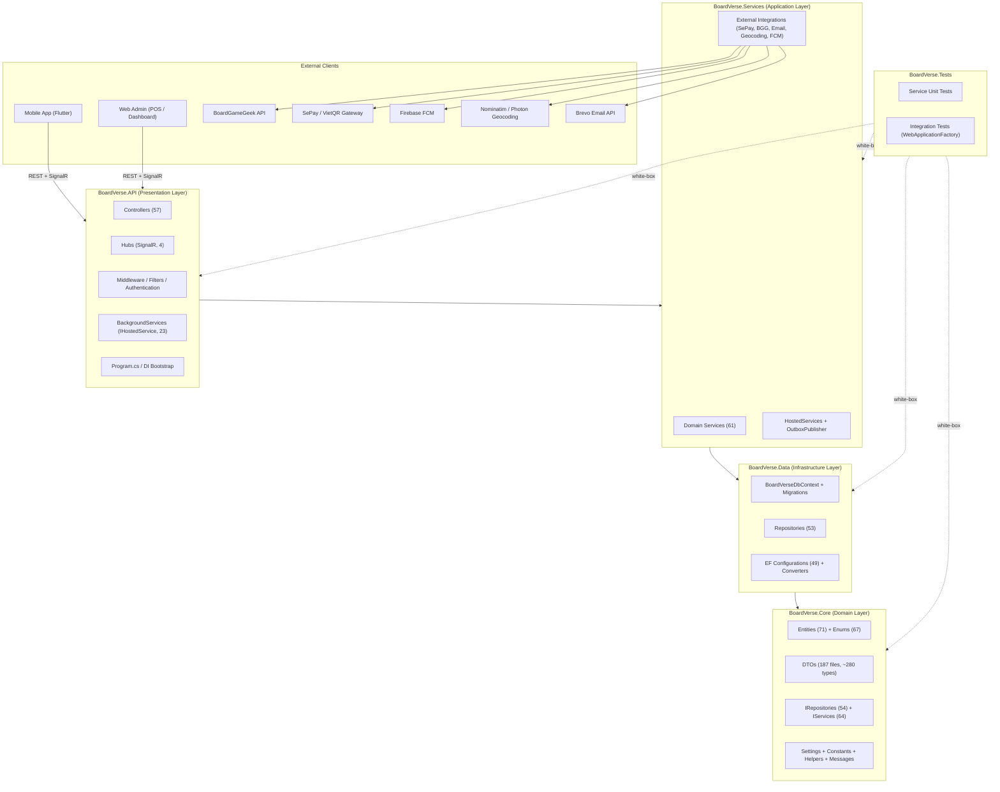
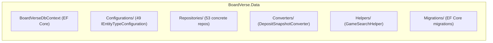
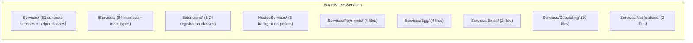
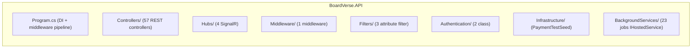
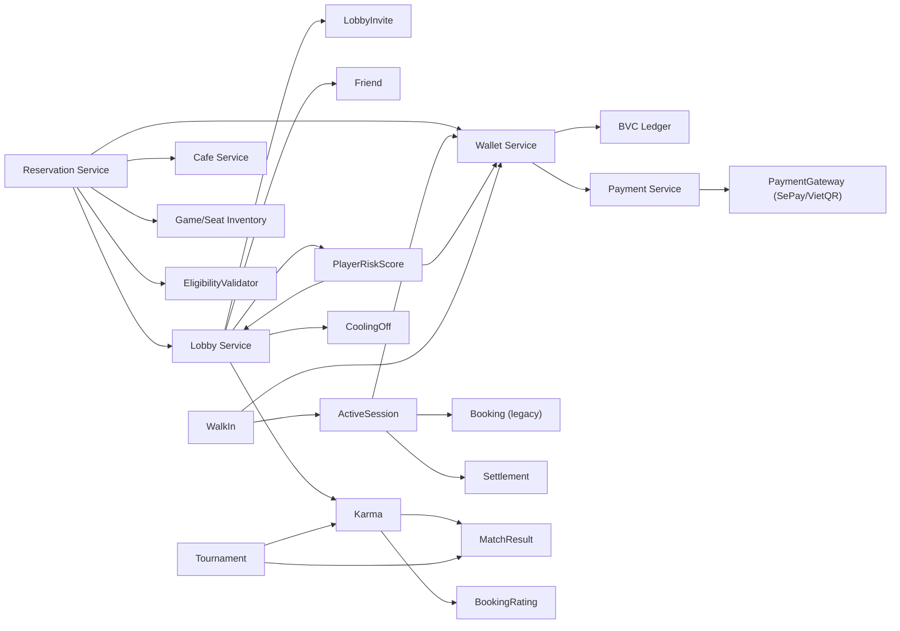

# 1.2 Package Diagram — BoardVerse Backend

Tài liệu này mô tả **package diagram đầy đủ tuyệt đối** cho toàn bộ backend BoardVerse. Mọi file `.cs` trong 5 project đều được liệt kê (class, record, enum, interface, struct) — không có ngoại lệ.

Nội dung gồm:

1. Tổng quan solution (.NET 8, Clean Architecture 4-tier + test project).
2. Package diagram cấp hệ thống (External clients ↔ API ↔ Services ↔ Data ↔ Core).
3. Package diagram chi tiết từng project — **kèm danh sách 100% các type trong mỗi package**.
4. Dependency matrix (Project ↔ Project).
5. Mapping sub-system nghiệp vụ ↔ package (Controllers / Services / Repositories / Entities).
6. Sơ đồ phụ thuộc giữa các service.

---

## 1.2.1 Tổng quan Solution

BoardVerse backend là một solution .NET 8 theo kiến trúc **4-tier + 1 test project**, tuân thủ Clean Architecture:

| # | Project (.csproj) | Vai trò | Phụ thuộc |
|---|---|---|---|
| 1 | `BoardVerse.Core` | Domain layer (entities, enums, DTOs, interfaces, settings, messages) | (không phụ thuộc project khác trong solution) |
| 2 | `BoardVerse.Data` | Infrastructure / Persistence layer (EF Core, repositories, configurations) | → `BoardVerse.Core` |
| 3 | `BoardVerse.Services` | Application layer (business logic, hosted services, external integrations) | → `BoardVerse.Data` → `BoardVerse.Core` |
| 4 | `BoardVerse.API` | Presentation layer (controllers, hubs, middleware, background jobs, DI bootstrap) | → `BoardVerse.Services` → `BoardVerse.Data` → `BoardVerse.Core` |
| 5 | `BoardVerse.Tests` | Unit / integration tests (xUnit) | → tất cả (qua `InternalsVisibleTo`) |

Ngoài 5 project trên, solution còn một số **console helper** (`CheckDb`, `RunMigration`, `GenToken`, `ApplyMigration`, `CreateTestPlayers`, `ResetTestPlayerPasswords`, `TempVerify`, `temp_insert_boxes`, `temp_seed_boxes`, `temp_query`) — đây là công cụ ad-hoc dùng cho testing/migration, không thuộc runtime system nên tách riêng.

---

## 1.2.2 Package Diagram tổng thể (system-level)

**Quy tắc phụ thuộc (dependency rule):**

- Mọi mũi tên chỉ đi **xuôi** từ layer ngoài vào layer trong: `API → Services → Data → Core`.
- `Core` không được reference `Data` / `Services` / `API` — đây là dependency rule cốt lõi của Clean Architecture.
- `Tests` reference mọi layer (white-box testing), nhưng `InternalsVisibleTo` chỉ mở cho `Tests` từ `Services` và `Data`.
- Domain layer (Core) không phụ thuộc bất kỳ framework nào ngoài `NetTopologySuite` (dùng cho PostGIS geography type).

---

## 1.2.3 Package Diagram chi tiết từng Project

### A. `BoardVerse.Core` — Domain Layer

`Core` chứa toàn bộ domain model, không có logic truy cập DB hay HTTP. Mục đích: chia sẻ "ngôn ngữ chung" giữa mọi layer.

```mermaid
flowchart LR
 subgraph Core["BoardVerse.Core"]
 Entities["Entities/ (71 entities)"]
 Enums["Enum/ (67 enums)"]
 DTOs["DTOs/ (~280 DTO records/classes trong 27 folder con)"]
 IfaceRepo["IRepositories/ (54 interface)"]
 IfaceSvc["IServices/ (64 interface)"]
 Settings["Settings/ (8 Settings POCO)"]
 Constants["Constants/ (CafeSchedule, LobbyInviteLimits, CafePartnerActivationRules, IScheduleResolver)"]
 Helpers["Helpers/ (26 helpers)"]
 Common["Common/ (PaginatedResponse, PaginationParams, PaginationMeta)"]
 Exceptions["Exceptions/ (AppExceptions + 41 typed exception)"]
 Messages["Messages/ (ApiErrorMessages, ApiSuccessMessages, ApiEmailMessages)"]
 Validation["Validation/ (MinimumAgeAttribute)"]
 Json["Json/ (FlexibleDateOnlyJsonConverter)"]
 DataSeeds["Data/ (GameCatalog, ComponentCatalog, DevSeedConstants, SystemConfigKeys, BggCategoryMapper, GameCategorySeedMap)"]
 end
```

#### A.1. `Entities/` — 71 POCO entity

| # | Entity | Mô tả ngắn |
|---|---|---|
| 1 | `ActiveSession` | Phiên chơi tổng tại quán (POS active) |
| 2 | `ActiveSessionGame` | Game đang chơi trong active session |
| 3 | `ActiveSessionMember` | Thành viên trong active session |
| 4 | `Booking` | Booking legacy (Flow B — BR-22 per-member deposit) |
| 5 | `BookingDeposit` | Deposit per-member cho booking legacy |
| 6 | `BookingNoShowVote` | Biểu quyết no-show |
| 7 | `BookingRating` | Đánh giá sau booking |
| 8 | `BvcLedgerEntry` | Sổ cái BVC (append-only) |
| 9 | `BvcRefundRequest` | Yêu cầu refund BVC |
| 10 | `BvcTopUpRequest` | Yêu cầu nạp BVC |
| 11 | `Cafe` | Quán đối tác |
| 12 | `CafeConfig` | Cấu hình cọc/PR của cafe |
| 13 | `CafeGameComponentPenalty` | Bảng giá phạt linh kiện của cafe |
| 14 | `CafeGameInventory` | Tồn kho game của cafe |
| 15 | `CafeInventoryBox` | Hộp board game vật lý |
| 16 | `CafePartnerApplication` | Đơn đăng ký làm đối tác |
| 17 | `CafeScheduleOverride` | Override giờ mở cửa (ngày lễ, qua đêm) |
| 18 | `CafeSettlement` | Settlement doanh thu cho cafe |
| 19 | `CafeShift` | Ca làm việc của staff |
| 20 | `CafeStaff` | Nhân viên cafe |
| 21 | `CafeTable` | Bàn/quầy (theo dõi trạng thái — không dùng cho layout) |
| 22 | `Category` | Danh mục board game |
| 23 | `ComponentCheckResult` | Kết quả kiểm kê linh kiện |
| 24 | `ComponentLossReport` | Báo cáo mất/hỏng linh kiện |
| 25 | `DepositSnapshot` | Owned type — snapshot cọc trong `Reservation` |
| 26 | `DeviceToken` | FCM token cho push notification |
| 27 | `FriendNote` | Ghi chú về bạn bè |
| 28 | `FriendReport` | Báo cáo vi phạm + enum `FriendReportCategory` |
| 29 | `Friendship` | Quan hệ bạn bè |
| 30 | `GameComponentTemplate` | Template linh kiện cho game |
| 31 | `GameInventory` | Tồn kho game (tổng quát) |
| 32 | `GameTemplate` | Template board game |
| 33 | `GameTemplateCategory` | Bảng nối Game ↔ Category |
| 34 | `KarmaLog` | Lịch sử thay đổi Karma |
| 35 | `KarmaShortPlayRecord` | Ghi nhận chơi ngắn (early checkout) |
| 36 | `Lobby` | Phòng chờ trực tuyến |
| 37 | `LobbyAtRiskWarning` | Cảnh báo lobby có nguy cơ fail |
| 38 | `LobbyInvite` | Lời mời vào lobby |
| 39 | `LobbyMember` | Thành viên lobby + enum `LobbyMemberStatus` |
| 40 | `LobbyMessage` | Tin nhắn chat trong lobby |
| 41 | `LobbyNotificationSent` | Tracking notification đã gửi + enum `LobbyNotificationMilestone` |
| 42 | `LobbyReport` | Báo cáo lobby vi phạm + enum `LobbyReportCategory` |
| 43 | `MatchHistory` | Lịch sử trận đấu (Elo) |
| 44 | `MatchHistoryParticipant` | Người chơi trong match history |
| 45 | `MatchResult` | Kết quả trận đấu |
| 46 | `OutboxEvent` | Transactional outbox cho event |
| 47 | `PlayerActionHistory` | Audit admin action |
| 48 | `PlayerAlert` | Cảnh báo cho admin |
| 49 | `PlayerKarmaRating` | Điểm Karma |
| 50 | `PlayerLocationHistory` | Lịch sử vị trí user |
| 51 | `PlayerRiskScore` | Điểm rủi ro 0-100 |
| 52 | `PosCheckInToken` | QR check-in token (chống replay) |
| 53 | `RefreshToken` | JWT refresh token |
| 54 | `RefundTransaction` | Giao dịch refund |
| 55 | `Reservation` | Reservation mới (Flow A — BVC wallet) |
| 56 | `RiskScoreHistory` | Lịch sử risk score theo ngày |
| 57 | `SeatInventory` | Tồn kho ghế theo cafe × time slot |
| 58 | `SePayAccount` | Tài khoản SePay (BoardVerse + cafe) |
| 59 | `SystemConfiguration` | Cấu hình hệ thống key-value |
| 60 | `Tournament` | Giải đấu |
| 61 | `TournamentMatchBracket` | Bảng đấu |
| 62 | `TournamentMatchEloContribution` | Đóng góp Elo từ mỗi trận |
| 63 | `TournamentParticipant` | Người đăng ký giải |
| 64 | `TournamentSpectator` | Khán giả giải đấu |
| 65 | `TournamentWaitlist` | Danh sách chờ |
| 66 | `Transaction` | Giao dịch (legacy) |
| 67 | `User` | Tài khoản người dùng |
| 68 | `UserProfile` | Hồ sơ user |
| 69 | `WalkInBooking` | Walk-in booking (legacy + mới) |
| 70 | `WalkInWindow` | Cửa sổ walk-in cho slot trống |
| 71 | `Wallet` | Ví BVC của user |

#### A.2. `Enum/` — 67 enum nghiệp vụ

| # | Enum | Mục đích |
|---|---|---|
| 1 | `AccountStatus` | Trạng thái tài khoản (active/warning/restricted/suspended/banned) |
| 2 | `AdminActionType` | Loại admin action |
| 3 | `AdminPunishmentActionType` | Loại hình phạt |
| 4 | `BoardGameComponentKind` | Loại linh kiện (meeple/card/dice/...) |
| 5 | `BookingDepositStatus` | Trạng thái deposit booking |
| 6 | `BookingStatus` | Trạng thái booking (PENDING_DEPOSIT/CONFIRMED/CHECKED_IN/EXPIRED/CANCELLED_*) |
| 7 | `BvcTopUpStatus` | Trạng thái nạp BVC |
| 8 | `CafeGameInventoryStatus` | Trạng thái tồn kho game |
| 9 | `CafePartnerApplicationStatus` | Trạng thái đơn đăng ký đối tác |
| 10 | `CafePartnerBillingModel` | Mô hình tính tiền (TimeBased/FlatEntry) — BR-01 |
| 11 | `CafePartnerOperationalStatus` | Trạng thái vận hành quán |
| 12 | `CafeSettlementStatus` | Trạng thái settlement |
| 13 | `CafeTableStatus` | AVAILABLE/HOLDING/RESERVED/IN_USE |
| 14 | `ComponentCheckStatus` | OK/MISSING/DAMAGED |
| 15 | `DepositRefundPolicy` | Chính sách hoàn cọc (Full/Partial/None) |
| 16 | `FriendshipRelationshipDirection` | Hướng quan hệ bạn bè |
| 17 | `FriendshipStatus` | Pending/Accepted/Blocked |
| 18 | `GameComponentCatalogSource` | Nguồn catalog linh kiện |
| 19 | `GamePlayNavigationTarget` | Target cho routing gameplay |
| 20 | `GamerTier` | Tier người chơi (BRONZE/SILVER/GOLD/PLATINUM) |
| 21 | `GroupSessionStatus` | ACTIVE/CHECKING/UNPAID/PAID |
| 22 | `IndividualSessionStatus` | PLAYING/SUSPENDED_MUTATION/FINISHED |
| 23 | `InventorySortField` | Field sort cho inventory |
| 24 | `KarmaLevel` + `KarmaStatus` | Mức Karma |
| 25 | `KarmaLogSource` | Nguồn ghi Karma |
| 26 | `KarmaRatingTag` | Tag rating (Friendly/Punctual/Cheater/...) |
| 27 | `KarmaRecordStatus` | Trạng thái record |
| 28 | `KarmaViolationCategory` | Loại vi phạm |
| 29 | `LedgerEntryType` | TOP_UP/DEPOSIT_HOLD/RELEASE/CAPTURE/FORFEIT/ADJUSTMENT |
| 30 | `LobbyInviteStatus` | Pending/Accepted/Declined/Expired/Cancelled |
| 31 | `LobbyStatus` | 12 trạng thái lobby (open/viable/full/inProgress/closed/timeoutFailed/hostCancelled/pendingCafeApproval/rejectedByCafe/expiredByCafe/pendingActivation) |
| 32 | `MatchConsensusStatus` | Trạng thái đồng thuận match |
| 33 | `MatchOutcome` | Win/Lose/Draw |
| 34 | `MatchType` | Swiss/Final/ThirdPlaceMatch |
| 35 | `NearbyCafeGameAvailabilityStatus` | Trạng thái game khả dụng lân cận |
| 36 | `OutboxEventType` | LobbyActivated/ReservationHeld/DepositHeld/LobbyConfirmed/LobbyTimeout |
| 37 | `PayTrigger` | Trigger thanh toán |
| 38 | `PlayerAlertSeverity` | Info/Warning/Critical |
| 39 | `PlayerAlertStatus` | Open/Acknowledged/Resolved/Dismissed |
| 40 | `PlayerAlertType` | auto_threshold_crossed/multi_account_detected/manual_report/admin_flagged |
| 41 | `PlayerLocationSource` | Nguồn location (GPS/IP/Manual) |
| 42 | `PlayerPlayMode` | Online/Offline |
| 43 | `PlayTimeRange` | Short/Medium/Long/Epic |
| 44 | `RefundReason` | Lý do refund |
| 45 | `RefundRequestStatus` | Trạng thái yêu cầu refund |
| 46 | `RefundStatus` | Trạng thái refund |
| 47 | `ReservationStatus` | 12 trạng thái reservation |
| 48 | `ReservationValidationError` | Lỗi validation reservation |
| 49 | `RiskLevel` | Low/Medium/High/Critical |
| 50 | `SePayAccountType` | BoardVerse central/Cafe merchant |
| 51 | `SessionEndReason` | Lý do kết thúc session |
| 52 | `ShiftStatus` | Open/Closed |
| 53 | `TimeSlot` | Morning/Afternoon/Evening/LateNight (BR-NEW-15) |
| 54 | `TournamentMatchStatus` | Pending/InProgress/Completed/Cancelled |
| 55 | `TournamentPairingMode` | Auto/Manual |
| 56 | `TournamentParticipantStatus` | Registered/CheckedIn/Withdrawn/Eliminated/Winner |
| 57 | `TournamentStatus` | Draft/RegistrationOpen/InProgress/Completed/Cancelled |
| 58 | `TournamentWaitlistStatus` | Waiting/Promoted/Cancelled |
| 59 | `TransactionDirection` | In/Out |
| 60 | `TransactionStatus` | Pending/Completed/Failed |
| 61 | `TransactionType` | Booking/Session/Refund/TopUp |
| 62 | `UserAccountStatus` | Trạng thái tài khoản user |
| 63 | `UserRole` | Player/Manager/Staff/Admin |
| 64 | `WalkInBookingStatus` | Active/Completed/Cancelled |
| 65 | `WalkInPaymentStatus` | Paid/Unpaid/Refunded |
| 66 | `WalkInWindowStatus` | Open/Closed/Expired |
| 67 | `PayTrigger` | (đã liệt kê ở #37) |

#### A.3. `IRepositories/` — 54 interface repositories

| # | Repository Interface |
|---|---|
| 1 | `IActiveSessionRepository` |
| 2 | `IAdminModerationRepository` |
| 3 | `IAuthRepository` |
| 4 | `IBookingDepositRepository` |
| 5 | `IBookingNoShowVoteRepository` |
| 6 | `IBookingRatingRepository` |
| 7 | `IBookingRepository` |
| 8 | `IBvcLedgerEntryRepository` |
| 9 | `IBvcRefundRequestRepository` |
| 10 | `IBvcTopUpRequestRepository` |
| 11 | `ICafeConfigRepository` |
| 12 | `ICafeInventoryRepository` |
| 13 | `ICafePartnerApplicationRepository` |
| 14 | `ICafePosRepository` |
| 15 | `ICafeRepository` |
| 16 | `ICafeScheduleOverrideRepository` |
| 17 | `ICafeSettlementRepository` |
| 18 | `ICafeShiftRepository` |
| 19 | `ICafeTableRepository` |
| 20 | `ICategoryRepository` |
| 21 | `IDatabaseTransactionContext` |
| 22 | `IDeviceTokenRepository` |
| 23 | `IFriendNoteRepository` |
| 24 | `IFriendReportRepository` |
| 25 | `IFriendshipRepository` |
| 26 | `IGameComponentTemplateRepository` |
| 27 | `IGameInventoryRepository` |
| 28 | `IGameTemplateRepository` |
| 29 | `IHealthRepository` |
| 30 | `IKarmaRatingRepository` |
| 31 | `IKarmaShortPlayRecordRepository` |
| 32 | `ILobbyInviteRepository` |
| 33 | `ILobbyMemberRepository` |
| 34 | `ILobbyMessageRepository` |
| 35 | `ILobbyRepository` |
| 36 | `IMatchResultRepository` |
| 37 | `IOutboxRepository` |
| 38 | `IPlayerAlertRepository` (+ inner `PlayerAlertQuery`) |
| 39 | `IPlayerRiskScoreRepository` |
| 40 | `IPosCheckInTokenRepository` |
| 41 | `IRefundTransactionRepository` |
| 42 | `IReservationRepository` |
| 43 | `ISeatInventoryRepository` |
| 44 | `ISePayAccountRepository` |
| 45 | `ISystemConfigurationRepository` |
| 46 | `ITournamentRepository` |
| 47 | `ITournamentSpectatorRepository` |
| 48 | `ITournamentWaitlistRepository` |
| 49 | `ITransactionRepository` |
| 50 | `IUserManagementRepository` |
| 51 | `IUserProfileRepository` (+ inner `LeaderboardMetric`, `LeaderboardRankRow`, `KarmaLeaderboardRow`, `EloLeaderboardRow`) |
| 52 | `IWalkInBookingRepository` |
| 53 | `IWalkInWindowRepository` |
| 54 | `IWalletRepository` |

#### A.4. `IServices/` — 64 interface services (trong `BoardVerse.Services/IServices/`)

| # | Service Interface |
|---|---|
| 1 | `IActiveSessionService` |
| 2 | `IAdminMasterCatalogService` |
| 3 | `IAdminModerationService` |
| 4 | `IAdminReportService` |
| 5 | `IAdminSystemConfigurationService` |
| 6 | `IAuthService` |
| 7 | `IBggGameService` |
| 8 | `IBoardGameService` |
| 9 | `IBookingDepositService` |
| 10 | `IBookingRatingService` |
| 11 | `IBookingService` |
| 12 | `IBvcRefundRequestService` |
| 13 | `ICafeBookingService` |
| 14 | `ICafeInventoryService` |
| 15 | `ICafePartnerApplicationService` |
| 16 | `ICafePosService` |
| 17 | `ICafeScheduleService` |
| 18 | `ICafeService` |
| 19 | `ICafeShiftService` |
| 20 | `ICoolingOffService` |
| 21 | `ICurrentUserService` |
| 22 | `IDeviceTokenService` |
| 23 | `IEmailService` |
| 24 | `IFriendNoteService` |
| 25 | `IFriendReportService` |
| 26 | `IFriendService` |
| 27 | `IGameSeedService` |
| 28 | `IGameTemplateService` |
| 29 | `IHealthService` |
| 30 | `IKarmaConfigurationService` |
| 31 | `IKarmaRatingService` |
| 32 | `IKarmaService` (+ inner `KarmaWarningResult`, `KarmaRestrictionResult`) |
| 33 | `ILeaderboardService` |
| 34 | `ILevelingService` |
| 35 | `ILobbyHubService` |
| 36 | `ILobbyInviteService` |
| 37 | `ILobbyMessageService` |
| 38 | `ILobbyService` |
| 39 | `IManualPaymentService` |
| 40 | `IMatchResultService` |
| 41 | `IOutboxEventPublisher` |
| 42 | `IPaymentService` |
| 43 | `IPaymentGatewayService` (trong `Services/Payments/PaymentGatewayService.cs`) |
| 44 | `IQrImageProxyService` (trong `Services/Payments/QrImageProxyService.cs`) |
| 45 | `ISePayClient` (trong `Services/Payments/SePayClient.cs`) |
| 46 | `IVietQrClient` (trong `Services/Payments/VietQrClient.cs`) |
| 47 | `IGeocodingClient` (trong `Services/Geocoding/`) |
| 48 | `IMemoryCacheGeocoding` (trong `Services/Geocoding/`) |
| 49 | `IPlayerGeocodingService` (trong `Services/Geocoding/`) |
| 50 | `IBggGameService` |
| 51 | `IPlayerAlertService` (+ inner `PlayerAlertMetricsDto`) |
| 52 | `IPlayerCheckInService` |
| 53 | `IPlayerKarmaService` |
| 54 | `IPlayerRiskQueryService` |
| 55 | `IPlayerRiskScoreService` |
| 56 | `IPosHubService` |
| 57 | `IPushNotificationService` (+ inner `PushNotificationPayload`) |
| 58 | `IReceiptService` |
| 59 | `IReservationExtensionService` |
| 60 | `IReservationService` |
| 61 | `ISePayAccountService` |
| 62 | `ISettlementService` |
| 63 | `ISystemConfigurationProvider` |
| 64 | `ITimeSlotService` |
| 65 | `ITournamentService` |
| 66 | `ITournamentSpectatorService` |
| 67 | `ITournamentWaitlistService` |
| 68 | `IUserManagementService` |
| 69 | `IUserProfileService` |
| 70 | `IWalkInService` |
| 71 | `IWalletService` (+ inner `BvcHoldResult`) |
| 72 | `RefundDepositResult` (record helper) |

#### A.5. `DTOs/` — 187 file, ~280 DTO types, 27 bounded-context folder

Tổng số file theo từng folder con:

| Folder con | Số file | Một số DTO tiêu biểu |
|---|---:|---|
| `Admin/` | 15 | `AdminAdjustKarmaRequestDto`, `AdminAdjustKarmaResponseDto`, `AdminBoardGameResponseDto`, `AdminUpdateBoardGameRequestDto`, `AdminUpdateThumbnailRequestDto`, `AdminCategoryResponseDto`, `AdminCreateCategoryRequestDto`, `AdminUpdateCategoryRequestDto`, `AdminCreateGameComponentRequestDto`, `AdminUpdateGameComponentRequestDto`, `AdminSetGameCategoriesRequestDto`, `AdminPunishUserRequestDto`, `AdminPunishUserResponseDto`, `AdminTournamentListItemDto`, `AdminTournamentDetailDto`, `AdminCafeStaffDto`, `AdminTournamentParticipantDto`, `AdminCreateTournamentRequestDto`, `AdminUpdateTournamentRequestDto`, `AdminTournamentListResponseDto`, `AdminTournamentParticipantsResponseDto`, `AdminDashboardOverviewDto`, `AdminLobbyFailuresReportDto`, `AdminLobbyFailureItemDto`, `AdminDepositItemDto`, `AdminDepositsReportDto`, `AdminDepositTrendItemDto`, `AdminCafePerformanceDto`, `AdminCafePerformanceReportDto`, `AdminCafeListItemDto`, `AdminCafeDetailDto`, `AdminCreateCafeRequestDto`, `AdminUpdateCafeRequestDto`, `AdminCafeListResponseDto`, `AlertResolveRequestDto`, `ReleaseCoolingOffRequestDto`, `ReleaseCoolingOffResponseDto`, `CoolingOffUserDto`, `ExtendCoolingOffRequestDto`, `ExtendCoolingOffResponseDto`, `PlayerRiskDetailDto`, `KarmaLogDto`, `PlayerActionHistoryDto`, `PlayerActionHistoryQuery`, `PlayerAlertDto`, `SystemConfigEntryDto`, `SystemConfigBulkUpdateRequestDto`, `SystemConfigUpdateItemDto`, `UserKarmaAlertDto` |
| `Auth/Requests/` | 11 | `ChangePasswordDto`, `GoogleAuthRequestDto`, `LinkGoogleRequestDto`, `LoginRequestDto`, `RefreshTokenRequestDto`, `RegisterRequestDto`, `RequestPasswordResetDto`, `ResetPasswordDto`, `SendEmailVerificationRequestDto`, `TestGoogleLoginDto`, `VerifyEmailRequestDto` |
| `Auth/Responses/` | 3 | `LoginResponseDto`, `RefreshTokenResponseDto`, `RegisterResponseDto` |
| `Bgg/` | 1 | `BggDtos.cs` (chứa `BggComponentCatalogItemDto`, `BggResolvedComponentDto`, `BggGamePreviewDto`, `BggSearchResultItemDto`, `ImportGameFromBggRequestDto`, `ImportGameFromBggResponseDto`) |
| `Booking/` | 9 | `AvailableCafeTableDto`, `BookingCafeSummaryDto`, `BookingRatingItemDto`, `SubmitBookingRatingsRequestDto`, `BookingRatingResponseDto`, `BookingRatingStatusDto`, `BookingRatingAggregationResultDto`, `BookingResponseDto`, `BookingSessionStatusResponseDto`, `BookingSessionMemberStatusDto`, `BookingSessionEstimatedBillDto`, `CafeAvailabilityDto`, `CafeAvailabilitySlotDto`, `CreateBookingRequestDto`, `SubmitNoShowVoteRequestDto`, `NoShowVoteCountDto`, `NoShowVoteResponseDto`, `UpdateBookingRequestDto` |
| `Cafe/` | 15 | `AddStaffRequestDto`, `AdminCafeOperationalStatusResultDto`, `AdminSetCafeOperationalStatusRequestDto`, `CafeDetailDto`, `CafeMinDepositDto`, `CafeConfigDto`, `CafeScheduleOverrideDto`, `CafeDto`, `ManagerCafeDto`, `NearbyAlternativeGameSuggestionDto`, `NearbyCafeDto`, `NearbyCafeSearchResultDto`, `PromoteStaffRequestDto`, `StaffDto`, `UpdateCafeRequestDto`, `UpdatePricingConfigRequestDto`, `CafePricingConfigResponseDto`, `UpdateRefundPolicyRequestDto`, `RefundTierDto`, `RefundPolicyResponseDto`, `UpdateSePayConfigRequestDto` |
| `CafePartner/` | 8 | `AdminCafePartnerApplicationQueryDto`, `CafePartnerApplicationResponseDto`, `ManagerCafeProfileResponseDto`, `OnboardPartnerResultDto`, `RejectCafePartnerApplicationRequestDto`, `SubmitCafePartnerApplicationRequestDto`, `UpdateOperationalProfileRequestDto`, `WorkingHoursDto` |
| `CafeSchedule/` | 1 | `CafeScheduleOverrideDtos.cs` (`UpsertCafeScheduleOverrideRequestDto`, `CafeScheduleOverrideResponseDto`, `CafeScheduleResponseDto`) |
| `CafeShift/` | 2 | `CafeShiftResponseDto`, `CafeShiftHistoryResponseDto`, `OpenShiftRequestDto`, `CloseShiftRequestDto` |
| `Common/` | 2 | `ApiResponse`, `PaginatedResult` |
| `Friend/` | 3 | `FriendDtos.cs` (`SendFriendRequestDto`, `FriendshipResponseDto`, `FriendSummaryDto`, `UserSearchResultDto`, `PlayerProfileDto`, `RelationshipDto`), `FriendAdvancedDtos.cs` (`SendFriendRequestWithMessageDto`, `FriendActivityDto`, `FriendSuggestionDto`, `MutualFriendDto`, `UpdateFriendPrivacyDto`, `FriendDetailDto`), `FriendNoteAndReportDtos.cs` (`UpsertFriendNoteDto`, `FriendNoteDto`, `CreateFriendReportDto`, `FriendReportDto`) |
| `Game/` | 13 | `BoardGameComponentDto`, `BoardGameDetailDto`, `BoardGameListItemDto`, `CategoryDto`, `GameCatalogSeedDto`, `GameCatalogComponentDto`, `GameComponentTemplateDto`, `GamePlayConfigurationDto`, `GamePlayNavigationResponseDto`, `GamePlayRoomConfigurationDto`, `GetBoardGamesQuery`, `GetMasterGamesQuery`, `MasterGameResponseDto`, `ResolveGamePlayNavigationRequestDto` |
| `Inventory/` | 7 | `AddCafeInventoryRequestDto`, `CafeInventoryBrowseDto`, `CafeInventoryResponseDto`, `ComponentPenaltyRequestDto`, `ComponentPenaltyResponseDto`, `GetCafeInventoryQuery`, `UpdateCafeInventoryRequestDto` |
| `Lobby/` | 6 | `ChangeTimeSlotRequestDto`, `CreateLobbyRequestDto`, `UpdateLobbyRequestDto`, `CreateLobbyReportDto`, `LobbyMemberDto`, `LobbyMessageDto`, `LobbyResponseDto`, `DissolveLobbyResponseDto`, `SearchLobbiesRequestDto` |
| `LobbyInvite/` | 1 | `LobbyInviteDtos.cs` (`SendLobbyInviteRequestDto`, `LobbyInviteResponseDto`, `JoinLobbyByShareCodeRequestDto`, `LobbyShareInfoDto`, `LobbyInvitableFriendsQuery`, `LobbyInviteFriendStatus`, `LobbyInvitableFriendDto`) |
| `Match/` | 3 | `MatchResultStatusDto`, `MatchOutcomeOptionDto`, `MatchMemberSubmissionDto`, `SubmitMatchResultRequestDto`, `UpdateMatchResultRequestDto` |
| `Notification/` | 1 | `DeviceTokenDto` |
| `Payment/` | 13 | `BookingDepositResponseDto`, `ConfirmPaymentResponseDto`, `CreatePaymentRequestDto`, `CreatePaymentResponseDto`, `CreateSessionPaymentDto`, `ManualPaymentConfirmDto`, `MockWebhookRequestDto`, `RefundDepositRequestDto`, `RefundDepositResponseDto`, `RegenerateQrResponseDto`, `SePayAccountDto`, `SePayWebhookDto`, `SnakeOrCamelConverter`, `SePayAccountQuery`, `SetEnvironmentRequestDto`, `SePayTransactionLookupDto`, `UpdateSePayAccountRequestDto` |
| `Pos/` | 20 | `ActiveSessionDto`, `ActiveSessionGameDto`, `ActiveSessionMemberDto`, `BookingPreviewDto`, `BookingMemberInfoDto`, `BookingLobbyInfoDto`, `BoxComponentHistoryDto`, `BoxComponentIncidentDto`, `BoxMissingComponentDto`, `CafeInventoryBoxDto`, `CafeTableStatusDto`, `CafeTableSyncItem`, `CheckInRequestDto`, `ComponentChecklistDto`, `ComponentCheckItemDto`, `ComponentCheckResultDto`, `ComponentCheckResultItemDto`, `DisputePlayedTimeRequestDto`, `DisputePlayedTimeResponseDto`, `OverridePlayedTimeRequestDto`, `OverridePlayedTimeResponseDto`, `GetPaidSessionsQuery`, `PaidSessionDto`, `PaidSessionsPagedResult`, `PosCheckInTokenDto`, `CreatePosCheckInTokenRequestDto`, `ReturnGameRequestDto`, `DamagedComponentDto`, `ReturnGameResponseDto`, `StartGameSessionRequestDto`, `SubmitComponentCheckRequestDto`, `SyncCafeTablesRequestDto`, `UpdateCafeTableRequestDto` |
| `Rating/` | 4 | `LobbyKarmaRatingContextDto`, `KarmaRatingTagOptionDto`, `LobbyMemberRatingTargetDto`, `LobbyKarmaRatingNotificationDto`, `SubmitKarmaRatingsRequestDto`, `KarmaRatingEntryDto`, `SubmitKarmaRatingsResponseDto`, `KarmaRatingAppliedDto` |
| `Receipt/` | 2 | `RevenueReportDto`, `RevenuePeriodDto`, `RevenueGameBreakdownDto`, `SessionReceiptDto`, `MemberReceiptItemDto` |
| `Reservation/` | 5 | `AdminOverrideRefundRequestDto`, `AdminOverrideRefundResultDto`, `DistanceBucket`, `DepositQuoteResult`, `EligibilityContext`, `ExtendReservationRequestDto`, `ExtendReservationResponseDto`, `ExtendAvailabilityDto`, `PlayerScanTokenRequestDto`, `PlayerScanTokenResponseDto`, `ReservationQuoteRequestDto`, `ReservationQuoteDto`, `EarlyCheckoutRefundPreview`, `ReservationConfirmRequestDto`, `ReservationConfirmResponseDto`, `CancelReservationRequestDto`, `CancelReservationResponseDto`, `CancelAfterCheckinRequestDto`, `CancelAfterCheckinResponseDto`, `CafeApprovalRequestDto`, `CafeApprovalResponseDto`, `ReservationCheckInRequestDto`, `ReservationCheckInResponseDto`, `ReservationDetailDto`, `ReservationListItemDto`, `ReservationListRequestDto`, `ReservationListResponseDto`, `LobbyPendingApprovalItemDto`, `LobbyPendingApprovalRequestDto`, `LobbyPendingApprovalListResponseDto`, `EndReservationRequestDto`, `EndReservationResponseDto` |
| `Session/` | 10 | `AttachGameRequestDto`, `AddLateMemberRequestDto`, `RecordInventoryLossRequestDto`, `RecordPreSessionInventoryLossRequestDto`, `ComponentLossItemDto`, `AlternativeCafesResponseDto`, `AlternativeCafeDto`, `ActiveSessionResponseDto`, `AddGuestSlotRequestDto`, `CheckoutRequestDto`, `ComponentCheckoutItemDto`, `MemberInvoiceDto`, `PenaltyDetailDto`, `BvcCaptureStatus`, `MergeSessionRequestDto`, `MergeSessionResponseDto`, `PartialCheckoutRequestDto`, `PaySessionRequestDto`, `ComponentPenaltyItemDto`, `PaySessionResponseDto`, `StartSessionRequestDto` |
| `TimeSlotOverride/` | 1 | `TimeSlotDtos.cs` (`DefaultTimeSlotDto`, `ManagerTimeSlotResponseDto`, `CreateTimeSlotOverrideRequestDto`, `UpdateTimeSlotOverrideRequestDto`) |
| `Tournament/` | 18 | `AddWalkInParticipantRequestDto`, `CancelMatchRequestDto`, `CreateTournamentRequestDto`, `EloHistoryResponseDto`, `EloHistoryEntryDto`, `LeaderboardEntryDto`, `LeaderboardResponseDto`, `ManualPairingDto`, `SetRoundPairingsRequestDto`, `RoundPairingsResponseDto`, `MyTournamentRegistrationDto`, `NoShowDetectionResult`, `SetPairingModeRequestDto`, `StartTournamentOptionsDto`, `RecordMatchResultRequestDto`, `MatchPlayerResultDto`, `TournamentMatchResponseDto`, `TournamentParticipantResponseDto`, `TournamentQueryDto`, `TournamentResponseDto`, `ManualPairingsSummaryDto`, `TournamentSpectatorDto`, `TournamentWaitlistEntryDto`, `UpdateMatchResultRequestDto`, `UpdateTournamentRequestDto` |
| `User/` | 19 | `AdminBlockUserDto`, `AdminCreateUserDto`, `AdminUpdateUserDto`, `AdminUpdateUserRoleDto`, `AdminUserDto`, `AdminUserQueryDto`, `ProfileCreateDto`, `ProfileDetailDto`, `LeaderboardEntryDto`, `KarmaLeaderboardEntryDto`, `EloLeaderboardEntryDto`, `KarmaLeaderboardDto`, `EloLeaderboardDto`, `LeaderboardPagedDto`, `KarmaLogEntryDto`, `KarmaStateDto`, `UserKarmaStateDto`, `SubmitKarmaAppealRequestDto`, `PlayerLocationDto`, `PlayerProfileWithStatsDto`, `ProfileProgressUpdateDto`, `ProfileUpdateDto`, `ProfileDto`, `UpdateAvatarRequestDto`, `UpdatePlayerLocationRequestDto`, `UpdatePlayerProfileDto` |
| `WalkIn/` | 1 | `WalkInDtos.cs` (`CreateWalkInBookingRequestDto`, `WalkInBookingResponseDto`, `WalkInWindowDto`, `WalkInWindowsResponseDto`, `CloseWalkInWindowRequestDto`) |
| `Wallet/` | 13 | `AdminAdjustBalanceRequestDto`, `AdminSetStatusRequestDto`, `AdminSetStatusResultDto`, `AdminUserTransactionsPageDto`, `AdminWalletSummaryDto`, `AdminWalletPageDto`, `AdminWalletDetailDto`, `WalletReconcileResultDto`, `BvcTransactionDto`, `BvcTransactionPageDto`, `CreateRefundRequestDto`, `RefundRequestResponseDto`, `RefundRequestPageDto`, `ResolveRefundRequestDto`, `RefundDecision`, `TopUpRequestDto`, `TopUpResponseDto`, `UpdateTopUpRequestDto`, `WalletDto` |

**Tổng DTO: 187 file → ~280 type.**

#### A.6. `Settings/` — 8 POCO options class

| # | Setting | Bind từ appsettings |
|---|---|---|
| 1 | `BggSettings` | `Bgg:*` |
| 2 | `BrevoSettings` | `Brevo:*` |
| 3 | `FirebaseSettings` | `Firebase:*` |
| 4 | `LegacyBookingSettings` | `LegacyBooking:*` |
| 5 | `NominatimSettings` | `Nominatim:*` |
| 6 | `PaymentSettings` | `Payment:*` |
| 7 | `RedisSettings` | `Redis:*` |
| 8 | `SePaySettings` | `SePay:*` |

#### A.7. `Constants/`

| File | Type |
|---|---|
| `CafePartnerActivationRules.cs` | `CafePartnerActivationRules` |
| `CafeSchedule.cs` | `CafeSchedule` (4 timeSlot definitions) |
| `IScheduleResolver.cs` | `IScheduleResolver` (interface) |
| `LobbyInviteLimits.cs` | `LobbyInviteLimits` |

#### A.8. `Helpers/` — 26 static helper

| # | File | Helper |
|---|---|---|
| 1 | `ActiveSessionBillingCalculator.cs` | Tính tiền giờ chơi |
| 2 | `CafeGameWaitTimeHelper.cs` | Tính thời gian chờ game |
| 3 | `CafeInventoryBoxSyncHelper.cs` | Đồng bộ inventory box |
| 4 | `CafePartnerOperationalStatusHelper.cs` | Helper cho partner status |
| 5 | `CafePartnerStatusMapper.cs` | Map partner status |
| 6 | `CafePartnerTableLayoutHelper.cs` | Layout bàn partner |
| 7 | `CafeTableSyncHelper.cs` | Đồng bộ bàn cafe |
| 8 | `CafeTableUpdateHelper.cs` | Update bàn cafe |
| 9 | `EloRatingHelper.cs` | Tính Elo |
| 10 | `GameCatalogMapper.cs` | Map game catalog |
| 11 | `GamePlayRoutingHelper.cs` | Routing gameplay |
| 12 | `GeoLocationHelper.cs` | Tính khoảng cách địa lý |
| 13 | `KarmaRatingHelper.cs` | Tính điểm Karma |
| 14 | `LateCancelRefundCalculator.cs` | Tính refund cancel trễ |
| 15 | `MatchConsensusHelper.cs` | Đồng thuận match |
| 16 | `PosTokenGenerator.cs` | Sinh token POS |
| 17 | `ProfileCompletionRules.cs` | Quy tắc hoàn thiện profile |
| 18 | `ReservationCodeDetector.cs` | Detect reservation code + inner enum `CodeType` |
| 19 | `ReservationTimeOverrunHelper.cs` | Tính overrun time |
| 20 | `SwissPairingHelper.cs` | Ghép cặp Swiss |
| 21 | `TableSizeOptimizer.cs` | Tối ưu size bàn |
| 22 | `TournamentEloCalculator.cs` | Tính Elo tournament |
| 23 | `TournamentKarmaPolicy.cs` | Policy Karma tournament |
| 24 | `TournamentRoundsCalculator.cs` | Tính số vòng |
| 25 | `UserAccessHelper.cs` | Helper truy cập user |
| 26 | `VietnameseTextNormalizer.cs` | Chuẩn hóa text tiếng Việt |

#### A.9. `Common/`

| File | Type |
|---|---|
| `PaginatedResponse.cs` | `PaginatedResponse<T>` |
| `PaginationMeta.cs` | `PaginationMeta` |
| `PaginationParams.cs` | `PaginationParams` |

#### A.10. `Exceptions/`

`AppExceptions.cs` chứa 1 abstract base + 41 typed exception:

`AppException`, `BadRequestException`, `UnauthorizedException`, `ForbiddenException`, `NotFoundException`, `ConflictException`, `UserBlockedException`, `InternalServerErrorException`, `UserNotFoundException`, `UserAlreadyExistsException`, `EmailAlreadyExistsException`, `InvalidCredentialsException`, `TokenExpiredException`, `InvalidTokenException`, `TooManyLoginAttemptsException`, `RefreshTokenExpiredException`, `RefreshTokenNotFoundException`, `VerificationTokenExpiredException`, `PasswordResetTokenExpiredException`, `EmailVerificationRequiredException`, `GoogleTokenValidationException`, `ProfileNotFoundException`, `ProfileAlreadyExistsException`, `ProfileDisabledException`, `ConfigurationMissingException`, `TenantNotFoundException`, `TenantAccessDeniedException`, `InsufficientKarmaException`, `TableAlreadyBookedException`, `BookingNotFoundException`, `InvalidInvoiceException`, `EmailSendingException`, `CafePartnerApplicationNotFoundException`, `OpenCafePartnerApplicationExistsException`, `CafePartnerEmailNotEligibleException`, `CafePartnerApplicationInvalidStatusException`, `CafePartnerApplicationEmailMismatchException`, `CafePartnerActivationRequirementsNotMetException`, `SevereDataDuplicationException`, `BoardGameNotFoundException`, `PaymentException`, `TooManyRequestsException`.

#### A.11. `Messages/`

| File | Mô tả |
|---|---|
| `ApiErrorMessages.cs` | Source of truth cho mọi thông điệp lỗi user-facing (group theo domain: Auth, Profile, Cafe, Inventory, BoardGame, Reservation, Lobby, Wallet, Payment, Karma, Http, Controller, Validation, ...). 3.100 dòng. |
| `ApiSuccessMessages.cs` | Thông điệp thành công |
| `ApiEmailMessages.cs` | Template email |

#### A.12. `Validation/`

| File | Type |
|---|---|
| `MinimumAgeAttribute.cs` | `MinimumAgeAttribute` (BR-11: tuổi ≥ 13) |

#### A.13. `Json/`

| File | Type |
|---|---|
| `FlexibleDateOnlyJsonConverter.cs` | `FlexibleDateOnlyJsonConverter` |

#### A.14. `Data/` (Catalog/Seed)

| File | Type |
|---|---|
| `BggCategoryMapper.cs` | `BggCategoryMapper` |
| `ComponentCatalog.cs` | `ComponentCatalog` |
| `DevSeedConstants.cs` | `DevSeedConstants` |
| `GameCatalog.cs` | `GameCatalog` |
| `GameCategorySeedMap.cs` | `GameCategorySeedMap` |
| `SystemConfigKeys.cs` | `SystemConfigKeys` |

---

### B. `BoardVerse.Data` — Infrastructure / Persistence Layer

`Data` implement các interface từ `Core.IRepositories`, dùng **EF Core + Npgsql** (Neon Postgres + PostGIS).

#### B.1. `Configurations/` — 49 `IEntityTypeConfiguration<T>`

| # | Configuration |
|---|---|
| 1 | `ActiveSessionConfiguration` |
| 2 | `ActiveSessionGameConfiguration` |
| 3 | `ActiveSessionMemberConfiguration` |
| 4 | `BookingConfiguration` |
| 5 | `BookingDepositConfiguration` |
| 6 | `BookingNoShowVoteConfiguration` (+ inner `BookingRatingConfiguration`) |
| 7 | `BvcLedgerEntryConfiguration` |
| 8 | `BvcRefundRequestConfiguration` |
| 9 | `BvcTopUpRequestConfiguration` |
| 10 | `CafeConfiguration` |
| 11 | `CafeGameComponentPenaltyConfiguration` |
| 12 | `CafeGameInventoryConfiguration` |
| 13 | `CafeInventoryBoxConfiguration` |
| 14 | `CafeScheduleOverrideConfiguration` |
| 15 | `CafeSettlementConfiguration` |
| 16 | `CafeTableConfiguration` |
| 17 | `CategoryConfiguration` |
| 18 | `ComponentCheckResultConfiguration` |
| 19 | `ComponentLossReportConfiguration` |
| 20 | `DeviceTokenConfiguration` |
| 21 | `FriendshipConfiguration` (+ inner `FriendNoteConfiguration`, `FriendReportConfiguration`) |
| 22 | `GameComponentTemplateConfiguration` |
| 23 | `GameTemplateCategoryConfiguration` |
| 24 | `GameTemplateConfiguration` |
| 25 | `KarmaLogConfiguration` |
| 26 | `KarmaShortPlayRecordConfiguration` |
| 27 | `LobbyAtRiskWarningConfiguration` |
| 28 | `LobbyConfiguration` (+ inner `LobbyMemberConfiguration`, `LobbyInviteConfiguration`, `LobbyMessageConfiguration`, `LobbyReportConfiguration`, `PlayerKarmaRatingConfiguration`) |
| 29 | `LobbyNotificationSentConfiguration` |
| 30 | `MatchResultConfiguration` (+ inner `MatchHistoryConfiguration`, `MatchHistoryParticipantConfiguration`) |
| 31 | `OutboxEventConfiguration` |
| 32 | `PlayerActionHistoryConfiguration` |
| 33 | `PlayerAlertConfiguration` |
| 34 | `PlayerLocationHistoryConfiguration` |
| 35 | `PlayerRiskScoreConfiguration` |
| 36 | `PosCheckInTokenConfiguration` |
| 37 | `RefundTransactionConfiguration` |
| 38 | `ReservationConfiguration` (+ inner `SeatInventoryConfiguration`, `GameInventoryConfiguration`, `CafeConfigConfiguration`) |
| 39 | `RiskScoreHistoryConfiguration` |
| 40 | `SePayAccountConfiguration` |
| 41 | `SystemConfigurationConfiguration` |
| 42 | `TournamentConfiguration` (+ inner `TournamentParticipantConfiguration`, `TournamentMatchBracketConfiguration`) |
| 43 | `TournamentMatchEloContributionConfiguration` |
| 44 | `TournamentWaitlistConfiguration` (+ inner `TournamentSpectatorConfiguration`) |
| 45 | `TransactionConfiguration` |
| 46 | `UserConfiguration` |
| 47 | `WalkInBookingConfiguration` |
| 48 | `WalkInWindowConfiguration` |
| 49 | `WalletConfiguration` |

#### B.2. `Repositories/` — 53 concrete repository

| # | Repository |
|---|---|
| 1 | `ActiveSessionRepository` |
| 2 | `AdminModerationRepository` |
| 3 | `AuthRepository` |
| 4 | `BookingDepositRepository` |
| 5 | `BookingNoShowVoteRepository` |
| 6 | `BookingRatingRepository` |
| 7 | `BookingRepository` |
| 8 | `BvcLedgerEntryRepository` |
| 9 | `BvcRefundRequestRepository` |
| 10 | `BvcTopUpRequestRepository` |
| 11 | `CafeConfigRepository` |
| 12 | `CafeInventoryRepository` |
| 13 | `CafePartnerApplicationRepository` |
| 14 | `CafePosRepository` |
| 15 | `CafeRepository` |
| 16 | `CafeScheduleOverrideRepository` |
| 17 | `CafeSettlementRepository` |
| 18 | `CafeShiftRepository` |
| 19 | `CafeTableRepository` |
| 20 | `CategoryRepository` |
| 21 | `DeviceTokenRepository` |
| 22 | `FriendNoteRepository` |
| 23 | `FriendReportRepository` |
| 24 | `FriendshipRepository` |
| 25 | `GameComponentTemplateRepository` |
| 26 | `GameInventoryRepository` |
| 27 | `GameTemplateRepository` |
| 28 | `HealthRepository` |
| 29 | `KarmaRatingRepository` |
| 30 | `KarmaShortPlayRecordRepository` |
| 31 | `LobbyInviteRepository` |
| 32 | `LobbyMemberRepository` |
| 33 | `LobbyMessageRepository` |
| 34 | `LobbyRepository` |
| 35 | `MatchResultRepository` |
| 36 | `OutboxRepository` |
| 37 | `PlayerAlertRepository` |
| 38 | `PlayerRiskScoreRepository` |
| 39 | `PosCheckInTokenRepository` |
| 40 | `RefundTransactionRepository` |
| 41 | `ReservationRepository` |
| 42 | `SeatInventoryRepository` |
| 43 | `SePayAccountRepository` |
| 44 | `SystemConfigurationRepository` |
| 45 | `TournamentRepository` |
| 46 | `TournamentSpectatorRepository` |
| 47 | `TournamentWaitlistRepository` |
| 48 | `TransactionRepository` |
| 49 | `UserManagementRepository` |
| 50 | `UserProfileRepository` |
| 51 | `WalkInBookingRepository` |
| 52 | `WalkInWindowRepository` |
| 53 | `WalletRepository` |

#### B.3. Converters / Helpers / Migrations / DbContext

| Thành phần | File |
|---|---|
| `BoardVerseDbContext` | `BoardVerseDbContext.cs` (file root) |
| Value converter | `Converters/DepositSnapshotConverter.cs` |
| Helper | `Helpers/GameSearchHelper.cs` |
| EF migrations | `Migrations/{timestamp}_{Name}.cs` + `.Designer.cs` |

**Quy tắc của `Data`:**

- Chỉ reference `Core` (qua `ProjectReference`).
- Không chứa business logic — chỉ truy vấn/aggregate và ánh xạ.
- Tất cả entity `Has*` config tập trung trong `Configurations/`, không dùng DataAnnotation nặng.

---

### C. `BoardVerse.Services` — Application Layer

`Services` chứa toàn bộ **business logic + orchestration**, là layer dày nhất.

#### C.1. `Services/` (root) — 61 concrete service + inner types

| # | Service |
|---|---|
| 1 | `ActiveSessionService` |
| 2 | `AdminMasterCatalogService` |
| 3 | `AdminModerationService` |
| 4 | `AdminReportService` |
| 5 | `AuthService` |
| 6 | `BoardGameService` |
| 7 | `BookingDepositService` |
| 8 | `BookingRatingService` |
| 9 | `BookingService` |
| 10 | `BvcRefundRequestService` |
| 11 | `CafeBookingService` |
| 12 | `CafeInventoryService` |
| 13 | `CafePartnerApplicationService` |
| 14 | `CafePosService` |
| 15 | `CafeScheduleResolver` |
| 16 | `CafeScheduleService` |
| 17 | `CafeService` |
| 18 | `CafeShiftService` |
| 19 | `CoolingOffService` |
| 20 | `CurrentUserService` |
| 21 | `DepositCalculator` |
| 22 | `EligibilityValidator` (+ inner `HostReservationContext`, `MemberJoinContext`) |
| 23 | `FriendNoteService` |
| 24 | `FriendReportService` |
| 25 | `FriendService` |
| 26 | `GameSeedService` |
| 27 | `GameTemplateService` |
| 28 | `HealthService` |
| 29 | `KarmaConfigurationService` |
| 30 | `KarmaRatingService` |
| 31 | `KarmaService` |
| 32 | `LeaderboardService` |
| 33 | `LegacyBookingCleanupService` (+ inner `LegacyBookingCleanupMetrics`, `LegacyBookingCleanupMetricsStore`) |
| 34 | `LevelingService` |
| 35 | `LobbyInviteService` |
| 36 | `LobbyMessageService` |
| 37 | `LobbyService` |
| 38 | `ManualPaymentService` |
| 39 | `MatchResultService` |
| 40 | `PaymentService` |
| 41 | `PlayerAlertService` |
| 42 | `PlayerCheckInService` |
| 43 | `PlayerKarmaService` |
| 44 | `PlayerRiskQueryService` |
| 45 | `PlayerRiskScoreService` |
| 46 | `RealOutboxPublisher` |
| 47 | `ReceiptService` |
| 48 | `RefundCalculationService` |
| 49 | `ReservationExtensionService` |
| 50 | `ReservationService` |
| 51 | `SePayAccountService` |
| 52 | `SettlementService` |
| 53 | `SystemConfigurationService` |
| 54 | `TimeSlotService` |
| 55 | `TournamentService` |
| 56 | `TournamentSpectatorService` |
| 57 | `TournamentWaitlistService` |
| 58 | `UserManagementService` |
| 59 | `UserProfileService` |
| 60 | `WalkInService` |
| 61 | `WalletService` |

#### C.2. `Services/Payments/` (4 file)

| File | Types |
|---|---|
| `PaymentGatewayService.cs` | `IPaymentGatewayService`, `PaymentGatewayService`, `PaymentGatewayRequest`, `PaymentGatewayResult`, `PaymentGateway` |
| `QrImageProxyService.cs` | `IQrImageProxyService`, `QrImageProxyService` |
| `SePayClient.cs` | `ISePayClient`, `SePayClient`, `CreateTransferRequest`, `SePayTransferResponse` |
| `VietQrClient.cs` | `IVietQrClient`, `VietQrClient` |

#### C.3. `Services/Bgg/` (4 file)

| File | Types |
|---|---|
| `BggApiClient.cs` | `BggApiClient` |
| `BggGameService.cs` | `BggGameService` |
| `BggComponentCatalogResolver.cs` | `BggComponentCatalogResolver` |
| `BggModels.cs` | (các model cho BGG API) |

#### C.4. `Services/Email/` (2 file)

| File | Types |
|---|---|
| `BrevoEmailService.cs` | `BrevoEmailService` |
| `OutboundEmailHttpHandlerFactory.cs` | `OutboundEmailHttpHandlerFactory` |

#### C.5. `Services/Geocoding/` (10 file)

| File | Types |
|---|---|
| `IGeocodingClient.cs` | `IGeocodingClient` |
| `IMemoryCacheGeocoding.cs` | `IMemoryCacheGeocoding` |
| `IPlayerGeocodingService.cs` | `IPlayerGeocodingService` |
| `ReverseGeocodeResult.cs` | `ReverseGeocodeResult` |
| `NominatimClient.cs` | `NominatimClient`, `NominatimResponseParser` |
| `PhotonClient.cs` | `PhotonClient` |
| `FallbackGeocodingClient.cs` | `FallbackGeocodingClient` |
| `MemoryCacheGeocodingAdapter.cs` | `MemoryCacheGeocodingAdapter` |
| `DistributedCacheGeocodingAdapter.cs` | `DistributedCacheGeocodingAdapter` |
| `PlayerGeocodingService.cs` | `PlayerGeocodingService` |

#### C.6. `Services/Notifications/` (2 file)

| File | Types |
|---|---|
| `DeviceTokenService.cs` | `DeviceTokenService` |
| `FcmPushNotificationService.cs` | `FcmPushNotificationService` |

#### C.7. `HostedServices/` (3 file)

| File | Types |
|---|---|
| `BvcCaptureRetryJob.cs` | `BvcCaptureRetryJob` |
| `OutboxPublisherHostedService.cs` | `OutboxPublisherHostedService` |
| `PollingHostedService.cs` | `PollingHostedService` |

#### C.8. `Extensions/` (5 file — DI registration)

| File | Types | Inner |
|---|---|---|
| `BggServiceExtensions.cs` | (static class) | — |
| `EmailServiceExtensions.cs` | (static class) | — |
| `GeocodingServiceExtensions.cs` | (static class) | — |
| `PaymentServiceExtensions.cs` | (static class — `AddBoardVersePayment`) | — |
| `RedisServiceExtensions.cs` | (static class) | `RedisCacheStartupInfo` |

**Đặc điểm:**

- Reference `Data` + `Core` (qua `ProjectReference`).
- Constructor-inject repository + service khác; private field `_camelCase`.
- Throw `AppExceptions` với message từ `ApiErrorMessages.*`.

---

### D. `BoardVerse.API` — Presentation Layer

`API` là điểm vào HTTP/WebSocket, host mọi background job dài hạn.

#### D.1. `Controllers/` — 57 REST controllers

| # | Controller |
|---|---|
| 1 | `AdminCafeController` |
| 2 | `AdminCafePartnerApplicationController` |
| 3 | `AdminConfigurationController` |
| 4 | `AdminFriendReportController` (+ inner `ResolveFriendReportRequestDto`) |
| 5 | `AdminJobsController` |
| 6 | `AdminMasterCatalogController` |
| 7 | `AdminModerationController` |
| 8 | `AdminReportController` |
| 9 | `AdminReservationController` |
| 10 | `AdminSettlementController` |
| 11 | `AdminTournamentController` (+ inner `AdminCancelTournamentRequestDto`) |
| 12 | `AdminWalletController` |
| 13 | `AuthController` |
| 14 | `BggController` |
| 15 | `BoardGameController` |
| 16 | `BookingController` |
| 17 | `BookingRatingController` |
| 18 | `CafeBookingController` |
| 19 | `CafeController` |
| 20 | `CafeInventoryController` |
| 21 | `CafePartnerApplicationController` |
| 22 | `CafePosController` |
| 23 | `CafeScheduleController` |
| 24 | `CafeSettlementController` |
| 25 | `CafeShiftController` |
| 26 | `DebugSePayController` |
| 27 | `DebugSessionPaymentController` |
| 28 | `DeviceTokenController` |
| 29 | `FriendController` |
| 30 | `HealthController` |
| 31 | `KarmaController` |
| 32 | `LeaderboardController` |
| 33 | `LobbyController` (+ inner `CloseLobbyRequestDto`, `DissolveLobbyRequestDto`, `TransferHostRequestDto`, `KickMemberRequestDto`, `SetReadyRequestDto`, `PostLobbyMessageRequestDto`) |
| 34 | `LobbyInviteController` |
| 35 | `ManagerCafeProfileController` |
| 36 | `ManagerController` |
| 37 | `MasterGameController` |
| 38 | `MatchController` |
| 39 | `PaymentController` |
| 40 | `PlayerCheckInController` |
| 41 | `ProtectedController` |
| 42 | `ReceiptController` |
| 43 | `ReservationController` |
| 44 | `SePayAccountController` |
| 45 | `SePayWebhookController` |
| 46 | `StaffController` |
| 47 | `TimeSlotController` |
| 48 | `TournamentController` |
| 49 | `TournamentPosController` (+ inner `KickTournamentParticipantRequestDto`) |
| 50 | `TournamentSpectatorController` |
| 51 | `TournamentWaitlistController` |
| 52 | `UserManagementController` |
| 53 | `UserProfileController` |
| 54 | `UserRatingController` |
| 55 | `WalkInController` |
| 56 | `WalletController` |
| 57 | `BaseApiController` (base class cho các controller khác) |

#### D.2. `Hubs/` — SignalR real-time (4 file)

| File | Types |
|---|---|
| `LobbyHub.cs` | `LobbyHub` |
| `LobbyHubService.cs` | `LobbyHubService` |
| `PosHub.cs` | `PosHub` |
| `PosHubService.cs` | `PosHubService` |

#### D.3. `Middleware/` (1 file)

| File | Types |
|---|---|
| `ApiExceptionMiddleware.cs` | `ApiExceptionMiddleware` |

#### D.4. `Filters/` (3 attribute filter)

| File | Types |
|---|---|
| `DeprecationHeadersAttribute.cs` | `DeprecationHeadersAttribute` |
| `LegacyBookingGateAttribute.cs` | `LegacyBookingGateAttribute` |
| `ValidateModelAttribute.cs` | `ValidateModelAttribute` |

#### D.5. `Authentication/` (2 file)

| File | Types |
|---|---|
| `JwtAuthFailureContext.cs` | `JwtAuthFailureContext` |
| `JwtBearerEventHandlers.cs` | `JwtBearerEventHandlers` |

#### D.6. `Infrastructure/` (1 file)

| File | Types |
|---|---|
| `PaymentTestSeed.cs` | `PaymentTestSeed` |

#### D.7. `BackgroundServices/` — 23 background jobs (`IHostedService` / `BackgroundService`)

| # | Job | Tác vụ |
|---|---|---|
| 1 | `AlertExpiryCleanupJob` | Dọn alert cũ |
| 2 | `AutoReleaseExpiredSessionsJob` | Tự giải phóng session hết hạn |
| 3 | `BookingDepositExpiryJob` | Hết hạn deposit booking |
| 4 | `BvcTopUpExpiryJob` | Hết hạn top-up BVC |
| 5 | `CoolingOffJob` | Detect / activate / expire cooling-off |
| 6 | `FriendRequestExpiryJob` | Hết hạn friend request |
| 7 | `KarmaWindowJob` | Karma aggregation |
| 8 | `KarmaWindowExpiryJob` | Đóng cửa sổ Karma |
| 9 | `LegacyBookingCleanupJob` | Dọn booking legacy |
| 10 | `LobbyAtRiskWarningJob` | Cảnh báo lobby fail |
| 11 | `LobbyCleanupJob` | Dọn lobby terminal |
| 12 | `LobbyInviteExpiryJob` | Hết hạn invite |
| 13 | `LobbyNotificationJob` | Gửi notification lobby |
| 14 | `LobbyTimeoutJob` | Lobby timeout (BR-08) |
| 15 | `ReservationDeadlineJob` | Hết hạn reservation |
| 16 | `ReservationNoShowDetectionJob` | Phát hiện no-show |
| 17 | `RiskScoreRecomputeJob` | Tính lại risk score |
| 18 | `SettlementRetryJob` | Retry settlement fail |
| 19 | `SuspensionExpiryCheckJob` | Mở khóa suspension hết hạn |
| 20 | `TournamentExpiryJob` | Hết hạn tournament |
| 21 | `TournamentNoShowDetectionJob` | Phát hiện no-show tournament |
| 22 | `TournamentReminderJob` | Nhắc nhở tournament |
| 23 | `WalkInWindowCleanupJob` | Dọn walk-in window |

#### D.8. `Program.cs`

| File | Vai trò |
|---|---|
| `Program.cs` | Bootstrap: bind config, đăng ký DI (qua `PaymentServiceExtensions.AddBoardVersePayment`...), build middleware pipeline (auth, exception, swagger), chạy `WebApplication` |

**Đặc điểm của `API`:**

- Reference `Services` (không reference trực tiếp `Data` hay `Core` qua project ref — nhưng truy cập gián tiếp qua Services).
- Controller chỉ làm HTTP routing + claim parsing + gọi service. Không có EF query.
- Mỗi action có **XML doc** theo chuẩn `
` + `<param>` + `<response code>` (rule `api-controller-xml-docs.mdc`).
- Background job class thường kế thừa `BackgroundService` và inject service tương ứng qua scope.

---

### E. `BoardVerse.Tests` — Test Project

- Reference tất cả project để white-box test.
- Dùng xUnit + Moq + FluentAssertions (qua NuGet).
- Test có sẵn (file duy nhất đã biết): `BoardVerse.Tests/Services/PaymentServiceTests.cs`.

---

## 1.2.4 Dependency Matrix (Project ↔ Project)

| From ↓ \ To → | `Core` | `Data` | `Services` | `API` | `Tests` |
|---|:---:|:---:|:---:|:---:|:---:|
| `Core` | — | — | — | — | — |
| `Data` | ✅ | — | — | — | ✅ (InternalsVisibleTo) |
| `Services` | ✅ (transitively) | ✅ | — | — | ✅ (InternalsVisibleTo) |
| `API` | ✅ (transitively) | ✅ (transitively) | ✅ | — | (chưa thấy ref trong csproj) |
| `Tests` | ✅ | ✅ | ✅ | (qua chain) | — |

> ✅ = trực tiếp hoặc transitive; **không có cycle** — Clean Architecture đúng chuẩn.

**Tổng kết số lượng file .cs trong mỗi project (loại trừ `bin/`, `obj/`, `Migrations/`):**

| Project | Số file .cs | Số type (class/record/enum/interface) |
|---|---:|---:|
| `BoardVerse.Core` | ~410 | ~520 |
| `BoardVerse.Data` | ~108 | ~106 |
| `BoardVerse.Services` | ~99 | ~110 |
| `BoardVerse.API` | ~98 | ~90 |
| `BoardVerse.Tests` | ≥1 | ≥1 |
| **Tổng** | **~716** | **~827+** |

---

## 1.2.5 Mapping: Backend Subsystems ↔ Cross-Cutting Concern

| Subsystem (Business) | Controllers (API) | Services | Repositories | Entities chính |
|---|---|---|---|---|
| **Reservation (Flow A — mới)** | `ReservationController`, `AdminReservationController`, `WalkInController` | `ReservationService`, `ReservationExtensionService`, `WalkInService`, `EligibilityValidator`, `DepositCalculator`, `RefundCalculationService` | `IReservationRepository`, `IWalletRepository`, `IBvcLedgerEntryRepository`, `ISeatInventoryRepository`, `IGameInventoryRepository` | `Reservation`, `Wallet`, `BvcLedgerEntry`, `SeatInventory`, `GameInventory`, `WalkInBooking`, `WalkInWindow` |
| **Booking (Flow B — legacy)** | `BookingController`, `CafeBookingController` | `BookingService`, `BookingDepositService`, `CafeBookingService`, `LegacyBookingCleanupService` | `IBookingRepository`, `IBookingDepositRepository` | `Booking`, `BookingDeposit`, `BookingRating`, `BookingNoShowVote` |
| **Lobby / Matchmaking** | `LobbyController`, `LobbyInviteController`, `FriendController`, `TournamentController` | `LobbyService`, `LobbyInviteService`, `LobbyMessageService`, `FriendService` | `ILobbyRepository`, `ILobbyInviteRepository`, `ILobbyMemberRepository`, `ILobbyMessageRepository`, `IFriendshipRepository` | `Lobby`, `LobbyMember`, `LobbyInvite`, `LobbyMessage`, `Friendship`, `LobbyAtRiskWarning`, `LobbyNotificationSent` |
| **Active Session / POS** | `CafePosController`, `PlayerCheckInController`, `ReceiptController`, `TournamentPosController` | `CafePosService`, `ActiveSessionService`, `PlayerCheckInService`, `ReceiptService`, `TournamentService` | `IActiveSessionRepository`, `ICafePosRepository`, `IPosCheckInTokenRepository` | `ActiveSession`, `ActiveSessionMember`, `ActiveSessionGame`, `PosCheckInToken`, `CafeTable`, `CafeShift` |
| **Payment / Wallet (BVC + SePay)** | `PaymentController`, `SePayWebhookController`, `DebugSePayController`, `WalletController`, `AdminWalletController` | `PaymentService`, `PaymentGatewayService`, `SePayClient`, `VietQrClient`, `QrImageProxyService`, `WalletService`, `BvcRefundRequestService`, `ManualPaymentService` | `IBvcLedgerEntryRepository`, `IBvcTopUpRequestRepository`, `IBvcRefundRequestRepository`, `ITransactionRepository`, `ISePayAccountRepository`, `IRefundTransactionRepository` | `BvcLedgerEntry`, `BvcTopUpRequest`, `BvcRefundRequest`, `Transaction`, `RefundTransaction`, `SePayAccount`, `BookingDeposit` |
| **Cafe Management** | `CafeController`, `CafeScheduleController`, `CafeInventoryController`, `CafeShiftController`, `CafeSettlementController`, `CafePartnerApplicationController` | `CafeService`, `CafeScheduleService`, `CafeInventoryService`, `CafeShiftService`, `CafePartnerApplicationService`, `SettlementService` | `ICafeRepository`, `ICafeConfigRepository`, `ICafeInventoryRepository`, `ICafeShiftRepository`, `ICafePartnerApplicationRepository`, `ICafeSettlementRepository`, `ICafeScheduleOverrideRepository` | `Cafe`, `CafeConfig`, `CafeScheduleOverride`, `CafeGameInventory`, `CafeInventoryBox`, `CafeGameComponentPenalty`, `CafeShift`, `CafeSettlement`, `CafePartnerApplication`, `CafeStaff`, `CafeTable` |
| **Karma / Rating** | `KarmaController`, `UserRatingController`, `BookingRatingController` | `KarmaService`, `KarmaRatingService`, `PlayerKarmaService`, `KarmaConfigurationService`, `LevelingService`, `LeaderboardService` | `IKarmaRatingRepository`, `IKarmaShortPlayRecordRepository` | `PlayerKarmaRating`, `KarmaLog`, `KarmaShortPlayRecord`, `MatchHistory`, `MatchHistoryParticipant` |
| **Risk / Cooling-off / Admin Moderation** | `AdminModerationController`, `AdminReportController`, `AdminCafeController` | `PlayerRiskScoreService`, `PlayerRiskQueryService`, `PlayerAlertService`, `CoolingOffService`, `AdminModerationService`, `AdminReportService` | `IPlayerRiskScoreRepository`, `IPlayerAlertRepository`, `IAdminModerationRepository` | `PlayerRiskScore`, `PlayerAlert`, `PlayerActionHistory`, `PlayerAccountLink`, `RiskScoreHistory`, `Wallet` |
| **Tournament** | `TournamentController`, `TournamentWaitlistController`, `TournamentSpectatorController`, `TournamentPosController`, `AdminTournamentController` | `TournamentService`, `TournamentWaitlistService`, `TournamentSpectatorService` | `ITournamentRepository`, `ITournamentWaitlistRepository`, `ITournamentSpectatorRepository` | `Tournament`, `TournamentParticipant`, `TournamentMatchBracket`, `TournamentMatchEloContribution`, `TournamentWaitlist`, `TournamentSpectator` |
| **Notification / Push** | `DeviceTokenController` | `DeviceTokenService`, `FcmPushNotificationService` | `IDeviceTokenRepository` | `DeviceToken` |
| **Board Game Catalog** | `BoardGameController`, `MasterGameController`, `BggController`, `AdminMasterCatalogController` | `BoardGameService`, `GameTemplateService`, `BggGameService`, `GameSeedService`, `AdminMasterCatalogService` | `IGameTemplateRepository`, `IGameComponentTemplateRepository`, `ICategoryRepository` | `GameTemplate`, `GameTemplateCategory`, `GameComponentTemplate`, `Category` |
| **Geocoding / Match** | `MatchController` | `PlayerGeocodingService` (+ adapters) | (không có repo riêng) | `PlayerLocationHistory` |
| **System / Auth / Profile** | `AuthController`, `UserProfileController`, `UserManagementController`, `ManagerController`, `StaffController`, `HealthController`, `ProtectedController`, `AdminConfigurationController`, `AdminJobsController`, `TimeSlotController` | `AuthService`, `CurrentUserService`, `UserProfileService`, `UserManagementService`, `SystemConfigurationService`, `TimeSlotService`, `HealthService`, `GameCatalogMapper` | `IAuthRepository`, `IUserProfileRepository`, `IUserManagementRepository`, `ISystemConfigurationRepository`, `IHealthRepository` | `User`, `UserProfile`, `RefreshToken`, `SystemConfiguration`, `PlayerLocationHistory`, `FriendNote`, `FriendReport` |

---

## 1.2.6 Sơ đồ phụ thuộc theo sub-system (services ↔ services)

---

## 1.2.7 Tóm tắt

- Backend BoardVerse tuân thủ **Clean Architecture 4-tier** rất rõ ràng: `API → Services → Data → Core`, không có cycle, không có layer "nhảy cóc".
- `Core` chứa **71 entity + 67 enum + 54 IRepositories + 64 IServices + 187 file DTO (~280 DTO types) + 8 Settings + 26 Helpers + 41 Exception + 3 Messages** — là nguồn sự thật duy nhất về domain.
- `Data` ánh xạ domain → Postgres/PostGIS qua 49 `IEntityTypeConfiguration` và 53 repository; toàn bộ schema đi qua EF migration.
- `Services` dày nhất với 61 concrete service + 64 interface, được nhóm theo bounded context trong folder con (`Payments`, `Bgg`, `Email`, `Geocoding`, `Notifications`).
- `API` gồm 57 controller, 4 SignalR hub, 23 background job, 1 global middleware, 3 filter, 2 JWT helper — entry point duy nhất cho client.
- Mọi package trong `Core` được thiết kế **persistence-ignorant** (không biết EF, không biết HTTP), đảm bảo có thể thay đổi infrastructure mà không động vào business rule.