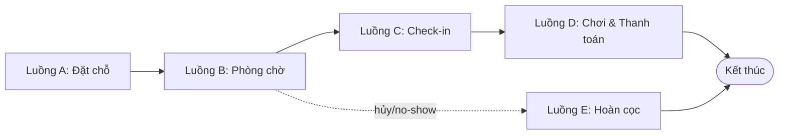
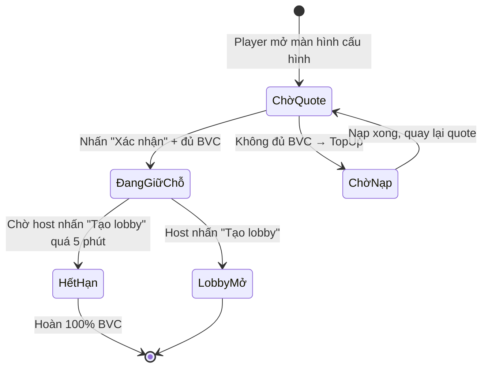
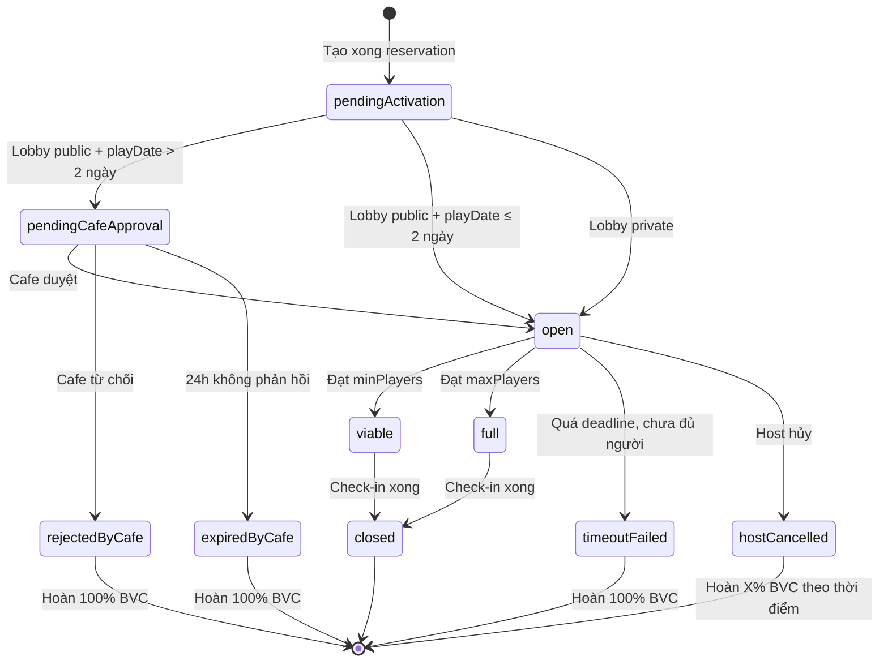
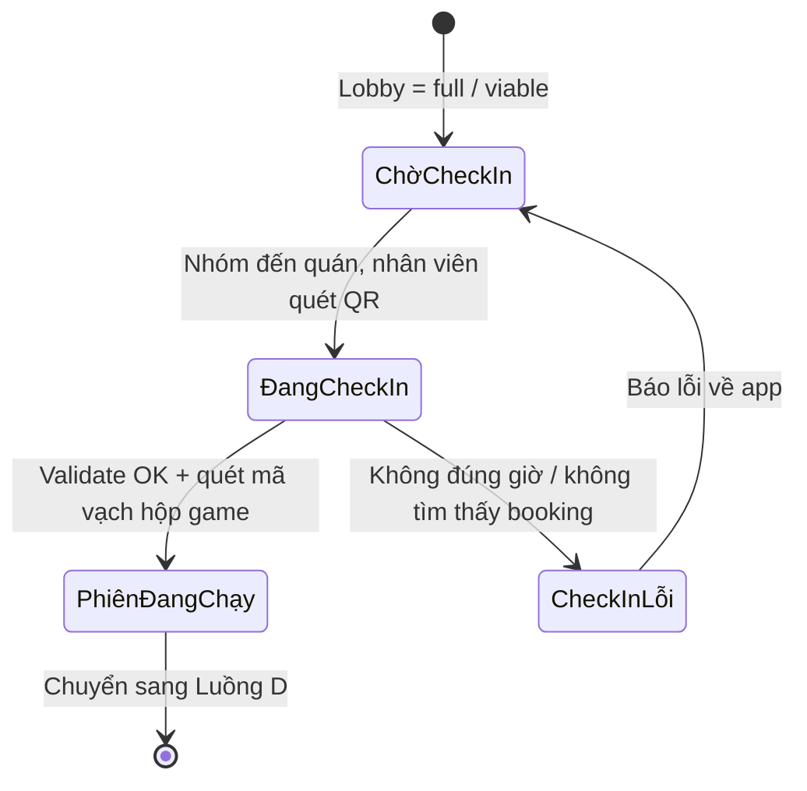
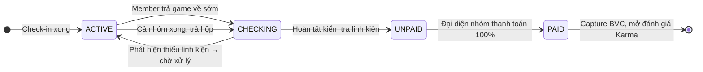
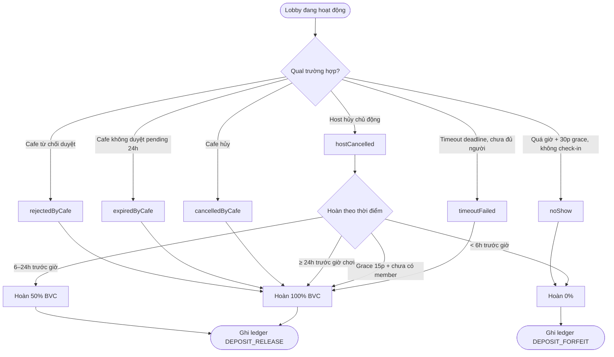

# Trình bày: Các nghiệp vụ chính của BoardVerse

> Tổng hợp các luồng nghiệp vụ cốt lõi của BoardVerse — từ lúc người chơi mở app, tạo phòng chờ, đặt cọc, đến khi ngồi xuống quán, chơi, trả game và thanh toán. Mỗi luồng đi kèm sơ đồ trạng thái (`mermaid`) và giải thích từng bước.
>
> Phạm vi: **Online → POS** (đầy đủ), phong cách **visual + step-by-step**, mô hình hiện tại (**Reservation + Lobby mới** — BVC wallet).

---

## Mục lục

1. [Bức tranh toàn cảnh](#i-bức-tranh-toàn-cảnh)
2. [Luồng A — Đặt chỗ (Reservation)](#ii-luồng-a--đặt-chỗ-reservation)
3. [Luồng B — Phòng chờ (Lobby)](#iii-luồng-b--phòng-chờ-lobby)
4. [Luồng C — Check-in tại quán](#iv-luồng-c--check-in-tại-quán)
5. [Luồng D — Phiên chơi & thanh toán POS](#v-luồng-d--phiên-chơi--thanh-toán-pos)
6. [Luồng E — Hủy / No-show / Hoàn cọc](#vi-luồng-e--hủy--no-show--hoàn-cọc)
7. [Bảng tổng hợp state machine](#vii-bảng-tổng-hợp-state-machine)
8. [Luồng ngoại lệ tiêu biểu](#viii-luồng-ngoại-lệ-tiêu-biểu)
9. [Liên kết tài liệu](#ix-liên-kết-tài-liệu)
10. [Bypass time-window (Dev/QA)](#x-bypass-time-window-devqa)

---

## I. Bức tranh toàn cảnh

BoardVerse có **5 luồng chính** nối tiếp nhau, từ app điện thoại của người chơi đến máy POS tại quán:



| Luồng | Mục đích | Bên thực hiện | Hệ thống liên quan |
|---|---|---|---|
| **A. Đặt chỗ** | Giữ chỗ ngồi + game copy + trừ BVC | Player (app) | Reservation, Wallet, SeatInventory, GameInventory |
| **B. Phòng chờ** | Tuyển thêm thành viên, xác nhận booking | Player (app) | Lobby, SignalR, Notification |
| **C. Check-in** | Vào quán, mở phiên chơi | Nhân viên POS | CafePos, ActiveSession, BookingGroupCode |
| **D. Chơi & Thanh toán** | Tính giờ, kiểm kê, xuất hóa đơn, capture BVC | Nhân viên POS | ActiveSession, Checkout, Karma |
| **E. Hủy / Hoàn cọc** | Xử lý timeout, host hủy, no-show | Hệ thống + POS | Refund, Ledger, Karma |

**Nguyên tắc chung:**

- **Host trả toàn bộ cọc BVC** (BR-DEPOSIT-01). Members không trả cọc riêng.
- **1 BVC = 1.000 VND**, không rút về tiền thật, không chuyển nhượng.
- **Server authoritative**: mọi phép tính cọc / availability / refund do backend xác nhận.
- **Atomic transaction** gom tất cả thay đổi (trừ BVC + giữ seat + giữ game + tạo reservation + tạo lobby) trong một transaction duy nhất.

---

## II. Luồng A — Đặt chỗ (Reservation)

> Mục đích: Bắt đầu một phiên đặt chỗ mới — giữ ghế + giữ game copy + trừ BVC từ ví host — đảm bảo không ai khác chen vào cùng khung giờ.

### Sơ đồ



### Các bước chi tiết

#### Bước 1 — Quote (tính tiền cọc)

Player chọn **cafe**, **game**, **playDate**, **timeSlot**, **maxPlayers**, **minPlayers** → gọi `POST /api/v1/reservations/quote`.

Backend tính toán:

```
baseDeposit = depositRatePerPerson × maxPlayers
finalDeposit = max(minDeposit(theo khoảng cách playDate), baseDeposit × riskMultiplier)
```

**Bảng minDeposit theo khoảng cách playDate** (BR-NEW-01):

| Khoảng cách | maxPlayers | minDeposit (BVC) |
|---|---|---|
| Hôm nay | 30 | 50 |
| 1 ngày sau | 20 | 50 |
| 2 ngày sau | 15 | 100 |
| 3–4 ngày sau | 10 | 150 |
| 5–7 ngày sau | 6 | 200 |

Backend trả về:

```json
{
  "quoteId": "...",
  "cafeId": "...",
  "gameId": "...",
  "scheduledTime": "2026-08-20T19:00:00Z",
  "maxPlayers": 30,
  "depositRatePerPerson": 5,
  "baseDeposit": 150,
  "riskMultiplier": 1.0,
  "finalDeposit": 150,
  "minDeposit": 100,
  "currentBalance": 220,
  "missingAmount": 0,
  "expiresAt": "2026-08-15T18:30:00Z"
}
```

#### Bước 1.5 — Validation chain (BR-RES-07/08, fix 2026-09-01)

Trước khi tính deposit, backend validate theo thứ tự:

- **BR-RES-07** (preferred times với `CafeSchedule`): start ≥ `OpenTime`, end ≤ `CloseTime`; overnight → validate end với schedule ngày kế tiếp. (G3 fix: áp dụng cho cả `CreateQuoteAsync` và `ConfirmAsync`.)
- **G2 fix:** `playDate ∈ [today, today+7]` (`MaxAdvanceBookingDays = 7`, cố định toàn hệ thống).
- **G11 fix:** `scheduledStartTime > now()` → 400 `StartTimeInPast`.
- **G7 fix:** duration ≤ 12 giờ → 400 `DurationTooLong(12)`.
- **G8 fix:** duration ≥ 30 phút → 400 `DurationTooShort(30)`.
- **G5 fix:** `preferredEndTime` không được là `default` (TimeOnly.MinValue) → 400 `PreferredEndTimeRequired`.
- **BR-NEW-15:** Overnight rule (`endTime.Date == startTime.Date + 1`); Same-day rule (`endTime.Date == startTime.Date`).
- **G13 fix:** Defensive `Debug.Assert(scheduledStartTime.Date == playDate)` — chỉ trigger khi `BuildScheduledStartEndFromPreferred` có bug.

#### Bước 2 — Kiểm tra điều kiện (BR-USER-LIMIT)

Trước khi confirm, backend validate:

- **BR-USER-LIMIT-01**: user chỉ được host 1 lobby active + member 1 lobby khác (tổng 2).
- **BR-USER-LIMIT-02**: lịch không chồng lấn (+30 phút đệm).
- **BR-USER-LIMIT-03**: tổng `heldBalance` ≤ 500k (user thường) / 1tr (VIP) / 200k (user có riskMultiplier ≥ 1.25).
- **BR-LOBBY-01a/b/c**: buffer `recruitmentDeadline - now()` ≥ 120 phút (OK), 60–120 phút (cảnh báo), < 60 phút (từ chối). **G16 fix:** Demo mode (`X-Bypass-Demo-Locks` header) bypass toàn bộ buffer check.
- **BR-NEW-02**: chỉ 1 lobby active / playDate / user.
- **BR-NEW-11**: lobby public + playDate ≥ 2 ngày → chờ cafe duyệt.

#### Bước 3 — Top-up (nếu thiếu BVC)

Nếu `currentBalance < finalDeposit`:

- App mở `TopUpPage` → player chọn gói 20k / 50k / 100k / … hoặc nhập tùy chỉnh.
- Lưu ý: số tiền ≥ 10.000 VND, chia hết cho 1.000, không bonus.
- Gọi `POST /api/v1/wallet/topup` → SePay (VietQR fallback) → webhook success → backend ghi ledger `TOP_UP`, `availableBalance += X`.
- Idempotency key chống trùng.

#### Bước 4 — Confirm (atomic transaction)

Player nhấn "Xác nhận" → gọi `POST /api/v1/reservations/confirm`.

**Một transaction duy nhất:**

```sql
BEGIN TRANSACTION
  1. Validate quote (chưa hết hạn)
  2. Validate seat availability (SELECT FOR UPDATE)
  3. Validate game copy availability
  4. Validate user eligibility (status, limit, cooling-off)
  5. UPDATE wallet: availableBalance -= X; heldBalance += X
  6. INSERT ledger: DEPOSIT_HOLD
  7. INSERT reservation(status = holding)
  8. INSERT lobby(status = pendingActivation hoặc pendingCafeApproval)
  9. UPDATE seat_inventory: hold seats
 10. UPDATE game_inventory: hold 1 copy
COMMIT
```

Sau commit → ghi outbox event `LobbyActivated` → SignalR push notification.

#### Bước 5 — Trạng thái tiếp theo

- Reservation → `holding`
- Lobby → `pendingActivation` (transaction đang xử lý) → `open` (public, ≤ 2 ngày) hoặc `pendingCafeApproval` (public, > 2 ngày) hoặc `open` ngay (private)
- Player nhận lobbyId → app navigate sang `LobbyPage`

**Nếu bất kỳ bước nào fail → rollback toàn bộ**, BVC vẫn trong `availableBalance` của player.

---

## III. Luồng B — Phòng chờ (Lobby)

> Mục đích: Tuyển thêm thành viên, xác nhận booking khi đủ người, xử lý deadline.

### Sơ đồ



### Các bước chi tiết

#### Bước 1 — Host chờ thành viên

- Lobby ở trạng thái `open` → hiển thị trên `GET /api/v1/lobbies/search` (lobby public) hoặc qua `ShareCode` (lobby private).
- Filter: **Karma ≥ minimumKarma** của lobby, bán kính địa lý, loại trừ overlap lịch (BR-USER-LIMIT-02).
- Hệ thống **gửi push notification** tới các user phù hợp.

#### Bước 2 — Member join

Member nhấn "Tham gia" → gọi `POST /api/v1/lobbies/{id}/join`.

Backend validate:

- BR-USER-LIMIT-01, 02, 04 (cross-role). **BR-USER-LIMIT-05: ĐÃ BỎ** — host có thể join lobby khác nếu không overlap.
- Karma của member ≥ `lobby.minKarma`.
- Lobby chưa full, chưa quá `recruitmentDeadline`.
- Friendship (nếu lobby private): member phải là bạn `Accepted` của ít nhất 1 member active.

Nếu OK → `lobby.currentPlayers++` → SignalR broadcast `MemberJoinedEvent`.

#### Bước 3 — Đạt minPlayers / maxPlayers

| Điều kiện | Lobby | Booking |
|---|---|---|
| `currentPlayers ≥ minPlayers` | `viable` | `confirmed` |
| `currentPlayers == maxPlayers` | `full` (đóng tuyển) | `confirmed` |
| `currentPlayers < minPlayers` + quá deadline | `timeoutFailed` | `expired` (hoàn 100% BVC) |

#### Bước 4 — Notification 4 mốc (BR-NEW-13)

| Mốc | Người nhận | Nội dung |
|---|---|---|
| 48h trước `recruitmentDeadline` | Host | "Lobby XYZ còn 48 giờ để tuyển đủ người" |
| 24h trước `recruitmentDeadline` | Host + Members | "Lobby sắp đến deadline, còn thiếu X người" |
| 2h trước `preferredStartTime` | Host + Members | "Lobby bắt đầu sau 2 giờ tại Cafe Y" |
| 30 phút trước `preferredStartTime` | Host + Members | "Lobby bắt đầu sau 30 phút" |

#### Bước 5 — Cảnh báo lobby có nguy cơ fail (BR-NEW-14)

Sau 50% thời gian tuyển, nếu `currentPlayers < 50% × minPlayers` → gửi notification host với 4 đề xuất:

1. Chia sẻ link mời qua Zalo/Messenger.
2. Đổi `timeSlot` khác xa hơn.
3. Hủy lobby (hoàn cọc theo BR-REFUND-03).
4. Boost lobby (Phase sau).

#### Bước 6 — Member rời lobby (BR-LOBBY-03)

- Member được rời trước `recruitmentDeadline`.
- Lobby giảm `currentPlayers`, slot mở lại.
- **Tiền cọc của host không đổi**.
- Nếu user xuống dưới `minPlayers`, lobby quay lại `open`.

---

## IV. Luồng C — Check-in tại quán

> Mục đích: Nhân viên quán xác nhận nhóm đến, mở phiên chơi, bàn giao game.

### Sơ đồ



### Các bước chi tiết

#### Bước 1 — Nhóm đến quán

Host mở `BookingSuccessPage` → hiển thị QR code (chứa `reservationCode` 8-char alphanumeric).

#### Bước 2 — Nhân viên quét QR

POS quét QR → gọi `POST /api/cafes/{cafeId}/pos/check-in` với `code = reservationCode`.

Backend validate:

- Reservation tồn tại, status = `confirmed`.
- `recruitmentDeadline` đã qua (chỉ cho check-in trong khung giờ).
- `playDate` khớp với ngày hiện tại.

#### Bước 3 — Mở phiên chơi

- Reservation → `checkedIn`
- Tạo `ActiveSession` (group session status = `ACTIVE`).
- Reservation.currentPlayers → ActiveSession members.
- Game copy từ `held` → `inUse` (gán barcode cụ thể).
- Bắt đầu tính giờ cho từng member.

#### Bước 4 — Bàn giao game

Nhân viên:
- Chỉ định vị trí ngồi (không cần hệ thống vì BoardVerse không quản lý sơ đồ bàn vật lý).
- Quét mã vạch trên hộp game → binding vào session.

#### Trường hợp đặc biệt

| Tình huống | Xử lý |
|---|---|
| Có thành viên không có app / hết pin | Nhân viên thêm `GuestSlot` trên POS (BR-13, BR-14) |
| Thành viên đến muộn sau khi nhóm đã check-in | POS thêm member vào session, tách mốc thời gian tính tiền |
| Thành viên về sớm trước khi cả nhóm xong | Xem Luồng D — Partial Checkout |

---

## V. Luồng D — Phiên chơi & thanh toán POS

> Mục đích: Tính tiền giờ, kiểm kê linh kiện, xuất hóa đơn, capture BVC về doanh thu quán.

### Sơ đồ



### Các bước chi tiết

#### Bước 1 — Đang chơi (ACTIVE)

- `ActiveSession` chạy đếm phút theo thời gian thực cho từng member.
- POS hiển thị thời gian + billboard tiền tạm tính.

#### Bước 2 — Trả game (CHECKING)

Nhân viên:
- Bấm "Trả game" trên POS.
- Mở danh mục kiểm kê linh kiện số hóa (`Digital Component Checklist`).
- Tick mất/hỏng cho từng linh kiện.

**BR-12**: Hệ thống **khóa** in hóa đơn cho đến khi kiểm kê hoàn tất.

#### Bước 3 — Tính tiền (UNPAID)

Backend tính `Member.TotalAmount` theo **BR-15**:

```
Hóa đơn cá nhân = Tiền giờ chơi cá nhân + Phí phạt (nếu có) - Deposit cá nhân
```

Lưu ý (BR-09 — BoardVerse overriding):

- **Có Booking**: deposit là phí giữ chỗ của BoardVerse, **KHÔNG trừ** vào hóa đơn session.
- Mỗi thành viên thanh toán 100% tiền giờ tại checkout.
- Walk-in (không có Booking) cũng trả 100% tiền giờ, không có deposit.

Tuy nhiên, **luồng cũ (BR-22)** cho phép trừ deposit nếu hệ thống đang ở chế độ per-member deposit — tùy cấu hình cafe.

**Công thức BR-16** (chốt phí theo mô hình quán):

| Mô hình | Cách tính |
|---|---|
| **Thời gian thực** (block lũy tiến) | `giờ đầu + (block phút × đơn giá)` |
| **Vào cổng trọn gói** | `giờ đầu = giá vé vào cổng; các block tiếp = 0` |

#### Bước 4 — Thanh toán (PAID)

POS hiển thị tổng hóa đơn → đại diện nhóm thanh toán (tiền mặt, SePay, hoặc trừ deposit nếu áp dụng).

Backend:

- `ActiveSession.status = PAID`.
- `ActiveSession.totalAmount = tổng cộng nhóm`.
- **Capture BVC**: ghi ledger `DEPOSIT_CAPTURE` → `heldBalance -= finalDeposit` → `settlement += finalDeposit` (doanh thu quán — BR-REVENUE-01).
- Giải phóng ghế + game copy.

#### Bước 5 — Đánh giá Karma

App mở cửa sổ đánh giá chéo (cross-rating) giữa các thành viên trong nhóm → cập nhật `Karma`.

#### Trường hợp Partial Checkout (BR-12, BR-14)

Khi một số member về sớm, cả nhóm chưa xong:

1. Nhân viên chọn member muốn tách → hệ thống **khóa in hóa đơn**.
2. Yêu cầu nhóm tạm dừng → thu hồi hộp game → kiểm kê.
3. **Nhánh đủ linh kiện**: in hóa đơn cho member về sớm, tiền cọc không trừ.
4. **Nhánh thiếu/hỏng linh kiện**:
   - Phí phạt thanh toán ngay trong hóa đơn về sớm, **hoặc**
   - Gộp vào hóa đơn cuối của Host để nhóm tự đối lưu tiền mặt.
   - **Block đóng phiên** nếu phí phạt chưa giải quyết.
5. Member còn lại tiếp tục chơi → có thể chuyển sang nhóm khác (xem Exception 4).

---

## VI. Luồng E — Hủy / No-show / Hoàn cọc

> Mục đích: Xử lý các trường hợp gián đoạn — timeout, host hủy, no-show, cafe hủy, member rời lobby.

### Sơ đồ tổng quát



### Bảng hoàn cọc (BR-REFUND-01 → 07)

| Tình huống | Hoàn BVC | Điều kiện | Karma |
|---|---|---|---|
| **Timeout** (BR-REFUND-01) | **100%** | Không đủ người trước deadline | Không phạt (lần đầu) |
| **Host hủy — grace 15p** (BR-REFUND-03) | **100%** | Trong 15 phút đầu + chưa có member | Không phạt |
| **Host hủy — ≥ 24h** (BR-REFUND-02) | **100%** | Trước `scheduledStartTime` ≥ 24h | Không phạt |
| **Host hủy — 6–24h** | **50%** | Trước `scheduledStartTime` 6–24h | Giảm đáng kể |
| **Host hủy — < 6h** | **0%** | Trước `scheduledStartTime` < 6h | Giảm nặng |
| **No-show** (BR-REFUND-03) | **0%** | Không check-in sau grace 30 phút | Giảm nặng, có thể tạm khóa |
| **Cafe hủy** (BR-REFUND-04) | **100%** | Quán hủy vì bất khả kháng | Không phạt, có thể bồi thường |
| **Cafe không duyệt 24h** | **100%** | `pendingCafeApproval` quá 24h | Không phạt |
| **Cafe từ chối** | **100%** | `rejectedByCafe` | Không phạt |
| **Early checkout ≥ 90%** | **0%** | `playedRatio ≥ 90%` | Không phạt |
| **Early checkout 50–90%** | **30%** | `playedRatio ≥ 50%` | Không phạt |
| **Early checkout < 50%** | **0%** | `playedRatio < 50%` | Giảm nhẹ |

**Công thức:**

```
playedRatio = (EndedAt - StartedAt) / (ScheduledEndTime - ScheduledStartTime)
```

### Quy trình kỹ thuật

1. **Ghi ledger** mới (bất biến — không UPDATE/DELETE):
 - `DEPOSIT_RELEASE` nếu hoàn một phần/100%.
 - `DEPOSIT_FORFEIT` nếu tịch thu toàn bộ.
2. **Cập nhật wallet**:
 - `DEPOSIT_RELEASE`: `heldBalance -= X; availableBalance += X`.
 - `DEPOSIT_FORFEIT`: `heldBalance -= X; settlement += X` (doanh thu quán).
3. **Cập nhật lobby/reservation** → trạng thái terminal.
4. **Giải phóng seat_inventory + game_inventory**.
5. **Notification** cho host (và members nếu liên quan).
6. **Audit log** + `PlayerActionHistory`.
7. **Check cooling-off** (BR-NEW-10):
 - 3 lần timeoutFailed / 7 ngày → cooling-off 30 ngày, cọc ×2.
 - User chỉ được tạo lobby có `playDate = hôm nay`.
 - Sau 30 ngày tự đánh giá lại.

---

## VII. Bảng tổng hợp state machine

### Reservation

| Code | Tiếng Việt | Ý nghĩa |
|---|---|---|
| `holding` | Đang giữ chỗ | Đã trừ BVC, lobby đang tuyển |
| `pendingCafeApproval` | Chờ cafe duyệt | Lobby public + playDate > 2 ngày |
| `confirmed` | Đã xác nhận | Đủ người, sẵn sàng check-in |
| `checkedIn` | Đã nhận khách | Nhóm đã đến quán |
| `completed` | Hoàn thành | Phiên chơi đã thanh toán, BVC captured |
| `expired` | Hết hạn | Timeout deadline, hoàn 100% |
| `cancelledByPlayer` | Hủy bởi host | Hoàn theo thời điểm |
| `cancelledByCafe` | Hủy bởi quán | Hoàn 100% |
| `noShow` | Không đến | Không check-in sau grace 30p |
| `rejectedByCafe` | Quán từ chối | Hoàn 100% |
| `expiredByCafe` | Quán hết hạn duyệt | Hoàn 100% |

### Lobby

| Code | Tiếng Việt | Ý nghĩa |
|---|---|---|
| `pendingActivation` | Đang kích hoạt | Transaction atomic đang xử lý |
| `pendingCafeApproval` | Chờ cafe duyệt | Public + playDate > 2 ngày |
| `open` | Đang mở | Tuyển người |
| `viable` | Đủ người | Đạt minPlayers, vẫn nhận thêm |
| `full` | Đầy | Đạt maxPlayers, đóng tuyển |
| `inProgress` | Đang chơi | Đã check-in |
| `closed` | Đã đóng | Phiên kết thúc |
| `timeoutFailed` | Hết giờ tuyển | Hoàn 100% |
| `hostCancelled` | Host hủy | Hoàn theo thời điểm |
| `rejectedByCafe` | Quán từ chối | Hoàn 100% |
| `expiredByCafe` | Quán hết hạn duyệt | Hoàn 100% |

### ActiveSession

| Code | Tiếng Việt | Ý nghĩa |
|---|---|---|
| `ACTIVE` | Đang chơi | Đếm giờ |
| `CHECKING` | Đang kiểm kê | Trả game, kiểm linh kiện |
| `UNPAID` | Chưa thanh toán | Đã lập hóa đơn |
| `PAID` | Đã thanh toán | Capture BVC, mở Karma |

### Wallet (BVC)

| Field | Tiếng Việt | Ý nghĩa |
|---|---|---|
| `availableBalance` | Số dư khả dụng | Dùng để đặt cọc |
| `heldBalance` | Số dư đang giữ | Bị khóa cho reservation |
| `riskMultiplier` | Hệ số rủi ro | 1.0 – 2.0 nhân vào cọc |
| `isCoolingOff` | Đang hạn chế | Không cho tạo lobby > 1 ngày |

---

## VIII. Luồng ngoại lệ tiêu biểu

### 1. Multi-account spam (BR-F-12 — Kịch bản tấn đa lớp)

```
Attacker tạo user mới (chưa xác minh).
Spam tạo lobby 28 slot khác nhau, maxPlayers=30, cọc 50k.
Tổng cọc: 1.4 triệu BVC.
```

**Phòng thủ đa lớp:**

| Lớp | BR | Hiệu quả |
|---|---|---|
| Cap tổng cọc active | BR-USER-LIMIT-03 | Sau 10 lobby × 50k → đạt cap. |
| 1 lobby / playDate+timeSlot / cafe / user | BR-NEW-08 | Sau lobby đầu tiên ở Cafe A, slot morning, ngày X → lobby thứ 2 cùng slot bị từ chối. |
| Hạn mức theo khoảng cách | BR-NEW-01 | Lobby > 2 ngày: maxPlayers = 6–15. |
| Cafe duyệt > 2 ngày | BR-NEW-11 | Cafe phát hiện spam → từ chối. |
| Cooling-off | BR-NEW-10 | Sau 3 lobby fail → cooling-off 30 ngày, cọc ×2. |

### 2. Race condition khi nhiều nhóm cùng đặt

```
Quán còn 6 ghế, 2 hộp Catan.
Nhóm A tạo lobby 4 người cùng lúc nhóm B.
```

- Backend dùng `SELECT FOR UPDATE` trên `seat_inventory` + `game_inventory` của cafe trong khung giờ đó.
- Transaction commit trước giữ được → transaction còn lại fail.
- Player B nhận thông báo "Quán không đủ chỗ", BVC được trả về ví.

### 3. Host hủy sát giờ (< 6h)

- Lobby → `hostCancelled`.
- Reservation → `cancelledByPlayer`.
- Deposit **forfeit 100%** → doanh thu quán.
- Karma giảm đáng kể.
- Nếu 3 lần liên tiếp trong 7 ngày → cooling-off 30 ngày.

### 4. Member tách nhóm, chuyển sang nhóm khác (Exception 4 gốc)

1. A1, A2 về sớm → POS thu hồi hộp game → kiểm kê.
2. A1, A2 thanh toán 100% tiền giờ (không trừ cọc).
3. A3 ngồi lại, sang ghép nhóm B.
4. POS quét mã A3 → nhập vào session Nhóm B.
5. Khi Nhóm B kết thúc → hóa đơn cuối cộng thêm phần tiền giờ của A3 từ sau thời điểm chuyển nhóm.

### 5. Admin reset risk score (false positive)

```
Job risk_score_recompute: user X từ 45 → 78 (critical).
Admin review signals:
  - SIG-08: 12 lần tạo+hủy cùng playDate.
Admin xác minh: user đang test app cho gia đình.
→ ADM-05 Reset risk score.
```

- `riskScore = 0`, `riskLevel = low`, `accountStatus = active`.
- Ghi `PlayerActionHistory` (actionType = reset_score, reason = false positive).
- Signal tiếp tục trigger → riskScore tăng lại (reset chỉ 1 lần).

### 6. Multi-account phát hiện tự động (BR-RISK-08)

```
User A đăng ký IP 1.2.3.4 ngày 01/08.
User B đăng ký cùng IP 1.2.3.4 ngày 03/08.
Cùng Android ID.
→ 2 tín hiệu trùng: IP + device.
```

- Job `signal_detect_multi_account` chạy mỗi 6 giờ → phát hiện.
- Tạo `PlayerAccountLink` (status = suspected).
- Tạo `PlayerAlert` (severity = critical) cho admin.
- Risk score cả 2 user +30 (SIG-07).
- Admin review thủ công:
  - **Confirmed**: khóa account phụ, hoàn BVC về account chính.
  - **Dismissed**: reset SIG-07 contribution.

---

## IX. Liên kết tài liệu

### Tài liệu nghiệp vụ

- [Business rules consolidated](../.cursor/rules/boardverse.mdc) — BR-01..BR-18, state machine
- [Lobby booking deposit BVC](../.cursor/rules/lobby-booking-deposit-bvc.mdc) — BR-DEPOSIT-*, BR-LOBBY-*, BR-USER-LIMIT-*, BR-REFUND-*, BR-RISK-*
- [SePay payment flow](../.cursor/rules/sepay-payment-flow.mdc) — BR-05, BR-09, BR-15, BR-22
- [Lobby lifecycle presentation](./lobby-lifecycle-presentation.md) — sơ đồ trạng thái Lobby
- [Table reservation lifecycle](./table-reservation-lifecycle-presentation.md) — sơ đồ trạng thái Booking/Reservation
- [Game session billing presentation](./game-session-billing-presentation.md) — BR-15, BR-16, BR-17

### API tham chiếu

- [api/reservation.md](./api/reservation.md) — REST API Reservation
- [api/lobby.md](./api/lobby.md) — REST API Lobby
- [api/lobby-invite.md](./api/lobby-invite.md) — REST API mời bạn
- [api/cafe-pos.md](./api/cafe-pos.md) — REST API POS tại quán
- [api/wallet.md](./api/wallet.md) — REST API ví BVC
- [api/booking.md](./api/booking.md) — REST API Booking (legacy)
- [api/sepay-webhook.md](./api/sepay-webhook.md) — Webhook SePay
- [api/lobby-hub.md](./api/lobby-hub.md) — SignalR Hub

### Tài liệu kỹ thuật

- [docs/api/lobby-hub.md](./api/lobby-hub.md) — SignalR Hub cho lobby realtime
- [docs/api/admin-moderation.md](./api/admin-moderation.md) — Admin cooling-off + risk
- [docs/api/admin-configuration.md](./api/admin-configuration.md) — Admin system config + bypass time-window
- [docs/api/system-config.md](./api/system-config.md) — Public read-only endpoint (dev/QA check nhanh, không cần Admin token)
- [docs/api/notifications.md](./api/notifications.md) — Notification 4 mốc
- [docs/api/leaderboard.md](./api/leaderboard.md) — Karma + Elo

---

## X. Bypass time-window (Dev/QA)

BoardVerse cung cấp cờ bypass các ràng buộc thời gian để Dev/QA test đầy đủ flow mà không bị chặn bởi deadline thực tế. Cờ áp dụng cho **6 check** sau:

| # | Check bị bypass | Service | Operation key |
|---|-----------------|---------|---------------|
| 1 | Check-in window (± grace) | `PlayerCheckInService.CheckInByTokenAsync` + `ReservationService.ValidateCheckInTimeWindowAsync` | `PlayerCheckIn.Window`, `Reservation.CheckInWindow` |
| 2 | Lobby recruitment deadline | `LobbyService.JoinLobbyAsync` | `Lobby.JoinDeadline` |
| 3 | Lobby time-slot change buffer (< 60 phút) | `LobbyService.UpdateTimeSlotAsync` | `Lobby.TimeSlotChangeBuffer` |
| 4 | Refund milestones (24h/6h) | `ReservationService.ComputeRefundPolicyAsync` | `Reservation.RefundMilestone` |
| 5 | No-show detection grace | `ReservationNoShowDetectionJob.RunDetectionAsync` (background) | `ReservationNoShowDetectionJob` |
| 6 | Tournament scheduled time + registration deadline | `TournamentService.CreateTournamentAsync` + `UpdateTournamentAsync` | `Tournament.CreateDeadlinePast`, `Tournament.StartTimeFuture` |

### Ba cách bật bypass (ưu tiên từ cao xuống thấp)

| # | Cách | Phạm vi | Dùng khi |
|---|------|---------|----------|
| 1 | HTTP header `X-Bypass-Time-Window: true` | 1 request | Test 1 endpoint cụ thể |
| 2 | Query string `?bypassTimeWindow=true` | 1 request | Test từ browser/Postman |
| 3 | DB config `bypass_time_window_validations=true` | Toàn cục (mọi instance, áp dụng sau ≤ 10s) | Test full flow / nhiều request liên tiếp |

### Endpoint admin

```bash
# Bật bypass toàn cục (cách 3)
POST /api/v1/admin/configs/bypass-time-window
→ { bypassEnabled: true, appliedWithinSeconds: 10 }

# Tắt bypass toàn cục
DELETE /api/v1/admin/configs/bypass-time-window
→ { bypassEnabled: false, appliedWithinSeconds: 10 }

# Xem trạng thái
GET /api/v1/admin/configs/bypass-time-window
→ { bypassEnabled: false, configKey: "bypass_time_window_validations" }

# Invalidate cache ngay lập tức (bỏ qua TTL 10s)
POST /api/v1/admin/configs/invalidate-cache
```

### Ví dụ sử dụng

```bash
# Test check-in ngoài khung giờ (cách 1)
curl https://api.boardverse.dev/api/v1/pos/check-in/scan \
  -H "Authorization: Bearer <token>" \
  -H "X-Bypass-Time-Window: true" \
  -d '{"token": "ABCDEFGHJKLMNPQR"}'

# Test full flow dev/QA (cách 3 - toàn cục)
curl -X POST https://api.boardverse.dev/api/v1/admin/configs/bypass-time-window \
  -H "Authorization: Bearer <admin-token>"
# → Áp dụng trong vòng 10 giây cho mọi instance
# → Test check-in, cancel, refund, no-show tự do
# → Sau khi xong: DELETE /bypass-time-window để tắt
```

### Lưu ý quan trọng

- **Production**: Mặc định `bypass_time_window_validations=false`. Không được bật trên production trừ khi có sự cố cần investigate.
- **Multi-instance**: Cache TTL 10s (IDistributedCache / Redis) đảm bảo mọi instance cùng toggle trong khoảng thời gian ngắn. Dùng `POST /invalidate-cache` để áp dụng ngay.
- **Audit**: Mọi lần toggle bypass ghi audit log qua endpoint admin (qua hệ thống admin action log có sẵn).
- **Pre-existing safe**: Logic bypass dùng `TimeWindowGuard.ShouldBypassAsync` — wrap CÓ điều kiện `if (!bypass && <originalCheck>)`. Khi tắt bypass, hành vi y hệt như trước khi triển khai.

Xem chi tiết: [api/admin-configuration.md](./api/admin-configuration.md).

> 💡 **Admin check nhanh**: Để xem trạng thái `bypass_time_window_validations` (yêu cầu JWT Admin token), dùng endpoint:
> ```bash
> curl https://api.boardverse.dev/api/v1/system-configs/bypass_time_window_validations \
>   -H "Authorization: Bearer <admin-token>"
> # → { ..., "inferredType": "bool", "parsedValue": true|false }
> ```
> Xem [api/system-config.md](./api/system-config.md).

---

**Trạng thái**: Bản rút gọn tổng hợp các luồng nghiệp vụ chính theo mô hình **Reservation + Lobby mới** (BVC wallet). Khi mô hình thay đổi, cập nhật file này đồng thời với các BR rules liên quan.
