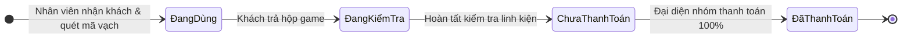

# Trình bày: Vòng đời Phiên chơi & Thanh toán (Sơ đồ trạng thái)

> Cách đọc sơ đồ trạng thái trên quầy POS web — một đường thẳng, bốn ô, không nhánh rẽ.

## Sơ đồ



---

## Dẫn giải sơ đồ (~2 phút)

### Đặc điểm của sơ đồ này

Nhìn sơ đồ: **một chuỗi tuyến tính** từ trái sang phải.  
Mỗi trạng thái chỉ có **một mũi tên ra** — không có `ĐãHủy`, không có nhánh song song. Đọc sơ đồ = đi thẳng từ `[*]` đến `[*]`.

---

### `[*]` → `ĐangDùng`

Mũi tên đầu, nhãn **「Nhân viên nhận khách & quét mã vạch」**: nhân viên xác nhận khách, quét mã vạch hộp game, gán vào bàn.

Vào ô `ĐangDùng` thì:
- Phiên hoạt động (`ActiveSession`) bắt đầu đếm giờ
- Hộp game và bàn chuyển sang trạng thái đang dùng
- Quầy POS hiển thị thời gian chơi theo thời gian thực

---

### `ĐangDùng` → `ĐangKiểmTra`

Mũi tên nhãn **「Khách trả hộp game」** — điều kiện duy nhất để rời `ĐangDùng`.

Ô `ĐangKiểmTra`: nhân viên **không cất hộp ngay**, mà mở danh mục kiểm tra linh kiện, tích mất/hỏng. Đây là bước nghiệp vụ trên sơ đồ, tách riêng với tính tiền.

---

### `ĐangKiểmTra` → `ChưaThanhToán`

Mũi tên nhãn **「Hoàn tất kiểm tra linh kiện」**.

Sang ô `ChưaThanhToán` = hệ thống **tự lập hóa đơn**: tiền giờ + nước/dịch vụ + phí đền bù linh kiện. Chưa thu tiền — chỉ mới có số.

Quy tắc đọc từ sơ đồ: **không có đường tắt** từ `ĐangDùng` hay `ĐangKiểmTra` thẳng sang `ĐãThanhToán`. Phải đi qua `ChưaThanhToán`.

---

### `ChưaThanhToán` → `ĐãThanhToán`

Mũi tên nhãn **「Đại diện nhóm thanh toán 100%」** — điều kiện chuyển trạng thái: trả **đủ**, không phải trả một phần.

Ô `ĐãThanhToán`: giao dịch xong. Có thể nhả bàn, nhả hộp, ghi doanh thu, mở đánh giá uy tín (`RatingOpen` nếu gắn phòng chờ).

---

### `ĐãThanhToán` → `[*]`

Mũi tên cuối về điểm đen — **phiên quầy POS kết thúc**. Không quay lại `ĐangDùng` trên cùng một phiên.

---

### Đọc nhanh cả sơ đồ

```text
[*] ──quét mã vạch──→ ĐangDùng ──trả hộp──→ ĐangKiểmTra ──kiểm tra xong──→ ChưaThanhToán ──trả đủ 100%──→ ĐãThanhToán ──→ [*]
```

Một câu nhớ sơ đồ: **kiểm tra trước → tính tiền → thu tiền → xong**.

---

## Nối với sơ đồ khác

Sơ đồ quầy POS **không tự bắt đầu từ `[*]` độc lập** trong luồng BoardVerse đầy đủ:

```text
Phòng chờ (ĐangChơi) ──→ nhận khách tại quán ──→ [ sơ đồ POS bắt đầu tại ĐangDùng ]
Đặt bàn (ĐãNhậnKhách) ─┘
```

Mũi tên vào `ĐangDùng` trên quầy POS = lúc nhân viên quét mã vạch — dù khách đến từ phòng chờ hay từ đặt bàn.

---

## Liên kết API (theo từng ô)

| Trạng thái | Module |
|------------|--------|
| `ĐangDùng` | `POST /pos/sessions` — quét mã vạch, giao game |
| `ĐangKiểmTra` | Kiểm soát kho — danh mục linh kiện trên quầy |
| `ChưaThanhToán` | Tính tiền — theo `BillingModel` của quán |
| `ĐãThanhToán` | Hoàn tất thanh toán → có thể gọi `karma-rating/open` |

### Ánh xạ tên trong code

| Trên sơ đồ (tiếng Việt) | Trong code |
|-------------------------|------------|
| `ĐangDùng` | `InUse` |
| `ĐangKiểmTra` | `Checking` |
| `ChưaThanhToán` | `UnPaid` |
| `ĐãThanhToán` | `Paid` |
