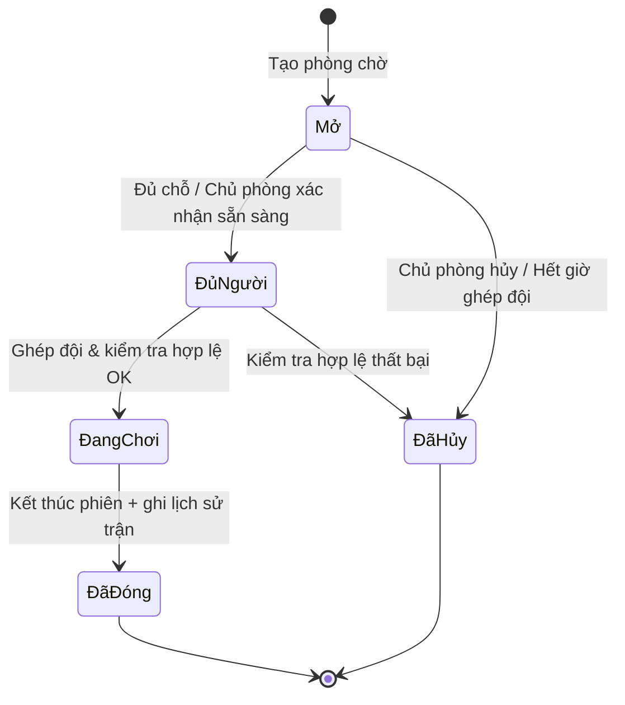

# Trình bày: Vòng đời Phòng chờ (Sơ đồ trạng thái)

> Cách đọc sơ đồ trạng thái phòng chờ BoardVerse — đi từng ô (trạng thái), từng mũi tên (chuyển trạng thái), theo đúng thứ tự trên sơ đồ.

## Sơ đồ



---

## Dẫn giải sơ đồ (~2 phút)

*Đứng trước slide, chỉ tay theo sơ đồ khi nói.*

### Bắt đầu từ đâu?

Nhìn **điểm đen `[*]`** bên trái — đó là lúc phòng chờ **chưa tồn tại**.  
Mũi tên đầu tiên, nhãn **「Tạo phòng chờ」**, đưa hệ thống vào trạng thái **`Mở`**.

Từ đây trở đi, phòng chờ **luôn nằm trong đúng một ô** trên sơ đồ. Không có ô nào khác ngoài những gì bạn thấy.

---

### Trạng thái `Mở` — đang tìm đồng đội

Đây là ô đầu tiên sau khi tạo phòng. Phòng chờ đang **mở**, nhận thêm người, hệ thống ghép đội chạy ngầm (lọc game, khoảng cách, điểm Elo, khung giờ).

Từ `Mở` có **hai mũi tên ra**:

| Mũi tên | Nhãn trên sơ đồ | Nghĩa là |
|---------|-----------------|----------|
| `Mở` → `ĐủNgười` | Đủ chỗ / Chủ phòng xác nhận sẵn sàng | Đủ người **hoặc** chủ phòng bảo nhóm sẵn sàng → chuyển sang ô tiếp theo |
| `Mở` → `ĐãHủy` | Chủ phòng hủy / Hết giờ ghép đội | Chủ phòng hủy phòng **hoặc** chờ quá lâu không ai vào → **dừng hẳn** |

Nếu đi nhánh `ĐãHủy`, mũi tên từ `ĐãHủy` về `[*]` — **kết thúc**, không có trận.

---

### Trạng thái `ĐủNgười` — đã đủ người, chưa chơi

Phòng chờ **khóa chỗ**, không nhận thêm thành viên. Ô này là giai đoạn **chuẩn bị**: kiểm tra quán còn bàn cho khách vãng lai không, nếu hết chỗ thì kích hoạt đặt bàn (sơ đồ đặt bàn là sơ đồ khác).

Từ `ĐủNgười` cũng có **hai mũi tên**:

| Mũi tên | Nhãn trên sơ đồ | Nghĩa là |
|---------|-----------------|----------|
| `ĐủNgười` → `ĐangChơi` | Ghép đội & kiểm tra hợp lệ OK | Mọi điều kiện đạt — đủ người đến, bàn OK → **bắt đầu trận** |
| `ĐủNgười` → `ĐãHủy` | Kiểm tra hợp lệ thất bại | Không đến, ai đó rời phòng, hết bàn… → **dừng hẳn** |

---

### Trạng thái `ĐangChơi` — đang chơi

Phòng chờ ở ô này khi trận **đang diễn ra thật** trên bàn. Quầy POS có thể bật phiên thanh toán.

Chỉ **một mũi tên ra**:

| Mũi tên | Nhãn trên sơ đồ | Nghĩa là |
|---------|-----------------|----------|
| `ĐangChơi` → `ĐãĐóng` | Kết thúc phiên + ghi lịch sử trận | Phiên xong **và** đã ghi lịch sử trận → sang ô kết thúc thành công |

Không có đường từ `ĐangChơi` sang `ĐãHủy` trên sơ đồ này — nếu hủy giữa trận, đó là logic mở rộng (ngoài sơ đồ tổng quan).

---

### Hai điểm kết thúc: `ĐãĐóng` và `ĐãHủy`

**`ĐãĐóng`** — nhánh thành công. Dữ liệu vào lịch sử trận, điểm Elo, điểm uy tín (Karma), thống kê. Mũi tên `ĐãĐóng` → `[*]`: vòng đời phòng chờ **hoàn tất**.

**`ĐãHủy`** — nhánh hủy. Không có trận hoàn chỉnh. Mũi tên `ĐãHủy` → `[*]`: cũng **hoàn tất**, nhưng kết quả là “không chơi được”.

Cả hai đều về `[*]` — trên sơ đồ trạng thái, đó là cách vẽ **trạng thái kết thúc**: không còn chuyển trạng thái nào sau đó.

---

### Đọc nhanh cả sơ đồ

```text
[*] ──Tạo phòng chờ──→ Mở ──┬── đủ người ──→ ĐủNgười ──┬── OK ──→ ĐangChơi ──→ ĐãĐóng ──→ [*]
                            │                           │
                            └── hủy/hết giờ               └── lỗi ──→ ĐãHủy ──→ [*]
                                 └──→ ĐãHủy ──→ [*]
```

- **Đường thành công:** `Mở → ĐủNgười → ĐangChơi → ĐãĐóng → [*]`
- **Đường cắt sớm:** từ `Mở` hoặc `ĐủNgười` nhảy thẳng sang `ĐãHủy → [*]`
- **Không có vòng lặp** — phòng chờ không quay lại `Mở` sau khi đã `ĐủNgười`

---

## Liên kết hệ thống (theo từng ô trên sơ đồ)

| Trạng thái trên sơ đồ | Hệ thống liên quan |
|-----------------------|-------------------|
| `Mở` | Ghép đội, thông báo đẩy, tìm quán |
| `ĐủNgười` | Đặt bàn, kiểm tra bàn & kho game |
| `ĐangChơi` | Quầy POS web, phiên thanh toán |
| `ĐãĐóng` | Lịch sử trận, Elo, Karma |

> **Ghi chú khi đọc sơ đồ thật trong code:** Triển khai hiện có thêm trạng thái `RatingOpen` (mở cửa sổ đánh giá uy tín) — một ô nữa giữa `ĐangChơi` và `ĐãĐóng`. Sơ đồ trên là bản rút gọn để trình bày; `ĐãHủy` tương ứng `Cancelled` trong code — thiết kế mục tiêu cho các kịch bản hủy.

### Ánh xạ tên trong code

| Trên sơ đồ (tiếng Việt) | Trong code |
|-------------------------|------------|
| `Mở` | `Open` |
| `ĐủNgười` | `Full` |
| `ĐangChơi` | `InProgress` |
| `ĐãĐóng` | `Closed` |
| `ĐãHủy` | `Cancelled` |
