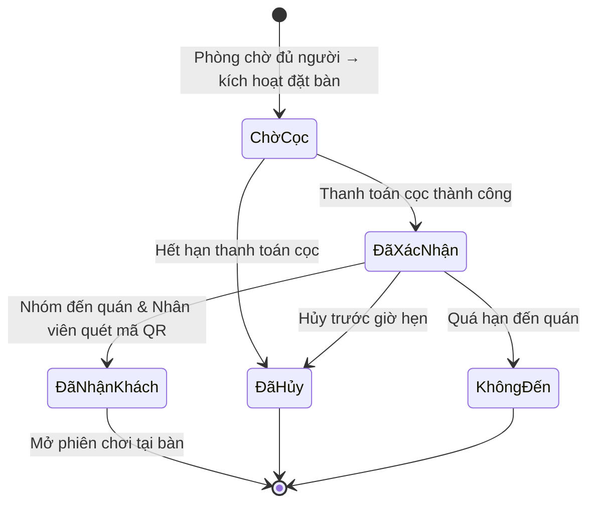

# Trình bày: Vòng đời Đặt bàn (Sơ đồ trạng thái)

> Cách đọc sơ đồ trạng thái đặt bàn — kích hoạt khi phòng chờ `ĐủNgười` mà quán hết chỗ khách vãng lai.

## Sơ đồ



---

## Dẫn giải sơ đồ (~2–3 phút)

### Điểm vào — không phải người chơi bấm tạo

Khác phòng chờ, đơn đặt bàn **không bắt đầu từ nút “đặt bàn”** trên sơ đồ này.

Mũi tên từ `[*]` sang `ChờCọc`, nhãn **「Phòng chờ đủ người → kích hoạt đặt bàn」**: hệ thống **tự tạo đơn** khi phòng chờ đã `ĐủNgười` và quán không còn chỗ ngay.

---

### Trạng thái `ChờCọc` — chờ đặt cọc

Ô đầu tiên của đơn đặt bàn. Bàn **chưa chắc chắn được giữ** — đang chờ người chơi trả cọc.

Hai mũi tên ra:

| Mũi tên | Nhãn | Nghĩa là |
|---------|------|----------|
| → `ĐãXácNhận` | Thanh toán cọc thành công | Có cam kết tài chính → bàn được giữ chính thức |
| → `ĐãHủy` | Hết hạn thanh toán cọc | Quá giờ chưa cọc → đơn hết hiệu lực, bàn nhả ra |

---

### Trạng thái `ĐãXácNhận` — đã cọc, chờ đến quán

Đây là ô **ba nhánh** — trung tâm của sơ đồ:

| Mũi tên | Nhãn | Nghĩa là |
|---------|------|----------|
| → `ĐãNhậnKhách` | Nhóm đến quán & Nhân viên quét mã QR | Đến đúng hạn, nhân viên xác minh → **thành công** |
| → `ĐãHủy` | Hủy trước giờ hẹn | Người chơi chủ động hủy |
| → `KhôngĐến` | Quá hạn đến quán | Đã cọc nhưng không tới kịp (hết khung giờ đến) |

Ba mũi tên này **song song**, không đi qua ô trung gian — đọc sơ đồ: từ `ĐãXácNhận` bạn có thể rẽ một trong ba hướng.

---

### Trạng thái `ĐãNhậnKhách` — nhánh thành công

Nhóm đã có mặt tại quán. Một mũi tên duy nhất: `ĐãNhậnKhách` → `[*]`, nhãn **「Mở phiên chơi tại bàn」**.

Trên sơ đồ, `[*]` ở đây nghĩa là **đơn đặt bàn xong nhiệm vụ** — luồng tiếp theo chuyển sang sơ đồ khác (phiên thanh toán / phòng chờ `ĐangChơi`).

---

### Hai điểm kết thúc “không chơi”: `ĐãHủy` và `KhôngĐến`

Cả hai đều có mũi tên về `[*]` — trạng thái kết thúc.

| Trạng thái | Khác nhau ở đâu |
|------------|-----------------|
| `ĐãHủy` | Hủy sớm (chưa cọc kịp **hoặc** hủy sau khi đã `ĐãXácNhận`) |
| `KhôngĐến` | Đã `ĐãXácNhận`, đã cọc, nhưng **không đến** — thường ảnh hưởng điểm uy tín (Karma) |

---

### Đọc nhanh cả sơ đồ

```text
[*] ──Đủ người──→ ChờCọc ──┬── cọc OK ──→ ĐãXácNhận ──┬── quét QR OK ──→ ĐãNhậnKhách ──→ [*]
                            │                            ├── hủy ──→ ĐãHủy ──→ [*]
                            └── hết giờ                  └── trễ ──→ KhôngĐến ──→ [*]
                                 └──→ ĐãHủy ──→ [*]
```

- **Đường thành công:** `ChờCọc → ĐãXácNhận → ĐãNhậnKhách → [*]`
- **Hủy:** từ `ChờCọc` hoặc `ĐãXácNhận` → `ĐãHủy`
- **Phạt uy tín:** chỉ nhánh `ĐãXácNhận → KhôngĐến` (đã cam kết mà không đến)

---

## Nối với sơ đồ Phòng chờ

| Trên sơ đồ Phòng chờ | Trên sơ đồ Đặt bàn |
|----------------------|---------------------|
| `ĐủNgười` (mũi tên kích hoạt) | → `ChờCọc` |
| `ĐangChơi` (sau khi chơi) | ← `ĐãNhậnKhách` → `[*]` |

---

## Liên kết hệ thống (theo từng ô)

| Trạng thái | Bên thực hiện / hệ thống |
|------------|---------------------------|
| `ChờCọc` | Cổng thanh toán, tác vụ hết giờ tự động |
| `ĐãXácNhận` | Nhắc lịch, giữ bàn trên sơ đồ quầy POS |
| `ĐãNhậnKhách` | Quầy POS web — quét mã QR / mã đặt bàn |
| Sau `ĐãNhậnKhách` | Phiên thanh toán, theo dõi game |
| `KhôngĐến` / `ĐãHủy` | Karma, giải phóng bàn |

### Ánh xạ tên trong code

| Trên sơ đồ (tiếng Việt) | Trong code |
|-------------------------|------------|
| `ChờCọc` | `PendingDeposit` |
| `ĐãXácNhận` | `Confirmed` |
| `ĐãNhậnKhách` | `CheckedIn` |
| `ĐãHủy` | `Cancelled` |
| `KhôngĐến` | `NoShow` |
