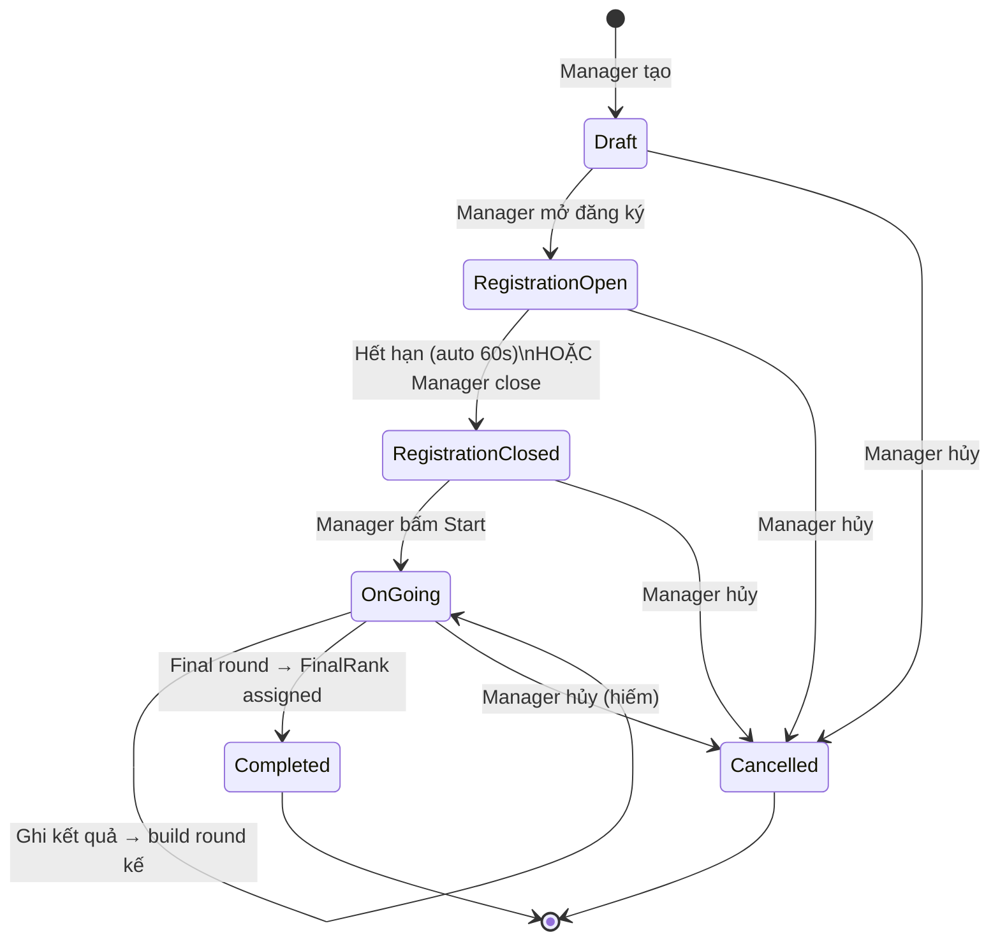
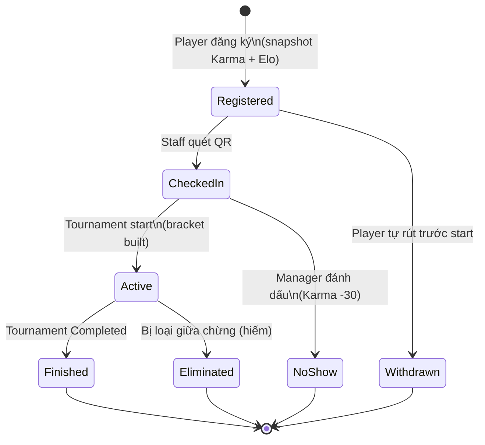
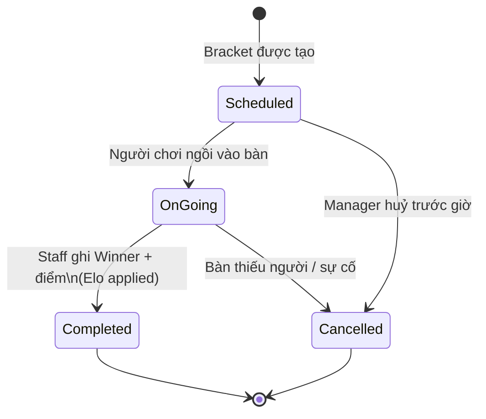

# Tournament — Nghiệp vụ & Flow

> Tài liệu mô tả **nghiệp vụ** của Tournament Module và **flow xử lý** từng giai đoạn. Không bao gồm implementation detail, không có KPIs/roadmap — chỉ tập trung vào "làm gì, khi nào, như thế nào".

---

## 1. Khái quát

### 1.1. Định nghĩa

**Tournament** là giải đấu board game có thứ hạng, áp dụng format **Swiss** (nhiều vòng, cùng điểm gặp nhau) + **Final** (top N người cao điểm chung kết).

### 1.2. Phân biệt với Lobby

| Khía cạnh | Lobby | Tournament |
|---|---|---|
| Mục đích | Ghép nhóm đi chơi | Thi đấu xếp hạng |
| Tiền cọc | Có (BR-05) | Không (miễn phí) |
| Format | Tự do | Swiss 3 + Final 1 |
| Elo | Không | Có (BR-10) |
| Karma reward | Sau ván | Theo thứ hạng cuối |
| Pairing | Host tự chọn | Auto Swiss |

### 1.3. Áp dụng BR

- **BR-05:** Payment success + còn ghế — không liên quan đến tournament
- **BR-10:** Elo **chỉ** dùng trong Tournament, **không** dùng để ghép nhóm Lobby

### 1.4. Game hỗ trợ

Hiện tại chỉ **Splendor** (hardcode theo yêu cầu giáo viên). Thiết kế để dễ mở rộng sau.

---

## 2. Tham số cấu hình

Manager cấu hình khi tạo giải:

| Tham số | Mặc định | Ràng buộc | Ý nghĩa |
|---|---|---|---|
| Game | Splendor | Hardcode | Tựa game thi đấu |
| StartTime | — | Tương lai | Thời điểm bắt đầu round 1 |
| RegistrationDeadline | StartTime − 24h | < StartTime | Hạn chót đăng ký |
| RoundDurationMinutes | 45 | 30-90 | Thời lượng dự kiến mỗi vòng |
| MinParticipants | 4 | ≥ 4 | Tối thiểu để bắt đầu |
| MaxParticipants | 32 | Bội số 4 | Tối đa 8 bàn |
| PreliminaryRounds | 3 | ≥ 2 | Số vòng Swiss trước Final |
| FinalistCount | 4 | 2-8 | Số người vào Final |
| MinKarmaRequirement | 0 | 0-100 | Karma tối thiểu để đăng ký |
| PairingMode | Auto | Auto/Manual | Auto Swiss hoặc Manager tự chọn |
| WinnerKarmaBonus | +50 | -100/+100 | Karma thưởng nhà vô địch |
| FinalistKarmaBonus | +20 | -100/+100 | Karma thưởng Top 2-4 |
| NoShowKarmaPenalty | -30 | -100/+100 | Karma phạt bùng kèo |
| AutoExtendOnShortage | false | — | Tự extend khi thiếu người |
| MaxExtensionCount | 2 | ≥ 0 | Số lần extend tối đa |
| ExtensionMinutesPerAttempt | 30 | > 0 | Phút mỗi lần extend |

---

## 3. State machine

### 3.1. TournamentStatus



### 3.2. TournamentParticipantStatus



### 3.3. TournamentMatchStatus



---

## 4. Flow nghiệp vụ

### 4.1. Tạo giải (Draft)

**Ai:** Manager  
**Trigger:** Manager muốn tổ chức giải

1. Manager tạo tournament với các tham số cấu hình
2. Hệ thống validate:
   - Manager sở hữu cafe
   - MaxParticipants là bội số của 4
   - RegistrationDeadline < StartTime
   - Title 5-200 ký tự
3. Lưu Tournament với Status = Draft
4. Manager có thể sửa thông tin khi đang ở Draft

### 4.2. Mở đăng ký

**Ai:** Manager  
**Trigger:** Sẵn sàng cho player đăng ký

1. Manager chuyển từ Draft → RegistrationOpen
2. Validate: Status phải là Draft, RegistrationDeadline > now
3. Status = RegistrationOpen
4. Player có thể bắt đầu đăng ký

### 4.3. Player đăng ký

**Ai:** Player  
**Trigger:** Muốn tham gia giải

1. Validate:
   - Status = RegistrationOpen
   - RegistrationDeadline > now
   - Chưa đăng ký (unique)
   - Chưa đầy MaxParticipants
   - Karma hiện tại ≥ MinKarmaRequirement (nếu có)
2. Snapshot:
   - **KarmaAtRegistration** — điểm Karma tại thời điểm đăng ký
   - **InitialElo** — Elo ban đầu để tính delta sau này
3. Tạo TournamentParticipant với Status = Registered

### 4.4. Auto-close registration (background)

**Ai:** System (background job)  
**Trigger:** Mỗi 60 giây

1. Job quét tournaments có Status = RegistrationOpen và RegistrationDeadline < now
2. Với mỗi tournament thỏa điều kiện → Status = RegistrationClosed
3. **Không tự build bracket** — đợi Manager bấm Start
4. Idempotent — chỉ act trên tournament ở RegistrationOpen

### 4.5. POS check-in

**Ai:** POS Staff  
**Trigger:** Player đến quán

1. Staff quét QR của player (hoặc chọn từ danh sách)
2. Validate:
   - Manager sở hữu cafe
   - Participant.Status = Registered (chưa check-in)
3. Cập nhật:
   - Status = CheckedIn
   - CheckedInAt = now
   - CheckedInByStaffId = staffId
4. Player sẵn sàng để vào bracket khi Start

### 4.6. Start tournament

**Ai:** Manager  
**Trigger:** Đến giờ bắt đầu

1. Validate: Status ∈ {RegistrationOpen, RegistrationClosed}
2. Đếm số CheckedIn participants
3. **Xử lý shortage** (xem chi tiết ở §5):
   - Đủ người → Start bình thường
   - Thiếu + AutoExtendOnShortage + còn lượt → Extend deadline +30 phút
   - Thiếu + Manager chấp nhận partial → Auto-shorten rounds
   - Thiếu + không có option nào → Throw 409
4. Build Round 1 brackets:
   - Auto mode → `SwissPairingHelper` (snake draft)
   - Manual mode → đọc JSON pairings đã set trước
5. Cập nhật:
   - Status = OnGoing
   - CurrentRound = 1
   - ActualPreliminaryRounds (nếu shortage)
   - StartedWithShortage (nếu shortage)
6. Mark tất cả CheckedIn → Active

### 4.7. Thi đấu Swiss (Round 1 → N)

**Mỗi vòng:**

1. Players chơi Splendor (~30 phút, theo RoundDurationMinutes)
2. Staff nhập kết quả từng bàn qua POS:
   - **WinnerUserId** (bắt buộc là 1 trong 4 players)
   - **Results**: list { UserId, Score (PrestigePoints), CardsBought }
3. Hệ thống validate: Winner phải là player trong match
4. Cập nhật Match:
   - Player scores + cards bought
   - WinnerPlayerId
   - Status = Completed
   - ActualEndTime = now
5. **Aggregate Swiss scores** vào Participant:
   - Winner → SwissWins++
   - Loser → SwissLosses++
   - TotalPrestigePoints += Score
   - TotalCardsBought += CardsBought
6. **Aggregate Elo changes**:
   - Tính delta theo công thức Elo multi-player
   - Snapshot K-factor để audit
   - Cập nhật EloDelta vào Participant
   - Set Match.EloApplied = true (tránh double-apply)
7. Nếu vừa hoàn thành **last Swiss round** → build Final match:
   - Sắp xếp theo Swiss score desc
   - Tiebreaker: PrestigePoints → CardsBought (asc) → Elo (desc)
   - Top N → build Final match (IsFinal = true)
   - CurrentRound = TotalRounds

### 4.8. Final round

**Ai:** Manager + 4 finalists  
**Trigger:** Sau khi Swiss xong, Top 4 vào chung kết

1. 4 finalists chơi 1 bàn Splendor
2. Staff ghi nhận kết quả như Swiss bình thường
3. Hệ thống xử lý:
   - Match.IsFinal = true → apply đặc biệt
   - **AssignFinalRanks**:
     - Rank 1 = Winner
     - Rank 2-4 = theo PrestigePoints desc
   - Mark tất cả Active → Finished
   - Status = Completed
4. **Apply Karma rewards**:
   - Winner → KarmaPoints += WinnerKarmaBonus (+50 default)
   - Top 2-4 → KarmaPoints += FinalistKarmaBonus (+20 default)
   - Ghi KarmaLog với source = TournamentReward
5. **Apply Elo finalization**:
   - FinalElo = InitialElo + EloDelta
   - Cập nhật vào User.GlobalElo

### 4.9. Cancel tournament

**Ai:** Manager  
**Trigger:** Manager muốn hủy giải

1. Validate:
   - Manager sở hữu cafe
   - Status ≠ Completed
2. Status = Cancelled
3. Lưu CancellationReason + CancelledAt
4. **Không apply Karma reward** cho participants
5. **Không refund** vì entry fee = 0

### 4.10. Withdraw registration

**Ai:** Player  
**Trigger:** Player đổi ý

1. Validate:
   - Đã đăng ký
   - Chưa rút lui
   - Status ∉ {Active, Finished}
2. Status = Withdrawn
3. **Không penalty** Karma

---

## 5. Shortage handling

### 5.1. Vấn đề

Manager bấm Start nhưng số CheckedIn < MinParticipants (= 4).

### 5.2. 4 strategies

```
                    Manager bấm START
                           │
                  ┌────────┴────────┐
                  │ CheckedIn ≥ Min │
                  └────────┬────────┘
                           │
              ┌────────────┴────────────┐
              │ YES                     │ NO
              ▼                         ▼
        ┌──────────┐            ┌──────────────┐
        │  Start   │            │ Auto-extend? │
        │  bình    │            │  (configured)│
        │ thường   │            └──────┬───────┘
        └──────────┘                   │
                              ┌────────┴────────┐
                              │ YES             │ NO
                              ▼                 ▼
                    ┌─────────────────┐  ┌──────────────────┐
                    │ Extend deadline │  │ Allow partial?   │
                    │     +30 phút    │  │ (manager choice) │
                    │ Manager retry   │  └────────┬─────────┘
                    └─────────────────┘           │
                                         ┌────────┴────────┐
                                         │ YES             │ NO
                                         ▼                 ▼
                                ┌──────────────┐    ┌────────────┐
                                │ Auto-shorten │    │   409      │
                                │   rounds     │    │  Reject    │
                                └──────────────┘    └────────────┘
```

### 5.3. Auto-shorten formula

```
rounds = max(2, ceil(log2(ceil(N/4))) + 1)
       = clamp(2, configuredRounds)

Ví dụ (configuredRounds = 3):
  4 người → 2 rounds (min)
  5-7 người → 2 rounds
  8-11 người → 3 rounds (full Swiss)
```

### 5.4. Audit

Khi shortage xảy ra, hệ thống ghi:
- `StartedWithShortage = true`
- `ActualPreliminaryRounds` (có thể < PreliminaryRounds)
- Warning log với before/after count

---

## 6. Pairing algorithm

### 6.1. Design goals (priority order)

| # | Mục tiêu | Lý do |
|---|---|---|
| 1 | **Anti-repeat** | Không cho 2 người gặp lại |
| 2 | **Swiss score balance** | Cùng điểm gặp nhau |
| 3 | **Elo balance** | Variance Elo thấp |
| 4 | **Table size balance** | Auto-fit 2-4 người/bàn |

### 6.2. Round 1 — Snake draft

```
9 players ranked by Elo: [2000, 1980, 1950, 1920, 1900, 1880, 1850, 1820, 1800]
                        ↓ Snake
┌──────────┬──────────┬──────────┐
│  Bàn 1   │  Bàn 2   │  Bàn 3   │
│ 2000     │ 1980     │ 1950     │
│ 1880     │ 1900     │ 1920     │
│ 1850     │ 1820     │ 1800     │
└──────────┴──────────┴──────────┘
```

Mỗi bàn có 1 top Elo + 1 bottom Elo + middle.

### 6.3. Round 2+ — Constraint solver

1. Group players theo Swiss score (1.0, 0.5, 0.0)
2. Sort trong group theo Elo desc
3. Greedy assign từng player:
   - Skip nếu anti-repeat violated
   - Skip nếu bàn đầy
4. Retry 16 lần nếu stuck → chọn attempt có quality score cao nhất
5. Best-effort nếu không tìm được valid → relax anti-repeat

### 6.4. Auto-sizing bàn

| Số người | Split tối ưu | Strategy |
|---|---|---|
| 4 | [4] | 1 bàn full |
| 5 | [3, 2] | Equal |
| 6 | [3, 3] | Equal |
| 7 | [4, 3] | Front-heavy |
| 8 | [4, 4] | Full x 2 |
| 9 | [3, 3, 3] | Equal |
| 10 | [4, 3, 3] | Front-heavy |
| 11 | [4, 4, 3] | Front-heavy |
| 12 | [4, 4, 4] | Full x 3 |
| 13 | [4, 3, 3, 3] | Front-heavy |

**Không có bàn 1 người** (Splendor rule tối thiểu 2).  
**Bàn 2 người** có penalty trong quality scoring.

---

## 7. Hệ thống Elo

### 7.1. Công thức (multi-player)

```
Với 4 players [E1, E2, E3, E4]:

Expected_i = sum over j ≠ i: 1 / (1 + 10^((E_j - E_i) / 400))

Score_i:
  1.0 nếu thắng
  0.0 nếu thua
  0.5 nếu hòa (hiếm trong Splendor)

K-factor: từ SystemConfig (default 32)

Delta_i = K × (Score_i - Expected_i)
```

### 7.2. Áp dụng vào DB

| Field | Khi nào set | Mục đích |
|---|---|---|
| `Match.EloKFactorUsed` | Record match | Snapshot K-factor để audit |
| `Match.EloApplied` | Sau khi apply Elo | Tránh double-apply |
| `Participant.EloDelta` | Sau mỗi match | Tổng delta qua các round |
| `Participant.FinalElo` | Tournament Complete | InitialElo + EloDelta |

### 7.3. BR-10 Enforcement

- Elo **chỉ** được update qua TournamentService
- Lobby/Karma services không touch Elo
- Karma trong Lobby dùng Elo filter — sai BR-10, đã sửa

---

## 8. Karma rewards

| Outcome | Karma Δ | KarmaLog Source | Violation Category |
|---|---|---|---|
| Winner (Rank 1) | +WinnerKarmaBonus (+50) | TournamentReward | — |
| Finalist (Rank 2-4) | +FinalistKarmaBonus (+20) | TournamentReward | — |
| Eliminated (Rank 5+) | 0 | — | — |
| No-show | +NoShowKarmaPenalty (−30) | TournamentReward | NoShow |
| Withdrawn trước start | 0 | — | — |

---

## 9. Edge cases quan trọng

### 9.1. Player no-show

**Tình huống:** Player đã check-in nhưng không đến khi tournament start.

**Xử lý:**
1. Manager gọi mark no-show
2. Status = NoShow
3. Apply NoShowKarmaPenalty (−30)
4. Ghi KarmaLog
5. Tournament tiếp tục với các player còn lại

### 9.2. Match bị cancel

**Tình huống:** Bàn thiếu người, manager cancel match.

**Xử lý:**
1. Match.Status = Cancelled
2. **Không apply Elo** (không có kết quả)
3. Players giữ nguyên Swiss score (không bị 0)
4. Round tiếp theo không bao gồm players của match cancelled

### 9.3. Manager quên close registration

**Tình huống:** Manager tạo giải mở đăng ký nhưng quên close.

**Xử lý:**
- Background job `TournamentExpiryJob` chạy mỗi 60s
- Tự động Status = RegistrationClosed khi deadline qua
- Idempotent

### 9.4. Player withdraw sau khi Active

**Tình huống:** Player muốn rút khi đã Active.

**Xử lý:**
- **Không cho phép** — throw 409
- Phải gặp manager để xử lý ngoài hệ thống

### 9.5. Manager edit pairings

**Tình huống:** Manager muốn tự chọn ai ngồi bàn nào.

**Xử lý:**
1. Set `PairingMode = Manual`
2. Upload JSON pairings cho từng round
3. Khi Start Round N, dùng manual thay vì auto
4. Validate không có duplicate player

### 9.6. Final round thiếu người

**Tình huống:** 1 trong Top 4 no-show → Final chỉ 3 người.

**Xử lý:**
- Manager quyết định: cancel final HOẶC chơi 3 người
- Nếu cancel: tournament kết thúc sớm, FinalRank dựa trên Swiss score cuối

---

## 10. Tổng hợp controllers

### 10.1. Manager endpoints

| Endpoint | Mô tả |
|---|---|
| `POST /manager/tournaments` | Tạo tournament (Draft) |
| `PUT /manager/tournaments/{id}` | Sửa tournament (chỉ khi Draft) |
| `POST /manager/tournaments/{id}/open-registration` | Draft → RegistrationOpen |
| `POST /manager/tournaments/{id}/close-registration` | RegistrationOpen → RegistrationClosed |
| `POST /manager/tournaments/{id}/extend-registration` | Extend deadline +30 phút |
| `POST /manager/tournaments/{id}/start` | Start tournament |
| `POST /manager/tournaments/{id}/start-with-options` | Start với shortage options |
| `POST /manager/tournaments/{id}/cancel` | Cancel tournament |
| `POST /manager/tournaments/{id}/complete` | Manual complete |
| `POST /manager/tournaments/{id}/set-manual-pairings/{round}` | Set manual pairings |

### 10.2. POS endpoints

| Endpoint | Mô tả |
|---|---|
| `POST /pos/tournaments/{tid}/check-in/{pid}` | Staff check-in player |
| `POST /pos/tournaments/{tid}/participants/{pid}/no-show` | Đánh dấu no-show |
| `POST /pos/tournaments/matches/{matchId}/result` | Ghi nhận kết quả bàn |
| `POST /pos/tournaments/matches/{matchId}/cancel` | Cancel match |

### 10.3. Player endpoints

| Endpoint | Mô tả |
|---|---|
| `GET /tournaments/open` | List tournaments đang mở |
| `GET /tournaments/{id}` | Chi tiết tournament |
| `GET /tournaments/{id}/participants` | List participants |
| `GET /tournaments/{id}/matches` | List matches (all rounds) |
| `GET /tournaments/{id}/matches/round/{n}` | Matches của 1 round |
| `POST /tournaments/{id}/register` | Đăng ký |
| `POST /tournaments/{id}/unregister` | Rút lui trước start |
| `GET /tournaments/my-registrations` | Giải của tôi |
| `GET /tournaments/my-elo-history` | Lịch sử Elo |
| `GET /tournaments/leaderboard` | Top Elo toàn hệ thống |