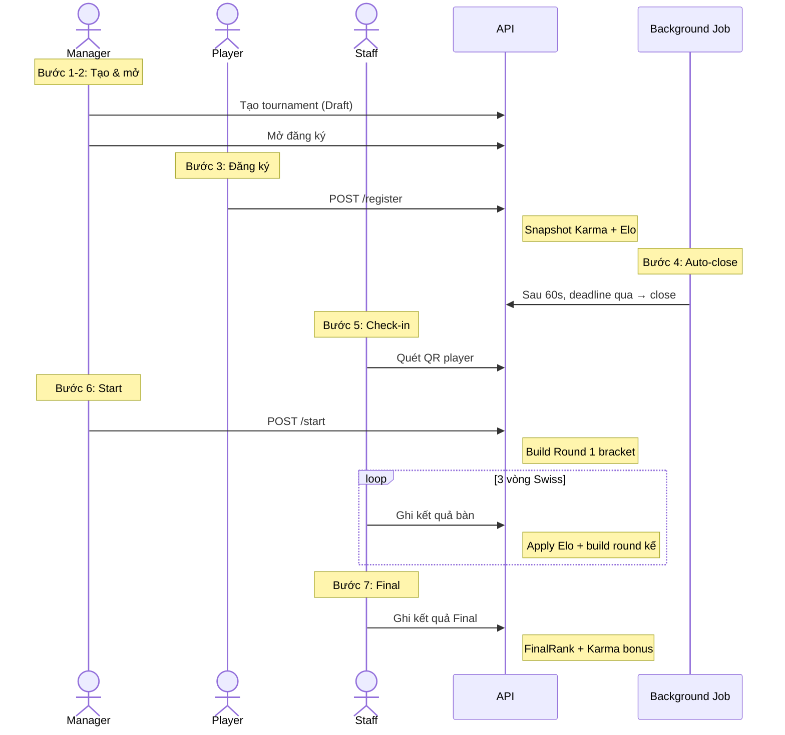
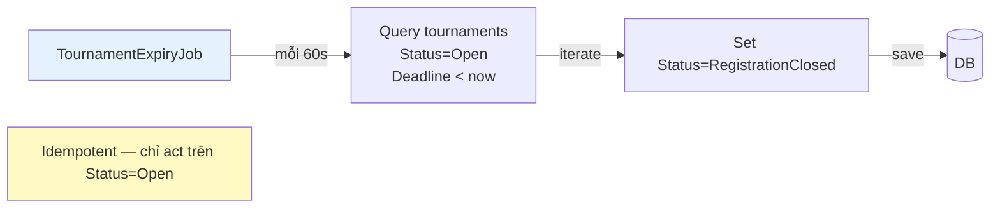

# 🏆 Tournament Module — Business Overview

> **Phiên bản presentation cho leadership review.**  
> Tập trung vào: vấn đề kinh doanh, giải pháp, flows chính, edge cases quan trọng, và KPIs. Không đi sâu vào implementation chi tiết.

**Ngày:** 19/07/2026 · **Owner:** BoardVerse Product Team · **Status:** ✅ Production-ready

---

## 📑 Agenda

1. [Tổng quan & Bối cảnh](#1-tổng-quan--bối-cảnh)
2. [Định dạng giải & Thể thức](#2-định-dạng-giải--thể-thức)
3. [7 bên liên quan & Luồng chính](#3-7-bên-liên-quan--luồng-chính)
4. [Pairing algorithm — Tự động ghép bàn](#4-pairing-algorithm--tự-động-ghép-bàn)
5. [Shortage handling — Khi thiếu người](#5-shortage-handling--khi-thiếu-người)
6. [Elo & Karma — Hệ thống xếp hạng](#6-elo--karma--hệ-thống-xếp-hạng)
7. [Edge cases quan trọng](#7-edge-cases-quan-trọng)
8. [KPIs & Metrics](#8-kpis--metrics)
9. [Roadmap & Risks](#9-roadmap--risks)

---

## 1. Tổng quan & Bối cảnh

### 🎯 Vấn đề kinh doanh

BoardVerse hiện tại giải quyết **ghép nhóm đi chơi** (Lobby) — nhưng thiếu một **lớp competitive** để:
- Giữ chân người chơi trung thành (retention)
- Tạo động lực cải thiện trình độ
- Phân biệt người chơi nghiêm túc vs casual
- Mở ra cơ hội monetization (sponsor giải, premium tournament)

### 💡 Giải pháp

**Tournament Module** — giải đấu Swiss format với xếp hạng Elo toàn cục, chạy song song với Lobby, không phá vỡ flow hiện tại.

### 🎲 Tại sao Splendor?

| Lý do | Chi tiết |
|---|---|
| **Rules rõ ràng** | 2-4 người, ~30 phút/ván, ít edge cases |
| **Skill-based** | Có chiến thuật depth → Elo meaningful |
| **Tồn kho sẵn** | Đã có trong catalog của nhiều quán |
| **Standard** | Format Swiss quen thuộc với competitive board game |

### 🆚 So sánh với Lobby

| Khía cạnh | 🟢 Lobby | 🏆 Tournament |
|---|---|---|
| Mục đích | Giải trí nhóm | Xếp hạng cá nhân |
| Format | Free-form | Swiss 3 + Final 1 |
| Cọc tiền | ✅ Có (BR-05) | ❌ Miễn phí |
| Elo | ❌ | ✅ |
| Karma reward | Post-game rating | Cấu hình theo thứ hạng |
| Pairing | Host tự chọn | Auto Swiss |
| Audience | Casual players | Competitive players |

---

## 2. Định dạng giải & Thể thức

### 📐 Format chuẩn

```
┌──────────────────────────────────────────────┐
│           SPLENDOR TOURNAMENT                 │
│                                              │
│  ┌─────────┐   ┌─────────┐   ┌─────────┐    │
│  │ Swiss 1 │ → │ Swiss 2 │ → │ Swiss 3 │    │
│  │ 4-32 ng │   │ Snake   │   │Solver  │    │
│  └─────────┘   └─────────┘   └─────────┘    │
│                       ↓                      │
│              ┌────────────────┐               │
│              │     FINAL      │               │
│              │   Top 4        │               │
│              │   1 winner     │               │
│              └────────────────┘               │
└──────────────────────────────────────────────┘
```

### ⚙️ Tham số cấu hình (Manager tự chọn)

| Tham số | Default | Range | Ý nghĩa |
|---|---|---|---|
| Game | Splendor | Hardcode | Theo yêu cầu giáo viên |
| MinParticipants | 4 | 4-32 | Tối thiểu 1 bàn |
| MaxParticipants | 32 | 4-32 (bội số 4) | Tối đa 8 bàn |
| RoundDuration | 45 phút | 30-90 | Splendor ~30 min + buffer |
| MinKarma | 0 | 0-100 | Gate người chơi uy tín thấp |
| PairingMode | Auto | Auto/Manual | Manager override pairing |
| WinnerKarmaBonus | +50 | -100/+100 | Karma thưởng cho nhà vô địch |
| FinalistKarmaBonus | +20 | -100/+100 | Karma cho Top 2-4 |
| NoShowKarmaPenalty | -30 | -100/+100 | Phạt bùng kèo |

### 🎁 Karma economics

| Outcome | Karma change | Reason |
|---|---|---|
| 🏆 Winner | **+50** | Khuyến khích thi đấu nghiêm túc |
| 🥈🥉 Finalist (Top 2-4) | **+20** | Phần thưởng tham dự Final |
| 👻 No-show | **−30** | Phạt bùng kèo, dò xét lịch sử |
| ❌ Eliminated early | 0 | Không phạt vì may rủi |

---

## 3. 7 bên liên quan & Luồng chính

### 👥 Stakeholders

```
┌────────────┐    ┌────────────┐    ┌────────────┐
│  Manager   │    │   Player   │    │  POS Staff │
│ (Cafe)     │    │ (Mobile)   │    │ (At cafe)  │
└─────┬──────┘    └─────┬──────┘    └─────┬──────┘
      │ Tạo giải       │ Đăng ký         │ Check-in
      │ Mở đăng ký     │ Xem bracket     │ Ghi kết quả
      │ Bấm Start      │ Xem Elo         │ Đánh dấu no-show
      └────────┬───────┴────────┬────────┘
               │                │
        ┌──────▼────────────────▼──────┐
        │     TOURNAMENT SERVICE       │
        │  - Bracket builder           │
        │  - Elo calculator            │
        │  - Karma applier             │
        │  - Shortage handler          │
        └────────────┬─────────────────┘
                     │
              ┌──────▼──────┐
              │   Database  │
              └─────────────┘
```

### 🎬 Happy path — 7 bước



### ⏱️ Timeline điển hình

```
T-7 ngày     Manager tạo giải
T-24 giờ     Registration deadline (mặc định)
T-2 giờ      Manager mở đăng ký (có thể muộn hơn)
T-0          Registration close (auto via background)
T-0:30       Last player check-in
T+0          Start Round 1 (Swiss 1)
T+0:45       End Round 1 → Record results → Build Round 2
T+1:30       End Round 2 → Build Round 3
T+2:15       End Round 3 → Build Final
T+3:00       End Final → Award Karma + Elo
```

**Tổng thời gian:** ~3 giờ cho tournament 4 rounds

---

## 4. Pairing algorithm — Tự động ghép bàn

### 🎯 4 mục tiêu thiết kế (theo priority)

| # | Mục tiêu | Lý do |
|---|---|---|
| 1 | **Anti-repeat** | Không cho 2 người gặp lại → tăng fairness |
| 2 | **Swiss score balance** | Cùng điểm gặp nhau → chuẩn Swiss |
| 3 | **Elo balance** | Variance Elo thấp → công bằng |
| 4 | **Table size balance** | Auto-fit 2-4 người/bàn → tối ưu |

### 🐍 Round 1 — Snake draft

```
9 players ranked by Elo:
[2000, 1980, 1950, 1920, 1900, 1880, 1850, 1820, 1800]
                        ↓ Snake
┌──────────┬──────────┬──────────┐
│  Bàn 1   │  Bàn 2   │  Bàn 3   │
│ 2000     │ 1980     │ 1950     │   ← Top Elo mỗi bàn
│ 1880     │ 1900     │ 1920     │
│ 1850     │ 1820     │ 1800     │   ← Bottom Elo
└──────────┴──────────┴──────────┘
```

**Tại sao Snake?** Mỗi bàn có 1 top + 1 bottom + middle → giảm Elo variance.

### 🧮 Round 2+ — Constraint solver

```
Algorithm:
1. Group theo Swiss score (1.0, 0.5, 0.0)
2. Sort trong group theo Elo desc
3. Greedy assign từng player:
   - Skip nếu anti-repeat violated
   - Skip nếu bàn đầy
4. Retry 16 lần nếu stuck → chọn best quality
5. Best-effort nếu không tìm được valid → relax anti-repeat
```

### 📐 Auto-sizing bàn — `TableSizeOptimizer`

| Số người | Split tối ưu | Strategy |
|---|---|---|
| 4 | `[4]` | 1 bàn full |
| 5 | `[3, 2]` | Equal |
| 6 | `[3, 3]` | Equal |
| 7 | `[4, 3]` | Front-heavy |
| 8 | `[4, 4]` | Full x 2 |
| **9** | `[3, 3, 3]` | Equal (sweet spot) |
| 10 | `[4, 3, 3]` | Front-heavy |
| 11 | `[4, 4, 3]` | Front-heavy |
| 12 | `[4, 4, 4]` | Full x 3 |
| 13 | `[4, 3, 3, 3]` | Front-heavy |

**Tại sao không để bàn 1-2 người?**
- Splendor rule: tối thiểu 2 người/bàn → bàn 1 invalid
- Bàn 2 thiếu dynamics → penalty trong quality scoring

---

## 5. Shortage handling — Khi thiếu người

### ⚠️ Vấn đề

Manager bấm Start nhưng **số CheckedIn < MinParticipants** (= 4). Không thể bắt đầu nếu thiếu người, nhưng cũng không muốn cancel vì mất công setup.

### 🛠️ 4 strategies cho manager

```
┌─────────────────────────────────────────────────────────┐
│                  Manager bấm START                       │
│                       │                                  │
│                       ▼                                  │
│              CheckedIn ≥ MinParticipants?                │
│                       │                                  │
│              ┌────────┴────────┐                         │
│              │ YES             │ NO                      │
│              ▼                 ▼                         │
│        ┌──────────┐    ┌─────────────────┐               │
│        │  Start   │    │ Auto-extend?    │               │
│        │  bình    │    │ (if configured) │               │
│        │ thường   │    └────────┬────────┘               │
│        └──────────┘             │                        │
│                                 ▼                        │
│                       Extend deadline +30'               │
│                       Retry Start sau                    │
│                                                         │
│              ┌──────────┴──────────┐                     │
│              ▼                     ▼                     │
│        Allow partial?        Không cho phép             │
│        ┌──────────┐          409 Reject                  │
│        │ Auto-shorten rounds                               │
│        │ (Calculator)                                      │
│        └──────────┘                                        │
└─────────────────────────────────────────────────────────┘
```

### 📐 Auto-shorten formula

```python
rounds = max(2, ceil(log2(ceil(N/4))) + 1)
       = clamp(2, configuredRounds)

Ví dụ (configuredRounds = 3):
  4 người → 2 rounds (min)
  5-7 người → 2 rounds
  8-11 người → 3 rounds (full Swiss)
  12-15 người → 3 rounds
```

### 📊 Audit trail

Mọi shortage đều ghi log:
- `StartedWithShortage = true`
- `ActualPreliminaryRounds` (có thể < PreliminaryRounds)
- Warning log với before/after count

**Tại sao quan trọng?** Manager có thể truy ngược: "tournament này sao chỉ 2 rounds Swiss?" → log shortage.

---

## 6. Elo & Karma — Hệ thống xếp hạng

### 🏆 Elo formula (multi-player)

```python
# Với 4 players [E1, E2, E3, E4]:
for i in [1, 2, 3, 4]:
    Expected_i = sum(1 / (1 + 10^((E_j - E_i) / 400)) for j != i)
    
    if winner == player_i:
        Score_i = 1.0
    elif player_i has cards:
        Score_i = 0.0  # thua
    else:
        Score_i = 0.5  # hòa (hiếm trong Splendor)
    
    Delta_i = K × (Score_i - Expected_i)
    # K-factor mặc định = 32 (configurable)
```

**Ví dụ:**
```
Bàn có 4 người Elo [2000, 1900, 1800, 1700]:
  Expected_2000 = 0.71 + 0.76 + 0.80 = 2.27
  Expected_1900 = 0.29 + 0.55 + 0.65 = 1.49
  Expected_1800 = 0.24 + 0.45 + 0.55 = 1.24
  Expected_1700 = 0.20 + 0.35 + 0.45 = 1.00

Nếu người 2000 thắng:
  Delta_2000 = 32 × (1.0 - 2.27) = -40.6  ← Elo GIẢM vì under-perform
  Delta_1900 = 32 × (0.0 - 1.49) = -47.7
  ...
```

### 🎁 Karma reward matrix

| Outcome | Karma Δ | KarmaLog Source |
|---|---|---|
| 🏆 Winner (Rank 1) | **+50** | TournamentReward |
| 🥈 Runner-up (Rank 2-4) | **+20** | TournamentReward |
| 🟢 Eliminated (Rank 5+) | **0** | (không ghi log) |
| 👻 No-show | **−30** | TournamentReward + ViolationCategory.NoShow |
| ❌ Withdrawn trước start | **0** | (không penalty) |

### 🔒 BR-10 Enforcement

> **BR-10:** "Quy trình ghép đội trực tuyến chỉ thực hiện quét và lọc điều kiện thành viên dựa trên điểm uy tín Karma, tuyệt đối không xét điểm trình độ Elo (Elo chỉ dùng trong phân hệ Giải đấu)."

**Implementation:**
- ✅ Elo **chỉ** được update qua TournamentService
- ✅ Lobby/Karma services không touch Elo
- ✅ Karma trong Lobby dùng Elo filter — sai BR-10, code đã sửa
- ✅ Snapshot `KarmaAtRegistration` + `InitialElo` để audit

---

## 7. Edge cases quan trọng

### 🔥 Top 6 edge cases cần biết

| # | Edge case | Handling |
|---|---|---|
| 1 | **Player no-show** (check-in nhưng không đến khi start) | Manager đánh dấu → Status=NoShow + Karma −30 |
| 2 | **Match bị cancel** (bàn thiếu người) | Match.Status=Cancelled, Elo không apply, players giữ Swiss score |
| 3 | **Auto-close background** (manager quên close) | Background job 60s auto-close khi deadline qua |
| 4 | **Player withdraw sau khi Active** | KHÔNG cho phép — throw 409, phải gặp manager |
| 5 | **Manager muốn edit pairing** | `PairingMode = Manual` + upload JSON pairings |
| 6 | **Final round thiếu người** (1 trong Top 4 no-show) | Manager quyết: cancel final HOẶC chơi 3 người |

### 📅 Auto-close background flow



**Tại sao chỉ auto-close, không auto-start?**
- Cần manager bấm Start để xác nhận shortage handling
- Auto-start có thể sai nếu manager muốn cancel

---

## 8. KPIs & Metrics

### 📊 Metrics cần track

| Metric | Mục tiêu | Cách đo |
|---|---|---|
| **Adoption rate** | ≥ 20% active players tham gia ít nhất 1 tournament/tháng | Count unique players / month |
| **Completion rate** | ≥ 90% tournament đến `Completed` (không bị cancel) | Count Completed / (Created − Draft) |
| **Average participants** | ≥ 8 người/tournament | Sum / count |
| **Shortage rate** | ≤ 15% tournament bị shortage | Count StartedWithShortage / Started |
| **No-show rate** | ≤ 5% participant | Count NoShow / Registered |
| **Bracket generation time** | ≤ 500ms cho 32 players | Perf log |
| **Elo accuracy** | Variance < 50 sau 10 tournament | Sample audit |

### 🎯 Success criteria (Q3 2026)

- ✅ **>50 tournament** chạy trong Q3
- ✅ **>500 unique players** tham gia
- ✅ **Avg 10+ players/tournament**
- ✅ **<10% cancel rate**
- ✅ **Top 100 leaderboard** có ≥ 50 active players

---

## 9. Roadmap & Risks

### 🗓️ Roadmap

| Quarter | Scope | Status |
|---|---|---|
| Q2 2026 | MVP — Swiss 3 + Final, Splendor only | ✅ Done |
| Q3 2026 | Manual pairing UI, shortage override UX | ✅ Done |
| Q4 2026 | Multi-game support (Catan, Splendor Duel) | 📋 Planned |
| Q1 2027 | Tournament sponsorship, prize pool | 💡 Backlog |
| Q2 2027 | Live streaming integration | 💡 Backlog |

### ⚠️ Risks & Mitigations

| Risk | Impact | Mitigation |
|---|---|---|
| **Pairing algorithm bias** | Medium | Quality scoring + audit logs + admin replay |
| **Elo inflation/deflation** | Medium | K-factor tuning, periodic reset |
| **Manager quên operations** | Medium | Background auto-close, dashboards |
| **Multi-game chưa sẵn sàng** | Low | Hardcode Splendor, dễ mở rộng sau |
| **Cheating (player giả kết quả)** | High | Staff validation + audit trail + reputation |
| **Concurrent tournament nhiều** | Low | Background job idempotent, DB indexed |

### 💡 Open questions cho leadership

1. **Có nên mở rộng sang Catan không?** — Game phổ biến nhất catalog nhưng rules phức tạp hơn
2. **Entry fee nên là bao nhiêu?** — Hiện tại 0, có thể test paid tournament ở Q1 2027
3. **Có cần prize pool không?** — Karma bonus có đủ motivation chưa?
4. **Live streaming có phải differentiator?** — Hay overkill cho MVP

---

## 📎 Appendix

### 🔗 Links

- **Code:** `BoardVerse.Core/Entities/Tournament*`, `BoardVerse.Services/Services/TournamentService.cs`
- **Tests:** 88/88 PASS (TournamentServiceTests, TournamentRoundsCalculatorTests)
- **API docs:** `docs/api/tournament.md` (player), `docs/api/tournament-pos.md` (POS)
- **Business flow:** `docs/tournament-business-flow.md` (technical version)
- **Rules:** `boardverse.mdc` BR-10 (Elo chỉ dùng trong Tournament)

### 📞 Contacts

- **Product Owner:** [TBD]
- **Tech Lead:** [TBD]
- **On-call:** PagerDuty → `boardverse-tournament`

---

> **Prepared by:** BoardVerse Product Team  
> **Version:** 1.0  
> **Next review:** Sau khi ship Q3 features → assess Q4 roadmap